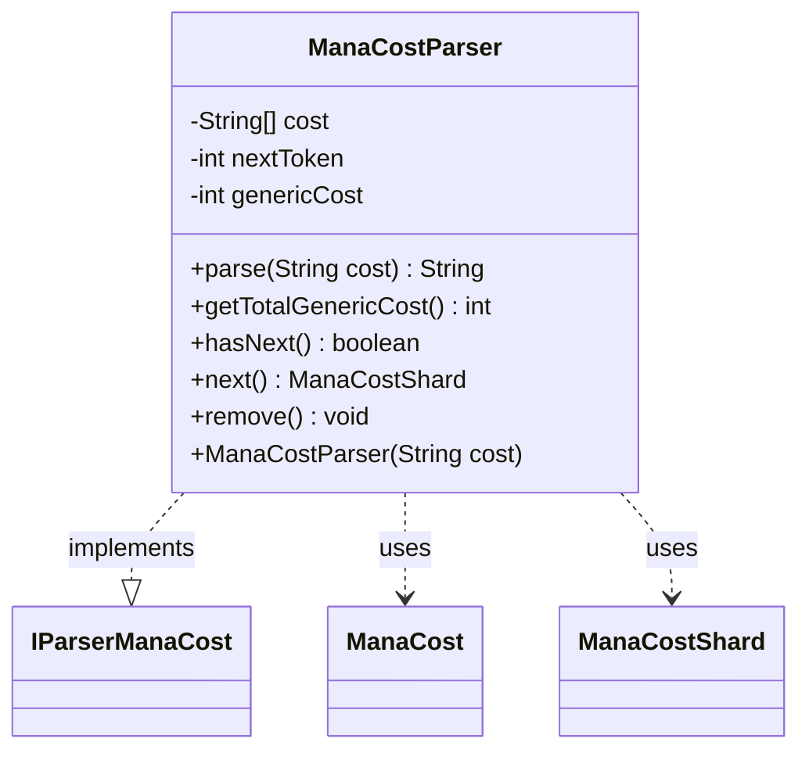

---
aliases:
  - ManaCostParser
tags:
  - java/class
  - module/forge-core
  - pkg/forge/card/mana
fqn: forge.card.mana.ManaCostParser
package: forge.card.mana
module: forge-core
kind: Class
---

# ManaCostParser

**Package:** `forge.card.mana`   **Module:** `forge-core`   **Kind:** Class



## Relationships
**Implements:**
- [[forge.card.mana.IParserManaCost|IParserManaCost]]
**Uses:**
- [[forge.card.mana.ManaCost|ManaCost]]
- [[forge.card.mana.ManaCostShard|ManaCostShard]]


## Design Description

`ManaCostParser` converts a textual mana-cost string into a sequence of mana symbols by splitting the input on spaces and exposing the resulting tokens through the `IParserManaCost` contract it implements—an `Iterator<ManaCostShard>` walked once, forward only. During iteration, purely numeric tokens are folded into a running generic-cost total and surfaced as `null`, while symbolic tokens are delegated to `ManaCostShard.parseNonGeneric` to yield a typed shard, letting a `ManaCost` drive the parser directly during its own construction.

The design favors a single-pass, stateful traversal: `getTotalGenericCost` throws if invoked before iteration finishes, guaranteeing the accumulated generic value is read only once complete, and `remove` is deliberately a no-op. The static `parse` helper packages the common case, building a parser, feeding it to a `ManaCost`, and returning the formatted string.

## Source
`forge-core/src/main/java/forge/card/mana/ManaCostParser.java`

```java
package forge.card.mana;

import com.google.common.primitives.Ints;


/**
 * The Class ParserCardnameTxtManaCost.
 */
public class ManaCostParser implements IParserManaCost {
    private final String[] cost;
    private int nextToken;
    private int genericCost;

    /**
     * Parse the given cost and output formatted cost string
     * 
     * @param cost
     */
    public static String parse(final String cost) {
    	final ManaCostParser parser = new ManaCostParser(cost);
    	final ManaCost manaCost = new ManaCost(parser);
    	return manaCost.toString();
    }

    /**
     * Instantiates a new parser cardname txt mana cost.
     * 
     * @param cost
     *            the cost
     */
    public ManaCostParser(final String cost) {
        this.cost = cost.split(" ");
        this.nextToken = 0;
        this.genericCost = 0;
    }

    /*
     * (non-Javadoc)
     * 
     * @see forge.card.CardManaCost.ManaParser#getTotalGenericCost()
     */
    @Override
    public final int getTotalGenericCost() {
        if (this.hasNext()) {
            throw new RuntimeException("Generic cost should be obtained after iteration is complete");
        }
        return this.genericCost;
    }

    /*
     * (non-Javadoc)
     * 
     * @see java.util.Iterator#hasNext()
     */
    @Override
    public final boolean hasNext() {
        return this.nextToken < this.cost.length;
    }

    /*
     * (non-Javadoc)
     * 
     * @see java.util.Iterator#next()
     */
    @Override
    public final ManaCostShard next() {
        final String unparsed = this.cost[this.nextToken++];
        // consider negation sign
        Integer i = Ints.tryParse(unparsed);
        if (i != null) {
            this.genericCost += i;
            return null;
        }

        return ManaCostShard.parseNonGeneric(unparsed);
    }

    /*
     * (non-Javadoc)
     * 
     * @see java.util.Iterator#remove()
     */
    @Override
    public void remove() {
    } // unsupported
}
```

## Python
`forge/card/mana/ManaCostParser.py`

```python
from forge.card.mana.IParserManaCost import IParserManaCost
from forge.card.mana.ManaCost import ManaCost
from forge.card.mana.ManaCostShard import ManaCostShard


class ManaCostParser(IParserManaCost):
    """The Class ParserCardnameTxtManaCost."""

    @staticmethod
    def parse(cost: str) -> str:
        """Parse the given cost and output formatted cost string

        :param cost:
        """
        parser = ManaCostParser(cost)
        manaCost = ManaCost(parser)
        return str(manaCost)

    def __init__(self, cost: str):
        """Instantiates a new parser cardname txt mana cost.

        :param cost: the cost
        """
        self.cost = cost.split(" ")
        self.nextToken = 0
        self.genericCost = 0

    def getTotalGenericCost(self) -> int:
        if self.hasNext():
            raise RuntimeError("Generic cost should be obtained after iteration is complete")
        return self.genericCost

    def hasNext(self) -> bool:
        return self.nextToken < len(self.cost)

    def next(self) -> ManaCostShard:
        unparsed = self.cost[self.nextToken]
        self.nextToken += 1
        # consider negation sign
        i = None
        try:
            i = int(unparsed)
        except ValueError:
            i = None
        if i is not None:
            self.genericCost += i
            return None

        return ManaCostShard.parseNonGeneric(unparsed)

    def remove(self) -> None:
        pass  # unsupported
```
