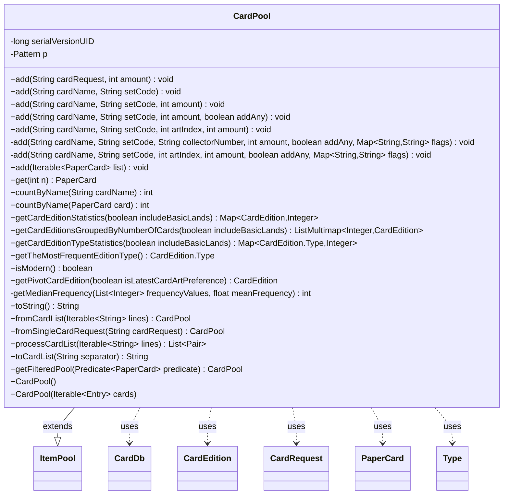

---
aliases:
  - CardPool
tags:
  - java/class
  - module/forge-core
  - pkg/forge/deck
fqn: forge.deck.CardPool
package: forge.deck
module: forge-core
kind: Class
---

# CardPool

**Package:** `forge.deck`   **Module:** `forge-core`   **Kind:** Class



## Relationships
**Extends:**
- [[forge.util.ItemPool|ItemPool]]
**Uses:**
- [[forge.card.CardDb|CardDb]]
- [[forge.card.CardDb.CardRequest|CardRequest]]
- [[forge.card.CardEdition|CardEdition]]
- [[forge.card.CardEdition.Type|Type]]
- [[forge.item.PaperCard|PaperCard]]

## Design Description

CardPool is a specialized collection that models a deck or card collection as a multiset of `PaperCard` instances mapped to quantities. Extending the generic `ItemPool<PaperCard>`, it inherits count-based storage while adding card-specific behavior: flexible `add` overloads that resolve requests through `StaticData`'s `CardDb` instances by name, set code, art index, or collector number, with fallbacks for Alchemy variants, unsupported cards, and random art distribution. Static factories (`fromCardList`, `fromSingleCardRequest`) and `toCardList` handle parsing and serializing human-readable deck lists.

Beyond storage, the class concentrates edition-analysis logic: it computes per-`CardEdition` and `CardEdition.Type` frequency statistics and derives higher-level judgments such as the dominant edition type, whether the pool is "modern," and a weighted "pivot edition." This design intent—centralizing card-resolution and edition-heuristics here—lets callers treat the pool as the authoritative source for art-preference and reprint decisions rather than scattering that logic across the deck layer.

## Source
`forge-core/src/main/java/forge/deck/CardPool.java`

```java
/*
 * Forge: Play Magic: the Gathering.
 * Copyright (C) 2011  Forge Team
 *
 * This program is free software: you can redistribute it and/or modify
 * it under the terms of the GNU General Public License as published by
 * the Free Software Foundation, either version 3 of the License, or
 * (at your option) any later version.
 *
 * This program is distributed in the hope that it will be useful,
 * but WITHOUT ANY WARRANTY; without even the implied warranty of
 * MERCHANTABILITY or FITNESS FOR A PARTICULAR PURPOSE.  See the
 * GNU General Public License for more details.
 *
 * You should have received a copy of the GNU General Public License
 * along with this program.  If not, see <http://www.gnu.org/licenses/>.
 */
package forge.deck;

import com.google.common.collect.ListMultimap;
import com.google.common.collect.Lists;
import com.google.common.collect.Multimaps;
import forge.StaticData;
import forge.card.CardDb;
import forge.card.CardEdition;
import forge.item.IPaperCard;
import forge.item.PaperCard;
import forge.util.ItemPool;
import forge.util.ItemPoolSorter;
import forge.util.MyRandom;
import org.apache.commons.lang3.StringUtils;
import org.apache.commons.lang3.tuple.Pair;

import java.util.*;
import java.util.Map.Entry;
import java.util.function.Predicate;
import java.util.regex.Matcher;
import java.util.regex.Pattern;

public class CardPool extends ItemPool<PaperCard> {
    private static final long serialVersionUID = -5379091255613968393L;

    public CardPool() {
        super(PaperCard.class);
    }

    public CardPool(final Iterable<Entry<PaperCard, Integer>> cards) {
        this();
        this.addAll(cards);
    }

    public void add(final String cardRequest, final int amount) {
        CardDb.CardRequest request = CardDb.CardRequest.fromString(cardRequest);
        if(request.collectorNumber != null && !request.collectorNumber.equals(IPaperCard.NO_COLLECTOR_NUMBER))
            this.add(CardDb.CardRequest.compose(request.cardName, request.isFoil), request.edition, request.collectorNumber, amount, false, request.flags);
        else
            this.add(CardDb.CardRequest.compose(request.cardName, request.isFoil), request.edition, request.artIndex, amount, false, request.flags);
    }

    public void add(final String cardName, final String setCode) {
        this.add(cardName, setCode, IPaperCard.DEFAULT_ART_INDEX, 1);
    }

    public void add(final String cardName, final String setCode, final int amount) {
        this.add(cardName, setCode, IPaperCard.DEFAULT_ART_INDEX, amount);
    }

    public void add(final String cardName, final String setCode, final int amount, boolean addAny) {
        this.add(cardName, setCode, IPaperCard.NO_ART_INDEX, amount, addAny, null);
    }

    // NOTE: ART indices are "1" -based
    public void add(String cardName, String setCode, int artIndex, final int amount) {
        this.add(cardName, setCode, artIndex, amount, false, null);
    }
    private void add(String cardName, String setCode, String collectorNumber, final int amount, boolean addAny, Map<String, String> flags) {
        Map<String, CardDb> dbs = StaticData.instance().getAvailableDatabases();
        for (Map.Entry<String, CardDb> entry: dbs.entrySet()){
            CardDb db = entry.getValue();

            PaperCard paperCard = db.getCard(cardName, setCode, collectorNumber, flags);
            if (paperCard != null) {
                this.add(paperCard, amount);
                return;
            }
        }

        // Try to get non-Alchemy version if it cannot find it.
        if (cardName.startsWith("A-")) {
            System.out.println("Alchemy card not found for '" + cardName + "'. Trying to get its non-Alchemy equivalent.");
            cardName = cardName.replaceFirst("A-", "");
        }

        //Failed to find it. Fall back accordingly?
        this.add(cardName, setCode, IPaperCard.NO_ART_INDEX, amount, addAny, flags);
    }
    private void add(String cardName, String setCode, int artIndex, final int amount, boolean addAny, Map<String, String> flags) {
        Map<String, CardDb> dbs = StaticData.instance().getAvailableDatabases();
        PaperCard paperCard = null;
        String selectedDbName = "";
        artIndex = Math.max(artIndex, IPaperCard.DEFAULT_ART_INDEX);
        int loadAttempt = 0;
        while (paperCard == null && loadAttempt < 2) {
            for (Map.Entry<String, CardDb> entry: dbs.entrySet()){
                String dbName = entry.getKey();
                CardDb db = entry.getValue();
                paperCard = db.getCard(cardName, setCode, artIndex, flags);
                if (paperCard != null) {
                    selectedDbName = dbName;
                    break;
                }
            }
            loadAttempt += 1;
            if (paperCard == null && loadAttempt < 2) {
                /* Attempt to load the card first, and then try again all the three available DBs
                 as we simply don't know which db the card has been added to (in case). */
                StaticData.instance().attemptToLoadCard(cardName, setCode);
                artIndex = IPaperCard.DEFAULT_ART_INDEX;  // Reset Any artIndex passed in, at this point
            }
        }
        if (addAny && paperCard == null) {
            paperCard = StaticData.instance().getCommonCards().getCard(cardName);
            selectedDbName = "Common";
        }
        if (paperCard == null) {
            // after all still null
            System.err.println("An unsupported card was requested: \"" + cardName + "\" from \"" + setCode + "\". \n");
            paperCard = StaticData.instance().getCommonCards().createUnsupportedCard(cardName);
            selectedDbName = "Common";
        }
        CardDb cardDb = dbs.getOrDefault(selectedDbName, StaticData.instance().getCommonCards());
        // Determine Art Index
        setCode = paperCard.getEdition();
        cardName = paperCard.getName();
        int artCount = cardDb.getArtCount(cardName, setCode);
        boolean artIndexExplicitlySet = (artIndex > IPaperCard.DEFAULT_ART_INDEX) ||
                (CardDb.CardRequest.fromString(cardName).artIndex > IPaperCard.NO_ART_INDEX);

        if ((artIndexExplicitlySet || artCount == 1) && !addAny) {
            // either a specific art index is specified, or there is only one art, so just add the card
            this.add(paperCard, amount);
        } else {
            // random art index specified, make sure we get different groups of cards with different art
            int[] artGroups = MyRandom.splitIntoRandomGroups(amount, artCount);
            for (int i = 1; i <= artGroups.length; i++) {
                int cnt = artGroups[i - 1];
                if (cnt <= 0)
                    continue;
                PaperCard randomCard = cardDb.getCard(cardName, setCode, i, flags);
                this.add(randomCard, cnt);
            }
        }
    }

    /**
     * Add all from a List of CardPrinted.
     *
     * @param list CardPrinteds to add
     */
    public void add(final Iterable<PaperCard> list) {
        for (PaperCard cp : list) {
            this.add(cp);
        }
    }

    /**
     * returns n-th card from this DeckSection. LINEAR time. No fixed order between changes
     *
     * @param n
     * @return
     */
    public PaperCard get(int n) {
        for (Entry<PaperCard, Integer> e : this) {
            n -= e.getValue();
            if (n <= 0) return e.getKey();
        }
        return null;
    }

    public int countByName(String cardName) {
        return this.countAll((c) -> c.getName().equals(cardName));
    }

    public int countByName(PaperCard card) {
        return this.countAll((c) -> c.getName().equals(card.getName()));
    }

    /**
     * Get the Map of frequencies (i.e. counts) for all the CardEdition found
     * among cards in the Pool.
     *
     * @param includeBasicLands determines whether or not basic lands should be counted in or
     *                          not when gathering statistics
     * @return Map<CardEdition, Integer>
     * An HashMap structure mapping each CardEdition in Pool to its corresponding frequency count
     */
    public Map<CardEdition, Integer> getCardEditionStatistics(boolean includeBasicLands) {
        Map<CardEdition, Integer> editionStatistics = new HashMap<>();
        for(Entry<PaperCard, Integer> cp : this.items.entrySet()) {
            PaperCard card = cp.getKey();
            // Check whether or not including basic land in stats count
            if (card.getRules().getType().isBasicLand() && !includeBasicLands)
                continue;
            int count = cp.getValue();
            CardEdition edition = StaticData.instance().getCardEdition(card.getEdition());
            if (edition == null)
                continue;
            int currentCount = editionStatistics.getOrDefault(edition, 0);
            currentCount += count;
            editionStatistics.put(edition, currentCount);
        }
        return editionStatistics;
    }

    /**
     * Returns the map of card frequency indexed by frequency value, rather than single card edition.
     * Therefore, all editions with the same card count frequency will be grouped together.
     *
     * Note: This method returns the reverse map generated by <code>getCardEditionStatistics</code>
     *
     * @param includeBasicLands Decide to include or not basic lands in gathered statistics
     *
     * @return a ListMultimap structure matching each unique frequency value to its corresponding list
     * of CardEditions
     *
     * @see CardPool#getCardEditionStatistics(boolean)
     */
    public ListMultimap<Integer, CardEdition> getCardEditionsGroupedByNumberOfCards(boolean includeBasicLands){
        Map<CardEdition, Integer> editionsFrequencyMap = this.getCardEditionStatistics(includeBasicLands);
        ListMultimap<Integer, CardEdition> reverseMap = Multimaps.newListMultimap(new HashMap<>(), Lists::newArrayList);
        for (Map.Entry<CardEdition, Integer> entry : editionsFrequencyMap.entrySet())
            reverseMap.put(entry.getValue(), entry.getKey());
        return reverseMap;
    }

    /**
     * Gather Statistics per Edition Type from cards included in the CardPool.
     *
     * @param includeBasicLands  Determine whether or not basic lands should be included in gathered statistics
     *
     * @return an HashMap structure mapping each <code>CardEdition.Type</code> found among
     * cards in the Pool, and their corresponding (card) count.
     *
     * @see CardPool#getCardEditionStatistics(boolean)
     */
    public Map<CardEdition.Type, Integer> getCardEditionTypeStatistics(boolean includeBasicLands) {
        Map<CardEdition.Type, Integer> editionTypeStats = new HashMap<>();
        Map<CardEdition, Integer> editionStatistics = this.getCardEditionStatistics(includeBasicLands);
        for (Entry<CardEdition, Integer> entry : editionStatistics.entrySet()) {
            CardEdition edition = entry.getKey();
            int count = entry.getValue();
            CardEdition.Type key = edition.getType();
            int currentCount = editionTypeStats.getOrDefault(key, 0);
            currentCount += count;
            editionTypeStats.put(key, currentCount);
        }
        return editionTypeStats;
    }

    /**
     * Returns the <code>CardEdition.Type</code> that is the most frequent among cards' editions
     * in the pool. In case of more than one candidate, Expansion Type will be preferred (if available).
     *
     * @return The most frequent CardEdition.Type in the pool, or null if the Pool is empty
     */
    public CardEdition.Type getTheMostFrequentEditionType() {
        Map<CardEdition.Type, Integer> editionTypeStats = this.getCardEditionTypeStatistics(false);
        Integer mostFrequentType = 0;
        List<CardEdition.Type> mostFrequentEditionTypes = new ArrayList<>();
        for (Map.Entry<CardEdition.Type, Integer> entry : editionTypeStats.entrySet()) {
            if (entry.getValue() > mostFrequentType) {
                mostFrequentType = entry.getValue();
                mostFrequentEditionTypes.add(entry.getKey());
            }
        }
        if (mostFrequentEditionTypes.isEmpty())
            return null;
        CardEdition.Type mostFrequentEditionType = mostFrequentEditionTypes.get(0);
        for (int i=1; i < mostFrequentEditionTypes.size(); i++){
            CardEdition.Type frequentType = mostFrequentEditionTypes.get(i);
            if (frequentType == CardEdition.Type.EXPANSION)
                return frequentType;
        }
        return mostFrequentEditionType;
    }

    /**
     * Determines whether (the majority of the) cards in the Pool are modern framed
     * (that is, cards are from Modern Card Edition).
     *
     * @return True if the majority of cards in Pool are from Modern Edition, false otherwise.
     * If the count of Modern and PreModern cards is tied, the return value is determined
     * by the preferred Card Art Preference settings, namely True if Latest Art, False otherwise.
     */
    public boolean isModern() {
        int modernEditionsCount = 0;
        int preModernEditionsCount = 0;
        Map<CardEdition, Integer> editionStats = this.getCardEditionStatistics(false);
        for (Map.Entry<CardEdition, Integer> entry: editionStats.entrySet()) {
            CardEdition edition = entry.getKey();
            if (edition.isModern())
                modernEditionsCount += entry.getValue();
            else
                preModernEditionsCount += entry.getValue();
        }
        if (modernEditionsCount == preModernEditionsCount)
            return StaticData.instance().cardArtPreferenceIsLatest();
        return modernEditionsCount > preModernEditionsCount;
    }

    /**
     * Determines the Pivot Edition for cards in the Pool.
     * <p>
     * The Pivot Edition refers to the <code>CardEdition</code> for cards in the pool that sets the
     * <i>reference boundary</i> for cards in the pool.
     * Therefore, the <i>Pivot Edition</i> will be selected considering the per-edition distribution of
     * cards in the Pool.
     * If the majority of the cards in the pool corresponds to a single edition, this edition will be the Pivot.
     * The majority exists if the highest card frequency accounts for at least a third of the whole Pool
     * (i.e. 1 over 3 cards - not including basic lands).
     * <p>
     * However, there are cases in which cards in a Pool are gathered from several editions, so that there is
     * no clear winner for a single edition of reference.
     * In these cases, the Pivot will be selected as the "Median Edition", that is the edition whose frequency
     * is the closest to the average.
     * <p>
     * In cases where multiple candidates could be selected (most likely to occur when the average frequency
     * is considered) pivot candidates will be first sorted in ascending (earliest edition first) or
     * descending (latest edition first) order depending on whether or not the selected Card Art Preference policy
     * and the majority of cards in the Pool are compliant. This is to give preference more likely to
     * the best candidate for alternative card art print search.
     *
     * @param isLatestCardArtPreference Determines whether the Card Art Preference to consider should
     *                                  prefer or not Latest Card Art Editions first.
     * @return CardEdition instance representing the Pivot Edition
     *
     * @see #isModern()
     */
    public CardEdition getPivotCardEdition(boolean isLatestCardArtPreference) {
        ListMultimap<Integer, CardEdition> editionsStatistics = this.getCardEditionsGroupedByNumberOfCards(false);
        List<Integer> frequencyValues = new ArrayList<>(editionsStatistics.keySet());
        // Sort in descending order
        frequencyValues.sort(Comparator.reverseOrder());
        float weightedMean = 0;
        int sumWeights = 0;
        for (Integer freq : frequencyValues) {
            int editionsCount = editionsStatistics.get(freq).size();
            int weightedFrequency = freq * editionsCount;
            sumWeights += editionsCount;
            weightedMean += weightedFrequency;
        }

        if (frequencyValues.isEmpty())
            return null;

        int totalNoCards = (int)weightedMean;
        weightedMean /= sumWeights;

        int topFrequency = frequencyValues.get(0);
        float ratio = ((float) topFrequency) / totalNoCards;
        // determine the Pivot Frequency
        int pivotFrequency;
        if (ratio >= 0.33)  // 1 over 3 cards are from the most frequent edition(s)
            pivotFrequency = topFrequency;
        else
            pivotFrequency = getMedianFrequency(frequencyValues, weightedMean);

        // Now Get editions corresponding to pivot frequency
        List<CardEdition> pivotCandidates = new ArrayList<>(editionsStatistics.get(pivotFrequency));
        // Now Sort candidates chronologically
        pivotCandidates.sort(CardEdition::compareTo);
        boolean searchPolicyAndPoolAreCompliant = isLatestCardArtPreference == this.isModern();
        if (!searchPolicyAndPoolAreCompliant)
            Collections.reverse(pivotCandidates);  // reverse to have latest-first.
        return pivotCandidates.get(0);
    }

    /* Utility (static) method to return the median value given a target mean.  */
    private static int getMedianFrequency(List<Integer> frequencyValues, float meanFrequency) {
        int medianFrequency = frequencyValues.get(0);
        float refDelta = Math.abs(meanFrequency - medianFrequency);
        for (int i = 1; i < frequencyValues.size(); i++) {
            int currentFrequency = frequencyValues.get(i);
            float delta = Math.abs(meanFrequency - currentFrequency);
            if (delta < refDelta) {
                medianFrequency = currentFrequency;
                refDelta = delta;
            }
        }
        return medianFrequency;
    }

    @Override
    public String toString() {
        if (this.isEmpty()) {
            return "[]";
        }

        boolean isFirst = true;
        StringBuilder sb = new StringBuilder();
        sb.append('[');
        for (Entry<PaperCard, Integer> e : this) {
            if (isFirst) {
                isFirst = false;
            } else {
                sb.append(", ");
            }
            sb.append(e.getValue()).append(" x ").append(e.getKey().getName());
        }
        return sb.append(']').toString();
    }

    private final static Pattern p = Pattern.compile("((\\d+)\\s+)?(.*?)");

    public static CardPool fromCardList(final Iterable<String> lines) {
        CardPool pool = new CardPool();
        if (lines == null) {
            return pool;
        }
        List<Pair<String, Integer>> cardRequests = processCardList(lines);
        for (Pair<String, Integer> pair : cardRequests) {
            String cardRequest = pair.getLeft();
            int count = pair.getRight();
            pool.add(cardRequest, count);
        }
        return pool;
    }

    public static CardPool fromSingleCardRequest(String cardRequest) {
        if(StringUtils.isBlank(cardRequest))
            return new CardPool();
        return fromCardList(List.of(cardRequest));
    }

    public static List<Pair<String, Integer>> processCardList(final Iterable<String> lines) {
        List<Pair<String, Integer>> cardRequests = new ArrayList<>();
        if (lines == null)
            return cardRequests;  // empty list

        for (String line : lines) {
            if (line.startsWith(";") || line.startsWith("#")) {
                continue;
            } // that is a comment or not-yet-supported card

            final Matcher m = p.matcher(line.trim());
            boolean matches = m.matches();
            if (!matches)
                continue;
            final String sCnt = m.group(2);
            final String cardRequest = m.group(3);
            if (StringUtils.isBlank(cardRequest))
                continue;
            final int count = sCnt == null ? 1 : Integer.parseInt(sCnt);
            cardRequests.add(Pair.of(cardRequest, count));
        }
        return cardRequests;
    }

    public String toCardList(String separator) {
        List<Entry<PaperCard, Integer>> main2sort = Lists.newArrayList(this);
        main2sort.sort(ItemPoolSorter.BY_NAME_THEN_SET);
        StringBuilder sb = new StringBuilder();

        boolean isFirst = true;

        for (final Entry<PaperCard, Integer> e : main2sort) {
            if (!isFirst)
                sb.append(separator);
            else
                isFirst = false;

            sb.append(e.getValue()).append(" ");
            sb.append(CardDb.CardRequest.compose(e.getKey()));
        }
        return sb.toString();
    }

    /**
     * Applies a predicate to this CardPool's cards.
     *
     * @param predicate the Predicate to apply to this CardPool
     * @return a new CardPool made from this CardPool with only the cards that agree with the provided Predicate
     */
    @Override
    public CardPool getFilteredPool(Predicate<PaperCard> predicate) {
        CardPool filteredPool = new CardPool();
        for (PaperCard c : this.items.keySet()) {
            if (predicate.test(c))
                filteredPool.add(c, this.items.get(c));
        }
        return filteredPool;
    }
}
```

## Python
`forge/deck/CardPool.py`

```python
from forge.StaticData import StaticData
from forge.card.CardDb import CardDb
from forge.card.CardDb.CardRequest import CardRequest
from forge.card.CardEdition import CardEdition
from forge.card.CardEdition.Type import Type
from forge.item.IPaperCard import IPaperCard
from forge.item.PaperCard import PaperCard
from forge.util.ItemPool import ItemPool
from forge.util.ItemPoolSorter import ItemPoolSorter
from forge.util.MyRandom import MyRandom

import re
import sys
from functools import cmp_to_key
from typing import Optional


class CardPool(ItemPool):
    serialVersionUID = -5379091255613968393

    def __init__(self, cards=None):
        super().__init__(PaperCard)
        if cards is not None:
            self.addAll(cards)

    def add(self, *args):
        n = len(args)
        if n == 1:
            arg = args[0]
            if isinstance(arg, PaperCard):
                # inherited single-item add
                super().add(arg)
            else:
                # add(Iterable<PaperCard> list)
                for cp in arg:
                    self.add(cp)
            return
        if n == 2:
            a0, a1 = args
            if isinstance(a0, PaperCard):
                # inherited add(PaperCard, amount)
                super().add(a0, a1)
            elif isinstance(a1, str):
                # add(String cardName, String setCode)
                self.add(a0, a1, IPaperCard.DEFAULT_ART_INDEX, 1)
            else:
                # add(String cardRequest, int amount)
                request = CardRequest.fromString(a0)
                if request.collectorNumber is not None and request.collectorNumber != IPaperCard.NO_COLLECTOR_NUMBER:
                    self.add(CardRequest.compose(request.cardName, request.isFoil), request.edition, request.collectorNumber, a1, False, request.flags)
                else:
                    self.add(CardRequest.compose(request.cardName, request.isFoil), request.edition, request.artIndex, a1, False, request.flags)
            return
        if n == 3:
            # add(String cardName, String setCode, int amount)
            cardName, setCode, amount = args
            self.add(cardName, setCode, IPaperCard.DEFAULT_ART_INDEX, amount)
            return
        if n == 4:
            a0, a1, a2, a3 = args
            if isinstance(a3, bool):
                # add(String cardName, String setCode, int amount, boolean addAny)
                self.add(a0, a1, IPaperCard.NO_ART_INDEX, a2, a3, None)
            else:
                # NOTE: ART indices are "1" -based
                # add(String cardName, String setCode, int artIndex, int amount)
                self.add(a0, a1, a2, a3, False, None)
            return
        if n == 6:
            a0, a1, a2, a3, a4, a5 = args
            if isinstance(a2, str):
                self._addByCollectorNumber(a0, a1, a2, a3, a4, a5)
            else:
                self._addByArtIndex(a0, a1, a2, a3, a4, a5)
            return

    def _addByCollectorNumber(self, cardName, setCode, collectorNumber, amount, addAny, flags):
        dbs = StaticData.instance().getAvailableDatabases()
        for dbName, db in dbs.items():
            paperCard = db.getCard(cardName, setCode, collectorNumber, flags)
            if paperCard is not None:
                self.add(paperCard, amount)
                return

        # Try to get non-Alchemy version if it cannot find it.
        if cardName.startswith("A-"):
            print("Alchemy card not found for '" + cardName + "'. Trying to get its non-Alchemy equivalent.")
            cardName = cardName.replace("A-", "", 1)

        # Failed to find it. Fall back accordingly?
        self.add(cardName, setCode, IPaperCard.NO_ART_INDEX, amount, addAny, flags)

    def _addByArtIndex(self, cardName, setCode, artIndex, amount, addAny, flags):
        dbs = StaticData.instance().getAvailableDatabases()
        paperCard = None
        selectedDbName = ""
        artIndex = max(artIndex, IPaperCard.DEFAULT_ART_INDEX)
        loadAttempt = 0
        while paperCard is None and loadAttempt < 2:
            for dbName, db in dbs.items():
                paperCard = db.getCard(cardName, setCode, artIndex, flags)
                if paperCard is not None:
                    selectedDbName = dbName
                    break
            loadAttempt += 1
            if paperCard is None and loadAttempt < 2:
                # Attempt to load the card first, and then try again all the three available DBs
                # as we simply don't know which db the card has been added to (in case).
                StaticData.instance().attemptToLoadCard(cardName, setCode)
                artIndex = IPaperCard.DEFAULT_ART_INDEX  # Reset Any artIndex passed in, at this point
        if addAny and paperCard is None:
            paperCard = StaticData.instance().getCommonCards().getCard(cardName)
            selectedDbName = "Common"
        if paperCard is None:
            # after all still null
            print("An unsupported card was requested: \"" + cardName + "\" from \"" + setCode + "\". \n", file=sys.stderr)
            paperCard = StaticData.instance().getCommonCards().createUnsupportedCard(cardName)
            selectedDbName = "Common"
        cardDb = dbs.get(selectedDbName, StaticData.instance().getCommonCards())
        # Determine Art Index
        setCode = paperCard.getEdition()
        cardName = paperCard.getName()
        artCount = cardDb.getArtCount(cardName, setCode)
        artIndexExplicitlySet = (artIndex > IPaperCard.DEFAULT_ART_INDEX) or \
            (CardRequest.fromString(cardName).artIndex > IPaperCard.NO_ART_INDEX)

        if (artIndexExplicitlySet or artCount == 1) and not addAny:
            # either a specific art index is specified, or there is only one art, so just add the card
            self.add(paperCard, amount)
        else:
            # random art index specified, make sure we get different groups of cards with different art
            artGroups = MyRandom.splitIntoRandomGroups(amount, artCount)
            for i in range(1, len(artGroups) + 1):
                cnt = artGroups[i - 1]
                if cnt <= 0:
                    continue
                randomCard = cardDb.getCard(cardName, setCode, i, flags)
                self.add(randomCard, cnt)

    def get(self, n: int) -> Optional[PaperCard]:
        """returns n-th card from this DeckSection. LINEAR time. No fixed order between changes"""
        for e in self:
            n -= e.getValue()
            if n <= 0:
                return e.getKey()
        return None

    def countByName(self, cardName) -> int:
        if isinstance(cardName, PaperCard):
            card = cardName
            return self.countAll(lambda c: c.getName() == card.getName())
        return self.countAll(lambda c: c.getName() == cardName)

    def getCardEditionStatistics(self, includeBasicLands: bool) -> dict:
        """Get the Map of frequencies (i.e. counts) for all the CardEdition found among cards in the Pool."""
        editionStatistics = {}
        for card, count in self.items.items():
            # Check whether or not including basic land in stats count
            if card.getRules().getType().isBasicLand() and not includeBasicLands:
                continue
            edition = StaticData.instance().getCardEdition(card.getEdition())
            if edition is None:
                continue
            currentCount = editionStatistics.get(edition, 0)
            currentCount += count
            editionStatistics[edition] = currentCount
        return editionStatistics

    def getCardEditionsGroupedByNumberOfCards(self, includeBasicLands: bool) -> dict:
        """Returns the map of card frequency indexed by frequency value, rather than single card edition."""
        editionsFrequencyMap = self.getCardEditionStatistics(includeBasicLands)
        reverseMap = {}
        for edition, freq in editionsFrequencyMap.items():
            reverseMap.setdefault(freq, []).append(edition)
        return reverseMap

    def getCardEditionTypeStatistics(self, includeBasicLands: bool) -> dict:
        """Gather Statistics per Edition Type from cards included in the CardPool."""
        editionTypeStats = {}
        editionStatistics = self.getCardEditionStatistics(includeBasicLands)
        for edition, count in editionStatistics.items():
            key = edition.getType()
            currentCount = editionTypeStats.get(key, 0)
            currentCount += count
            editionTypeStats[key] = currentCount
        return editionTypeStats

    def getTheMostFrequentEditionType(self):
        """Returns the CardEdition.Type that is the most frequent among cards' editions in the pool."""
        editionTypeStats = self.getCardEditionTypeStatistics(False)
        mostFrequentType = 0
        mostFrequentEditionTypes = []
        for key, value in editionTypeStats.items():
            if value > mostFrequentType:
                mostFrequentType = value
                mostFrequentEditionTypes.append(key)
        if not mostFrequentEditionTypes:
            return None
        mostFrequentEditionType = mostFrequentEditionTypes[0]
        for i in range(1, len(mostFrequentEditionTypes)):
            frequentType = mostFrequentEditionTypes[i]
            if frequentType == Type.EXPANSION:
                return frequentType
        return mostFrequentEditionType

    def isModern(self) -> bool:
        """Determines whether (the majority of the) cards in the Pool are modern framed."""
        modernEditionsCount = 0
        preModernEditionsCount = 0
        editionStats = self.getCardEditionStatistics(False)
        for edition, value in editionStats.items():
            if edition.isModern():
                modernEditionsCount += value
            else:
                preModernEditionsCount += value
        if modernEditionsCount == preModernEditionsCount:
            return StaticData.instance().cardArtPreferenceIsLatest()
        return modernEditionsCount > preModernEditionsCount

    def getPivotCardEdition(self, isLatestCardArtPreference: bool):
        """Determines the Pivot Edition for cards in the Pool."""
        editionsStatistics = self.getCardEditionsGroupedByNumberOfCards(False)
        frequencyValues = list(editionsStatistics.keys())
        # Sort in descending order
        frequencyValues.sort(reverse=True)
        weightedMean = 0.0
        sumWeights = 0
        for freq in frequencyValues:
            editionsCount = len(editionsStatistics[freq])
            weightedFrequency = freq * editionsCount
            sumWeights += editionsCount
            weightedMean += weightedFrequency

        if not frequencyValues:
            return None

        totalNoCards = int(weightedMean)
        weightedMean /= sumWeights

        topFrequency = frequencyValues[0]
        ratio = float(topFrequency) / totalNoCards
        # determine the Pivot Frequency
        if ratio >= 0.33:  # 1 over 3 cards are from the most frequent edition(s)
            pivotFrequency = topFrequency
        else:
            pivotFrequency = CardPool.getMedianFrequency(frequencyValues, weightedMean)

        # Now Get editions corresponding to pivot frequency
        pivotCandidates = list(editionsStatistics.get(pivotFrequency, []))
        # Now Sort candidates chronologically
        pivotCandidates.sort(key=cmp_to_key(CardEdition.compareTo))
        searchPolicyAndPoolAreCompliant = isLatestCardArtPreference == self.isModern()
        if not searchPolicyAndPoolAreCompliant:
            pivotCandidates.reverse()  # reverse to have latest-first.
        return pivotCandidates[0]

    @staticmethod
    def getMedianFrequency(frequencyValues, meanFrequency: float) -> int:
        """Utility (static) method to return the median value given a target mean."""
        medianFrequency = frequencyValues[0]
        refDelta = abs(meanFrequency - medianFrequency)
        for i in range(1, len(frequencyValues)):
            currentFrequency = frequencyValues[i]
            delta = abs(meanFrequency - currentFrequency)
            if delta < refDelta:
                medianFrequency = currentFrequency
                refDelta = delta
        return medianFrequency

    def __str__(self) -> str:
        if self.isEmpty():
            return "[]"

        isFirst = True
        sb = []
        sb.append('[')
        for e in self:
            if isFirst:
                isFirst = False
            else:
                sb.append(", ")
            sb.append(str(e.getValue()))
            sb.append(" x ")
            sb.append(e.getKey().getName())
        sb.append(']')
        return "".join(sb)

    p = re.compile(r"((\d+)\s+)?(.*?)")

    @staticmethod
    def fromCardList(lines):
        pool = CardPool()
        if lines is None:
            return pool
        cardRequests = CardPool.processCardList(lines)
        for pair in cardRequests:
            cardRequest = pair[0]
            count = pair[1]
            pool.add(cardRequest, count)
        return pool

    @staticmethod
    def fromSingleCardRequest(cardRequest):
        if cardRequest is None or not cardRequest.strip():
            return CardPool()
        return CardPool.fromCardList([cardRequest])

    @staticmethod
    def processCardList(lines):
        cardRequests = []
        if lines is None:
            return cardRequests  # empty list

        for line in lines:
            if line.startswith(";") or line.startswith("#"):
                continue
            # that is a comment or not-yet-supported card

            m = CardPool.p.fullmatch(line.strip())
            matches = m is not None
            if not matches:
                continue
            sCnt = m.group(2)
            cardRequest = m.group(3)
            if cardRequest is None or not cardRequest.strip():
                continue
            count = 1 if sCnt is None else int(sCnt)
            cardRequests.append((cardRequest, count))
        return cardRequests

    def toCardList(self, separator: str) -> str:
        main2sort = list(self)
        main2sort.sort(key=cmp_to_key(ItemPoolSorter.BY_NAME_THEN_SET))
        sb = []

        isFirst = True

        for e in main2sort:
            if not isFirst:
                sb.append(separator)
            else:
                isFirst = False

            sb.append(str(e.getValue()))
            sb.append(" ")
            sb.append(CardRequest.compose(e.getKey()))
        return "".join(sb)

    def getFilteredPool(self, predicate):
        """Applies a predicate to this CardPool's cards."""
        filteredPool = CardPool()
        for c in self.items.keys():
            if predicate(c):
                filteredPool.add(c, self.items.get(c))
        return filteredPool
```
