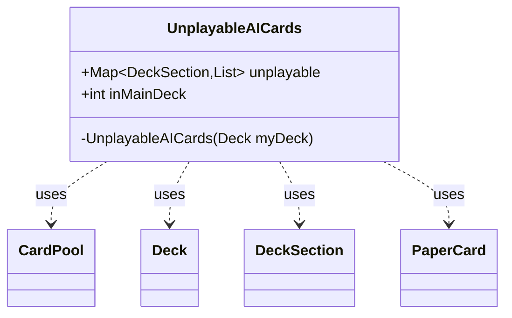

---
aliases:
  - UnplayableAICards
tags:
  - java/class
  - module/forge-core
  - pkg/forge/deck
fqn: forge.deck.Deck.UnplayableAICards
package: forge.deck
module: forge-core
kind: Class
---

# UnplayableAICards

**Package:** `forge.deck`   **Module:** `forge-core`   **Kind:** Class



## Relationships
**Uses:**
- [[forge.deck.CardPool|CardPool]]
- [[forge.deck.Deck|Deck]]
- [[forge.deck.DeckSection|DeckSection]]
- [[forge.item.PaperCard|PaperCard]]

## Design Description

Forge's `UnplayableAICards` is a static nested helper of `Deck` that captures, as a point-in-time snapshot, which cards in a deck the AI is directed to avoid playing. Its constructor is private, so instances arise only through `Deck` itself, reinforcing that it is an internal diagnostic view rather than a standalone entity.

Iterating each `DeckSection`'s `CardPool`, it collects every `PaperCard` whose rules carry the `remAIDecks` AI hint into the immutable `unplayable` map, and separately records the Main-deck count in `inMainDeck`. The design favors a simple, read-only data carrier: final fields populated once at construction, exposing aggregate counts and per-section lists so callers can warn players that a deck may be unsuitable for AI opponents.

## Source
`forge-core/src/main/java/forge/deck/Deck.java` — declaration excerpt

```java
    public static final class UnplayableAICards {
        public final Map<DeckSection, List<? extends PaperCard>> unplayable = new HashMap<>();
        public final int inMainDeck;

        private UnplayableAICards(Deck myDeck) {
            int mainDeck = 0;
            for (Entry<DeckSection, CardPool> ds : myDeck) {
                List<PaperCard> result = Lists.newArrayList();
                for (Entry<PaperCard, Integer> cp : ds.getValue()) {
                    if (cp.getKey().getRules().getAiHints().getRemAIDecks()) {
                        result.add(cp.getKey());
                    }
                }
                if (ds.getKey().equals(DeckSection.Main)) {
                  mainDeck = result.size();
                }
                if (!result.isEmpty()) {
                    unplayable.put(ds.getKey(), result);
                }
            }
            inMainDeck = mainDeck;
        }
    }
```
