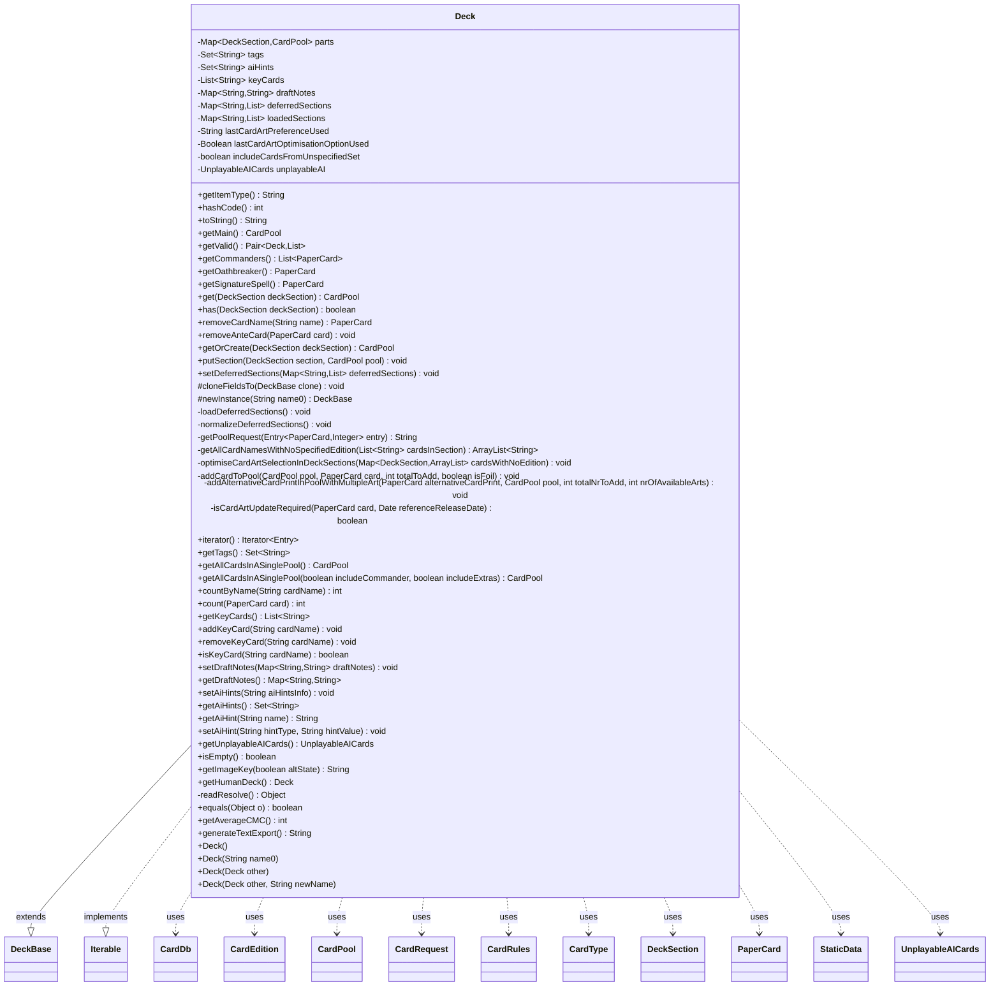

---
aliases:
  - Deck
tags:
  - java/class
  - module/forge-core
  - pkg/forge/deck
fqn: forge.deck.Deck
package: forge.deck
module: forge-core
kind: Class
---

# Deck

**Package:** `forge.deck`   **Module:** `forge-core`   **Kind:** Class



## Relationships
**Extends:**
- [[forge.deck.DeckBase|DeckBase]]
**Uses:**
- [[forge.StaticData|StaticData]]
- [[forge.card.CardDb|CardDb]]
- [[forge.card.CardDb.CardRequest|CardRequest]]
- [[forge.card.CardEdition|CardEdition]]
- [[forge.card.CardRules|CardRules]]
- [[forge.card.CardType|CardType]]
- [[forge.deck.CardPool|CardPool]]
- [[forge.deck.Deck.UnplayableAICards|UnplayableAICards]]
- [[forge.deck.DeckSection|DeckSection]]
- [[forge.item.PaperCard|PaperCard]]


## Design Description

The `Deck` class models a Magic: the Gathering deck — the legal cards that become a player's library at game start — bundled with lightweight metadata such as tags, key cards, draft notes, and AI hints. It extends `DeckBase` to inherit name/identity, cloning, and serialization plumbing, and implements `Iterable<Entry<DeckSection, CardPool>>` so callers can iterate its sections directly. Internally it partitions cards into an `EnumMap` from `DeckSection` to `CardPool`, exposing typed accessors (main, commanders, oathbreaker, signature spell) alongside aggregate queries like per-name counts and average CMC, and a text exporter.

A key design intent is lazy, deferred loading: sections are held as raw card-request strings and materialized into `CardPool`s only on first access via `loadDeferredSections`, avoiding loading every card at startup. It collaborates with `StaticData`, `CardDb`, and `CardEdition` to optimize card-art selection, substituting alternative printings consistent with the pool's dominant ("pivot") edition and the user's art preferences. A `readResolve` hook repairs older serialized decks for backward compatibility.

## Source
`forge-core/src/main/java/forge/deck/Deck.java`

```java
/*
 * Forge: Play Magic: the Gathering.
 * Copyright (C) 2011  Forge Team
 *
 * This program is free software: you can redistribute it and/or modify
 * it under the terms of the GNU General Public License as published by
 * the Free Software Foundation, either version 3 of the License, or
 * (at your option) any later version.
 * 
 * This program is distributed in the hope that it will be useful,
 * but WITHOUT ANY WARRANTY; without even the implied warranty of
 * MERCHANTABILITY or FITNESS FOR A PARTICULAR PURPOSE.  See the
 * GNU General Public License for more details.
 * 
 * You should have received a copy of the GNU General Public License
 * along with this program.  If not, see <http://www.gnu.org/licenses/>.
 */
package forge.deck;

import com.google.common.collect.Lists;
import forge.StaticData;
import forge.card.CardDb;
import forge.card.CardEdition;
import forge.card.CardRules;
import forge.card.CardType;
import forge.item.IPaperCard;
import forge.item.PaperCard;
import forge.util.StreamUtil;
import org.apache.commons.lang3.StringUtils;
import org.apache.commons.lang3.tuple.Pair;

import java.io.ObjectStreamException;
import java.io.Serial;
import java.util.*;
import java.util.Map.Entry;
import java.util.stream.Collectors;

/**
 * <p>
 * Deck class.
 * </p>
 * 
 * The set of MTG legal cards that become player's library when the game starts.
 * Any other data is not part of a deck and should be stored elsewhere. Current
 * fields allowed for deck metadata are Name, Title, Description and Deck Type.
 */
@SuppressWarnings("serial")
public class Deck extends DeckBase implements Iterable<Entry<DeckSection, CardPool>> {
    private final Map<DeckSection, CardPool> parts = new EnumMap<>(DeckSection.class);
    private final Set<String> tags = new TreeSet<>(String.CASE_INSENSITIVE_ORDER);
    // Supports deferring loading a deck until we actually need its contents. This works in conjunction with
    // the lazy card load feature to ensure we don't need to load all cards on start up.
    private final Set<String> aiHints = new TreeSet<>();
    private final List<String> keyCards = new ArrayList<>();
    private final Map<String, String> draftNotes = new HashMap<>();
    private Map<String, List<String>> deferredSections = null;
    private Map<String, List<String>> loadedSections = null;
    private String lastCardArtPreferenceUsed = "";
    private Boolean lastCardArtOptimisationOptionUsed = null;
    private boolean includeCardsFromUnspecifiedSet = false;
    private transient UnplayableAICards unplayableAI = null;

    public Deck() {
        this("");
    }

    /**
     * Instantiates a new deck.
     *
     * @param name0 the name0
     */
    public Deck(final String name0) {
        super(name0);
        getOrCreate(DeckSection.Main);
    }

    /**
     * Copy constructor.
     * 
     * @param other
     *            the {@link Deck} to copy.
     */
    public Deck(final Deck other) {
        this(other, other.getName());
    }

    /**
     * Copy constructor with a different name for the new deck.
     * 
     * @param other
     *            the {@link Deck} to copy.
     * @param newName
     *            the name of the new deck.
     */
    public Deck(final Deck other, final String newName) {
        super(newName);
        other.cloneFieldsTo(this);
    }

    @Override
    public String getItemType() {
        return "Deck";
    }

    @Override
    public int hashCode() {
        return this.getName().hashCode();
    }

    /** {@inheritDoc} */
    @Override
    public String toString() {
        return this.getName();
    }

    public CardPool getMain() {
        loadDeferredSections();
        return parts.get(DeckSection.Main);
    }

    public Pair<Deck, List<PaperCard>> getValid() {
        List<PaperCard> unsupported = new ArrayList<>();
        for (Entry<DeckSection, CardPool> kv : parts.entrySet()) {
            CardPool pool = kv.getValue();
            for (Entry<PaperCard, Integer> pc : pool) {
                if (pc.getKey().getRules() != null && pc.getKey().getRules().isUnsupported()) {
                    unsupported.add(pc.getKey());
                    pool.remove(pc.getKey());
                }
            }
        }
        return Pair.of(this, unsupported);
    }

    public List<PaperCard> getCommanders() {
        List<PaperCard> result = Lists.newArrayList();
        final CardPool cp = get(DeckSection.Commander);
        if (cp == null) {
            return result;
        }
        for (final Entry<PaperCard, Integer> c : cp) {
            result.add(c.getKey());
        }
        if (result.size() > 1) { //sort by type so signature spell comes after oathbreaker
            result.sort(Comparator.comparing(c -> c.getRules().canBeSignatureSpell()));
        }
        return result;
    }

    //at least for now, Oathbreaker will only support one oathbreaker and one signature spell
    public PaperCard getOathbreaker() {
        final CardPool cp = get(DeckSection.Commander);
        if (cp == null) {
            return null;
        }
        for (final Entry<PaperCard, Integer> c : cp) {
            PaperCard card = c.getKey();
            if (card.getRules().canBeOathbreaker()) {
                return card;
            }
        }
        return null;
    }
    public PaperCard getSignatureSpell() {
        final CardPool cp = get(DeckSection.Commander);
        if (cp == null) {
            return null;
        }
        for (final Entry<PaperCard, Integer> c : cp) {
            PaperCard card = c.getKey();
            if (card.getRules().canBeSignatureSpell()) {
                return card;
            }
        }
        return null;
    }

    // may return nulls
    public CardPool get(DeckSection deckSection) {
        loadDeferredSections();
        return parts.get(deckSection);
    }

    public boolean has(DeckSection deckSection) {
        final CardPool cp = get(deckSection);
        return cp != null && !cp.isEmpty();
    }

    public PaperCard removeCardName(String name) {
        PaperCard paperCard;
        for (Entry<DeckSection, CardPool> kv : parts.entrySet()) {
            CardPool pool = kv.getValue();
            for (Entry<PaperCard, Integer> pc : pool) {
                if (pc.getKey().getName().equalsIgnoreCase(name)) {
                    paperCard = pc.getKey();
                    pool.remove(paperCard);
                    return paperCard;
                }
            }
        }
        return null;
    }

    /**
     * Removes a card from any section it's found in, prioritizing the sideboard over other sections.
     */
    public void removeAnteCard(PaperCard card) {
        if (has(DeckSection.Sideboard) && get(DeckSection.Sideboard).contains(card)) {
            get(DeckSection.Sideboard).remove(card);
            return;
        }
        for (CardPool pool : parts.values()) {
            if(pool.contains(card)) {
                pool.remove(card);
                return;
            }
        }
    }

    // will return new if it was absent
    public CardPool getOrCreate(DeckSection deckSection) {
        CardPool p = get(deckSection);
        if (p != null)
            return p;
        p = new CardPool();
        this.parts.put(deckSection, p);
        return p;
    }
    
    public void putSection(DeckSection section, CardPool pool) {
        this.parts.put(section, pool);
    }

    public void setDeferredSections(Map<String, List<String>> deferredSections) {
        this.deferredSections = deferredSections;
    }

    /* (non-Javadoc)
     * @see forge.deck.DeckBase#cloneFieldsTo(forge.deck.DeckBase)
     */
    @Override
    protected void cloneFieldsTo(final DeckBase clone) {
        super.cloneFieldsTo(clone);
        final Deck result = (Deck) clone;
        loadDeferredSections();
        // parts shouldn't be null
        if (parts != null) {
            for (Entry<DeckSection, CardPool> kv : parts.entrySet()) {
                CardPool cp = new CardPool();
                result.parts.put(kv.getKey(), cp);
                cp.addAll(kv.getValue());
            }
        }
        result.setAiHints(StringUtils.join(aiHints, " | "));
        result.setDraftNotes(draftNotes);
        //noinspection ConstantValue
        if(tags != null) //Can happen deserializing old Decks.
            result.tags.addAll(this.tags);
        if(keyCards != null)
            result.keyCards.addAll(this.keyCards);
    }

    /*
     * (non-Javadoc)
     * 
     * @see forge.deck.DeckBase#newInstance(java.lang.String)
     */
    @Override
    protected DeckBase newInstance(final String name0) {
        return new Deck(name0);
    }

    private void loadDeferredSections() {
        if (deferredSections == null && loadedSections == null)
            return;

        if (loadedSections != null && !includeCardsFromUnspecifiedSet)
            return;  // deck loaded, and does not include ANY card with no specified edition: all good!

        String cardArtPreference = StaticData.instance().getCardArtPreferenceName();
        boolean smartCardArtSelection = StaticData.instance().isEnabledCardArtSmartSelection();

        if (lastCardArtOptimisationOptionUsed == null)  // first time here
            lastCardArtOptimisationOptionUsed = smartCardArtSelection;

        if (loadedSections != null && cardArtPreference.equals(lastCardArtPreferenceUsed) &&
                lastCardArtOptimisationOptionUsed == smartCardArtSelection)
            return;  // deck loaded already - card with no set have been found, but no change since last time: all good!

        Map<String, List<String>> referenceDeckLoadingMap;
        if (deferredSections != null) {
            this.normalizeDeferredSections();
            referenceDeckLoadingMap = new HashMap<>(this.deferredSections);
        } else
            referenceDeckLoadingMap = new HashMap<>(loadedSections);

        loadedSections = new HashMap<>();
        lastCardArtPreferenceUsed = cardArtPreference;
        lastCardArtOptimisationOptionUsed = smartCardArtSelection;
        Map<DeckSection, ArrayList<String>> cardsWithNoEdition = null;
        if (smartCardArtSelection)
             cardsWithNoEdition = new EnumMap<>(DeckSection.class);

        for (Entry<String, List<String>> s : referenceDeckLoadingMap.entrySet()) {
            // first thing, update loaded section
            loadedSections.put(s.getKey(), s.getValue());
            DeckSection sec = DeckSection.smartValueOf(s.getKey());
            if (sec == null)
                continue;
            final List<String> cardsInSection = s.getValue();
            ArrayList<String> cardNamesWithNoEdition = getAllCardNamesWithNoSpecifiedEdition(cardsInSection);
            if (!cardNamesWithNoEdition.isEmpty()) {
                includeCardsFromUnspecifiedSet = true;
                if (smartCardArtSelection)
                    cardsWithNoEdition.put(sec, cardNamesWithNoEdition);
            }

            CardPool pool = CardPool.fromCardList(cardsInSection);
            putSection(sec, pool);
        }
        deferredSections = null;  // set to null, just in case!
        if (includeCardsFromUnspecifiedSet && smartCardArtSelection)
            optimiseCardArtSelectionInDeckSections(cardsWithNoEdition);
    }

    private void normalizeDeferredSections() {
        /*
         Construct a temporary (DeckSection, CardPool) Maps, to be sanitised and finalised
         before copying into `this.parts`. This sanitization is applied because of the
         validation schema introduced in DeckSections.
         */
        Map<String, List<String>> validatedSections = new TreeMap<>(String.CASE_INSENSITIVE_ORDER);
        for (Entry<String, List<String>> s : this.deferredSections.entrySet()) {
            final DeckSection deckSection = DeckSection.smartValueOf(s.getKey());
            if (deckSection == null) {
                validatedSections.put(s.getKey(), s.getValue());
                continue;
            }

            final List<String> cardsInSection = s.getValue();
            CardPool pool = CardPool.fromCardList(cardsInSection);
            if (pool.countDistinct() == 0)
                continue;  // pool empty, no card has been found!

            List<String> validatedSection = validatedSections.computeIfAbsent(s.getKey(), (k) -> new ArrayList<>());
            for (Entry<PaperCard, Integer> entry : pool) {
                PaperCard card = entry.getKey();
                String normalizedRequest = getPoolRequest(entry);
                if(deckSection.validate(card))
                    validatedSection.add(normalizedRequest);
                else {
                    // Card was in the wrong section. Move it to the right section.
                    DeckSection cardSection = DeckSection.matchingSection(card);
                    assert(cardSection.validate(card)); //Card doesn't fit in the matchingSection?
                    List<String> sectionCardList = validatedSections.computeIfAbsent(cardSection.name(), (k) -> new ArrayList<>());
                    sectionCardList.add(normalizedRequest);
                }
            }
        } // end main for on deferredSections

        // Overwrite deferredSections
        this.deferredSections = validatedSections;
    }

    private String getPoolRequest(Entry<PaperCard, Integer> entry) {
        int amount = entry.getValue();
        String poolCardRequest = CardDb.CardRequest.compose(entry.getKey());
        return String.format("%d %s", amount, poolCardRequest);
    }

    private ArrayList<String> getAllCardNamesWithNoSpecifiedEdition(List<String> cardsInSection) {
        ArrayList<String> cardNamesWithNoEdition = new ArrayList<>();
        List<Pair<String, Integer>> cardRequests = CardPool.processCardList(cardsInSection);
        for (Pair<String, Integer> pair : cardRequests) {
            String requestString = pair.getLeft();
            CardDb.CardRequest request = CardDb.CardRequest.fromString(requestString);
            if (request.edition == null)
                cardNamesWithNoEdition.add(request.cardName);
        }
        return cardNamesWithNoEdition;
    }

    private void optimiseCardArtSelectionInDeckSections(Map<DeckSection, ArrayList<String>> cardsWithNoEdition) {
        StaticData data = StaticData.instance();
        // Get current Card Art Preference Settings
        boolean isCardArtPreferenceLatestArt = data.cardArtPreferenceIsLatest();
        boolean cardArtPreferenceHasFilter = data.isCoreExpansionOnlyFilterSet();

        for (Entry<DeckSection, CardPool> part : parts.entrySet()) {
            DeckSection deckSection = part.getKey();
            if (deckSection != DeckSection.Main && deckSection != DeckSection.Sideboard && deckSection != DeckSection.Commander)
                continue;

            // == 0. First Off, check if there is anything at all to do for the current section
            ArrayList<String> cardNamesWithNoEditionInSection = cardsWithNoEdition.getOrDefault(deckSection, null);
            if (cardNamesWithNoEditionInSection == null || cardNamesWithNoEditionInSection.size() == 0)
                continue; // nothing to do here

            CardPool pool = part.getValue();
            // Set options for the alternative card print search
            boolean isExpansionTheMajorityInThePool = (pool.getTheMostFrequentEditionType() == CardEdition.Type.EXPANSION);
            boolean isPoolModernFramed = pool.isModern();

            // == Get the most representative (Pivot) Edition in the Pool
            // Note: Card Art Updates (if any) will be determined based on the Pivot Edition.
            CardEdition pivotEdition = pool.getPivotCardEdition(isCardArtPreferenceLatestArt);
            if (pivotEdition == null)
                continue;

            // == Inspect and Update the Pool
            Date releaseDatePivotEdition = pivotEdition.getDate();
            CardPool newPool = new CardPool();
            for (Entry<PaperCard, Integer> cp : pool) {
                PaperCard card = cp.getKey();
                int totalToAddToPool = cp.getValue();
                // A. Skip cards not requiring any update, because they add the edition specified!
                if (!cardNamesWithNoEditionInSection.contains(card.getName())) {
                    addCardToPool(newPool, card, totalToAddToPool, card.isFoil());
                    continue;
                }
                // B. Determine if current card requires update
                boolean cardArtNeedsOptimisation = this.isCardArtUpdateRequired(card, releaseDatePivotEdition);
                if (!cardArtNeedsOptimisation) {
                    addCardToPool(newPool, card, totalToAddToPool, card.isFoil());
                    continue;
                }
                PaperCard alternativeCardPrint = data.getAlternativeCardPrint(card, releaseDatePivotEdition,
                                                                              isCardArtPreferenceLatestArt,
                                                                              cardArtPreferenceHasFilter,
                                                                              isExpansionTheMajorityInThePool,
                                                                              isPoolModernFramed);
                if (alternativeCardPrint == null)  // no alternative found, add original card in Pool
                    addCardToPool(newPool, card, totalToAddToPool, card.isFoil());
                else
                    addCardToPool(newPool, alternativeCardPrint, totalToAddToPool, card.isFoil());
            }
            parts.put(deckSection, newPool);
        }
    }

    private void addCardToPool(CardPool pool, PaperCard card, int totalToAdd, boolean isFoil) {
        StaticData data = StaticData.instance();
        if (card.getArtIndex() != IPaperCard.NO_ART_INDEX && card.getArtIndex() != IPaperCard.DEFAULT_ART_INDEX)
            pool.add(isFoil ? card.getFoiled() : card, totalToAdd);  // art index requested, keep that way!
        else {
            int artCount = data.getCardArtCount(card);
            if (artCount > 1)
                addAlternativeCardPrintInPoolWithMultipleArt(card, pool, totalToAdd, artCount);
            else
                pool.add(isFoil ? card.getFoiled() : card, totalToAdd);
        }
    }

    private void addAlternativeCardPrintInPoolWithMultipleArt(PaperCard alternativeCardPrint, CardPool pool,
                                                              int totalNrToAdd, int nrOfAvailableArts) {
        StaticData data = StaticData.instance();

        // distribute available card art
        String cardName = alternativeCardPrint.getName();
        String setCode = alternativeCardPrint.getEdition();
        boolean isFoil = alternativeCardPrint.isFoil();
        int cardsPerArtIndex = totalNrToAdd / nrOfAvailableArts;
        int restOfCardsToAdd = cardsPerArtIndex > 0 ? totalNrToAdd % nrOfAvailableArts : 0;
        cardsPerArtIndex = Math.max(1, cardsPerArtIndex);  // make sure is never zero
        int cardsAdded = 0;
        PaperCard alternativeCardArt = null;
        for (int artIndex = 1; artIndex <= nrOfAvailableArts; artIndex++) {
            alternativeCardArt = data.getOrLoadCommonCard(cardName, setCode, artIndex, isFoil);
            cardsAdded += cardsPerArtIndex;
            pool.add(alternativeCardArt, cardsPerArtIndex);
            if (cardsAdded == totalNrToAdd)
                break;
        }
        if (restOfCardsToAdd > 0)
            pool.add(alternativeCardArt, restOfCardsToAdd);
    }

    private boolean isCardArtUpdateRequired(PaperCard card, Date referenceReleaseDate) {
        /* A Card Art update is required ONLY IF the current edition of the card is either
        newer (older) than pivot edition when LATEST ART (ORIGINAL ART) Card Art Preference
        is selected.
        This is because what we're trying to "FIX" is the card art selection that is
        "too new" wrt. PivotEdition (or, "too old" with ORIGINAL ART Preference, respectively).
        Example:
        - Case 1: [Latest Art]
        We don't want Lands automatically selected from AFR (too new) within a Deck of mostly Core21 (Pivot)
        - Case 2: [Original Art]
        We don't want an Atog from LEA (too old) in a Deck of Mirrodin (Pivot)

        NOTE: the control implemented in release date also consider the case when the input PaperCard
        is exactly from the Pivot Edition. In this case, NO update will be required!
        */

        if (card.getRules().isVariant())
            return false;  // skip variant cards
        if (StaticData.instance().getCommonCards().hasPreferredArt(card.getName())) {
            // if there is any preferred art, never update it!
            CardDb.CardRequest request = CardDb.CardRequest.fromString(card.getName());
            if (request.edition.equals(card.getEdition()) && request.artIndex == card.getArtIndex())
                return false;
        }
        boolean isLatestCardArtPreference = StaticData.instance().cardArtPreferenceIsLatest();
        CardEdition cardEdition = StaticData.instance().getCardEdition(card.getEdition());
        if (cardEdition == null)  return false;
        Date releaseDate = cardEdition.getDate();
        if (releaseDate == null)  return false;
        if (isLatestCardArtPreference)  // Latest Art
            return releaseDate.compareTo(referenceReleaseDate) > 0;
        // Original Art
        return releaseDate.compareTo(referenceReleaseDate) < 0;
    }

    /* (non-Javadoc)
     * @see java.lang.Iterable#iterator()
     */
    @Override
    public Iterator<Entry<DeckSection, CardPool>> iterator() {
        loadDeferredSections();
        return parts.entrySet().iterator();
    }

    /**
     * @return the associated tags, a writable set
     */
    public Set<String> getTags() {
        return tags;
    }

    public CardPool getAllCardsInASinglePool() {
        return getAllCardsInASinglePool(true, false);
    }
    public CardPool getAllCardsInASinglePool(final boolean includeCommander, boolean includeExtras) {
        final CardPool allCards = new CardPool(); // will count cards in this pool to enforce restricted
        allCards.addAll(this.getMain());
        if (this.has(DeckSection.Sideboard)) {
            allCards.addAll(this.get(DeckSection.Sideboard));
        }
        if (includeCommander && this.has(DeckSection.Commander)) {
            allCards.addAll(this.get(DeckSection.Commander));
        }
        if (includeExtras) {
            for (DeckSection section : DeckSection.NONTRADITIONAL_SECTIONS)
                if (this.has(section))
                    allCards.addAll(this.get(section));
        }
        // do not include schemes / avatars and any non-regular cards
        return allCards;
    }

    /**
     * Counts the number of cards with the given name across all deck sections.
     */
    public int countByName(String cardName) {
        int sum = 0;
        for (Entry<DeckSection, CardPool> section : this) {
            sum += section.getValue().countByName(cardName);
        }
        return sum;
    }

    /**
     * Counts the number of copies of this exact card print across all deck sections.
     */
    public int count(PaperCard card) {
        int sum = 0;
        for (Entry<DeckSection, CardPool> section : this) {
            sum += section.getValue().count(card);
        }
        return sum;
    }

    public List<String> getKeyCards() {
        return new ArrayList<>(keyCards);
    }

    public void addKeyCard(String cardName) {
        if (cardName != null && !cardName.trim().isEmpty()) {
            String trimmed = cardName.trim();
            if (!keyCards.contains(trimmed)) {
                keyCards.add(trimmed);
            }
        }
    }

    public void removeKeyCard(String cardName) {
        if (cardName != null) {
            keyCards.remove(cardName.trim());
        }
    }

    public boolean isKeyCard(String cardName) {
        if (cardName == null) {
            return false;
        }
        return keyCards.contains(cardName.trim());
    }

    public void setDraftNotes(Map<String, String> draftNotes) {
        if (draftNotes == null) {
            return;
        }

        for(String key : draftNotes.keySet()) {
            String notes = draftNotes.get(key);
            if (notes == null || notes.isEmpty()) {
                continue;
            }
            this.draftNotes.put(key, notes.trim());
        }
    }

    public Map<String, String> getDraftNotes() {
        return draftNotes;
    }

    public void setAiHints(String aiHintsInfo) {
        if (aiHintsInfo == null || aiHintsInfo.trim().isEmpty()) {
            return;
        }
        String[] hints = aiHintsInfo.split("\\|");
        for (String hint : hints) {
            aiHints.add(hint.trim());
        }
    }

    public Set<String> getAiHints() {
        return aiHints;
    }

    public String getAiHint(String name) {
        for (String aiHint : aiHints) {
            if (aiHint.toLowerCase().startsWith(name.toLowerCase() + "$")) {
                return aiHint.substring(aiHint.indexOf("$") + 1).trim();
            }
        }
        return "";
    }

    public void setAiHint(String hintType, String hintValue) {
        if (hintValue == null || hintValue.trim().isEmpty()) {
            return;
        }

        // Remove existing hint of the same type, if any
        aiHints.removeIf(hint -> hint.toLowerCase().startsWith(hintType.toLowerCase() + "$"));

        // Add new hint if it's not empty
        aiHints.add(hintType + "$" + hintValue.trim());
    }

    public UnplayableAICards getUnplayableAICards() {
        if (unplayableAI == null) {
            unplayableAI = new UnplayableAICards(this);
        }
        return unplayableAI;
    }

    public static final class UnplayableAICards {
        public final Map<DeckSection, List<? extends PaperCard>> unplayable = new HashMap<>();
        public final int inMainDeck;

        private UnplayableAICards(Deck myDeck) {
            int mainDeck = 0;
            for (Entry<DeckSection, CardPool> ds : myDeck) {
                List<PaperCard> result = Lists.newArrayList();
                for (Entry<PaperCard, Integer> cp : ds.getValue()) {
                    if (cp.getKey().getRules().getAiHints().getRemAIDecks()) {
                        result.add(cp.getKey());
                    }
                }
                if (ds.getKey().equals(DeckSection.Main)) {
                  mainDeck = result.size();
                }
                if (!result.isEmpty()) {
                    unplayable.put(ds.getKey(), result);
                }
            }
            inMainDeck = mainDeck;
        }
    }

    @Override
    public boolean isEmpty() {
        loadDeferredSections();
        for (CardPool part : parts.values()) {
            if (!part.isEmpty()) {
                return false;
            }
        }
        return true;
    }

    @Override
    public String getImageKey(boolean altState) {
        return null;
    }

    @Override
    public Deck getHumanDeck() {
        return this;
    }

    @Serial
    private Object readResolve() throws ObjectStreamException {
        //If we deserialized an old deck that doesn't have tags, fix it here.
        if(this.tags == null)
            return new Deck(this, this.getName() == null ? "" : this.getName());
        return this;
    }

    /** {@inheritDoc} */
    @Override
    public boolean equals(final Object o) {
        if (o instanceof DeckBase deckBase) {
            boolean deckBaseEquals = super.equals(deckBase);
            if (!deckBaseEquals)
                return false;
            // ok so far we made sure they do have the same name. Now onto comparing parts
            final Deck d = (Deck) o;
            for (DeckSection deckSection : this.parts.keySet()) {
                CardPool otherPool = d.get(deckSection);
                CardPool thisPool = this.parts.get(deckSection);
                if (!thisPool.equals(otherPool))  // this also accounts for null from d.get
                    return false;
            }
            // if we reached this far, it means all sections in this.parts are identical to d.parts
            // now let's consider the other way around, as in any section in d not in parts.
            for (DeckSection deckSection: d.parts.keySet()){
                CardPool otherPool = d.get(deckSection);
                if (!this.parts.containsKey(deckSection) && otherPool.countAll() > 0)
                    return false;
            }
            return true;
        }
        return false;
    }

    public int getAverageCMC() {
        int totalCMC = 0;
        int totalCount = 0;
        for (final Entry<DeckSection, CardPool> deckEntry : this) {
            switch (deckEntry.getKey()) {
            case Main:
            case Commander:
                for (final Entry<PaperCard, Integer> poolEntry : deckEntry.getValue()) {
                    CardRules rules = poolEntry.getKey().getRules();
                    CardType type = rules.getType();
                    if (!type.isLand() && (type.isArtifact() || type.isCreature() || type.isEnchantment() || type.isPlaneswalker() || type.isInstant() || type.isSorcery())) {
                        totalCMC += rules.getManaCost().getCMC();
                        totalCount++;
                    }
                }
                break;
            default:
                break; //ignore other sections
            }
        }
        return totalCount == 0 ? 0 : Math.round(totalCMC / totalCount);
    }

    public String generateTextExport() {
        final String nl = System.lineSeparator();
        final StringBuilder deckList = new StringBuilder();
        String dName = getName();
        //fix copying a commander netdeck then importing it again...
        if (dName.startsWith("[Commander")||dName.contains("Commander"))
            dName = "";
        deckList.append(dName == null ? "" : "Deck: "+dName + nl + nl);

        for (DeckSection s : DeckSection.values()) {
            CardPool cp = get(s);
            if (cp == null || cp.isEmpty()) {
                continue;
            }
            deckList.append(s.toString()).append(": ");
            deckList.append(nl);

            for (final Entry<String, Integer> ev: StreamUtil.stream(cp).collect(Collectors.groupingBy(ev -> ev.getKey().getCardName(), TreeMap::new, Collectors.summingInt(ev -> ev.getValue()))).entrySet()) {
                deckList.append(ev.getValue()).append(" ").append(ev.getKey()).append(nl);
            }
            deckList.append(nl);
        }
        return deckList.toString();
    }
}
```

## Python
`forge/deck/Deck.py`

```python
from forge.deck.DeckBase import DeckBase
from forge.StaticData import StaticData
from forge.card.CardDb import CardDb
from forge.card.CardDb.CardRequest import CardRequest
from forge.card.CardEdition import CardEdition
from forge.card.CardRules import CardRules
from forge.card.CardType import CardType
from forge.deck.CardPool import CardPool
from forge.deck.DeckSection import DeckSection
from forge.item.IPaperCard import IPaperCard
from forge.item.PaperCard import PaperCard

import os


class _DeckEntry:
    """Lightweight Map.Entry<DeckSection, CardPool> equivalent yielded while iterating a Deck."""
    def __init__(self, key, value):
        self._key = key
        self._value = value

    def getKey(self):
        return self._key

    def getValue(self):
        return self._value


class Deck(DeckBase):
    """
    Deck class.

    The set of MTG legal cards that become player's library when the game starts.
    Any other data is not part of a deck and should be stored elsewhere. Current
    fields allowed for deck metadata are Name, Title, Description and Deck Type.
    """

    def __init__(self, *args):
        # field initializers (run for every constructor, mirroring Java)
        self.parts = {}  # Map<DeckSection, CardPool>
        self.tags = set()  # Set<String> (case-insensitive in Java)
        # Supports deferring loading a deck until we actually need its contents. This works in conjunction with
        # the lazy card load feature to ensure we don't need to load all cards on start up.
        self.aiHints = set()  # Set<String>
        self.keyCards = []  # List<String>
        self.draftNotes = {}  # Map<String, String>
        self.deferredSections = None
        self.loadedSections = None
        self.lastCardArtPreferenceUsed = ""
        self.lastCardArtOptimisationOptionUsed = None
        self.includeCardsFromUnspecifiedSet = False
        self.unplayableAI = None  # transient

        if len(args) == 0:
            Deck.__init__(self, "")
            return

        if len(args) == 1 and isinstance(args[0], str):
            name0 = args[0]
            super().__init__(name0)
            self.getOrCreate(DeckSection.Main)
            return

        if len(args) == 1 and isinstance(args[0], Deck):
            other = args[0]
            Deck.__init__(self, other, other.getName())
            return

        if len(args) == 2:
            other, newName = args
            super().__init__(newName)
            other.cloneFieldsTo(self)
            return

        raise TypeError("Invalid arguments for Deck constructor")

    def getItemType(self):
        return "Deck"

    def __hash__(self):
        return hash(self.getName())

    def __str__(self):
        return self.getName()

    def getMain(self):
        self.loadDeferredSections()
        return self.parts.get(DeckSection.Main)

    def getValid(self):
        unsupported = []
        for section, pool in self.parts.items():
            for pc in list(pool):
                if pc.getKey().getRules() is not None and pc.getKey().getRules().isUnsupported():
                    unsupported.append(pc.getKey())
                    pool.remove(pc.getKey())
        return (self, unsupported)

    def getCommanders(self):
        result = []
        cp = self.get(DeckSection.Commander)
        if cp is None:
            return result
        for c in cp:
            result.append(c.getKey())
        if len(result) > 1:  # sort by type so signature spell comes after oathbreaker
            result.sort(key=lambda c: c.getRules().canBeSignatureSpell())
        return result

    # at least for now, Oathbreaker will only support one oathbreaker and one signature spell
    def getOathbreaker(self):
        cp = self.get(DeckSection.Commander)
        if cp is None:
            return None
        for c in cp:
            card = c.getKey()
            if card.getRules().canBeOathbreaker():
                return card
        return None

    def getSignatureSpell(self):
        cp = self.get(DeckSection.Commander)
        if cp is None:
            return None
        for c in cp:
            card = c.getKey()
            if card.getRules().canBeSignatureSpell():
                return card
        return None

    # may return nulls
    def get(self, deckSection):
        self.loadDeferredSections()
        return self.parts.get(deckSection)

    def has(self, deckSection):
        cp = self.get(deckSection)
        return cp is not None and not cp.isEmpty()

    def removeCardName(self, name):
        for section, pool in self.parts.items():
            for pc in list(pool):
                if pc.getKey().getName().equalsIgnoreCase(name):
                    paperCard = pc.getKey()
                    pool.remove(paperCard)
                    return paperCard
        return None

    def removeAnteCard(self, card):
        """Removes a card from any section it's found in, prioritizing the sideboard over other sections."""
        if self.has(DeckSection.Sideboard) and self.get(DeckSection.Sideboard).contains(card):
            self.get(DeckSection.Sideboard).remove(card)
            return
        for pool in self.parts.values():
            if pool.contains(card):
                pool.remove(card)
                return

    # will return new if it was absent
    def getOrCreate(self, deckSection):
        p = self.get(deckSection)
        if p is not None:
            return p
        p = CardPool()
        self.parts[deckSection] = p
        return p

    def putSection(self, section, pool):
        self.parts[section] = pool

    def setDeferredSections(self, deferredSections):
        self.deferredSections = deferredSections

    def cloneFieldsTo(self, clone):
        super().cloneFieldsTo(clone)
        result = clone
        self.loadDeferredSections()
        # parts shouldn't be null
        if self.parts is not None:
            for key, value in self.parts.items():
                cp = CardPool()
                result.parts[key] = cp
                cp.addAll(value)
        result.setAiHints(" | ".join(self.aiHints))
        result.setDraftNotes(self.draftNotes)
        if self.tags is not None:  # Can happen deserializing old Decks.
            result.tags.update(self.tags)
        if self.keyCards is not None:
            result.keyCards.extend(self.keyCards)

    def newInstance(self, name0):
        return Deck(name0)

    def loadDeferredSections(self):
        if self.deferredSections is None and self.loadedSections is None:
            return

        if self.loadedSections is not None and not self.includeCardsFromUnspecifiedSet:
            return  # deck loaded, and does not include ANY card with no specified edition: all good!

        cardArtPreference = StaticData.instance().getCardArtPreferenceName()
        smartCardArtSelection = StaticData.instance().isEnabledCardArtSmartSelection()

        if self.lastCardArtOptimisationOptionUsed is None:  # first time here
            self.lastCardArtOptimisationOptionUsed = smartCardArtSelection

        if self.loadedSections is not None and cardArtPreference == self.lastCardArtPreferenceUsed and \
                self.lastCardArtOptimisationOptionUsed == smartCardArtSelection:
            return  # deck loaded already - card with no set have been found, but no change since last time: all good!

        if self.deferredSections is not None:
            self.normalizeDeferredSections()
            referenceDeckLoadingMap = dict(self.deferredSections)
        else:
            referenceDeckLoadingMap = dict(self.loadedSections)

        self.loadedSections = {}
        self.lastCardArtPreferenceUsed = cardArtPreference
        self.lastCardArtOptimisationOptionUsed = smartCardArtSelection
        cardsWithNoEdition = None
        if smartCardArtSelection:
            cardsWithNoEdition = {}

        for key, value in referenceDeckLoadingMap.items():
            # first thing, update loaded section
            self.loadedSections[key] = value
            sec = DeckSection.smartValueOf(key)
            if sec is None:
                continue
            cardsInSection = value
            cardNamesWithNoEdition = self.getAllCardNamesWithNoSpecifiedEdition(cardsInSection)
            if cardNamesWithNoEdition:
                self.includeCardsFromUnspecifiedSet = True
                if smartCardArtSelection:
                    cardsWithNoEdition[sec] = cardNamesWithNoEdition

            pool = CardPool.fromCardList(cardsInSection)
            self.putSection(sec, pool)
        self.deferredSections = None  # set to null, just in case!
        if self.includeCardsFromUnspecifiedSet and smartCardArtSelection:
            self.optimiseCardArtSelectionInDeckSections(cardsWithNoEdition)

    def normalizeDeferredSections(self):
        """
        Construct a temporary (DeckSection, CardPool) Maps, to be sanitised and finalised
        before copying into `this.parts`. This sanitization is applied because of the
        validation schema introduced in DeckSections.
        """
        validatedSections = {}  # keyed case-insensitively in Java (TreeMap)
        for key, value in self.deferredSections.items():
            deckSection = DeckSection.smartValueOf(key)
            if deckSection is None:
                validatedSections[key] = value
                continue

            cardsInSection = value
            pool = CardPool.fromCardList(cardsInSection)
            if pool.countDistinct() == 0:
                continue  # pool empty, no card has been found!

            validatedSection = validatedSections.get(key)
            if validatedSection is None:
                validatedSection = []
                validatedSections[key] = validatedSection
            for entry in pool:
                card = entry.getKey()
                normalizedRequest = self.getPoolRequest(entry)
                if deckSection.validate(card):
                    validatedSection.append(normalizedRequest)
                else:
                    # Card was in the wrong section. Move it to the right section.
                    cardSection = DeckSection.matchingSection(card)
                    assert cardSection.validate(card)  # Card doesn't fit in the matchingSection?
                    sectionCardList = validatedSections.get(cardSection.name())
                    if sectionCardList is None:
                        sectionCardList = []
                        validatedSections[cardSection.name()] = sectionCardList
                    sectionCardList.append(normalizedRequest)
        # end main for on deferredSections

        # Overwrite deferredSections
        self.deferredSections = validatedSections

    def getPoolRequest(self, entry):
        amount = entry.getValue()
        poolCardRequest = CardRequest.compose(entry.getKey())
        return "%d %s" % (amount, poolCardRequest)

    def getAllCardNamesWithNoSpecifiedEdition(self, cardsInSection):
        cardNamesWithNoEdition = []
        cardRequests = CardPool.processCardList(cardsInSection)
        for pair in cardRequests:
            requestString = pair.getLeft()
            request = CardRequest.fromString(requestString)
            if request.edition is None:
                cardNamesWithNoEdition.append(request.cardName)
        return cardNamesWithNoEdition

    def optimiseCardArtSelectionInDeckSections(self, cardsWithNoEdition):
        data = StaticData.instance()
        # Get current Card Art Preference Settings
        isCardArtPreferenceLatestArt = data.cardArtPreferenceIsLatest()
        cardArtPreferenceHasFilter = data.isCoreExpansionOnlyFilterSet()

        for deckSection, pool in list(self.parts.items()):
            if deckSection != DeckSection.Main and deckSection != DeckSection.Sideboard and deckSection != DeckSection.Commander:
                continue

            # == 0. First Off, check if there is anything at all to do for the current section
            cardNamesWithNoEditionInSection = cardsWithNoEdition.get(deckSection, None)
            if cardNamesWithNoEditionInSection is None or len(cardNamesWithNoEditionInSection) == 0:
                continue  # nothing to do here

            # Set options for the alternative card print search
            isExpansionTheMajorityInThePool = (pool.getTheMostFrequentEditionType() == CardEdition.Type.EXPANSION)
            isPoolModernFramed = pool.isModern()

            # == Get the most representative (Pivot) Edition in the Pool
            # Note: Card Art Updates (if any) will be determined based on the Pivot Edition.
            pivotEdition = pool.getPivotCardEdition(isCardArtPreferenceLatestArt)
            if pivotEdition is None:
                continue

            # == Inspect and Update the Pool
            releaseDatePivotEdition = pivotEdition.getDate()
            newPool = CardPool()
            for cp in pool:
                card = cp.getKey()
                totalToAddToPool = cp.getValue()
                # A. Skip cards not requiring any update, because they add the edition specified!
                if card.getName() not in cardNamesWithNoEditionInSection:
                    self.addCardToPool(newPool, card, totalToAddToPool, card.isFoil())
                    continue
                # B. Determine if current card requires update
                cardArtNeedsOptimisation = self.isCardArtUpdateRequired(card, releaseDatePivotEdition)
                if not cardArtNeedsOptimisation:
                    self.addCardToPool(newPool, card, totalToAddToPool, card.isFoil())
                    continue
                alternativeCardPrint = data.getAlternativeCardPrint(card, releaseDatePivotEdition,
                                                                    isCardArtPreferenceLatestArt,
                                                                    cardArtPreferenceHasFilter,
                                                                    isExpansionTheMajorityInThePool,
                                                                    isPoolModernFramed)
                if alternativeCardPrint is None:  # no alternative found, add original card in Pool
                    self.addCardToPool(newPool, card, totalToAddToPool, card.isFoil())
                else:
                    self.addCardToPool(newPool, alternativeCardPrint, totalToAddToPool, card.isFoil())
            self.parts[deckSection] = newPool

    def addCardToPool(self, pool, card, totalToAdd, isFoil):
        data = StaticData.instance()
        if card.getArtIndex() != IPaperCard.NO_ART_INDEX and card.getArtIndex() != IPaperCard.DEFAULT_ART_INDEX:
            pool.add(card.getFoiled() if isFoil else card, totalToAdd)  # art index requested, keep that way!
        else:
            artCount = data.getCardArtCount(card)
            if artCount > 1:
                self.addAlternativeCardPrintInPoolWithMultipleArt(card, pool, totalToAdd, artCount)
            else:
                pool.add(card.getFoiled() if isFoil else card, totalToAdd)

    def addAlternativeCardPrintInPoolWithMultipleArt(self, alternativeCardPrint, pool, totalNrToAdd, nrOfAvailableArts):
        data = StaticData.instance()

        # distribute available card art
        cardName = alternativeCardPrint.getName()
        setCode = alternativeCardPrint.getEdition()
        isFoil = alternativeCardPrint.isFoil()
        cardsPerArtIndex = totalNrToAdd // nrOfAvailableArts
        restOfCardsToAdd = totalNrToAdd % nrOfAvailableArts if cardsPerArtIndex > 0 else 0
        cardsPerArtIndex = max(1, cardsPerArtIndex)  # make sure is never zero
        cardsAdded = 0
        alternativeCardArt = None
        for artIndex in range(1, nrOfAvailableArts + 1):
            alternativeCardArt = data.getOrLoadCommonCard(cardName, setCode, artIndex, isFoil)
            cardsAdded += cardsPerArtIndex
            pool.add(alternativeCardArt, cardsPerArtIndex)
            if cardsAdded == totalNrToAdd:
                break
        if restOfCardsToAdd > 0:
            pool.add(alternativeCardArt, restOfCardsToAdd)

    def isCardArtUpdateRequired(self, card, referenceReleaseDate):
        """
        A Card Art update is required ONLY IF the current edition of the card is either
        newer (older) than pivot edition when LATEST ART (ORIGINAL ART) Card Art Preference
        is selected.
        This is because what we're trying to "FIX" is the card art selection that is
        "too new" wrt. PivotEdition (or, "too old" with ORIGINAL ART Preference, respectively).
        Example:
        - Case 1: [Latest Art]
        We don't want Lands automatically selected from AFR (too new) within a Deck of mostly Core21 (Pivot)
        - Case 2: [Original Art]
        We don't want an Atog from LEA (too old) in a Deck of Mirrodin (Pivot)

        NOTE: the control implemented in release date also consider the case when the input PaperCard
        is exactly from the Pivot Edition. In this case, NO update will be required!
        """

        if card.getRules().isVariant():
            return False  # skip variant cards
        if StaticData.instance().getCommonCards().hasPreferredArt(card.getName()):
            # if there is any preferred art, never update it!
            request = CardRequest.fromString(card.getName())
            if request.edition == card.getEdition() and request.artIndex == card.getArtIndex():
                return False
        isLatestCardArtPreference = StaticData.instance().cardArtPreferenceIsLatest()
        cardEdition = StaticData.instance().getCardEdition(card.getEdition())
        if cardEdition is None:
            return False
        releaseDate = cardEdition.getDate()
        if releaseDate is None:
            return False
        if isLatestCardArtPreference:  # Latest Art
            return releaseDate > referenceReleaseDate
        # Original Art
        return releaseDate < referenceReleaseDate

    def __iter__(self):
        self.loadDeferredSections()
        for key, value in self.parts.items():
            yield _DeckEntry(key, value)

    def iterator(self):
        return self.__iter__()

    def getTags(self):
        """:return: the associated tags, a writable set"""
        return self.tags

    def getAllCardsInASinglePool(self, includeCommander=True, includeExtras=False):
        allCards = CardPool()  # will count cards in this pool to enforce restricted
        allCards.addAll(self.getMain())
        if self.has(DeckSection.Sideboard):
            allCards.addAll(self.get(DeckSection.Sideboard))
        if includeCommander and self.has(DeckSection.Commander):
            allCards.addAll(self.get(DeckSection.Commander))
        if includeExtras:
            for section in DeckSection.NONTRADITIONAL_SECTIONS:
                if self.has(section):
                    allCards.addAll(self.get(section))
        # do not include schemes / avatars and any non-regular cards
        return allCards

    def countByName(self, cardName):
        """Counts the number of cards with the given name across all deck sections."""
        sum_ = 0
        for section in self:
            sum_ += section.getValue().countByName(cardName)
        return sum_

    def count(self, card):
        """Counts the number of copies of this exact card print across all deck sections."""
        sum_ = 0
        for section in self:
            sum_ += section.getValue().count(card)
        return sum_

    def getKeyCards(self):
        return list(self.keyCards)

    def addKeyCard(self, cardName):
        if cardName is not None and cardName.strip() != "":
            trimmed = cardName.strip()
            if trimmed not in self.keyCards:
                self.keyCards.append(trimmed)

    def removeKeyCard(self, cardName):
        if cardName is not None:
            trimmed = cardName.strip()
            if trimmed in self.keyCards:
                self.keyCards.remove(trimmed)

    def isKeyCard(self, cardName):
        if cardName is None:
            return False
        return cardName.strip() in self.keyCards

    def setDraftNotes(self, draftNotes):
        if draftNotes is None:
            return

        for key in draftNotes.keys():
            notes = draftNotes.get(key)
            if notes is None or notes == "":
                continue
            self.draftNotes[key] = notes.strip()

    def getDraftNotes(self):
        return self.draftNotes

    def setAiHints(self, aiHintsInfo):
        if aiHintsInfo is None or aiHintsInfo.strip() == "":
            return
        hints = aiHintsInfo.split("|")
        for hint in hints:
            self.aiHints.add(hint.strip())

    def getAiHints(self):
        return self.aiHints

    def getAiHint(self, name):
        for aiHint in self.aiHints:
            if aiHint.lower().startswith(name.lower() + "$"):
                return aiHint[aiHint.index("$") + 1:].strip()
        return ""

    def setAiHint(self, hintType, hintValue):
        if hintValue is None or hintValue.strip() == "":
            return

        # Remove existing hint of the same type, if any
        self.aiHints = {hint for hint in self.aiHints if not hint.lower().startswith(hintType.lower() + "$")}

        # Add new hint if it's not empty
        self.aiHints.add(hintType + "$" + hintValue.strip())

    def getUnplayableAICards(self):
        if self.unplayableAI is None:
            self.unplayableAI = Deck.UnplayableAICards(self)
        return self.unplayableAI

    class UnplayableAICards:
        def __init__(self, myDeck):
            self.unplayable = {}  # Map<DeckSection, List<? extends PaperCard>>
            mainDeck = 0
            for ds in myDeck:
                result = []
                for cp in ds.getValue():
                    if cp.getKey().getRules().getAiHints().getRemAIDecks():
                        result.append(cp.getKey())
                if ds.getKey() == DeckSection.Main:
                    mainDeck = len(result)
                if result:
                    self.unplayable[ds.getKey()] = result
            self.inMainDeck = mainDeck

    def isEmpty(self):
        self.loadDeferredSections()
        for part in self.parts.values():
            if not part.isEmpty():
                return False
        return True

    def getImageKey(self, altState):
        return None

    def getHumanDeck(self):
        return self

    def readResolve(self):
        # If we deserialized an old deck that doesn't have tags, fix it here.
        if self.tags is None:
            return Deck(self, "" if self.getName() is None else self.getName())
        return self

    def __eq__(self, o):
        if isinstance(o, DeckBase):
            deckBase = o
            deckBaseEquals = super().__eq__(deckBase)
            if not deckBaseEquals:
                return False
            # ok so far we made sure they do have the same name. Now onto comparing parts
            d = o
            for deckSection in list(self.parts.keys()):
                otherPool = d.get(deckSection)
                thisPool = self.parts.get(deckSection)
                if not thisPool.equals(otherPool):  # this also accounts for null from d.get
                    return False
            # if we reached this far, it means all sections in this.parts are identical to d.parts
            # now let's consider the other way around, as in any section in d not in parts.
            for deckSection in list(d.parts.keys()):
                otherPool = d.get(deckSection)
                if deckSection not in self.parts and otherPool.countAll() > 0:
                    return False
            return True
        return False

    def getAverageCMC(self):
        totalCMC = 0
        totalCount = 0
        for deckEntry in self:
            if deckEntry.getKey() in (DeckSection.Main, DeckSection.Commander):
                for poolEntry in deckEntry.getValue():
                    rules = poolEntry.getKey().getRules()
                    type_ = rules.getType()
                    if not type_.isLand() and (type_.isArtifact() or type_.isCreature() or type_.isEnchantment() or type_.isPlaneswalker() or type_.isInstant() or type_.isSorcery()):
                        totalCMC += rules.getManaCost().getCMC()
                        totalCount += 1
            else:
                pass  # ignore other sections
        return 0 if totalCount == 0 else totalCMC // totalCount

    def generateTextExport(self):
        nl = os.linesep
        deckList = []
        dName = self.getName()
        # fix copying a commander netdeck then importing it again...
        if dName.startswith("[Commander") or "Commander" in dName:
            dName = ""
        deckList.append("" if dName is None else "Deck: " + dName + nl + nl)

        for s in DeckSection.values():
            cp = self.get(s)
            if cp is None or cp.isEmpty():
                continue
            deckList.append(str(s))
            deckList.append(": ")
            deckList.append(nl)

            groups = {}
            for ev in cp:
                cardName = ev.getKey().getCardName()
                groups[cardName] = groups.get(cardName, 0) + ev.getValue()
            for cardName in sorted(groups):
                deckList.append(str(groups[cardName]))
                deckList.append(" ")
                deckList.append(cardName)
                deckList.append(nl)
            deckList.append(nl)
        return "".join(deckList)
```
