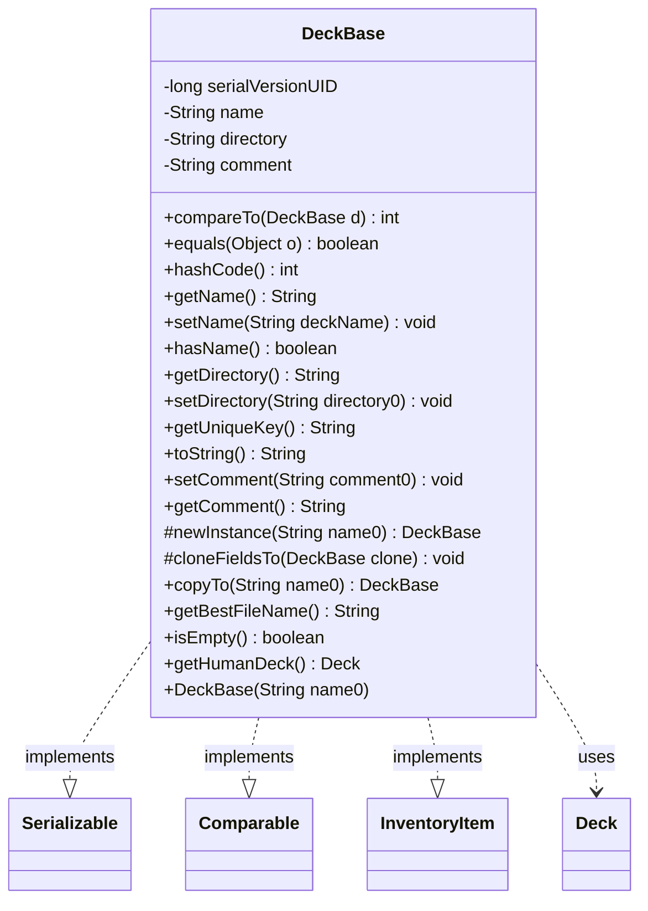

---
aliases:
  - DeckBase
tags:
  - java/class
  - module/forge-core
  - pkg/forge/deck
fqn: forge.deck.DeckBase
package: forge.deck
module: forge-core
kind: Class
---

# DeckBase

**Package:** `forge.deck`   **Module:** `forge-core`   **Kind:** Class



## Relationships
**Implements:**
- [[forge.item.InventoryItem|InventoryItem]]
**Uses:**
- [[forge.deck.Deck|Deck]]


## Design Description

DeckBase is the abstract root of Forge's deck model, providing the shared identity and metadata common to every kind of deck. It holds a name (sanitized of path separators), an optional directory, and a free-form comment, and derives values from these such as a unique key (`directory/name`) and a filesystem-safe filename that falls back to a timestamp when the name yields no legal characters. By implementing `Serializable` it supports persistence, `Comparable<DeckBase>` orders decks by name, and `InventoryItem` lets decks participate as catalog items; equality and hashing are likewise keyed solely on name.

Concrete behavior is deferred to subclasses through the abstract `newInstance`, `isEmpty`, and `getHumanDeck` (which collaborates with `Deck`) methods. The template-style `copyTo` pairs `newInstance` with the overridable `cloneFieldsTo` hook, letting subclasses extend cloning while reusing the base's copy logic — a clear separation of shared state from type-specific construction.

## Source
`forge-core/src/main/java/forge/deck/DeckBase.java`

```java
/*
 * Forge: Play Magic: the Gathering.
 * Copyright (C) 2011  Forge Team
 *
 * This program is free software: you can redistribute it and/or modify
 * it under the terms of the GNU General Public License as published by
 * the Free Software Foundation, either version 3 of the License, or
 * (at your option) any later version.
 *
 * This program is distributed in the hope that it will be useful,
 * but WITHOUT ANY WARRANTY; without even the implied warranty of
 * MERCHANTABILITY or FITNESS FOR A PARTICULAR PURPOSE.  See the
 * GNU General Public License for more details.
 *
 * You should have received a copy of the GNU General Public License
 * along with this program.  If not, see <http://www.gnu.org/licenses/>.
 */
package forge.deck;

import forge.item.InventoryItem;

import java.io.Serializable;
import java.time.LocalDateTime;
import java.time.format.DateTimeFormatter;

public abstract class DeckBase implements Serializable, Comparable<DeckBase>, InventoryItem {
    private static final long serialVersionUID = -7538150536939660052L;
    // gameType is from Constant.GameType, like GameType.Regular

    private String name;
    private transient String directory;
    private String comment = null;

    /**
     * Instantiates a new deck base.
     *
     * @param name0 the name0
     */
    public DeckBase(final String name0) {
        name = name0.replace('/', '_');
    }

    /* (non-Javadoc)
     * @see java.lang.Comparable#compareTo(java.lang.Object)
     */
    @Override
    public int compareTo(final DeckBase d) {
        return name.compareTo(d.name);
    }

    /** {@inheritDoc} */
    @Override
    public boolean equals(final Object o) {
        if (o instanceof DeckBase) {
            final DeckBase d = (DeckBase) o;
            return name.equals(d.name);
        }
        return false;
    }

    /*
     * (non-Javadoc)
     *
     * @see java.lang.Object#hashCode()
     */
    @Override
    public int hashCode() {
        return (name.hashCode() * 17) + name.hashCode();
    }

    public String getName() {
        return name;
    }

    public void setName(String deckName) { this.name = deckName; }

    public boolean hasName() {
        return !(this.name.isEmpty());
    }

    public String getDirectory() {
        return directory;
    }

    public void setDirectory(String directory0) {
        directory = directory0;
    }

    public String getUniqueKey() {
        if (directory == null) { return name; }
        return directory + "/" + name;
    }

    @Override
    public String toString() {
        return name;
    }

    /**
     * Sets the comment.
     *
     * @param comment0 the new comment
     */
    public void setComment(final String comment0) {
        comment = comment0;
    }

    /**
     * <p>
     * getComment.
     * </p>
     *
     * @return a {@link java.lang.String} object.
     */
    public String getComment() {
        return comment;
    }

    /**
     * New instance.
     *
     * @param name0 the name0
     * @return the deck base
     */
    protected abstract DeckBase newInstance(String name0);

    /**
     * Clone fields to.
     *
     * @param clone the clone
     */
    protected void cloneFieldsTo(final DeckBase clone) {
        clone.directory = directory;
        clone.comment = comment;
    }

    /**
     * Copy to.
     *
     * @param name0 the name0
     * @return the deck base
     */
    public DeckBase copyTo(final String name0) {
        final DeckBase obj = newInstance(name0);
        cloneFieldsTo(obj);
        return obj;
    }

    /**
     * Gets the best file name.
     *
     * @return the best file name
     */
    public final String getBestFileName() {
        //string operator hard to guarantee filename legal,only replace some not allowed as file names characters
        final String result = name.replaceAll("[\\/:*?\"<>|]","");
        if (result.isEmpty()) {
            final String createTime = LocalDateTime.now().format(DateTimeFormatter.ofPattern("yyyy-MM-dd-HH-mm"));
            return createTime;
        }
        return result;
    }

    public abstract boolean isEmpty();

    public abstract Deck getHumanDeck();
}
```

## Python
`forge/deck/DeckBase.py`

```python
from forge.item.InventoryItem import InventoryItem
from forge.deck.Deck import Deck

from abc import abstractmethod
from datetime import datetime


class DeckBase(InventoryItem):
    serialVersionUID = -7538150536939660052
    # gameType is from Constant.GameType, like GameType.Regular

    def __init__(self, name0: str):
        self.name = name0.replace('/', '_')
        self.directory = None
        self.comment = None

    def compareTo(self, d: "DeckBase") -> int:
        if self.name < d.name:
            return -1
        if self.name > d.name:
            return 1
        return 0

    def equals(self, o: object) -> bool:
        if isinstance(o, DeckBase):
            d = o
            return self.name == d.name
        return False

    def hashCode(self) -> int:
        return (hash(self.name) * 17) + hash(self.name)

    def getName(self) -> str:
        return self.name

    def setName(self, deckName: str) -> None:
        self.name = deckName

    def hasName(self) -> bool:
        return not (len(self.name) == 0)

    def getDirectory(self) -> str:
        return self.directory

    def setDirectory(self, directory0: str) -> None:
        self.directory = directory0

    def getUniqueKey(self) -> str:
        if self.directory is None:
            return self.name
        return self.directory + "/" + self.name

    def toString(self) -> str:
        return self.name

    def setComment(self, comment0: str) -> None:
        self.comment = comment0

    def getComment(self) -> str:
        return self.comment

    @abstractmethod
    def newInstance(self, name0: str) -> "DeckBase":
        ...

    def cloneFieldsTo(self, clone: "DeckBase") -> None:
        clone.directory = self.directory
        clone.comment = self.comment

    def copyTo(self, name0: str) -> "DeckBase":
        obj = self.newInstance(name0)
        self.cloneFieldsTo(obj)
        return obj

    def getBestFileName(self) -> str:
        # string operator hard to guarantee filename legal,only replace some not allowed as file names characters
        import re
        result = re.sub(r'[\\/:*?"<>|]', "", self.name)
        if len(result) == 0:
            createTime = datetime.now().strftime("%Y-%m-%d-%H-%M")
            return createTime
        return result

    @abstractmethod
    def isEmpty(self) -> bool:
        ...

    @abstractmethod
    def getHumanDeck(self) -> Deck:
        ...
```
