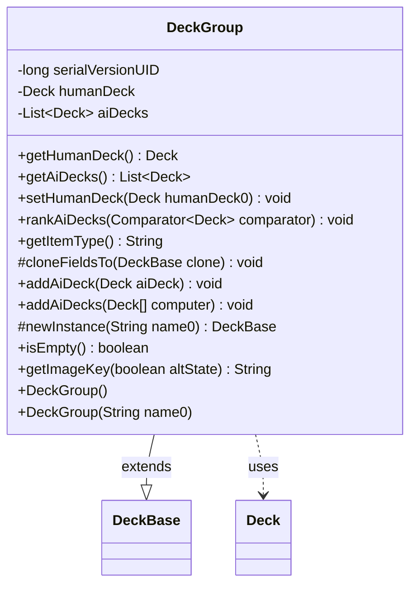

---
aliases:
  - DeckGroup
tags:
  - java/class
  - module/forge-core
  - pkg/forge/deck
fqn: forge.deck.DeckGroup
package: forge.deck
module: forge-core
kind: Class
---

# DeckGroup

**Package:** `forge.deck` &nbsp; **Module:** `forge-core` &nbsp; **Kind:** Class



## Relationships
**Extends:**
- [[forge.deck.DeckBase|DeckBase]]
**Uses:**
- [[forge.deck.Deck|Deck]]


## Design Description

DeckGroup represents a related set of decks for a limited-format experience such as draft or sealed play, bundling a single human player's deck together with the collection of opposing AI decks. It extends `DeckBase`, inheriting that base's naming, identity, and persistence machinery while specializing the grouped-deck behavior: it overrides `getItemType`, `getImageKey`, `isEmpty`, and the `newInstance` factory hook, and implements `cloneFieldsTo` to deep-copy the human deck and every AI deck so a duplicated group stays fully independent.

It collaborates with `Deck`, storing one as the human entry and the rest in an `ArrayList`. The design keeps the contained decks consistent with the group: adding any deck propagates the group's directory, the human deck's name tracks the group's name, and null inputs are guarded. `rankAiDecks` delegates ordering to a caller-supplied `Comparator`, leaving the container agnostic about ranking policy.

## Source
`forge-core/src/main/java/forge/deck/DeckGroup.java`

```java
/*
 * Forge: Play Magic: the Gathering.
 * Copyright (C) 2011  Nate
 *
 * This program is free software: you can redistribute it and/or modify
 * it under the terms of the GNU General Public License as published by
 * the Free Software Foundation, either version 3 of the License, or
 * (at your option) any later version.
 * 
 * This program is distributed in the hope that it will be useful,
 * but WITHOUT ANY WARRANTY; without even the implied warranty of
 * MERCHANTABILITY or FITNESS FOR A PARTICULAR PURPOSE.  See the
 * GNU General Public License for more details.
 * 
 * You should have received a copy of the GNU General Public License
 * along with this program.  If not, see <http://www.gnu.org/licenses/>.
 */
package forge.deck;

import java.util.ArrayList;
import java.util.Arrays;
import java.util.Comparator;
import java.util.List;

/**
 * Related decks usually pertaining to a limited experience like draft or sealed
 * This file represents a human player deck and all opposing AI decks
 * 
 */
public class DeckGroup extends DeckBase {

    public DeckGroup() {
        this("");
    }

    /**
     * Instantiates a new deck group.
     *
     * @param name0 the name0
     */
    public DeckGroup(final String name0) {
        super(name0);
    }

    private static final long serialVersionUID = -1628725522049635829L;
    private Deck humanDeck;
    private List<Deck> aiDecks = new ArrayList<>();

    /**
     * Gets the human deck.
     *
     * @return the human deck
     */
    @Override
    public Deck getHumanDeck() {
        return humanDeck;
    }

    /**
     * Gets the ai decks.
     *
     * @return the ai decks
     */
    public final List<Deck> getAiDecks() {
        return aiDecks;
    }

    /**
     * Sets the human deck.
     *
     * @param humanDeck0 the new human deck
     */
    public final void setHumanDeck(final Deck humanDeck0) {
        humanDeck = humanDeck0;
        if (humanDeck != null) {
            humanDeck.setDirectory(getDirectory());
        }
    }

    /**
     * Evaluate and 'rank' the ai decks.
     *
     * 
     */
    public final void rankAiDecks(Comparator<Deck> comparator) {
        if (aiDecks.size() < 2) {
            return;
        }
        aiDecks.sort(comparator);
    }
    
    @Override
    public String getItemType() {
        return "Group of decks";
    }        

    @Override
    protected void cloneFieldsTo(final DeckBase clone) {
        super.cloneFieldsTo(clone);

        DeckGroup myClone = (DeckGroup) clone;
        myClone.setHumanDeck((Deck) humanDeck.copyTo(getName())); //human deck name should always match DeckGroup name

        for (Deck src : aiDecks) {
            myClone.addAiDeck((Deck) src.copyTo(src.getName()));
        }
    }

    /**
     * Adds the ai deck.
     *
     * @param aiDeck the ai deck
     */
    public final void addAiDeck(final Deck aiDeck) {
        if (aiDeck == null) {
            return;
        }
        aiDeck.setDirectory(getDirectory());
        aiDecks.add(aiDeck);
    }

    /**
     * Adds the ai decks.
     *
     * @param computer the computer
     */
    public void addAiDecks(final Deck[] computer) {
        aiDecks.addAll(Arrays.asList(computer));
    }

    /*
     * (non-Javadoc)
     * 
     * @see forge.deck.DeckBase#newInstance(java.lang.String)
     */
    @Override
    protected DeckBase newInstance(final String name0) {
        return new DeckGroup(name0);
    }

    @Override
    public boolean isEmpty() {
        return humanDeck == null || humanDeck.isEmpty();
    }

    @Override
    public String getImageKey(boolean altState) {
        return null;
    }
}
```
