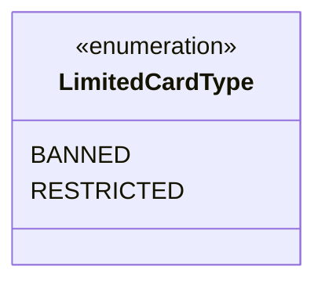

---
aliases:
  - LimitedCardType
tags:
  - java/enum
  - module/forge-core
  - pkg/forge/deck
fqn: forge.deck.DeckRecognizer.LimitedCardType
package: forge.deck
module: forge-core
kind: Enum
---

# LimitedCardType

**Package:** `forge.deck`   **Module:** `forge-core`   **Kind:** Enum



## Design Description

`LimitedCardType` is a small enumeration nested within `DeckRecognizer`, defining the two ways a card's legality can be constrained in a limited or sanctioned format: `BANNED` (disallowed entirely) and `RESTRICTED` (permitted only in limited quantity). It exists to give the deck-recognition logic a type-safe vocabulary for classifying cards against format rules, replacing ad-hoc strings or flags with a closed, self-documenting set of constants. As a nested enum in the `forge.deck` package, it serves purely as a supporting value type for `DeckRecognizer`, which consumes it when parsing and validating deck lists; it holds no state or behavior of its own, reflecting a deliberately minimal design that keeps legality semantics centralized and unambiguous wherever the recognizer reports on a card's standing.

## Source
`forge-core/src/main/java/forge/deck/DeckRecognizer.java` — declaration excerpt

```java
    public enum LimitedCardType {
        BANNED,
        RESTRICTED,
    }
```

## Python
`forge/deck/DeckRecognizer/LimitedCardType.py`

```python
from forge.deck.DeckRecognizer import DeckRecognizer
from enum import Enum


class LimitedCardType(Enum):
    BANNED = "BANNED"
    RESTRICTED = "RESTRICTED"
```
