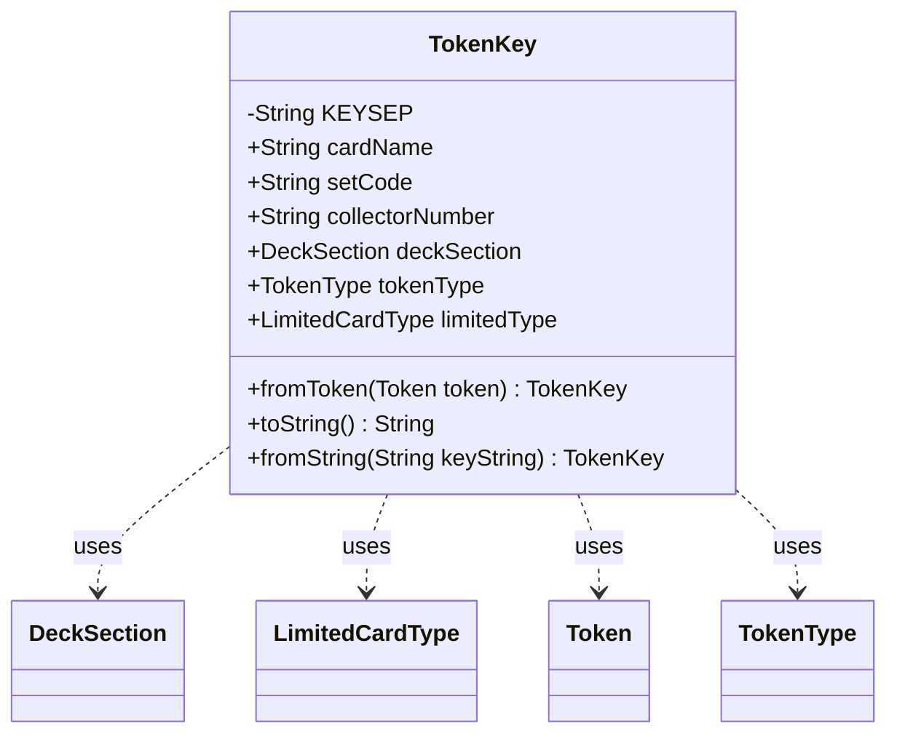

---
aliases:
  - TokenKey
tags:
  - java/class
  - module/forge-core
  - pkg/forge/deck
fqn: forge.deck.DeckRecognizer.Token.TokenKey
package: forge.deck
module: forge-core
kind: Class
---

# TokenKey

**Package:** `forge.deck`   **Module:** `forge-core`   **Kind:** Class



## Relationships
**Uses:**
- [[forge.deck.DeckRecognizer.LimitedCardType|LimitedCardType]]
- [[forge.deck.DeckRecognizer.Token|Token]]
- [[forge.deck.DeckRecognizer.TokenType|TokenType]]
- [[forge.deck.DeckSection|DeckSection]]

## Design Description

TokenKey is a static nested data object within DeckRecognizer that captures the identity of a card-derived deck token as a flat set of string and enum attributes — card name, set code, collector number, and the classifying `DeckSection`, `TokenType`, and optional `LimitedCardType`. Its responsibility is to serve as a serializable reference key, bridging live `Token` instances and their compact string form: the static `fromToken` factory extracts key fields from a card-bearing `Token` (returning null for non-card tokens), while `toString` and the static `fromString` factory implement a reversible encoding using a `|` separator and single-letter tags ("D", "T", "L") to mark the optional and type-discriminating segments.

Design intent is visibly that of a lightweight value object: public mutable fields with no behavior beyond construction and (de)serialization, leaning on enum `valueOf`/`name` for safe round-tripping and treating token type and core card info as the only mandatory components.

## Source
`forge-core/src/main/java/forge/deck/DeckRecognizer.java` — declaration excerpt

```java
        /**
         * Encapsulate the logic for a Token Key (Data Object)
         */
        public static class TokenKey {
            private static final String KEYSEP = "|";

            public String cardName;
            public String setCode;
            public String collectorNumber;
            public DeckSection deckSection;
            public TokenType tokenType;
            public LimitedCardType limitedType;

            /**
             * Instantiate a new TokeKey for the given card token token.
             * @param token Input token to generate the key for.
             * @return null if input token is not a CardToken
             * @see Token#isCardToken()
             */
            public static TokenKey fromToken(final Token token){
                if (!token.isCardToken())
                    return null;
                TokenKey key = new TokenKey();
                key.cardName = CardDb.CardRequest.compose(token.card.getName(), token.getCard().isFoil());
                key.setCode = token.card.getEdition();
                key.collectorNumber = token.card.getCollectorNumber();
                key.tokenType = token.getType();
                if (token.tokenSection != null)
                    key.deckSection = token.tokenSection;
                if (token.limitedCardType != null)
                    key.limitedType = token.limitedCardType;
                return key;
            }

            /**
             * String representation of a Token Key (to be used as reference to target token)
             * @return A String (separated by KEYSEP) containing all the token-key attributes.
             * Non-card parts of the keys are identified by an initial capital letter, that is
             * either "D", "T", or "L" to refer to Deck Section (if any), Token Type, and
             * Limited type (if any), respectively.
             */
            public String toString(){
                StringBuilder keyString = new StringBuilder();
                keyString.append(String.format("%s%s%s%s%s", this.cardName, KEYSEP,
                        this.setCode, KEYSEP, this.collectorNumber));
                if (this.deckSection != null)
                    keyString.append(String.format("%sD%s",KEYSEP, this.deckSection.name()));
                keyString.append(String.format("%sT%s", KEYSEP, this.tokenType.name()));
                if (this.limitedType != null)
                    keyString.append(String.format("%sL%s", KEYSEP, this.limitedType.name()));
                return keyString.toString();
            }

            /**
             * Generates a new TokenKey instance starting from a given Key-String
             * @param keyString String representation of a TokenKey
             * @return a new TokenKey object instantiated from the given Key. Null if key string does not
             * non-optional infos, that is "all card info" and "token type".
             */
            public static TokenKey fromString(String keyString){
                String[] keyInfo = StringUtils.split(keyString, KEYSEP);
                if (keyInfo.length < 4)
                    return null;

                TokenKey tokenKey = new TokenKey();
                tokenKey.cardName = keyInfo[0];
                tokenKey.setCode = keyInfo[1];
                tokenKey.collectorNumber = keyInfo[2];
                int nxtInfoIdx = 3;
                if (keyInfo[nxtInfoIdx].startsWith("D")){
                    tokenKey.deckSection = DeckSection.valueOf(keyInfo[nxtInfoIdx].substring(1));
                    nxtInfoIdx += 1;
                }
                TokenType tokenType = TokenType.valueOf(keyInfo[nxtInfoIdx].substring(1));
                tokenKey.tokenType = tokenType;
                if (tokenType == TokenType.LIMITED_CARD)
                    tokenKey.limitedType = LimitedCardType.valueOf(keyInfo[nxtInfoIdx+1].substring(1));
                return tokenKey;
            }
        }
```
