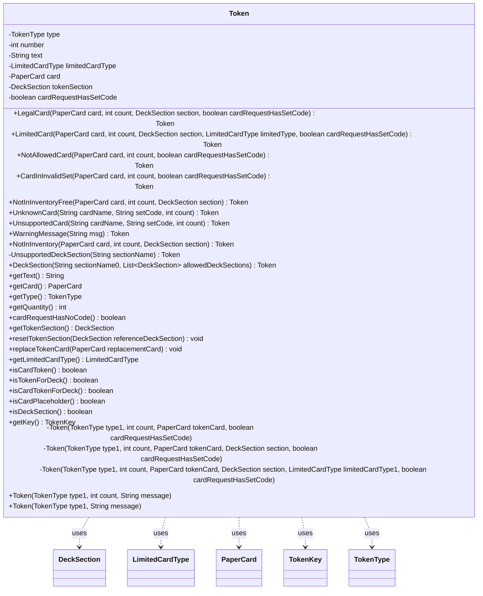

---
aliases:
  - Token
tags:
  - java/class
  - module/forge-core
  - pkg/forge/deck
fqn: forge.deck.DeckRecognizer.Token
package: forge.deck
module: forge-core
kind: Class
---

# Token

**Package:** `forge.deck`   **Module:** `forge-core`   **Kind:** Class



## Relationships
**Uses:**
- [[forge.deck.DeckRecognizer.LimitedCardType|LimitedCardType]]
- [[forge.deck.DeckRecognizer.Token.TokenKey|TokenKey]]
- [[forge.deck.DeckRecognizer.TokenType|TokenType]]
- [[forge.deck.DeckSection|DeckSection]]
- [[forge.item.PaperCard|PaperCard]]

## Design Description

The `DeckRecognizer.Token` class is an immutable-ish value object representing a single parsed unit produced when the `DeckRecognizer` interprets a decklist line. Each token carries a `TokenType` discriminator plus optional payload — a `PaperCard`, a quantity, free text, a `DeckSection`, or a `LimitedCardType` — so a single type models the full spectrum of recognizer outcomes: legal cards, limited or disallowed cards, unknown/unsupported entries, warning messages, and deck-section headers. Static factory methods (e.g. `LegalCard`, `UnknownCard`, `DeckSection`) keep the private constructors hidden and give callers intent-revealing entry points.

Type-classification predicates (`isCardToken`, `isTokenForDeck`, `isCardPlaceholder`, etc.) delegate to `TokenType` set membership, centralizing categorization. The nested `TokenKey` data object derives a stable, serializable identity from a card token's name, set, collector number, type, section, and limited type, supporting round-tripping via `toString`/`fromString` for cross-referencing tokens during deck import and card-art optimization.

## Source
`forge-core/src/main/java/forge/deck/DeckRecognizer.java` — declaration excerpt

```java
    /**
     * The Class Token.
     */
    public static class Token {
        private final TokenType type;
        private final int number;
        private final String text;
        // only used for illegal card tokens
        private LimitedCardType limitedCardType = null;
        // only used for card tokens
        private PaperCard card = null;
        private DeckSection tokenSection = null;
        // Flag used to mark whether original card request had any specified set code
        // This will be used to mark tokens that could be further processed by
        // card art optimisation (if enabled)
        private boolean cardRequestHasSetCode = true;


        public static Token LegalCard(final PaperCard card, final int count,
                                      final DeckSection section, final boolean cardRequestHasSetCode) {
            return new Token(TokenType.LEGAL_CARD, count, card, section, cardRequestHasSetCode);
        }

        public static Token LimitedCard(final PaperCard card, final int count,
                                        final DeckSection section, final LimitedCardType limitedType,
                                        final boolean cardRequestHasSetCode){
            return new Token(TokenType.LIMITED_CARD, count, card, section, limitedType, cardRequestHasSetCode);
        }

        public static Token NotAllowedCard(final PaperCard card, final int count, final boolean cardRequestHasSetCode) {
            return new Token(TokenType.CARD_FROM_NOT_ALLOWED_SET, count, card, cardRequestHasSetCode);
        }

        public static Token CardInInvalidSet(final PaperCard card, final int count, final boolean cardRequestHasSetCode) {
            return new Token(TokenType.CARD_FROM_INVALID_SET, count, card, cardRequestHasSetCode);
        }

        public static Token NotInInventoryFree(final PaperCard card, final int count, final DeckSection section) {
            return new Token(TokenType.FREE_CARD_NOT_IN_INVENTORY, count, card, section, true);
        }

        // WARNING MESSAGES
        // ================
        public static Token UnknownCard(final String cardName, final String setCode, final int count) {
            String ttext = setCode == null || setCode.isEmpty() ? cardName :
                    String.format("%s [%s]", cardName, setCode);
            return new Token(TokenType.UNKNOWN_CARD, count, ttext);
        }

        public static Token UnsupportedCard(final String cardName, final String setCode, final int count) {
            String ttext = setCode == null || setCode.isEmpty() ? cardName :
                    String.format("%s [%s]", cardName, setCode);
            return new Token(TokenType.UNSUPPORTED_CARD, count, ttext);
        }

        public static Token WarningMessage(String msg) {
           return new Token(TokenType.WARNING_MESSAGE, msg);
        }

        public static Token NotInInventory(final PaperCard card, final int count, final DeckSection section) {
            return new Token(TokenType.CARD_NOT_IN_INVENTORY, count, card, section, false);
        }

        /* =================================
         * DECK SECTIONS
         * ================================= */
        private static Token UnsupportedDeckSection(final String sectionName){
            return new Token(TokenType.UNSUPPORTED_DECK_SECTION, sectionName);
        }

        public static Token DeckSection(final String sectionName0, List<DeckSection> allowedDeckSections){
            String sectionName = sectionName0.toLowerCase().trim();
            DeckSection matchedSection = null;
            if (sectionName.equals("side") || sectionName.contains("sideboard") || sectionName.equals("sb"))
                matchedSection = DeckSection.Sideboard;
            else if (sectionName.equals("main") || sectionName.contains("card")
                    || sectionName.equals("mainboard") || sectionName.equals("deck"))
                matchedSection = DeckSection.Main;
            else if (sectionName.equals("avatar"))
                matchedSection = DeckSection.Avatar;
            else if (sectionName.equals("commander"))
                matchedSection = DeckSection.Commander;
            else if (sectionName.equals("schemes"))
                matchedSection = DeckSection.Schemes;
            else if (sectionName.equals("conspiracy"))
                matchedSection = DeckSection.Conspiracy;
            else if (sectionName.equals("planes"))
                matchedSection = DeckSection.Planes;
            else if (sectionName.equals("attractions"))
                matchedSection = DeckSection.Attractions;
            else if (sectionName.equals("contraptions"))
                matchedSection = DeckSection.Contraptions;

            if (matchedSection == null)  // no match found
                return null;

            if (allowedDeckSections != null && !allowedDeckSections.contains(matchedSection))
                return Token.UnsupportedDeckSection(sectionName0);
            return new Token(TokenType.DECK_SECTION_NAME, matchedSection.name());
        }

        private Token(final TokenType type1, final int count, final PaperCard tokenCard, boolean cardRequestHasSetCode) {
            this.number = count;
            this.type = type1;
            this.text = "";
            this.card = tokenCard;
            this.tokenSection = null;
            this.limitedCardType = null;
            this.cardRequestHasSetCode = cardRequestHasSetCode;
        }

        private Token(final TokenType type1, final int count, final PaperCard tokenCard,
                      final DeckSection section, boolean cardRequestHasSetCode) {
            this(type1, count, tokenCard, cardRequestHasSetCode);
            this.tokenSection = section;
            this.limitedCardType = null;
        }

        private Token(final TokenType type1, final int count, final PaperCard tokenCard,
                      final DeckSection section, final LimitedCardType limitedCardType1,
                      boolean cardRequestHasSetCode) {
            this(type1, count, tokenCard, cardRequestHasSetCode);
            this.tokenSection = section;
            this.limitedCardType = limitedCardType1;
        }

        public Token(final TokenType type1, final int count, final String message) {
            this.number = count;
            this.type = type1;
            this.text = message;
        }

        public Token(final TokenType type1, final String message) {
            this(type1, 0, message);
        }

        public final String getText() {
            if (this.isCardToken())
                return String.format("%s [%s] #%s",
                        this.card.getName(), this.card.getEdition(), this.card.getCollectorNumber());
            return this.text;
        }

        public final PaperCard getCard() {
            return this.card;
        }

        public final TokenType getType() {
            return this.type;
        }

        public final int getQuantity() {
            return this.number;
        }

        public final boolean cardRequestHasNoCode() {
            return !(this.cardRequestHasSetCode);
        }

        public final DeckSection getTokenSection() { return this.tokenSection; }

        public void resetTokenSection(DeckSection referenceDeckSection) {
            this.tokenSection = referenceDeckSection != null ? referenceDeckSection : DeckSection.Main;
        }

        public void replaceTokenCard(PaperCard replacementCard){
            if (!this.isCardToken())
                return;
            this.card = replacementCard;
        }

        public final LimitedCardType getLimitedCardType() { return this.limitedCardType; }

        /**
         * Filters all token types that have a PaperCard instance set (not null)
         * @return true for tokens of type:
         * LEGAL_CARD, LIMITED_CARD, CARD_FROM_NOT_ALLOWED_SET and CARD_FROM_INVALID_SET, CARD_NOT_IN_INVENTORY, FREE_CARD_NOT_IN_INVENTORY.
         * False otherwise.
         */
        public boolean isCardToken() {
            return TokenType.CARD_TOKEN_TYPES.contains(this.type);
        }

        /**
         * Filters all tokens that will be potentially considered during Deck Import.
         * @return true if the type of the token is one of:
         * LEGAL_CARD, LIMITED_CARD, DECK_NAME; false otherwise.
         */
        public boolean isTokenForDeck() {
            return TokenType.IN_DECK_TOKEN_TYPES.contains(this.type);
        }

        /**
         * Filters all tokens for deck that are also Card Token..
         * @return true for tokens of type: LEGAL_CARD, LIMITED_CARD.
         * False otherwise.
         */
        public boolean isCardTokenForDeck() {
            return isCardToken() && isTokenForDeck();
        }

        /**
         * Determines whether current token is a placeholder token for card categories,
         * only used for Decklist formatting.
         * @return true if the type of the token is one of:
         * CARD_RARITY, CARD_CMC, CARD_TYPE, MANA_COLOUR
         */
        public boolean isCardPlaceholder(){
            return TokenType.CARD_PLACEHOLDER_TOKEN_TYPES.contains(this.type);
        }

        /** Determines if current token is a Deck Section token
         * @return true if the type of token is DECK_SECTION_NAMES
         */
        public boolean isDeckSection(){ return this.type == TokenType.DECK_SECTION_NAME; }

        /**
         * Generates the key for the current token, which is a hyphenated string including
         * "Card Name", "Card Edition", "Card's Collector Number", "token-type", and
         * the "token section" (if any).
         * @return null if the current token, is a non-card token, else an instance of TokeKey
         * data object will be returned.
         * @see Token#isCardToken()
         * @see Token.TokenKey#fromToken(Token)
         */
        public TokenKey getKey(){
            return TokenKey.fromToken(this);
        }

        /**
         * Encapsulate the logic for a Token Key (Data Object)
         */
        public static class TokenKey {
            private static final String KEYSEP = "|";

            public String cardName;
            public String setCode;
            public String collectorNumber;
            public DeckSection deckSection;
            public TokenType tokenType;
            public LimitedCardType limitedType;

            /**
             * Instantiate a new TokeKey for the given card token token.
             * @param token Input token to generate the key for.
             * @return null if input token is not a CardToken
             * @see Token#isCardToken()
             */
            public static TokenKey fromToken(final Token token){
                if (!token.isCardToken())
                    return null;
                TokenKey key = new TokenKey();
                key.cardName = CardDb.CardRequest.compose(token.card.getName(), token.getCard().isFoil());
                key.setCode = token.card.getEdition();
                key.collectorNumber = token.card.getCollectorNumber();
                key.tokenType = token.getType();
                if (token.tokenSection != null)
                    key.deckSection = token.tokenSection;
                if (token.limitedCardType != null)
                    key.limitedType = token.limitedCardType;
                return key;
            }

            /**
             * String representation of a Token Key (to be used as reference to target token)
             * @return A String (separated by KEYSEP) containing all the token-key attributes.
             * Non-card parts of the keys are identified by an initial capital letter, that is
             * either "D", "T", or "L" to refer to Deck Section (if any), Token Type, and
             * Limited type (if any), respectively.
             */
            public String toString(){
                StringBuilder keyString = new StringBuilder();
                keyString.append(String.format("%s%s%s%s%s", this.cardName, KEYSEP,
                        this.setCode, KEYSEP, this.collectorNumber));
                if (this.deckSection != null)
                    keyString.append(String.format("%sD%s",KEYSEP, this.deckSection.name()));
                keyString.append(String.format("%sT%s", KEYSEP, this.tokenType.name()));
                if (this.limitedType != null)
                    keyString.append(String.format("%sL%s", KEYSEP, this.limitedType.name()));
                return keyString.toString();
            }

            /**
             * Generates a new TokenKey instance starting from a given Key-String
             * @param keyString String representation of a TokenKey
             * @return a new TokenKey object instantiated from the given Key. Null if key string does not
             * non-optional infos, that is "all card info" and "token type".
             */
            public static TokenKey fromString(String keyString){
                String[] keyInfo = StringUtils.split(keyString, KEYSEP);
                if (keyInfo.length < 4)
                    return null;

                TokenKey tokenKey = new TokenKey();
                tokenKey.cardName = keyInfo[0];
                tokenKey.setCode = keyInfo[1];
                tokenKey.collectorNumber = keyInfo[2];
                int nxtInfoIdx = 3;
                if (keyInfo[nxtInfoIdx].startsWith("D")){
                    tokenKey.deckSection = DeckSection.valueOf(keyInfo[nxtInfoIdx].substring(1));
                    nxtInfoIdx += 1;
                }
                TokenType tokenType = TokenType.valueOf(keyInfo[nxtInfoIdx].substring(1));
                tokenKey.tokenType = tokenType;
                if (tokenType == TokenType.LIMITED_CARD)
                    tokenKey.limitedType = LimitedCardType.valueOf(keyInfo[nxtInfoIdx+1].substring(1));
                return tokenKey;
            }
        }
    }
```

## Python
`forge/deck/DeckRecognizer/Token.py`

```python
from typing import List

from forge.card.CardDb import CardDb
from forge.deck.DeckRecognizer.LimitedCardType import LimitedCardType
from forge.deck.DeckRecognizer.TokenType import TokenType
from forge.deck.DeckSection import DeckSection
from forge.item.PaperCard import PaperCard


class Token:
    """
    The Class Token.
    """

    def __init__(self, type1: TokenType, count: int, message: str):
        self.number = count
        self.type = type1
        self.text = message
        # only used for illegal card tokens
        self.limitedCardType = None
        # only used for card tokens
        self.card = None
        self.tokenSection = None
        # Flag used to mark whether original card request had any specified set code
        # This will be used to mark tokens that could be further processed by
        # card art optimisation (if enabled)
        self.cardRequestHasSetCode = True

    # =================================
    # Private card-based constructors
    # =================================
    @classmethod
    def _Token_card(cls, type1: TokenType, count: int, tokenCard: PaperCard,
                    cardRequestHasSetCode: bool):
        self = cls.__new__(cls)
        self.number = count
        self.type = type1
        self.text = ""
        self.card = tokenCard
        self.tokenSection = None
        self.limitedCardType = None
        self.cardRequestHasSetCode = cardRequestHasSetCode
        return self

    @classmethod
    def _Token_card_section(cls, type1: TokenType, count: int, tokenCard: PaperCard,
                            section: DeckSection, cardRequestHasSetCode: bool):
        self = cls._Token_card(type1, count, tokenCard, cardRequestHasSetCode)
        self.tokenSection = section
        self.limitedCardType = None
        return self

    @classmethod
    def _Token_card_section_limited(cls, type1: TokenType, count: int, tokenCard: PaperCard,
                                    section: DeckSection, limitedCardType1: LimitedCardType,
                                    cardRequestHasSetCode: bool):
        self = cls._Token_card(type1, count, tokenCard, cardRequestHasSetCode)
        self.tokenSection = section
        self.limitedCardType = limitedCardType1
        return self

    @staticmethod
    def LegalCard(card: PaperCard, count: int, section: DeckSection,
                  cardRequestHasSetCode: bool) -> "Token":
        return Token._Token_card_section(TokenType.LEGAL_CARD, count, card, section, cardRequestHasSetCode)

    @staticmethod
    def LimitedCard(card: PaperCard, count: int, section: DeckSection,
                    limitedType: LimitedCardType, cardRequestHasSetCode: bool) -> "Token":
        return Token._Token_card_section_limited(TokenType.LIMITED_CARD, count, card, section,
                                                 limitedType, cardRequestHasSetCode)

    @staticmethod
    def NotAllowedCard(card: PaperCard, count: int, cardRequestHasSetCode: bool) -> "Token":
        return Token._Token_card(TokenType.CARD_FROM_NOT_ALLOWED_SET, count, card, cardRequestHasSetCode)

    @staticmethod
    def CardInInvalidSet(card: PaperCard, count: int, cardRequestHasSetCode: bool) -> "Token":
        return Token._Token_card(TokenType.CARD_FROM_INVALID_SET, count, card, cardRequestHasSetCode)

    @staticmethod
    def NotInInventoryFree(card: PaperCard, count: int, section: DeckSection) -> "Token":
        return Token._Token_card_section(TokenType.FREE_CARD_NOT_IN_INVENTORY, count, card, section, True)

    # WARNING MESSAGES
    # ================
    @staticmethod
    def UnknownCard(cardName: str, setCode: str, count: int) -> "Token":
        ttext = cardName if setCode is None or setCode == "" else "%s [%s]" % (cardName, setCode)
        return Token(TokenType.UNKNOWN_CARD, count, ttext)

    @staticmethod
    def UnsupportedCard(cardName: str, setCode: str, count: int) -> "Token":
        ttext = cardName if setCode is None or setCode == "" else "%s [%s]" % (cardName, setCode)
        return Token(TokenType.UNSUPPORTED_CARD, count, ttext)

    @staticmethod
    def WarningMessage(msg: str) -> "Token":
        return Token(TokenType.WARNING_MESSAGE, 0, msg)

    @staticmethod
    def NotInInventory(card: PaperCard, count: int, section: DeckSection) -> "Token":
        return Token._Token_card_section(TokenType.CARD_NOT_IN_INVENTORY, count, card, section, False)

    # =================================
    # DECK SECTIONS
    # =================================
    @staticmethod
    def UnsupportedDeckSection(sectionName: str) -> "Token":
        return Token(TokenType.UNSUPPORTED_DECK_SECTION, 0, sectionName)

    @staticmethod
    def DeckSection(sectionName0: str, allowedDeckSections: List[DeckSection]) -> "Token":
        sectionName = sectionName0.lower().strip()
        matchedSection = None
        if sectionName == "side" or "sideboard" in sectionName or sectionName == "sb":
            matchedSection = DeckSection.Sideboard
        elif (sectionName == "main" or "card" in sectionName
              or sectionName == "mainboard" or sectionName == "deck"):
            matchedSection = DeckSection.Main
        elif sectionName == "avatar":
            matchedSection = DeckSection.Avatar
        elif sectionName == "commander":
            matchedSection = DeckSection.Commander
        elif sectionName == "schemes":
            matchedSection = DeckSection.Schemes
        elif sectionName == "conspiracy":
            matchedSection = DeckSection.Conspiracy
        elif sectionName == "planes":
            matchedSection = DeckSection.Planes
        elif sectionName == "attractions":
            matchedSection = DeckSection.Attractions
        elif sectionName == "contraptions":
            matchedSection = DeckSection.Contraptions

        if matchedSection is None:  # no match found
            return None

        if allowedDeckSections is not None and matchedSection not in allowedDeckSections:
            return Token.UnsupportedDeckSection(sectionName0)
        return Token(TokenType.DECK_SECTION_NAME, 0, matchedSection.name())

    def getText(self) -> str:
        if self.isCardToken():
            return "%s [%s] #%s" % (self.card.getName(), self.card.getEdition(),
                                    self.card.getCollectorNumber())
        return self.text

    def getCard(self) -> PaperCard:
        return self.card

    def getType(self) -> TokenType:
        return self.type

    def getQuantity(self) -> int:
        return self.number

    def cardRequestHasNoCode(self) -> bool:
        return not self.cardRequestHasSetCode

    def getTokenSection(self) -> DeckSection:
        return self.tokenSection

    def resetTokenSection(self, referenceDeckSection: DeckSection) -> None:
        self.tokenSection = referenceDeckSection if referenceDeckSection is not None else DeckSection.Main

    def replaceTokenCard(self, replacementCard: PaperCard) -> None:
        if not self.isCardToken():
            return
        self.card = replacementCard

    def getLimitedCardType(self) -> LimitedCardType:
        return self.limitedCardType

    def isCardToken(self) -> bool:
        """
        Filters all token types that have a PaperCard instance set (not null)
        @return true for tokens of type:
        LEGAL_CARD, LIMITED_CARD, CARD_FROM_NOT_ALLOWED_SET and CARD_FROM_INVALID_SET,
        CARD_NOT_IN_INVENTORY, FREE_CARD_NOT_IN_INVENTORY.
        False otherwise.
        """
        return self.type in TokenType.CARD_TOKEN_TYPES

    def isTokenForDeck(self) -> bool:
        """
        Filters all tokens that will be potentially considered during Deck Import.
        @return true if the type of the token is one of:
        LEGAL_CARD, LIMITED_CARD, DECK_NAME; false otherwise.
        """
        return self.type in TokenType.IN_DECK_TOKEN_TYPES

    def isCardTokenForDeck(self) -> bool:
        """
        Filters all tokens for deck that are also Card Token..
        @return true for tokens of type: LEGAL_CARD, LIMITED_CARD.
        False otherwise.
        """
        return self.isCardToken() and self.isTokenForDeck()

    def isCardPlaceholder(self) -> bool:
        """
        Determines whether current token is a placeholder token for card categories,
        only used for Decklist formatting.
        @return true if the type of the token is one of:
        CARD_RARITY, CARD_CMC, CARD_TYPE, MANA_COLOUR
        """
        return self.type in TokenType.CARD_PLACEHOLDER_TOKEN_TYPES

    def isDeckSection(self) -> bool:
        """Determines if current token is a Deck Section token
        @return true if the type of token is DECK_SECTION_NAMES
        """
        return self.type == TokenType.DECK_SECTION_NAME

    def getKey(self) -> "Token.TokenKey":
        """
        Generates the key for the current token, which is a hyphenated string including
        "Card Name", "Card Edition", "Card's Collector Number", "token-type", and
        the "token section" (if any).
        @return null if the current token, is a non-card token, else an instance of TokeKey
        data object will be returned.
        """
        return Token.TokenKey.fromToken(self)

    class TokenKey:
        """
        Encapsulate the logic for a Token Key (Data Object)
        """
        KEYSEP = "|"

        def __init__(self):
            self.cardName = None
            self.setCode = None
            self.collectorNumber = None
            self.deckSection = None
            self.tokenType = None
            self.limitedType = None

        @staticmethod
        def fromToken(token: "Token") -> "Token.TokenKey":
            """
            Instantiate a new TokeKey for the given card token token.
            @param token Input token to generate the key for.
            @return null if input token is not a CardToken
            """
            if not token.isCardToken():
                return None
            key = Token.TokenKey()
            key.cardName = CardDb.CardRequest.compose(token.card.getName(), token.getCard().isFoil())
            key.setCode = token.card.getEdition()
            key.collectorNumber = token.card.getCollectorNumber()
            key.tokenType = token.getType()
            if token.tokenSection is not None:
                key.deckSection = token.tokenSection
            if token.limitedCardType is not None:
                key.limitedType = token.limitedCardType
            return key

        def toString(self) -> str:
            """
            String representation of a Token Key (to be used as reference to target token)
            @return A String (separated by KEYSEP) containing all the token-key attributes.
            Non-card parts of the keys are identified by an initial capital letter, that is
            either "D", "T", or "L" to refer to Deck Section (if any), Token Type, and
            Limited type (if any), respectively.
            """
            keyString = []
            keyString.append("%s%s%s%s%s" % (self.cardName, Token.TokenKey.KEYSEP,
                                             self.setCode, Token.TokenKey.KEYSEP, self.collectorNumber))
            if self.deckSection is not None:
                keyString.append("%sD%s" % (Token.TokenKey.KEYSEP, self.deckSection.name()))
            keyString.append("%sT%s" % (Token.TokenKey.KEYSEP, self.tokenType.name()))
            if self.limitedType is not None:
                keyString.append("%sL%s" % (Token.TokenKey.KEYSEP, self.limitedType.name()))
            return "".join(keyString)

        def __str__(self) -> str:
            return self.toString()

        @staticmethod
        def fromString(keyString: str) -> "Token.TokenKey":
            """
            Generates a new TokenKey instance starting from a given Key-String
            @param keyString String representation of a TokenKey
            @return a new TokenKey object instantiated from the given Key. Null if key string does not
            non-optional infos, that is "all card info" and "token type".
            """
            keyInfo = [t for t in keyString.split(Token.TokenKey.KEYSEP) if t]
            if len(keyInfo) < 4:
                return None

            tokenKey = Token.TokenKey()
            tokenKey.cardName = keyInfo[0]
            tokenKey.setCode = keyInfo[1]
            tokenKey.collectorNumber = keyInfo[2]
            nxtInfoIdx = 3
            if keyInfo[nxtInfoIdx].startswith("D"):
                tokenKey.deckSection = DeckSection.valueOf(keyInfo[nxtInfoIdx][1:])
                nxtInfoIdx += 1
            tokenType = TokenType.valueOf(keyInfo[nxtInfoIdx][1:])
            tokenKey.tokenType = tokenType
            if tokenType == TokenType.LIMITED_CARD:
                tokenKey.limitedType = LimitedCardType.valueOf(keyInfo[nxtInfoIdx + 1][1:])
            return tokenKey
```
