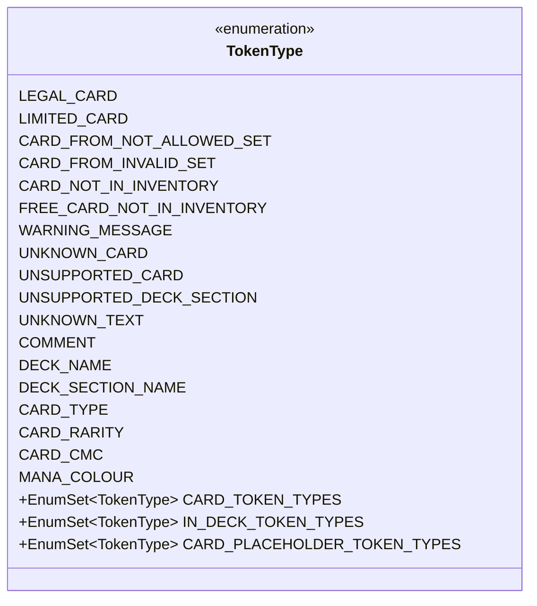

---
aliases:
  - TokenType
tags:
  - java/enum
  - module/forge-core
  - pkg/forge/deck
fqn: forge.deck.DeckRecognizer.TokenType
package: forge.deck
module: forge-core
kind: Enum
---

# TokenType

**Package:** `forge.deck`   **Module:** `forge-core`   **Kind:** Enum



## Design Description

TokenType is a nested enumeration within `DeckRecognizer` that classifies every line a deck list parser encounters, giving each recognized token a precise semantic category. Its constants span four conceptual groups: importable card outcomes (e.g., `LEGAL_CARD`, `LIMITED_CARD`, `CARD_NOT_IN_INVENTORY`), warnings for unrecognized or unsupported entries, structural non-tokens like `COMMENT` and `UNKNOWN_TEXT`, and placeholder markers such as `DECK_NAME` and `CARD_TYPE`. As an enum it has no supertype beyond `java.lang.Enum`, and it exists to be consumed by `DeckRecognizer`'s tokenizing and import logic.

The notable design intent lies in the three static `EnumSet` constants—`CARD_TOKEN_TYPES`, `IN_DECK_TOKEN_TYPES`, and `CARD_PLACEHOLDER_TOKEN_TYPES`—which pre-group related constants for fast, allocation-light membership tests. This lets callers ask categorical questions ("is this any kind of card token?") without enumerating cases, centralizing classification rules and keeping the recognizer's branching logic concise and maintainable.

## Source
`forge-core/src/main/java/forge/deck/DeckRecognizer.java` — declaration excerpt

```java
    /**
     * The Enum TokenType.
     */
    public enum TokenType {
        // Card Token Types
        LEGAL_CARD,
        LIMITED_CARD,
        CARD_FROM_NOT_ALLOWED_SET,
        CARD_FROM_INVALID_SET,
        /**
         * Valid card request, but can't be imported because the player does not have enough copies.
         * Should be replaced with a different printing if possible.
         */
        CARD_NOT_IN_INVENTORY,
        /**
         * Valid card request for a card that isn't in the player's inventory, but new copies can be acquired freely.
         * Usually used for basic lands. Should be supplied to the import controller by the editor.
         */
        FREE_CARD_NOT_IN_INVENTORY,
        // Warning messages
        WARNING_MESSAGE,
        UNKNOWN_CARD,
        UNSUPPORTED_CARD,
        UNSUPPORTED_DECK_SECTION,
        // No Token
        UNKNOWN_TEXT,
        COMMENT,
        // Placeholders
        DECK_NAME,
        DECK_SECTION_NAME,
        CARD_TYPE,
        CARD_RARITY,
        CARD_CMC,
        MANA_COLOUR;

        public static final EnumSet<TokenType> CARD_TOKEN_TYPES = EnumSet.of(LEGAL_CARD, LIMITED_CARD, CARD_FROM_NOT_ALLOWED_SET, CARD_FROM_INVALID_SET, CARD_NOT_IN_INVENTORY, FREE_CARD_NOT_IN_INVENTORY);
        public static final EnumSet<TokenType> IN_DECK_TOKEN_TYPES = EnumSet.of(LEGAL_CARD, LIMITED_CARD, DECK_NAME, FREE_CARD_NOT_IN_INVENTORY);
        public static final EnumSet<TokenType> CARD_PLACEHOLDER_TOKEN_TYPES = EnumSet.of(CARD_TYPE, CARD_RARITY, CARD_CMC, MANA_COLOUR);
    }
```

## Python
`forge/deck/DeckRecognizer/TokenType.py`

```python
from enum import Enum, auto


class TokenType(Enum):
    # Card Token Types
    LEGAL_CARD = auto()
    LIMITED_CARD = auto()
    CARD_FROM_NOT_ALLOWED_SET = auto()
    CARD_FROM_INVALID_SET = auto()
    # Valid card request, but can't be imported because the player does not have enough copies.
    # Should be replaced with a different printing if possible.
    CARD_NOT_IN_INVENTORY = auto()
    # Valid card request for a card that isn't in the player's inventory, but new copies can be acquired freely.
    # Usually used for basic lands. Should be supplied to the import controller by the editor.
    FREE_CARD_NOT_IN_INVENTORY = auto()
    # Warning messages
    WARNING_MESSAGE = auto()
    UNKNOWN_CARD = auto()
    UNSUPPORTED_CARD = auto()
    UNSUPPORTED_DECK_SECTION = auto()
    # No Token
    UNKNOWN_TEXT = auto()
    COMMENT = auto()
    # Placeholders
    DECK_NAME = auto()
    DECK_SECTION_NAME = auto()
    CARD_TYPE = auto()
    CARD_RARITY = auto()
    CARD_CMC = auto()
    MANA_COLOUR = auto()


TokenType.CARD_TOKEN_TYPES = frozenset({
    TokenType.LEGAL_CARD,
    TokenType.LIMITED_CARD,
    TokenType.CARD_FROM_NOT_ALLOWED_SET,
    TokenType.CARD_FROM_INVALID_SET,
    TokenType.CARD_NOT_IN_INVENTORY,
    TokenType.FREE_CARD_NOT_IN_INVENTORY,
})

TokenType.IN_DECK_TOKEN_TYPES = frozenset({
    TokenType.LEGAL_CARD,
    TokenType.LIMITED_CARD,
    TokenType.DECK_NAME,
    TokenType.FREE_CARD_NOT_IN_INVENTORY,
})

TokenType.CARD_PLACEHOLDER_TOKEN_TYPES = frozenset({
    TokenType.CARD_TYPE,
    TokenType.CARD_RARITY,
    TokenType.CARD_CMC,
    TokenType.MANA_COLOUR,
})
```
