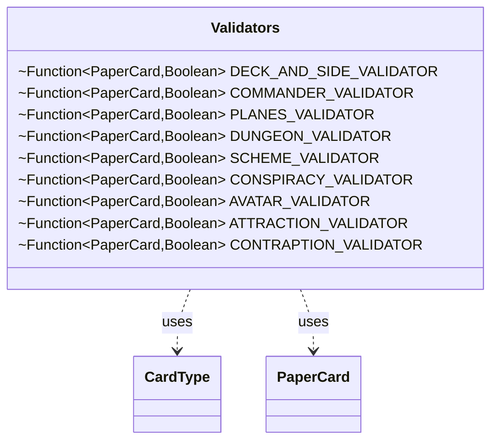

---
aliases:
  - Validators
tags:
  - java/class
  - module/forge-core
  - pkg/forge/deck
fqn: forge.deck.DeckSection.Validators
package: forge.deck
module: forge-core
kind: Class
---

# Validators

**Package:** `forge.deck`   **Module:** `forge-core`   **Kind:** Class



## Relationships
**Uses:**
- [[forge.card.CardType|CardType]]
- [[forge.item.PaperCard|PaperCard]]

## Design Description

Validators is a private, static utility class nested within `DeckSection`, serving as a centralized registry of card-eligibility predicates—one `Function<PaperCard, Boolean>` per deck section (main/sideboard, commander, planes, dungeon, scheme, conspiracy, avatar, attraction, contraption). Each validator inspects a `PaperCard`'s `CardRules` and resulting `CardType` to decide whether the card belongs in that section.

By collaborating with `PaperCard` and `CardType` purely through their query methods, the class encapsulates the game's deck-construction rules as composable lambdas, keeping `DeckSection`'s membership logic declarative and in one place. Its package-private, `static final` fields make the validators shared, stateless singletons; the comment referencing Rule 313.2 and deferred conspiracy handling shows the rules deliberately defer certain edge cases to later normalization rather than complicating each predicate.

## Source
`forge-core/src/main/java/forge/deck/DeckSection.java` — declaration excerpt

```java
    private static class Validators {
        static final Function<PaperCard, Boolean> DECK_AND_SIDE_VALIDATOR = card -> {
            CardType t = card.getRules().getType();
            // NOTE: Same rules applies to both Deck and Side, despite "Conspiracy cards" are allowed
            // in the SideBoard (see Rule 313.2)
            // Those will be matched later, in case (see `Deck::normalizeDeferredSections`)
            return !t.isConspiracy() && !t.isDungeon() && !t.isPhenomenon() && !t.isPlane() && !t.isScheme() && !t.isVanguard();
        };

        static final Function<PaperCard, Boolean> COMMANDER_VALIDATOR = card -> {
            CardType t = card.getRules().getType();
            return card.getRules().canBeCommander() || t.isPlaneswalker() || card.getRules().canBeOathbreaker() || card.getRules().canBeSignatureSpell();
        };

        static final Function<PaperCard, Boolean> PLANES_VALIDATOR = card -> {
            CardType t = card.getRules().getType();
            return t.isPlane() || t.isPhenomenon();
        };

        static final Function<PaperCard, Boolean> DUNGEON_VALIDATOR = card -> {
            CardType t = card.getRules().getType();
            return t.isDungeon();
        };

        static final Function<PaperCard, Boolean> SCHEME_VALIDATOR = card -> {
            CardType t = card.getRules().getType();
            return t.isScheme();
        };

        static final Function<PaperCard, Boolean> CONSPIRACY_VALIDATOR = card -> {
            CardType t = card.getRules().getType();
            return t.isConspiracy();
        };

        static final Function<PaperCard, Boolean> AVATAR_VALIDATOR = card -> {
            CardType t = card.getRules().getType();
            return t.isVanguard();
        };

        static final Function<PaperCard, Boolean> ATTRACTION_VALIDATOR = card -> {
            CardType t = card.getRules().getType();
            return t.isAttraction();
        };

        static final Function<PaperCard, Boolean> CONTRAPTION_VALIDATOR = card -> {
            CardType t = card.getRules().getType();
            return t.isContraption();
        };

    }
```

## Python
`forge/deck/DeckSection/Validators.py`

```python
from forge.card.CardType import CardType
from forge.item.PaperCard import PaperCard


class Validators:
    @staticmethod
    def DECK_AND_SIDE_VALIDATOR(card):
        t = card.getRules().getType()
        # NOTE: Same rules applies to both Deck and Side, despite "Conspiracy cards" are allowed
        # in the SideBoard (see Rule 313.2)
        # Those will be matched later, in case (see `Deck::normalizeDeferredSections`)
        return not t.isConspiracy() and not t.isDungeon() and not t.isPhenomenon() and not t.isPlane() and not t.isScheme() and not t.isVanguard()

    @staticmethod
    def COMMANDER_VALIDATOR(card):
        t = card.getRules().getType()
        return card.getRules().canBeCommander() or t.isPlaneswalker() or card.getRules().canBeOathbreaker() or card.getRules().canBeSignatureSpell()

    @staticmethod
    def PLANES_VALIDATOR(card):
        t = card.getRules().getType()
        return t.isPlane() or t.isPhenomenon()

    @staticmethod
    def DUNGEON_VALIDATOR(card):
        t = card.getRules().getType()
        return t.isDungeon()

    @staticmethod
    def SCHEME_VALIDATOR(card):
        t = card.getRules().getType()
        return t.isScheme()

    @staticmethod
    def CONSPIRACY_VALIDATOR(card):
        t = card.getRules().getType()
        return t.isConspiracy()

    @staticmethod
    def AVATAR_VALIDATOR(card):
        t = card.getRules().getType()
        return t.isVanguard()

    @staticmethod
    def ATTRACTION_VALIDATOR(card):
        t = card.getRules().getType()
        return t.isAttraction()

    @staticmethod
    def CONTRAPTION_VALIDATOR(card):
        t = card.getRules().getType()
        return t.isContraption()
```
