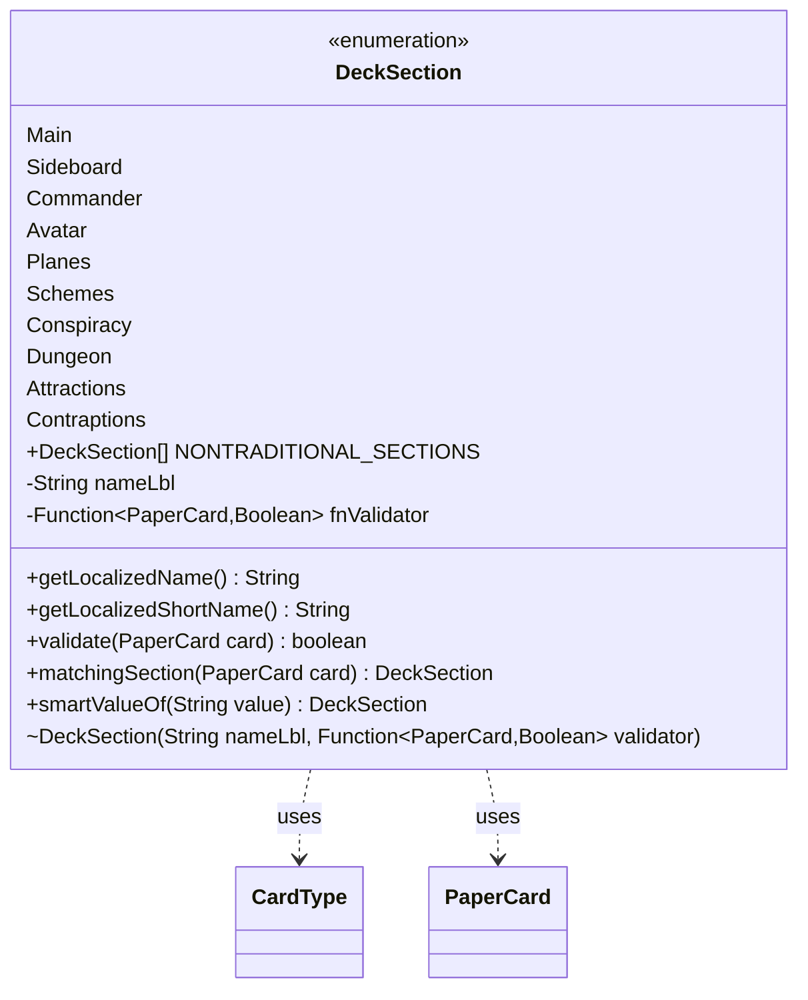

---
aliases:
  - DeckSection
tags:
  - java/enum
  - module/forge-core
  - pkg/forge/deck
fqn: forge.deck.DeckSection
package: forge.deck
module: forge-core
kind: Enum
---

# DeckSection

**Package:** `forge.deck`   **Module:** `forge-core`   **Kind:** Enum



## Relationships
**Uses:**
- [[forge.card.CardType|CardType]]
- [[forge.item.PaperCard|PaperCard]]


## Design Description

`DeckSection` is a `forge-core` enumeration that models the distinct compartments of a Magic deck—Main, Sideboard, Commander, and the supplementary zones (Avatar, Planes, Schemes, Conspiracy, Dungeon, Attractions, Contraptions)—while encapsulating the rules that decide which cards belong in each. Every constant binds a localization key to a `Function<PaperCard, Boolean>` predicate (held in the private `Validators` holder), so the enum owns both its user-facing names, exposed through `getLocalizedName`/`getLocalizedShortName` via `Localizer`, and its membership logic, exposed through `validate`.

Its central responsibility is card classification by inspecting a `PaperCard`'s `CardType`. The static `matchingSection` routes a card to its appropriate special section in priority order, defaulting to `Main`, while `smartValueOf` provides lenient, case-insensitive parsing and `NONTRADITIONAL_SECTIONS` flags the non-standard zones. Representing per-section behavior as data-driven function constants keeps the validation cohesive and avoids scattering type checks across callers.

## Source
`forge-core/src/main/java/forge/deck/DeckSection.java`

```java
package forge.deck;

import forge.card.CardType;
import forge.item.PaperCard;
import forge.util.Localizer;

import java.util.function.Function;

public enum DeckSection {
    Main("lblMainDeck", Validators.DECK_AND_SIDE_VALIDATOR),
    Sideboard("lblSideboard", Validators.DECK_AND_SIDE_VALIDATOR),
    Commander("lblCommander", Validators.COMMANDER_VALIDATOR),
    Avatar("lblAvatar", Validators.AVATAR_VALIDATOR),
    Planes("lblPlanarDeck", Validators.PLANES_VALIDATOR),
    Schemes("lblSchemeDeck", Validators.SCHEME_VALIDATOR),
    Conspiracy("lblConspiracies", Validators.CONSPIRACY_VALIDATOR),
    Dungeon("lblDungeons", Validators.DUNGEON_VALIDATOR),
    Attractions("lblAttractions", Validators.ATTRACTION_VALIDATOR),
    Contraptions("lblContraptions", Validators.CONTRAPTION_VALIDATOR);

    /**
     * Array of DeckSections that contain nontraditional cards.
     */
    public static final DeckSection[] NONTRADITIONAL_SECTIONS = new DeckSection[]{Avatar, Planes, Schemes, Conspiracy, Dungeon, Attractions, Contraptions};

    private final String nameLbl;
    private final Function<PaperCard, Boolean> fnValidator;

    DeckSection(String nameLbl, Function<PaperCard, Boolean> validator) {
        this.nameLbl = nameLbl;
        fnValidator = validator;
    }

    public String getLocalizedName() {
        return Localizer.getInstance().getMessage(this.nameLbl);
    }

    public String getLocalizedShortName() {
        String shortNameLabel;
        switch(this) {
            case Main: shortNameLabel = "lblMain"; break;
            case Sideboard: shortNameLabel = "lblSide"; break;
            case Planes: shortNameLabel = "lblPlanes"; break;
            case Schemes: shortNameLabel = "lblSchemes"; break;
            default: return getLocalizedName();
        }
        return Localizer.getInstance().getMessage(shortNameLabel);
    }

    public boolean validate(PaperCard card){
        if (fnValidator == null) return true;
        return fnValidator.apply(card);
    }

    // Returns the matching section for "special"/supplementary core types.
    public static DeckSection matchingSection(PaperCard card){
        if (DeckSection.Conspiracy.validate(card))
            return Conspiracy;
        if (DeckSection.Schemes.validate(card))
            return Schemes;
        if (DeckSection.Avatar.validate(card))
            return Avatar;
        if (DeckSection.Planes.validate(card))
            return Planes;
        if (DeckSection.Dungeon.validate(card))
            return Dungeon;
        if (DeckSection.Attractions.validate(card))
            return Attractions;
        if (DeckSection.Contraptions.validate(card))
            return Contraptions;
        return Main;  // default
    }

    public static DeckSection smartValueOf(String value) {
        if (value == null)
            return null;
        final String valToCompare = value.trim();
        for (final DeckSection v : DeckSection.values()) {
            if (v.name().compareToIgnoreCase(valToCompare) == 0) {
                return v;
            }
        }
        return null;
    }

    private static class Validators {
        static final Function<PaperCard, Boolean> DECK_AND_SIDE_VALIDATOR = card -> {
            CardType t = card.getRules().getType();
            // NOTE: Same rules applies to both Deck and Side, despite "Conspiracy cards" are allowed
            // in the SideBoard (see Rule 313.2)
            // Those will be matched later, in case (see `Deck::normalizeDeferredSections`)
            return !t.isConspiracy() && !t.isDungeon() && !t.isPhenomenon() && !t.isPlane() && !t.isScheme() && !t.isVanguard();
        };

        static final Function<PaperCard, Boolean> COMMANDER_VALIDATOR = card -> {
            CardType t = card.getRules().getType();
            return card.getRules().canBeCommander() || t.isPlaneswalker() || card.getRules().canBeOathbreaker() || card.getRules().canBeSignatureSpell();
        };

        static final Function<PaperCard, Boolean> PLANES_VALIDATOR = card -> {
            CardType t = card.getRules().getType();
            return t.isPlane() || t.isPhenomenon();
        };

        static final Function<PaperCard, Boolean> DUNGEON_VALIDATOR = card -> {
            CardType t = card.getRules().getType();
            return t.isDungeon();
        };

        static final Function<PaperCard, Boolean> SCHEME_VALIDATOR = card -> {
            CardType t = card.getRules().getType();
            return t.isScheme();
        };

        static final Function<PaperCard, Boolean> CONSPIRACY_VALIDATOR = card -> {
            CardType t = card.getRules().getType();
            return t.isConspiracy();
        };

        static final Function<PaperCard, Boolean> AVATAR_VALIDATOR = card -> {
            CardType t = card.getRules().getType();
            return t.isVanguard();
        };

        static final Function<PaperCard, Boolean> ATTRACTION_VALIDATOR = card -> {
            CardType t = card.getRules().getType();
            return t.isAttraction();
        };

        static final Function<PaperCard, Boolean> CONTRAPTION_VALIDATOR = card -> {
            CardType t = card.getRules().getType();
            return t.isContraption();
        };

    }
}
```

## Python
`forge/deck/DeckSection.py`

```python
from forge.card.CardType import CardType
from forge.item.PaperCard import PaperCard
from forge.util.Localizer import Localizer

from enum import Enum
from typing import Callable, Optional


class Validators:
    @staticmethod
    def DECK_AND_SIDE_VALIDATOR(card: PaperCard) -> bool:
        t: CardType = card.getRules().getType()
        # NOTE: Same rules applies to both Deck and Side, despite "Conspiracy cards" are allowed
        # in the SideBoard (see Rule 313.2)
        # Those will be matched later, in case (see `Deck::normalizeDeferredSections`)
        return (not t.isConspiracy() and not t.isDungeon() and not t.isPhenomenon()
                and not t.isPlane() and not t.isScheme() and not t.isVanguard())

    @staticmethod
    def COMMANDER_VALIDATOR(card: PaperCard) -> bool:
        t: CardType = card.getRules().getType()
        return (card.getRules().canBeCommander() or t.isPlaneswalker()
                or card.getRules().canBeOathbreaker() or card.getRules().canBeSignatureSpell())

    @staticmethod
    def PLANES_VALIDATOR(card: PaperCard) -> bool:
        t: CardType = card.getRules().getType()
        return t.isPlane() or t.isPhenomenon()

    @staticmethod
    def DUNGEON_VALIDATOR(card: PaperCard) -> bool:
        t: CardType = card.getRules().getType()
        return t.isDungeon()

    @staticmethod
    def SCHEME_VALIDATOR(card: PaperCard) -> bool:
        t: CardType = card.getRules().getType()
        return t.isScheme()

    @staticmethod
    def CONSPIRACY_VALIDATOR(card: PaperCard) -> bool:
        t: CardType = card.getRules().getType()
        return t.isConspiracy()

    @staticmethod
    def AVATAR_VALIDATOR(card: PaperCard) -> bool:
        t: CardType = card.getRules().getType()
        return t.isVanguard()

    @staticmethod
    def ATTRACTION_VALIDATOR(card: PaperCard) -> bool:
        t: CardType = card.getRules().getType()
        return t.isAttraction()

    @staticmethod
    def CONTRAPTION_VALIDATOR(card: PaperCard) -> bool:
        t: CardType = card.getRules().getType()
        return t.isContraption()


class DeckSection(Enum):
    Main = ("lblMainDeck", Validators.DECK_AND_SIDE_VALIDATOR)
    Sideboard = ("lblSideboard", Validators.DECK_AND_SIDE_VALIDATOR)
    Commander = ("lblCommander", Validators.COMMANDER_VALIDATOR)
    Avatar = ("lblAvatar", Validators.AVATAR_VALIDATOR)
    Planes = ("lblPlanarDeck", Validators.PLANES_VALIDATOR)
    Schemes = ("lblSchemeDeck", Validators.SCHEME_VALIDATOR)
    Conspiracy = ("lblConspiracies", Validators.CONSPIRACY_VALIDATOR)
    Dungeon = ("lblDungeons", Validators.DUNGEON_VALIDATOR)
    Attractions = ("lblAttractions", Validators.ATTRACTION_VALIDATOR)
    Contraptions = ("lblContraptions", Validators.CONTRAPTION_VALIDATOR)

    def __init__(self, nameLbl: str, validator: Callable[[PaperCard], bool]):
        self.nameLbl = nameLbl
        self.fnValidator = validator

    def getLocalizedName(self) -> str:
        return Localizer.getInstance().getMessage(self.nameLbl)

    def getLocalizedShortName(self) -> str:
        if self is DeckSection.Main:
            shortNameLabel = "lblMain"
        elif self is DeckSection.Sideboard:
            shortNameLabel = "lblSide"
        elif self is DeckSection.Planes:
            shortNameLabel = "lblPlanes"
        elif self is DeckSection.Schemes:
            shortNameLabel = "lblSchemes"
        else:
            return self.getLocalizedName()
        return Localizer.getInstance().getMessage(shortNameLabel)

    def validate(self, card: PaperCard) -> bool:
        if self.fnValidator is None:
            return True
        return self.fnValidator(card)

    # Returns the matching section for "special"/supplementary core types.
    @staticmethod
    def matchingSection(card: PaperCard) -> "DeckSection":
        if DeckSection.Conspiracy.validate(card):
            return DeckSection.Conspiracy
        if DeckSection.Schemes.validate(card):
            return DeckSection.Schemes
        if DeckSection.Avatar.validate(card):
            return DeckSection.Avatar
        if DeckSection.Planes.validate(card):
            return DeckSection.Planes
        if DeckSection.Dungeon.validate(card):
            return DeckSection.Dungeon
        if DeckSection.Attractions.validate(card):
            return DeckSection.Attractions
        if DeckSection.Contraptions.validate(card):
            return DeckSection.Contraptions
        return DeckSection.Main  # default

    @staticmethod
    def smartValueOf(value: str) -> Optional["DeckSection"]:
        if value is None:
            return None
        valToCompare = value.strip()
        for v in DeckSection.values():
            if v.name.lower() == valToCompare.lower():
                return v
        return None

    @classmethod
    def values(cls) -> list["DeckSection"]:
        return list(cls)


# Array of DeckSections that contain nontraditional cards.
DeckSection.NONTRADITIONAL_SECTIONS = [
    DeckSection.Avatar,
    DeckSection.Planes,
    DeckSection.Schemes,
    DeckSection.Conspiracy,
    DeckSection.Dungeon,
    DeckSection.Attractions,
    DeckSection.Contraptions,
]
```
