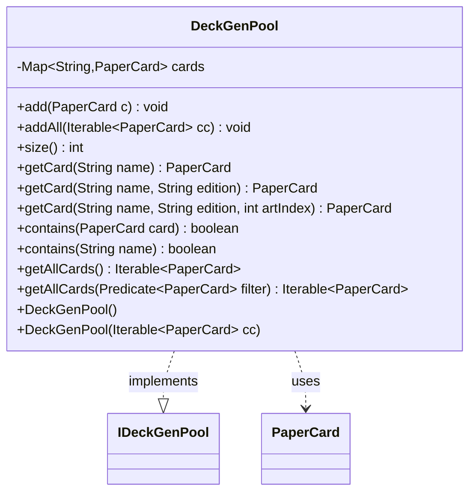

---
aliases:
  - DeckGenPool
tags:
  - java/class
  - module/forge-core
  - pkg/forge/deck/generation
fqn: forge.deck.generation.DeckGenPool
package: forge.deck.generation
module: forge-core
kind: Class
---

# DeckGenPool

**Package:** `forge.deck.generation` &nbsp; **Module:** `forge-core` &nbsp; **Kind:** Class



## Relationships
**Implements:**
- [[forge.deck.generation.IDeckGenPool|IDeckGenPool]]
**Uses:**
- [[forge.item.PaperCard|PaperCard]]


## Design Description

DeckGenPool is a lightweight, name-keyed registry of `PaperCard` instances used during deck generation. As a concrete implementation of `IDeckGenPool`, it wraps a `HashMap<String, PaperCard>` keyed on card name to provide fast insertion and constant-time lookup or containment checks, with bulk population via `addAll` and a convenience constructor accepting an `Iterable`.

Beyond plain name lookup, it supports edition-aware retrieval by streaming over its stored values with composed `PaperCardPredicates`, gracefully falling back to the default printing when no card matches the requested set; the art-index overload currently delegates to that same edition logic. Filtered enumeration is exposed lazily through `IterableUtil.filter`. The design favors a minimal, predicate-driven query surface that decouples deck-generation algorithms from the underlying card-storage details.

## Source
`forge-core/src/main/java/forge/deck/generation/DeckGenPool.java`

```java
package forge.deck.generation;

import forge.item.PaperCard;
import forge.item.PaperCardPredicates;
import forge.util.IterableUtil;

import java.util.HashMap;
import java.util.Map;
import java.util.function.Predicate;

public class DeckGenPool implements IDeckGenPool {
    private final Map<String, PaperCard> cards = new HashMap<>();

    public DeckGenPool() {
    }
    public DeckGenPool(Iterable<PaperCard> cc) {
        addAll(cc);
    }

    public void add(PaperCard c) {
        cards.put(c.getName(), c);
    }
    public void addAll(Iterable<PaperCard> cc) {
        for (PaperCard c : cc) {
            add(c);
        }
    }

    public int size() {
        return cards.size();
    }

    @Override
    public PaperCard getCard(String name) {
        return cards.get(name);
    }

    @Override
    public PaperCard getCard(String name, String edition) {
        Predicate<PaperCard> filter = PaperCardPredicates.printedInSet(edition).and(PaperCardPredicates.name(name));
        return cards.values().stream()
                .filter(filter)
                .findFirst().orElseGet(() -> getCard(name));
    }

    @Override
    public PaperCard getCard(String name, String edition, int artIndex) {
        return getCard(name, edition);
    }

    public boolean contains(PaperCard card) {
        return contains(card.getName());
    }

    @Override
    public boolean contains(String name) {
        return cards.containsKey(name);
    }

    @Override
    public Iterable<PaperCard> getAllCards() {
        return cards.values();
    }

    @Override
    public Iterable<PaperCard> getAllCards(Predicate<PaperCard> filter) {
        return IterableUtil.filter(getAllCards(), filter);
    }
}
```
