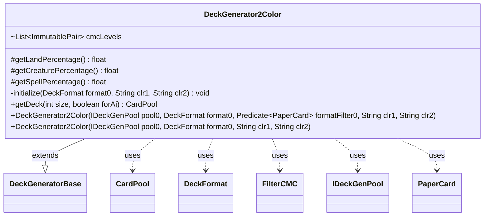

---
aliases:
  - DeckGenerator2Color
tags:
  - java/class
  - module/forge-core
  - pkg/forge/deck/generation
fqn: forge.deck.generation.DeckGenerator2Color
package: forge.deck.generation
module: forge-core
kind: Class
---

# DeckGenerator2Color

**Package:** `forge.deck.generation` &nbsp; **Module:** `forge-core` &nbsp; **Kind:** Class



## Relationships
**Extends:**
- [[forge.deck.generation.DeckGeneratorBase|DeckGeneratorBase]]
**Uses:**
- [[forge.deck.CardPool|CardPool]]
- [[forge.deck.DeckFormat|DeckFormat]]
- [[forge.deck.generation.DeckGeneratorBase.FilterCMC|FilterCMC]]
- [[forge.deck.generation.IDeckGenPool|IDeckGenPool]]
- [[forge.item.PaperCard|PaperCard]]


## Design Description

DeckGenerator2Color is a concrete deck builder that generates a randomized, format-legal two-color Magic deck. As a subclass of DeckGeneratorBase, its responsibility is to supply the strategy that the inherited generation machinery consumes: fixed land/creature/spell ratios (42%/34%/24%) overridden as final, and a mana-curve template (cmcLevels) that weights cheap cards heavily over expensive ones and is tuned per DeckFormat via adjustCMCLevels. Its initialize routine resolves two colors from the supplied names, randomly choosing distinct WUBRG colors when one or both are unspecified.

The class collaborates with IDeckGenPool as the card source, DeckFormat for legality and curve adjustment, FilterCMC for curve bucketing, and PaperCard as the filter target. getDeck orchestrates assembly—adding creatures and spells along the curve, then dual lands and basic lands sized to the land percentage—and returns a CardPool. The design deliberately confines color and ratio policy to the subclass while delegating the heavy lifting to base-class helpers.

## Source
`forge-core/src/main/java/forge/deck/generation/DeckGenerator2Color.java`

```java
/*
 * Forge: Play Magic: the Gathering.
 * Copyright (C) 2011  Forge Team
 *
 * This program is free software: you can redistribute it and/or modify
 * it under the terms of the GNU General Public License as published by
 * the Free Software Foundation, either version 3 of the License, or
 * (at your option) any later version.
 * 
 * This program is distributed in the hope that it will be useful,
 * but WITHOUT ANY WARRANTY; without even the implied warranty of
 * MERCHANTABILITY or FITNESS FOR A PARTICULAR PURPOSE.  See the
 * GNU General Public License for more details.
 * 
 * You should have received a copy of the GNU General Public License
 * along with this program.  If not, see <http://www.gnu.org/licenses/>.
 */
package forge.deck.generation;

import com.google.common.collect.Lists;
import forge.card.ColorSet;
import forge.card.MagicColor;
import forge.deck.CardPool;
import forge.deck.DeckFormat;
import forge.item.PaperCard;
import forge.util.MyRandom;
import org.apache.commons.lang3.tuple.ImmutablePair;

import java.util.Arrays;
import java.util.List;
import java.util.function.Predicate;

/**
 * <p>
 * Generate2ColorDeck class.
 * </p>
 * 
 * @author Forge
 * @version $Id$
 */
public class DeckGenerator2Color extends DeckGeneratorBase {
    @Override
    protected final float getLandPercentage() {
        return 0.42f;
    }
    @Override
    protected final float getCreaturePercentage() {
        return 0.34f;
    }
    @Override
    protected final float getSpellPercentage() {
        return 0.24f;
    }

    @SuppressWarnings("unchecked")
    final List<ImmutablePair<FilterCMC, Integer>> cmcLevels = Lists.newArrayList(
        ImmutablePair.of(new FilterCMC(0, 2), 6),
        ImmutablePair.of(new FilterCMC(3, 4), 4),
        ImmutablePair.of(new FilterCMC(5, 6), 2),
        ImmutablePair.of(new FilterCMC(7, 20), 1)
    );

    // mana curve of the card pool
    // 20x 0 - 2
    // 16x 3 - 4
    // 12x 5 - 6
    // 4x 7 - 20
    // = 52x - card pool (before further random filtering)

    public DeckGenerator2Color(IDeckGenPool pool0, DeckFormat format0, Predicate<PaperCard> formatFilter0, final String clr1, final String clr2) {
        super(pool0, format0,formatFilter0);
        initialize(format0,clr1,clr2);
    }

    public DeckGenerator2Color(IDeckGenPool pool0, DeckFormat format0, final String clr1, final String clr2) {
        super(pool0, format0);
        initialize(format0,clr1,clr2);
    }

    private void initialize(DeckFormat format0, final String clr1, final String clr2){
        int c1 = MagicColor.fromName(clr1);
        int c2 = MagicColor.fromName(clr2);

        format0.adjustCMCLevels(cmcLevels);

        if( c1 == 0 && c2 == 0) {
            int color1 = MyRandom.getRandom().nextInt(5);
            int color2 = (color1 + 1 + MyRandom.getRandom().nextInt(4)) % 5;
            colors = ColorSet.fromMask(MagicColor.WHITE << color1 | MagicColor.WHITE << color2);
        } else if ( c1 == 0 || c2 == 0 ) {
            byte knownColor = (byte) (c1 | c2);
            int color1 = Arrays.binarySearch(MagicColor.WUBRG, knownColor);
            int color2 = (color1 + 1 + MyRandom.getRandom().nextInt(4)) % 5;
            colors = ColorSet.fromMask(MagicColor.WHITE << color1 | MagicColor.WHITE << color2);
        } else {
            colors = ColorSet.fromMask(c1 | c2);
        }
    }

    @Override
    public final CardPool getDeck(final int size, final boolean forAi) {
        addCreaturesAndSpells(size, cmcLevels, forAi);

        // Add lands
        int numLands = Math.round(size * getLandPercentage());
        adjustDeckSize(size - numLands);
        trace.append(String.format("Adjusted deck size to: %d, should add %d land(s)%n", size - numLands, numLands));

        // Add dual lands
        List<String> duals = getDualLandList(forAi);
        for (String s : duals) {
            this.cardCounts.put(s, 0);
        }

        int dblsAdded = addSomeStr((numLands / 6), duals);
        numLands -= dblsAdded;

        addBasicLand(numLands);
        adjustDeckSize(size);
        trace.append("DeckSize:").append(tDeck.countAll()).append("\n");
        return tDeck;
    }
}
```
