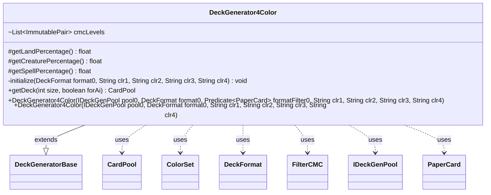

---
aliases:
  - DeckGenerator4Color
tags:
  - java/class
  - module/forge-core
  - pkg/forge/deck/generation
fqn: forge.deck.generation.DeckGenerator4Color
package: forge.deck.generation
module: forge-core
kind: Class
---

# DeckGenerator4Color

**Package:** `forge.deck.generation` &nbsp; **Module:** `forge-core` &nbsp; **Kind:** Class



## Relationships
**Extends:**
- [[forge.deck.generation.DeckGeneratorBase|DeckGeneratorBase]]
**Uses:**
- [[forge.card.ColorSet|ColorSet]]
- [[forge.deck.CardPool|CardPool]]
- [[forge.deck.DeckFormat|DeckFormat]]
- [[forge.deck.generation.DeckGeneratorBase.FilterCMC|FilterCMC]]
- [[forge.deck.generation.IDeckGenPool|IDeckGenPool]]
- [[forge.item.PaperCard|PaperCard]]


## Design Description

DeckGenerator4Color is a concrete deck-building strategy that assembles a randomized four-color deck from a supplied card pool. Extending `DeckGeneratorBase`, it overrides the abstract mana-base ratios—44% lands, 33% creatures, 23% spells—and defines a fixed mana curve (`cmcLevels`) weighted toward cheap cards, which the active `DeckFormat` may further adjust.

Its constructors take four color names plus an `IDeckGenPool` and optional format filter, then delegate to `initialize`, which converts the names to `MagicColor` bitmasks and resolves them through `ColorSet`. Notably, when fewer than three colors are supplied it randomly fills in the remainder (and a zero-color request yields a random three-color inverse), so the generator always settles on a valid multi-color identity. `getDeck` reuses inherited helpers to add creatures, spells, dual lands, and basic lands, tracing each step and returning a `CardPool` of `PaperCard`s. The design pushes shared assembly logic into the base class, leaving this subclass responsible only for color selection and ratio tuning.

## Source
`forge-core/src/main/java/forge/deck/generation/DeckGenerator4Color.java`

```java
/*
 * Forge: Play Magic: the Gathering.
 * Copyright (C) 2011  Forge Team
 *
 * This program is free software: you can redistribute it and/or modify
 * it under the terms of the GNU General Public License as published by
 * the Free Software Foundation, either version 3 of the License, or
 * (at your option) any later version.
 * 
 * This program is distributed in the hope that it will be useful,
 * but WITHOUT ANY WARRANTY; without even the implied warranty of
 * MERCHANTABILITY or FITNESS FOR A PARTICULAR PURPOSE.  See the
 * GNU General Public License for more details.
 * 
 * You should have received a copy of the GNU General Public License
 * along with this program.  If not, see <http://www.gnu.org/licenses/>.
 */
package forge.deck.generation;

import com.google.common.collect.Lists;
import forge.card.ColorSet;
import forge.card.MagicColor;
import forge.deck.CardPool;
import forge.deck.DeckFormat;
import forge.item.PaperCard;
import forge.util.MyRandom;
import org.apache.commons.lang3.tuple.ImmutablePair;

import java.util.List;
import java.util.function.Predicate;

/**
 * <p>
 * Generate3ColorDeck class.
 * </p>
 * 
 * @author Forge
 * @version $Id$
 */
public class DeckGenerator4Color extends DeckGeneratorBase {
    @Override
    protected final float getLandPercentage() {
        return 0.44f;
    }
    @Override
    protected final float getCreaturePercentage() {
        return 0.33f;
    }
    @Override
    protected final float getSpellPercentage() {
        return 0.23f;
    }

    @SuppressWarnings("unchecked")
    final List<ImmutablePair<FilterCMC, Integer>> cmcLevels = Lists.newArrayList(
        ImmutablePair.of(new FilterCMC(0, 2), 12),
        ImmutablePair.of(new FilterCMC(3, 5), 9),
        ImmutablePair.of(new FilterCMC(6, 20), 3)
    );

    public DeckGenerator4Color(IDeckGenPool pool0, DeckFormat format0, Predicate<PaperCard> formatFilter0, final String clr1, final String clr2, final String clr3, final String clr4) {
        super(pool0, format0, formatFilter0);
        initialize(format0,clr1,clr2,clr3,clr4);
    }

    public DeckGenerator4Color(IDeckGenPool pool0, DeckFormat format0, final String clr1, final String clr2, final String clr3, final String clr4) {
        super(pool0, format0);
        initialize(format0,clr1,clr2,clr3,clr4);
    }

    private void initialize(DeckFormat format0, final String clr1, final String clr2, final String clr3, final String clr4){
        format0.adjustCMCLevels(cmcLevels);

        int c1 = MagicColor.fromName(clr1);
        int c2 = MagicColor.fromName(clr2);
        int c3 = MagicColor.fromName(clr3);
        int c4 = MagicColor.fromName(clr4);

        int rc = 0;
        int combo = c1 | c2 | c3 | c4;

        ColorSet param = ColorSet.fromMask(combo);
        switch(param.countColors()) {
            case 3:
                colors = param;
                return;

            case 0:
                int color1 = MyRandom.getRandom().nextInt(5);
                int color2 = (color1 + 1 + MyRandom.getRandom().nextInt(4)) % 5;
                colors = ColorSet.fromMask(MagicColor.WHITE << color1 | MagicColor.WHITE << color2).inverse();
                return;

            case 1:
                do {
                    rc = MagicColor.WHITE << MyRandom.getRandom().nextInt(5);
                } while ( rc == combo );
                combo |= rc;

                //$FALL-THROUGH$
            case 2:
                do {
                    rc = MagicColor.WHITE << MyRandom.getRandom().nextInt(5);
                } while ( (rc & combo) != 0 );
                combo |= rc;
                break;
        }
        colors = ColorSet.fromMask(combo);
    }

    @Override
    public final CardPool getDeck(final int size, final boolean forAi) {
        addCreaturesAndSpells(size, cmcLevels, forAi);

        // Add lands
        int numLands = Math.round(size * getLandPercentage());
        adjustDeckSize(size - numLands);
        trace.append("numLands:").append(numLands).append("\n");

        // Add dual lands
        List<String> duals = getDualLandList(forAi);
        for (String s : duals) {
            this.cardCounts.put(s, 0);
        }

        int dblsAdded = addSomeStr((numLands / 4), duals);
        numLands -= dblsAdded;

        addBasicLand(numLands);
        adjustDeckSize(size);
        trace.append("DeckSize:").append(tDeck.countAll()).append("\n");
        return tDeck;
    }
}
```
