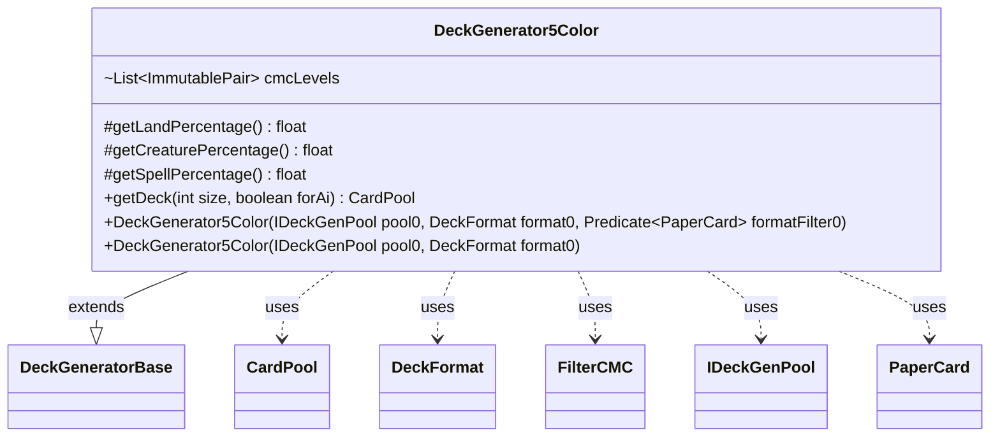

---
aliases:
  - DeckGenerator5Color
tags:
  - java/class
  - module/forge-core
  - pkg/forge/deck/generation
fqn: forge.deck.generation.DeckGenerator5Color
package: forge.deck.generation
module: forge-core
kind: Class
---

# DeckGenerator5Color

**Package:** `forge.deck.generation`   **Module:** `forge-core`   **Kind:** Class



## Relationships
**Extends:**
- [[forge.deck.generation.DeckGeneratorBase|DeckGeneratorBase]]
**Uses:**
- [[forge.deck.CardPool|CardPool]]
- [[forge.deck.DeckFormat|DeckFormat]]
- [[forge.deck.generation.DeckGeneratorBase.FilterCMC|FilterCMC]]
- [[forge.deck.generation.IDeckGenPool|IDeckGenPool]]
- [[forge.item.PaperCard|PaperCard]]


## Design Description

DeckGenerator5Color is a concrete deck builder that specializes the abstract `DeckGeneratorBase` template to produce five-color Magic decks. It pins the deck's composition by overriding the protected percentage hooks—44% lands, 33% creatures, 23% spells—and declares a fixed mana curve as a list of `FilterCMC` predicates weighted 3:2:1 across low (0–2), mid (3–5), and high (6–20) CMC bands, which the supplied `DeckFormat` may further adjust via `adjustCMCLevels`.

Both constructors delegate pool, format, and filter wiring to the superclass and seed the inherited `colors` field to all five colors (`ColorSet.fromMask(0).inverse()`). The overridden `getDeck` orchestrates assembly: it calls the base `addCreaturesAndSpells` along the curve, then computes the land count, layers in dual lands and basic lands, and returns the accumulated `CardPool`. The design keeps all reusable generation mechanics in the base class, leaving this subclass to supply only five-color tuning constants and the land-filling sequence.

## Source
`forge-core/src/main/java/forge/deck/generation/DeckGenerator5Color.java`

```java
/*
 * Forge: Play Magic: the Gathering.
 * Copyright (C) 2011  Forge Team
 *
 * This program is free software: you can redistribute it and/or modify
 * it under the terms of the GNU General Public License as published by
 * the Free Software Foundation, either version 3 of the License, or
 * (at your option) any later version.
 * 
 * This program is distributed in the hope that it will be useful,
 * but WITHOUT ANY WARRANTY; without even the implied warranty of
 * MERCHANTABILITY or FITNESS FOR A PARTICULAR PURPOSE.  See the
 * GNU General Public License for more details.
 * 
 * You should have received a copy of the GNU General Public License
 * along with this program.  If not, see <http://www.gnu.org/licenses/>.
 */
package forge.deck.generation;

import com.google.common.collect.Lists;
import forge.card.ColorSet;
import forge.deck.CardPool;
import forge.deck.DeckFormat;
import forge.item.PaperCard;
import org.apache.commons.lang3.tuple.ImmutablePair;

import java.util.List;
import java.util.function.Predicate;

/**
 * <p>
 * Generate5ColorDeck class.
 * </p>
 * 
 * @author Forge
 * @version $Id$
 */
public class DeckGenerator5Color extends DeckGeneratorBase {
    @Override
    protected final float getLandPercentage() {
        return 0.44f;
    }
    @Override
    protected final float getCreaturePercentage() {
        return 0.33f;
    }
    @Override
    protected final float getSpellPercentage() {
        return 0.23f;
    }

    @SuppressWarnings("unchecked")
    final List<ImmutablePair<FilterCMC, Integer>> cmcLevels = Lists.newArrayList(
        ImmutablePair.of(new FilterCMC(0, 2), 3),
        ImmutablePair.of(new FilterCMC(3, 5), 2),
        ImmutablePair.of(new FilterCMC(6, 20), 1)
    );

    // resulting mana curve of the card pool
    // 30x 0 - 2
    // 20x 3 - 5
    // 10x 6 - 20
    // =60x - card pool

    /**
     * Instantiates a new generate5 color deck.
     */
    public DeckGenerator5Color(IDeckGenPool pool0, DeckFormat format0, Predicate<PaperCard> formatFilter0) {
        super(pool0, format0, formatFilter0);
        format0.adjustCMCLevels(cmcLevels);
        colors = ColorSet.fromMask(0).inverse();
    }

    public DeckGenerator5Color(IDeckGenPool pool0, DeckFormat format0) {
        super(pool0, format0);
        format0.adjustCMCLevels(cmcLevels);
        colors = ColorSet.fromMask(0).inverse();
    }


    @Override
    public final CardPool getDeck(final int size, final boolean forAi) {
        addCreaturesAndSpells(size, cmcLevels, forAi);

        // Add lands
        int numLands = Math.round(size * getLandPercentage());
        adjustDeckSize(size - numLands);
        trace.append("numLands:").append(numLands).append("\n");

        // Add dual lands
        List<String> duals = getDualLandList(forAi);
        for (String s : duals) {
            this.cardCounts.put(s, 0);
        }

        int dblsAdded = addSomeStr((numLands / 4), duals);
        numLands -= dblsAdded;

        addBasicLand(numLands);
        adjustDeckSize(size);
        return tDeck;
    }
}
```

## Python
`forge/deck/generation/DeckGenerator5Color.py`

```python
from forge.deck.generation.DeckGeneratorBase import DeckGeneratorBase
from forge.deck.generation.DeckGeneratorBase import FilterCMC
from forge.deck.generation.IDeckGenPool import IDeckGenPool
from forge.deck.CardPool import CardPool
from forge.deck.DeckFormat import DeckFormat
from forge.item.PaperCard import PaperCard
from forge.card.ColorSet import ColorSet


class DeckGenerator5Color(DeckGeneratorBase):
    def getLandPercentage(self) -> float:
        return 0.44

    def getCreaturePercentage(self) -> float:
        return 0.33

    def getSpellPercentage(self) -> float:
        return 0.23

    # resulting mana curve of the card pool
    # 30x 0 - 2
    # 20x 3 - 5
    # 10x 6 - 20
    # =60x - card pool

    def __init__(self, pool0: IDeckGenPool, format0: DeckFormat, formatFilter0=None):
        if formatFilter0 is not None:
            super().__init__(pool0, format0, formatFilter0)
        else:
            super().__init__(pool0, format0)
        self.cmcLevels = [
            (FilterCMC(0, 2), 3),
            (FilterCMC(3, 5), 2),
            (FilterCMC(6, 20), 1),
        ]
        format0.adjustCMCLevels(self.cmcLevels)
        self.colors = ColorSet.fromMask(0).inverse()

    def getDeck(self, size: int, forAi: bool) -> CardPool:
        self.addCreaturesAndSpells(size, self.cmcLevels, forAi)

        # Add lands
        numLands = round(size * self.getLandPercentage())
        self.adjustDeckSize(size - numLands)
        self.trace.append("numLands:").append(numLands).append("\n")

        # Add dual lands
        duals = self.getDualLandList(forAi)
        for s in duals:
            self.cardCounts.put(s, 0)

        dblsAdded = self.addSomeStr((numLands // 4), duals)
        numLands -= dblsAdded

        self.addBasicLand(numLands)
        self.adjustDeckSize(size)
        return self.tDeck
```
