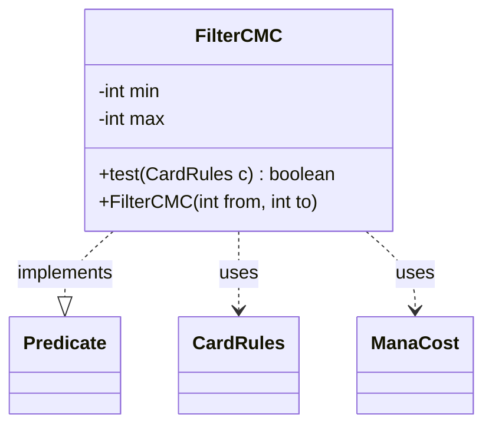

---
aliases:
  - FilterCMC
tags:
  - java/class
  - module/forge-core
  - pkg/forge/deck/generation
fqn: forge.deck.generation.DeckGeneratorBase.FilterCMC
package: forge.deck.generation
module: forge-core
kind: Class
---

# FilterCMC

**Package:** `forge.deck.generation`   **Module:** `forge-core`   **Kind:** Class



## Relationships
**Uses:**
- [[forge.card.CardRules|CardRules]]
- [[forge.card.mana.ManaCost|ManaCost]]

## Design Description

A predicate that filters cards by converted mana cost during deck generation. Defined as a static nested class of `DeckGeneratorBase`, it implements `Predicate<CardRules>` over an inclusive `[min, max]` CMC range fixed at construction. Its `test` method extracts the card's `ManaCost` via `CardRules`, reads the CMC, and accepts only cards whose cost falls within the range while rejecting cards with no mana cost (lands and other costless cards). The two `final` fields and absence of state mutation make instances immutable and safely reusable as composable filtering criteria when assembling random or themed decks.

## Source
`forge-core/src/main/java/forge/deck/generation/DeckGeneratorBase.java` — declaration excerpt

```java
    public static class FilterCMC implements Predicate<CardRules> {
        private final int min;
        private final int max;

        public FilterCMC(int from, int to) {
            min = from;
            max = to;
        }

        @Override
        public boolean test(CardRules c) {
            ManaCost mc = c.getManaCost();
            int cmc = mc.getCMC();
            return cmc >= min && cmc <= max && !mc.isNoCost();
        }
    }
```
