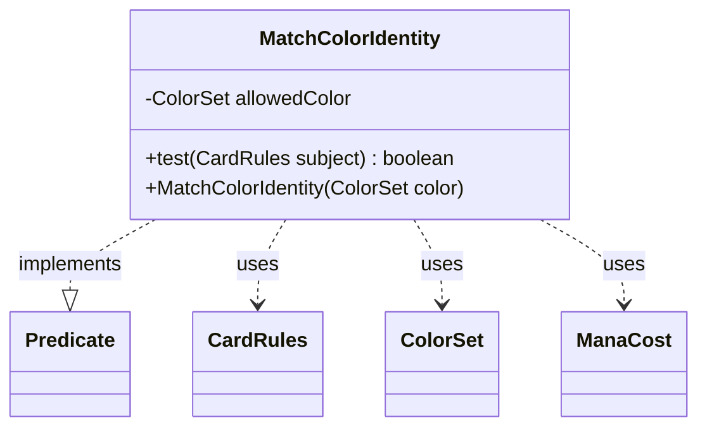

---
aliases:
  - MatchColorIdentity
tags:
  - java/class
  - module/forge-core
  - pkg/forge/deck/generation
fqn: forge.deck.generation.DeckGeneratorBase.MatchColorIdentity
package: forge.deck.generation
module: forge-core
kind: Class
---

# MatchColorIdentity

**Package:** `forge.deck.generation`   **Module:** `forge-core`   **Kind:** Class



## Relationships
**Uses:**
- [[forge.card.CardRules|CardRules]]
- [[forge.card.ColorSet|ColorSet]]
- [[forge.card.mana.ManaCost|ManaCost]]

## Design Description

MatchColorIdentity is a static nested helper of `DeckGeneratorBase` that implements `Predicate<CardRules>` to filter candidate cards during automated deck generation. Constructed with a fixed `ColorSet` of permitted colors, it accepts a card only when the card has a non-purely-generic mana cost and its color identity falls entirely within the allowed colors, letting callers restrict a generated deck to a chosen color identity.

As a `Predicate`, it plugs directly into Forge's card-stream filtering pipeline rather than exposing bespoke selection logic. It collaborates with `CardRules` to read each card's `ManaCost` and `ColorSet` color identity, delegating the subset check to `ColorSet.containsAllColorsFrom`. Commented-out alternatives in `test` reveal deliberate iteration over the matching rule—favoring color-identity containment over payability of the mana cost.

## Source
`forge-core/src/main/java/forge/deck/generation/DeckGeneratorBase.java` — declaration excerpt

```java
    public static class MatchColorIdentity implements Predicate<CardRules> {
        private final ColorSet allowedColor;

        public MatchColorIdentity(ColorSet color) {
            allowedColor = color;
        }

        @Override
        public boolean test(CardRules subject) {
            ManaCost mc = subject.getManaCost();
            return !mc.isPureGeneric() && allowedColor.containsAllColorsFrom(subject.getColorIdentity().getColor());
            //return  mc.canBePaidWithAvaliable(allowedColor);
            // return allowedColor.containsAllColorsFrom(mc.getColorProfile());
        }
    }
```

## Python
`forge/deck/generation/DeckGeneratorBase/MatchColorIdentity.py`

```python
from forge.card.CardRules import CardRules
from forge.card.ColorSet import ColorSet
from forge.card.mana.ManaCost import ManaCost
from typing import Callable


class MatchColorIdentity:
    def __init__(self, color: ColorSet):
        self.allowedColor = color

    def test(self, subject: CardRules) -> bool:
        mc = subject.getManaCost()
        return not mc.isPureGeneric() and self.allowedColor.containsAllColorsFrom(subject.getColorIdentity().getColor())
        # return mc.canBePaidWithAvaliable(allowedColor)
        # return allowedColor.containsAllColorsFrom(mc.getColorProfile())

    def __call__(self, subject: CardRules) -> bool:
        return self.test(subject)
```
