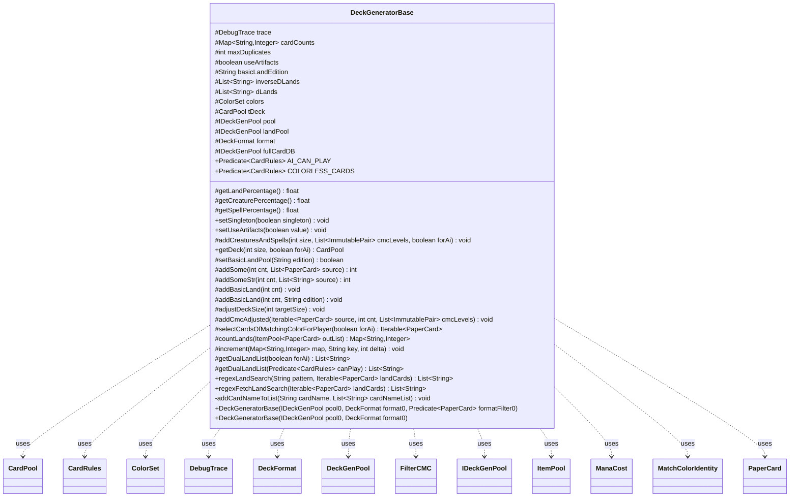

---
aliases:
  - DeckGeneratorBase
tags:
  - java/class
  - module/forge-core
  - pkg/forge/deck/generation
fqn: forge.deck.generation.DeckGeneratorBase
package: forge.deck.generation
module: forge-core
kind: Class
---

# DeckGeneratorBase

**Package:** `forge.deck.generation` &nbsp; **Module:** `forge-core` &nbsp; **Kind:** Class



## Relationships
**Uses:**
- [[forge.card.CardRules|CardRules]]
- [[forge.card.ColorSet|ColorSet]]
- [[forge.card.mana.ManaCost|ManaCost]]
- [[forge.deck.CardPool|CardPool]]
- [[forge.deck.DeckFormat|DeckFormat]]
- [[forge.deck.generation.DeckGenPool|DeckGenPool]]
- [[forge.deck.generation.DeckGeneratorBase.FilterCMC|FilterCMC]]
- [[forge.deck.generation.DeckGeneratorBase.MatchColorIdentity|MatchColorIdentity]]
- [[forge.deck.generation.IDeckGenPool|IDeckGenPool]]
- [[forge.item.PaperCard|PaperCard]]
- [[forge.util.DebugTrace|DebugTrace]]
- [[forge.util.ItemPool|ItemPool]]


## Design Description

DeckGeneratorBase is an abstract base class that anchors Forge's procedural deck-generation subsystem, holding the shared state and algorithms every concrete generator needs: the working `CardPool` (`tDeck`), the source and basic-land `IDeckGenPool`s, per-name duplicate limits, the target `ColorSet`, and the governing `DeckFormat`. It defers deck composition ratios to subclasses through the abstract `getLandPercentage`/`getCreaturePercentage`/`getSpellPercentage` hooks while supplying the reusable mechanics around them.

Its responsibility is to turn a format-filtered pool into a legal, color-coherent deck: it selects cards matching the target colors via the inner `MatchColorIdentity` predicate, distributes them along a mana curve with `FilterCMC` and `addCmcAdjusted`, balances basic lands from each card's color profile, and discovers dual and fetch lands by regex-matching oracle text. It leans on `PaperCard`, `CardRules`, and `ManaCost` for card evaluation and records every decision through `DebugTrace` for diagnostics.

## Source
`forge-core/src/main/java/forge/deck/generation/DeckGeneratorBase.java`

```java
/*
 * Forge: Play Magic: the Gathering.
 * Copyright (C) 2011  Forge Team
 *
 * This program is free software: you can redistribute it and/or modify
 * it under the terms of the GNU General Public License as published by
 * the Free Software Foundation, either version 3 of the License, or
 * (at your option) any later version.
 * 
 * This program is distributed in the hope that it will be useful,
 * but WITHOUT ANY WARRANTY; without even the implied warranty of
 * MERCHANTABILITY or FITNESS FOR A PARTICULAR PURPOSE.  See the
 * GNU General Public License for more details.
 * 
 * You should have received a copy of the GNU General Public License
 * along with this program.  If not, see <http://www.gnu.org/licenses/>.
 */
package forge.deck.generation;

import com.google.common.collect.Lists;
import forge.StaticData;
import forge.card.*;
import forge.card.mana.ManaCost;
import forge.deck.CardPool;
import forge.deck.DeckFormat;
import forge.item.PaperCard;
import forge.item.PaperCardPredicates;
import forge.util.*;
import org.apache.commons.lang3.tuple.ImmutablePair;

import java.util.*;
import java.util.Map.Entry;
import java.util.function.Predicate;
import java.util.regex.Matcher;
import java.util.regex.Pattern;

/**
 * <p>
 * Generate2ColorDeck class.
 * </p>
 * 
 * @author Forge
 * @version $Id: Generate2ColorDeck.java 14959 2012-03-28 14:03:43Z Chris H. $
 */
public abstract class DeckGeneratorBase {
    protected final DebugTrace trace = new DebugTrace();
    protected final Map<String, Integer> cardCounts = new HashMap<>();
    protected int maxDuplicates = 4;
    protected boolean useArtifacts = true;
    protected String basicLandEdition = null;
    protected List<String> inverseDLands = new ArrayList<>();
    protected List<String> dLands = new ArrayList<>();

    protected ColorSet colors;
    protected final CardPool tDeck = new CardPool();
    protected final IDeckGenPool pool;
    protected IDeckGenPool landPool;
    protected final DeckFormat format;
    protected final IDeckGenPool fullCardDB;

    protected abstract float getLandPercentage();
    protected abstract float getCreaturePercentage();
    protected abstract float getSpellPercentage();

    public DeckGeneratorBase(IDeckGenPool pool0, DeckFormat format0, Predicate<PaperCard> formatFilter0) {
        pool = new DeckGenPool(format0.getCardPool(pool0).getAllCards(formatFilter0));
        format = format0;
        fullCardDB = pool0;
    }

    public DeckGeneratorBase(IDeckGenPool pool0, DeckFormat format0) {
        pool = new DeckGenPool(format0.getCardPool(pool0).getAllCards());
        format = format0;
        fullCardDB = pool0;
    }

    public void setSingleton(boolean singleton) {
        maxDuplicates = singleton ? 1 : 4;
    }
    public void setUseArtifacts(boolean value) {
        useArtifacts = value;
    }

    protected void addCreaturesAndSpells(int size, List<ImmutablePair<FilterCMC, Integer>> cmcLevels, boolean forAi) {
        trace.append("Building deck of ").append(size).append("cards\n");

        final Iterable<PaperCard> cards = selectCardsOfMatchingColorForPlayer(forAi);
        // build subsets based on type

        final Iterable<PaperCard> creatures = IterableUtil.filter(cards, PaperCardPredicates.IS_CREATURE);
        final int creatCnt = (int) Math.ceil(getCreaturePercentage() * size);
        trace.append("Creatures to add:").append(creatCnt).append("\n");
        addCmcAdjusted(creatures, creatCnt, cmcLevels);

        Predicate<PaperCard> preSpells = PaperCardPredicates.fromRules(CardRulesPredicates.IS_NON_CREATURE_SPELL);
        final Iterable<PaperCard> spells = IterableUtil.filter(cards, preSpells);
        final int spellCnt = (int) Math.ceil(getSpellPercentage() * size);
        trace.append("Spells to add:").append(spellCnt).append("\n");
        addCmcAdjusted(spells, spellCnt, cmcLevels);

        trace.append(String.format("Current deck size: %d... should be %f%n", tDeck.countAll(), size * (getCreaturePercentage() + getSpellPercentage())));
    }

    public CardPool getDeck(final int size, final boolean forAi) {
        return null; // all but theme deck do override this method
    }

    protected boolean setBasicLandPool(String edition){
        Predicate<PaperCard> isSetBasicLand;
        if (edition != null){
            isSetBasicLand = PaperCardPredicates.printedInSet(edition)
                    .and(PaperCardPredicates.IS_BASIC_LAND);
        } else {
            isSetBasicLand = PaperCardPredicates.IS_BASIC_LAND;
        }

        landPool = new DeckGenPool(StaticData.instance().getCommonCards().getAllCards(isSetBasicLand));
        return landPool.contains("Plains");
    }

    protected int addSome(int cnt, List<PaperCard> source) {
        int srcLen = source.size();
        if (srcLen == 0) { return 0; }

        int res = 0;
        while (res < cnt) {
            PaperCard cp = source.get(MyRandom.getRandom().nextInt(srcLen));
            // TODO AltName conversion needed?
            int newCount = cardCounts.get(cp.getName()) + 1;

            //add card to deck if not already maxed out on card
            if (newCount <= maxDuplicates) {
                tDeck.add(pool.getCard(cp.getName(), cp.getEdition()));
                //see if current card is from an edition with basic lands to use for this deck
                if(basicLandEdition == null){
                    if(setBasicLandPool(cp.getEdition())){
                        basicLandEdition = cp.getEdition();
                    }
                }
                cardCounts.put(cp.getName(), newCount);
                trace.append(String.format("(%d) %s [%s]%n", cp.getRules().getManaCost().getCMC(), cp.getName(), cp.getRules().getManaCost()));
                res++;
            }

            //remove card from source if now maxed out on card
            if (newCount >= maxDuplicates) {
                source.remove(cp);
                srcLen--;
                if (srcLen == 0) { break; }
            }
        }
        return res;
    }

    protected int addSomeStr(int cnt, List<String> source) {
        int srcLen = source.size();
        if (srcLen == 0) { return 0; }

        int res = 0;
        while (res < cnt) {
            String s = source.get(MyRandom.getRandom().nextInt(srcLen));
            int newCount = cardCounts.get(s) + 1;

            //add card to deck if not already maxed out on card
            if (newCount <= maxDuplicates) {
                tDeck.add(pool.getCard(s));
                cardCounts.put(s, newCount);
                trace.append(s + "\n");
                res++;
            }

            //remove card from source if now maxed out on card
            if (newCount >= maxDuplicates) {
                source.remove(s);
                srcLen--;
                if (srcLen == 0) { break; }
            }
        }
        return res;
    }

    protected void addBasicLand(int cnt) {
    	addBasicLand(cnt, null);
    }

    protected void addBasicLand(int cnt, String edition) {
        trace.append(cnt).append(" basic lands remain").append("\n");

        // attempt to optimize basic land counts according to colors of picked cards
        final Map<String, Integer> clrCnts = countLands(tDeck);

        if (cnt > 0 && clrCnts.isEmpty()) {
            // The deck is completely colorless. Add some Plains then to fill the deck.
            clrCnts.put(MagicColor.Constant.BASIC_LANDS.get(0), cnt);
        }

        // total of all ClrCnts
        float totalColor = 0;
        for (Entry<String, Integer> c : clrCnts.entrySet()) {
            totalColor += c.getValue();
            trace.append(c.getKey()).append(":").append(c.getValue()).append("\n");
        }

        trace.append("totalColor:").append(totalColor).append("\n");

        int landsLeft = cnt;
        for (Entry<String, Integer> c : clrCnts.entrySet()) {
            String basicLandName = c.getKey();

            // calculate number of lands for each color
            final int nLand = Math.min(landsLeft, Math.round(cnt * c.getValue() / totalColor));
            trace.append("nLand-").append(basicLandName).append(":").append(nLand).append("\n");

            // just to prevent a null exception by the deck size fixing code
            cardCounts.put(basicLandName, nLand);

            if (!landPool.contains("Plains")) {//in case none of the cards came from a set with all basic lands
                setBasicLandPool("BFZ");
                basicLandEdition="BFZ";
            }

            for (int i = 0; i < nLand; i++) {
                tDeck.add(landPool.getCard(basicLandName, edition != null ? edition : basicLandEdition), 1);
            }

            landsLeft -= nLand;
        }
    }

    protected void adjustDeckSize(int targetSize) {
        // fix under-sized or over-sized decks, due to integer arithmetic
        int actualSize = tDeck.countAll();
        if (actualSize < targetSize) {
            addSome(targetSize - actualSize, tDeck.toFlatList());
        }
        else if (actualSize > targetSize) {

            for (int i = 0; i < 3 && actualSize > targetSize; i++) {
                List<PaperCard> toRemove = tDeck.toFlatList().stream()
                        .filter(PaperCardPredicates.NOT_BASIC_LAND)
                        .collect(StreamUtil.random(actualSize - targetSize));
                tDeck.removeAllFlat(toRemove);

                for (PaperCard c : toRemove) {
                    trace.append("Removed:").append(c.getName()).append("\n");
                }
                actualSize = tDeck.countAll();
            }
        }
    }

    protected void addCmcAdjusted(Iterable<PaperCard> source, int cnt, List<ImmutablePair<FilterCMC, Integer>> cmcLevels) {
        int totalWeight = 0;
        for (ImmutablePair<FilterCMC, Integer> pair : cmcLevels) {
            totalWeight += pair.getRight();
        }

        float variability = 0.6f; // if set to 1, you'll get minimum cards to choose from
        float desiredWeight = (float)cnt / ( maxDuplicates * variability ); 
        float desiredOverTotal = desiredWeight / totalWeight;
        float requestedOverTotal = (float)cnt / totalWeight;

        for (ImmutablePair<FilterCMC, Integer> pair : cmcLevels) {
            Iterable<PaperCard> matchingCards = IterableUtil.filter(source, PaperCardPredicates.fromRules(pair.getLeft()));
            int cmcCountForPool = (int) Math.ceil(pair.getRight() * desiredOverTotal);

            int addOfThisCmc = Math.round(pair.getRight() * requestedOverTotal);
            trace.append(String.format("Adding %d cards for cmc range from a pool with %d cards:%n", addOfThisCmc, cmcCountForPool));

            final List<PaperCard> curved = Aggregates.random(matchingCards, cmcCountForPool);
            final List<PaperCard> curvedRandomized = Lists.newArrayList();
            for (PaperCard c : curved) {
                cardCounts.put(c.getName(), 0);
                curvedRandomized.add(pool.getCard(c.getName()));
            }

            addSome(addOfThisCmc, curvedRandomized);
        }
    }

    protected Iterable<PaperCard> selectCardsOfMatchingColorForPlayer(boolean forAi) {
        // start with all cards
        // remove cards that generated decks don't like
        Predicate<CardRules> canPlay = forAi ? AI_CAN_PLAY : CardRulesPredicates.IS_KEPT_IN_RANDOM_DECKS;
        Predicate<CardRules> hasColor = new MatchColorIdentity(colors);
        Predicate<CardRules> canUseInFormat = c -> {
            // FIXME: should this be limited to AI only (!forAi) or should it be generally applied to all random generated decks?
            return !c.getAiHints().getRemNonCommanderDecks() || format.hasCommander();
        };

        if (useArtifacts) {
            hasColor = hasColor.or(COLORLESS_CARDS);
        }
        return IterableUtil.filter(pool.getAllCards(), PaperCardPredicates.fromRules(canPlay.and(hasColor).and(canUseInFormat)));
    }

    protected static Map<String, Integer> countLands(ItemPool<PaperCard> outList) {
        // attempt to optimize basic land counts according
        // to color representation
        Map<String, Integer> res = new TreeMap<>();
        // count each card color using mana costs
        // TODO: count hybrid mana differently?
        for (Entry<PaperCard, Integer> cpe : outList) {
            int profile = cpe.getKey().getRules().getManaCost().getColorProfile();

            if ((profile & MagicColor.WHITE) != 0) {
                increment(res, MagicColor.Constant.BASIC_LANDS.get(0), cpe.getValue());
            }
            else if ((profile & MagicColor.BLUE) != 0) {
                increment(res, MagicColor.Constant.BASIC_LANDS.get(1), cpe.getValue());
            }
            else if ((profile & MagicColor.BLACK) != 0) {
                increment(res, MagicColor.Constant.BASIC_LANDS.get(2), cpe.getValue());
            }
            else if ((profile & MagicColor.RED) != 0) {
                increment(res, MagicColor.Constant.BASIC_LANDS.get(3), cpe.getValue());
            }
            else if ((profile & MagicColor.GREEN) != 0) {
                increment(res, MagicColor.Constant.BASIC_LANDS.get(4), cpe.getValue());
            }
        }
        return res;
    }

    protected static void increment(Map<String, Integer> map, String key, int delta) {
        map.merge(key, delta, Integer::sum);
    }

    public static final Predicate<CardRules> AI_CAN_PLAY = CardRulesPredicates.IS_KEPT_IN_AI_DECKS.and(CardRulesPredicates.IS_KEPT_IN_RANDOM_DECKS);

    public static final Predicate<CardRules> COLORLESS_CARDS = c -> {
        ManaCost mc = c.getManaCost();
        return c.getColorIdentity().isColorless() && !mc.isNoCost();
    };

    public static class MatchColorIdentity implements Predicate<CardRules> {
        private final ColorSet allowedColor;

        public MatchColorIdentity(ColorSet color) {
            allowedColor = color;
        }

        @Override
        public boolean test(CardRules subject) {
            ManaCost mc = subject.getManaCost();
            return !mc.isPureGeneric() && allowedColor.containsAllColorsFrom(subject.getColorIdentity().getColor());
            //return  mc.canBePaidWithAvaliable(allowedColor);
            // return allowedColor.containsAllColorsFrom(mc.getColorProfile());
        }
    }

    public static class FilterCMC implements Predicate<CardRules> {
        private final int min;
        private final int max;

        public FilterCMC(int from, int to) {
            min = from;
            max = to;
        }

        @Override
        public boolean test(CardRules c) {
            ManaCost mc = c.getManaCost();
            int cmc = mc.getCMC();
            return cmc >= min && cmc <= max && !mc.isNoCost();
        }
    }

    protected List<String> getDualLandList(boolean forAi) {
        return getDualLandList(forAi ? AI_CAN_PLAY : CardRulesPredicates.IS_KEPT_IN_RANDOM_DECKS);
    }
    /**
     * Get list of dual lands for this color combo.
     *
     * @return dual land names
     */
    protected List<String> getDualLandList(Predicate<CardRules> canPlay) {
        if (colors.countColors() > 3) {
            addCardNameToList("Rupture Spire", dLands);
            addCardNameToList("Undiscovered Paradise", dLands);
        }

        if (colors.countColors() > 2) {
            addCardNameToList("Evolving Wilds", dLands);
            addCardNameToList("Terramorphic Expanse", dLands);
        }

        //filter to provide all dual lands from pool matching 2 or 3 colors from current deck
        Predicate<CardRules> dualLandFilter = CardRulesPredicates.coreType(CardType.CoreType.Land);
        Predicate<CardRules> exceptBasicLand = CardRulesPredicates.NOT_BASIC_LAND;

        Iterable<PaperCard> landCards = pool.getAllCards(PaperCardPredicates.fromRules(dualLandFilter.and(exceptBasicLand).and(canPlay)));
        Iterable<String> dualLandPatterns = Arrays.asList("Add \\{([WUBRG])\\} or \\{([WUBRG])\\}",
                "Add \\{([WUBRG])\\}, \\{([WUBRG])\\}, or \\{([WUBRG])\\}",
                "Add \\{([WUBRG])\\}\\{([WUBRG])\\}",
                "Add \\{[WUBRG]\\}\\{[WUBRG]\\}, \\{([WUBRG])\\}\\{([WUBRG])\\}, or \\{[WUBRG]\\}\\{[WUBRG]\\}");
        for (String pattern:dualLandPatterns) {
            regexLandSearch(pattern, landCards);
        }
        regexFetchLandSearch(landCards);

        return dLands;
    }

    public List<String> regexLandSearch(String pattern, Iterable<PaperCard> landCards) {
        Pattern p = Pattern.compile(pattern);
        for (PaperCard card:landCards) {
            Matcher matcher = p.matcher(card.getRules().getOracleText());
            while (matcher.find()) {
                List<String> manaColorNames = new ArrayList<>();
                for (int i = 1; i <= matcher.groupCount(); i++) {
                    manaColorNames.add(matcher.group(i));
                }
                ColorSet manaColorSet = ColorSet.fromNames(manaColorNames);
                if (colors.hasAllColors(manaColorSet.getColor())){
                    addCardNameToList(card.getName(),dLands);
                }else{
                    addCardNameToList(card.getName(),inverseDLands);
                }
            }
        }
        return dLands;
    }

    public List<String> regexFetchLandSearch(Iterable<PaperCard> landCards) {
        final String fetchPattern="Search your library for an* ([^\\s]*) or ([^\\s]*) card";
        Map<String,String> colorLookup= new HashMap<>();
        colorLookup.put("Plains","W");
        colorLookup.put("Forest","G");
        colorLookup.put("Mountain","R");
        colorLookup.put("Island","U");
        colorLookup.put("Swamp","B");
        Pattern p = Pattern.compile(fetchPattern);
        for (PaperCard card:landCards) {
            Matcher matcher = p.matcher(card.getRules().getOracleText());
            while (matcher.find()) {
                List<String> manaColorNames = new ArrayList<>();
                for (int i = 1; i <= matcher.groupCount(); i++) {
                    manaColorNames.add(colorLookup.get(matcher.group(i)));
                }
                ColorSet manaColorSet = ColorSet.fromNames(manaColorNames);
                if (colors.hasAllColors(manaColorSet.getColor())){
                    addCardNameToList(card.getName(),dLands);
                }else{
                    addCardNameToList(card.getName(),inverseDLands);
                }
            }
        }
        return dLands;
    }

    private void addCardNameToList(String cardName, List<String> cardNameList) {
        if (pool.contains(cardName)) { //avoid adding card if it's not in pool
            cardNameList.add(cardName);
        }
    }
}
```

## Python
`forge/deck/generation/DeckGeneratorBase.py`

```python
from forge.StaticData import StaticData
from forge.card.CardRules import CardRules
from forge.card.CardRulesPredicates import CardRulesPredicates
from forge.card.CardType import CardType
from forge.card.ColorSet import ColorSet
from forge.card.MagicColor import MagicColor
from forge.card.mana.ManaCost import ManaCost
from forge.deck.CardPool import CardPool
from forge.deck.DeckFormat import DeckFormat
from forge.deck.generation.DeckGenPool import DeckGenPool
from forge.deck.generation.IDeckGenPool import IDeckGenPool
from forge.item.PaperCard import PaperCard
from forge.item.PaperCardPredicates import PaperCardPredicates
from forge.util.Aggregates import Aggregates
from forge.util.DebugTrace import DebugTrace
from forge.util.IterableUtil import IterableUtil
from forge.util.ItemPool import ItemPool
from forge.util.MyRandom import MyRandom

import math
import re
from abc import ABC, abstractmethod


class DeckGeneratorBase(ABC):
    def __init__(self, pool0, format0, formatFilter0=None):
        self.trace = DebugTrace()
        self.cardCounts = {}
        self.maxDuplicates = 4
        self.useArtifacts = True
        self.basicLandEdition = None
        self.inverseDLands = []
        self.dLands = []

        self.colors = None
        self.tDeck = CardPool()
        self.landPool = None

        if formatFilter0 is not None:
            self.pool = DeckGenPool(format0.getCardPool(pool0).getAllCards(formatFilter0))
        else:
            self.pool = DeckGenPool(format0.getCardPool(pool0).getAllCards())
        self.format = format0
        self.fullCardDB = pool0

    @abstractmethod
    def getLandPercentage(self):
        ...

    @abstractmethod
    def getCreaturePercentage(self):
        ...

    @abstractmethod
    def getSpellPercentage(self):
        ...

    def setSingleton(self, singleton):
        self.maxDuplicates = 1 if singleton else 4

    def setUseArtifacts(self, value):
        self.useArtifacts = value

    def addCreaturesAndSpells(self, size, cmcLevels, forAi):
        self.trace.append("Building deck of ").append(size).append("cards\n")

        cards = self.selectCardsOfMatchingColorForPlayer(forAi)
        # build subsets based on type

        creatures = IterableUtil.filter(cards, PaperCardPredicates.IS_CREATURE)
        creatCnt = int(math.ceil(self.getCreaturePercentage() * size))
        self.trace.append("Creatures to add:").append(creatCnt).append("\n")
        self.addCmcAdjusted(creatures, creatCnt, cmcLevels)

        preSpells = PaperCardPredicates.fromRules(CardRulesPredicates.IS_NON_CREATURE_SPELL)
        spells = IterableUtil.filter(cards, preSpells)
        spellCnt = int(math.ceil(self.getSpellPercentage() * size))
        self.trace.append("Spells to add:").append(spellCnt).append("\n")
        self.addCmcAdjusted(spells, spellCnt, cmcLevels)

        self.trace.append("Current deck size: %d... should be %f\n" % (self.tDeck.countAll(), size * (self.getCreaturePercentage() + self.getSpellPercentage())))

    def getDeck(self, size, forAi):
        return None  # all but theme deck do override this method

    def setBasicLandPool(self, edition):
        if edition is not None:
            printed = PaperCardPredicates.printedInSet(edition)
            isSetBasicLand = lambda c: printed(c) and PaperCardPredicates.IS_BASIC_LAND(c)
        else:
            isSetBasicLand = PaperCardPredicates.IS_BASIC_LAND

        self.landPool = DeckGenPool(StaticData.instance().getCommonCards().getAllCards(isSetBasicLand))
        return self.landPool.contains("Plains")

    def addSome(self, cnt, source):
        srcLen = len(source)
        if srcLen == 0:
            return 0

        res = 0
        while res < cnt:
            cp = source[MyRandom.getRandom().nextInt(srcLen)]
            # TODO AltName conversion needed?
            newCount = self.cardCounts.get(cp.getName()) + 1

            # add card to deck if not already maxed out on card
            if newCount <= self.maxDuplicates:
                self.tDeck.add(self.pool.getCard(cp.getName(), cp.getEdition()))
                # see if current card is from an edition with basic lands to use for this deck
                if self.basicLandEdition is None:
                    if self.setBasicLandPool(cp.getEdition()):
                        self.basicLandEdition = cp.getEdition()
                self.cardCounts[cp.getName()] = newCount
                self.trace.append("(%d) %s [%s]\n" % (cp.getRules().getManaCost().getCMC(), cp.getName(), cp.getRules().getManaCost()))
                res += 1

            # remove card from source if now maxed out on card
            if newCount >= self.maxDuplicates:
                source.remove(cp)
                srcLen -= 1
                if srcLen == 0:
                    break
        return res

    def addSomeStr(self, cnt, source):
        srcLen = len(source)
        if srcLen == 0:
            return 0

        res = 0
        while res < cnt:
            s = source[MyRandom.getRandom().nextInt(srcLen)]
            newCount = self.cardCounts.get(s) + 1

            # add card to deck if not already maxed out on card
            if newCount <= self.maxDuplicates:
                self.tDeck.add(self.pool.getCard(s))
                self.cardCounts[s] = newCount
                self.trace.append(s + "\n")
                res += 1

            # remove card from source if now maxed out on card
            if newCount >= self.maxDuplicates:
                source.remove(s)
                srcLen -= 1
                if srcLen == 0:
                    break
        return res

    def addBasicLand(self, cnt, edition=None):
        self.trace.append(cnt).append(" basic lands remain").append("\n")

        # attempt to optimize basic land counts according to colors of picked cards
        clrCnts = self.countLands(self.tDeck)

        if cnt > 0 and not clrCnts:
            # The deck is completely colorless. Add some Plains then to fill the deck.
            clrCnts[MagicColor.Constant.BASIC_LANDS.get(0)] = cnt

        # total of all ClrCnts
        totalColor = 0.0
        for key, value in clrCnts.items():
            totalColor += value
            self.trace.append(key).append(":").append(value).append("\n")

        self.trace.append("totalColor:").append(totalColor).append("\n")

        landsLeft = cnt
        for key, value in clrCnts.items():
            basicLandName = key

            # calculate number of lands for each color
            nLand = min(landsLeft, round(cnt * value / totalColor))
            self.trace.append("nLand-").append(basicLandName).append(":").append(nLand).append("\n")

            # just to prevent a null exception by the deck size fixing code
            self.cardCounts[basicLandName] = nLand

            if not self.landPool.contains("Plains"):  # in case none of the cards came from a set with all basic lands
                self.setBasicLandPool("BFZ")
                self.basicLandEdition = "BFZ"

            for i in range(nLand):
                self.tDeck.add(self.landPool.getCard(basicLandName, edition if edition is not None else self.basicLandEdition), 1)

            landsLeft -= nLand

    def adjustDeckSize(self, targetSize):
        # fix under-sized or over-sized decks, due to integer arithmetic
        actualSize = self.tDeck.countAll()
        if actualSize < targetSize:
            self.addSome(targetSize - actualSize, self.tDeck.toFlatList())
        elif actualSize > targetSize:

            for i in range(3):
                if not (actualSize > targetSize):
                    break
                toRemove = Aggregates.random(
                    [c for c in self.tDeck.toFlatList() if PaperCardPredicates.NOT_BASIC_LAND(c)],
                    actualSize - targetSize)
                self.tDeck.removeAllFlat(toRemove)

                for c in toRemove:
                    self.trace.append("Removed:").append(c.getName()).append("\n")
                actualSize = self.tDeck.countAll()

    def addCmcAdjusted(self, source, cnt, cmcLevels):
        totalWeight = 0
        for pair in cmcLevels:
            totalWeight += pair.getRight()

        variability = 0.6  # if set to 1, you'll get minimum cards to choose from
        desiredWeight = cnt / (self.maxDuplicates * variability)
        desiredOverTotal = desiredWeight / totalWeight
        requestedOverTotal = cnt / totalWeight

        for pair in cmcLevels:
            matchingCards = IterableUtil.filter(source, PaperCardPredicates.fromRules(pair.getLeft()))
            cmcCountForPool = int(math.ceil(pair.getRight() * desiredOverTotal))

            addOfThisCmc = round(pair.getRight() * requestedOverTotal)
            self.trace.append("Adding %d cards for cmc range from a pool with %d cards:\n" % (addOfThisCmc, cmcCountForPool))

            curved = Aggregates.random(matchingCards, cmcCountForPool)
            curvedRandomized = []
            for c in curved:
                self.cardCounts[c.getName()] = 0
                curvedRandomized.append(self.pool.getCard(c.getName()))

            self.addSome(addOfThisCmc, curvedRandomized)

    def selectCardsOfMatchingColorForPlayer(self, forAi):
        # start with all cards
        # remove cards that generated decks don't like
        canPlay = self.AI_CAN_PLAY if forAi else CardRulesPredicates.IS_KEPT_IN_RANDOM_DECKS
        hasColor = self.MatchColorIdentity(self.colors)
        canUseInFormat = lambda c: (not c.getAiHints().getRemNonCommanderDecks()) or self.format.hasCommander()

        if self.useArtifacts:
            baseHasColor = hasColor
            hasColor = lambda c: baseHasColor(c) or self.COLORLESS_CARDS(c)
        return IterableUtil.filter(self.pool.getAllCards(), PaperCardPredicates.fromRules(lambda c: canPlay(c) and hasColor(c) and canUseInFormat(c)))

    @staticmethod
    def countLands(outList):
        # attempt to optimize basic land counts according
        # to color representation
        res = {}
        # count each card color using mana costs
        # TODO: count hybrid mana differently?
        for cpe in outList:
            profile = cpe.getKey().getRules().getManaCost().getColorProfile()

            if (profile & MagicColor.WHITE) != 0:
                DeckGeneratorBase.increment(res, MagicColor.Constant.BASIC_LANDS.get(0), cpe.getValue())
            elif (profile & MagicColor.BLUE) != 0:
                DeckGeneratorBase.increment(res, MagicColor.Constant.BASIC_LANDS.get(1), cpe.getValue())
            elif (profile & MagicColor.BLACK) != 0:
                DeckGeneratorBase.increment(res, MagicColor.Constant.BASIC_LANDS.get(2), cpe.getValue())
            elif (profile & MagicColor.RED) != 0:
                DeckGeneratorBase.increment(res, MagicColor.Constant.BASIC_LANDS.get(3), cpe.getValue())
            elif (profile & MagicColor.GREEN) != 0:
                DeckGeneratorBase.increment(res, MagicColor.Constant.BASIC_LANDS.get(4), cpe.getValue())
        return res

    @staticmethod
    def increment(map, key, delta):
        map[key] = map.get(key, 0) + delta

    AI_CAN_PLAY = staticmethod(lambda c: CardRulesPredicates.IS_KEPT_IN_AI_DECKS(c) and CardRulesPredicates.IS_KEPT_IN_RANDOM_DECKS(c))

    COLORLESS_CARDS = staticmethod(lambda c: c.getColorIdentity().isColorless() and not c.getManaCost().isNoCost())

    class MatchColorIdentity:
        def __init__(self, color):
            self.allowedColor = color

        def test(self, subject):
            mc = subject.getManaCost()
            return (not mc.isPureGeneric()) and self.allowedColor.containsAllColorsFrom(subject.getColorIdentity().getColor())
            # return mc.canBePaidWithAvaliable(allowedColor);
            # return allowedColor.containsAllColorsFrom(mc.getColorProfile());

        def __call__(self, subject):
            return self.test(subject)

    class FilterCMC:
        def __init__(self, from_, to):
            self.min = from_
            self.max = to

        def test(self, c):
            mc = c.getManaCost()
            cmc = mc.getCMC()
            return cmc >= self.min and cmc <= self.max and not mc.isNoCost()

        def __call__(self, c):
            return self.test(c)

    def getDualLandList(self, arg):
        if isinstance(arg, bool):
            return self.getDualLandList(self.AI_CAN_PLAY if arg else CardRulesPredicates.IS_KEPT_IN_RANDOM_DECKS)

        canPlay = arg
        if self.colors.countColors() > 3:
            self.addCardNameToList("Rupture Spire", self.dLands)
            self.addCardNameToList("Undiscovered Paradise", self.dLands)

        if self.colors.countColors() > 2:
            self.addCardNameToList("Evolving Wilds", self.dLands)
            self.addCardNameToList("Terramorphic Expanse", self.dLands)

        # filter to provide all dual lands from pool matching 2 or 3 colors from current deck
        dualLandFilter = CardRulesPredicates.coreType(CardType.CoreType.Land)
        exceptBasicLand = CardRulesPredicates.NOT_BASIC_LAND

        landCards = list(self.pool.getAllCards(PaperCardPredicates.fromRules(lambda c: dualLandFilter(c) and exceptBasicLand(c) and canPlay(c))))
        dualLandPatterns = ["Add \\{([WUBRG])\\} or \\{([WUBRG])\\}",
                            "Add \\{([WUBRG])\\}, \\{([WUBRG])\\}, or \\{([WUBRG])\\}",
                            "Add \\{([WUBRG])\\}\\{([WUBRG])\\}",
                            "Add \\{[WUBRG]\\}\\{[WUBRG]\\}, \\{([WUBRG])\\}\\{([WUBRG])\\}, or \\{[WUBRG]\\}\\{[WUBRG]\\}"]
        for pattern in dualLandPatterns:
            self.regexLandSearch(pattern, landCards)
        self.regexFetchLandSearch(landCards)

        return self.dLands

    def regexLandSearch(self, pattern, landCards):
        p = re.compile(pattern)
        for card in landCards:
            for matcher in p.finditer(card.getRules().getOracleText()):
                manaColorNames = []
                for i in range(1, p.groups + 1):
                    manaColorNames.append(matcher.group(i))
                manaColorSet = ColorSet.fromNames(manaColorNames)
                if self.colors.hasAllColors(manaColorSet.getColor()):
                    self.addCardNameToList(card.getName(), self.dLands)
                else:
                    self.addCardNameToList(card.getName(), self.inverseDLands)
        return self.dLands

    def regexFetchLandSearch(self, landCards):
        fetchPattern = "Search your library for an* ([^\\s]*) or ([^\\s]*) card"
        colorLookup = {}
        colorLookup["Plains"] = "W"
        colorLookup["Forest"] = "G"
        colorLookup["Mountain"] = "R"
        colorLookup["Island"] = "U"
        colorLookup["Swamp"] = "B"
        p = re.compile(fetchPattern)
        for card in landCards:
            for matcher in p.finditer(card.getRules().getOracleText()):
                manaColorNames = []
                for i in range(1, p.groups + 1):
                    manaColorNames.append(colorLookup.get(matcher.group(i)))
                manaColorSet = ColorSet.fromNames(manaColorNames)
                if self.colors.hasAllColors(manaColorSet.getColor()):
                    self.addCardNameToList(card.getName(), self.dLands)
                else:
                    self.addCardNameToList(card.getName(), self.inverseDLands)
        return self.dLands

    def addCardNameToList(self, cardName, cardNameList):
        if self.pool.contains(cardName):  # avoid adding card if it's not in pool
            cardNameList.append(cardName)
```
