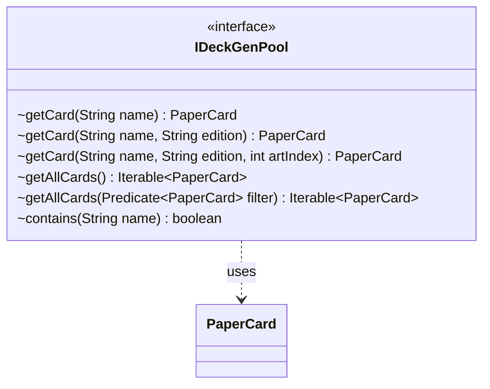

---
aliases:
  - IDeckGenPool
tags:
  - java/interface
  - module/forge-core
  - pkg/forge/deck/generation
fqn: forge.deck.generation.IDeckGenPool
package: forge.deck.generation
module: forge-core
kind: Interface
---

# IDeckGenPool

**Package:** `forge.deck.generation` &nbsp; **Module:** `forge-core` &nbsp; **Kind:** Interface



## Relationships
**Uses:**
- [[forge.item.PaperCard|PaperCard]]


## Design Description

IDeckGenPool defines the contract for a queryable pool of cards used during deck generation, decoupling the generation algorithms from how card data is actually stored. It provides name-based lookup of a `PaperCard`, optionally narrowed by edition and then by art index, plus bulk accessors that return all cards plain or constrained by a `Predicate<PaperCard>`, and a simple containment check by name.

As a `forge-core` interface, its only collaborator is `PaperCard`, the engine's representation of a physical card printing. By programming generators against this abstraction rather than a concrete collection, any backing source that can supply cards can serve as a pool. The three overloaded `getCard` signatures mirror Magic's distinction between a card's name, a specific printing, and a specific artwork, while `Iterable` return types keep the contract minimal and lazy-friendly.

## Source
`forge-core/src/main/java/forge/deck/generation/IDeckGenPool.java`

```java
package forge.deck.generation;

import forge.item.PaperCard;

import java.util.function.Predicate;

public interface IDeckGenPool {
    PaperCard getCard(String name);
    PaperCard getCard(String name, String edition);
    PaperCard getCard(String name, String edition, int artIndex);
    Iterable<PaperCard> getAllCards();
    Iterable<PaperCard> getAllCards(Predicate<PaperCard> filter);
    boolean contains(String name);
}
```

## Python
`forge/deck/generation/IDeckGenPool.py`

```python
from abc import ABC, abstractmethod
from typing import Iterable, Optional, Callable

from forge.item.PaperCard import PaperCard


class IDeckGenPool(ABC):
    @abstractmethod
    def getCard(self, name: str, edition: Optional[str] = None, artIndex: Optional[int] = None) -> PaperCard:
        ...

    @abstractmethod
    def getAllCards(self, filter: Optional[Callable[[PaperCard], bool]] = None) -> Iterable[PaperCard]:
        ...

    @abstractmethod
    def contains(self, name: str) -> bool:
        ...
```
