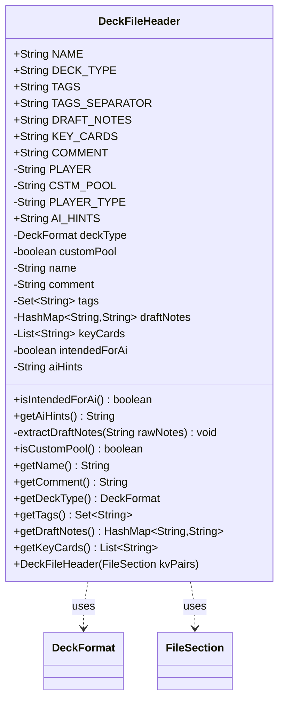

---
aliases:
  - DeckFileHeader
tags:
  - java/class
  - module/forge-core
  - pkg/forge/deck/io
fqn: forge.deck.io.DeckFileHeader
package: forge.deck.io
module: forge-core
kind: Class
---

# DeckFileHeader

**Package:** `forge.deck.io`   **Module:** `forge-core`   **Kind:** Class



## Relationships
**Uses:**
- [[forge.deck.DeckFormat|DeckFormat]]
- [[forge.util.FileSection|FileSection]]


## Design Description

`DeckFileHeader` is an immutable value object that parses and holds the metadata of a Forge deck file's header. Built from a `FileSection` of key/value pairs, its constructor reads well-known keys—name, comment, deck type, tags, draft notes, key cards, and AI hints—into `final` fields exposed only through getters, so a header is fully populated at construction and never mutated afterward.

It depends on `FileSection` as its sole input source and on `DeckFormat`, calling `DeckFormat.smartValueOf` to resolve the deck type while defaulting to `Constructed`. The class centralizes the file format's parsing rules: it splits and trims multi-valued fields (comma-separated tags into a sorted `TreeSet`, semicolon-separated key cards, and pipe/colon-delimited draft notes) while filtering blanks, and infers AI intent from legacy `Player`/`PlayerType` markers—letting the rest of the deck I/O layer work with typed accessors instead of raw strings.

## Source
`forge-core/src/main/java/forge/deck/io/DeckFileHeader.java`

```java
/*
 * Forge: Play Magic: the Gathering.
 * Copyright (C) 2011  Forge Team
 *
 * This program is free software: you can redistribute it and/or modify
 * it under the terms of the GNU General Public License as published by
 * the Free Software Foundation, either version 3 of the License, or
 * (at your option) any later version.
 * 
 * This program is distributed in the hope that it will be useful,
 * but WITHOUT ANY WARRANTY; without even the implied warranty of
 * MERCHANTABILITY or FITNESS FOR A PARTICULAR PURPOSE.  See the
 * GNU General Public License for more details.
 * 
 * You should have received a copy of the GNU General Public License
 * along with this program.  If not, see <http://www.gnu.org/licenses/>.
 */
package forge.deck.io;

import forge.deck.DeckFormat;
import forge.util.FileSection;
import org.apache.commons.lang3.StringUtils;

import java.util.ArrayList;
import java.util.HashMap;
import java.util.List;
import java.util.Set;
import java.util.TreeSet;

/**
 * TODO: Write javadoc for this type.
 * 
 */
public class DeckFileHeader {

    /** The Constant NAME. */
    public static final String NAME = "Name";

    /** The Constant DECK_TYPE. */
    public static final String DECK_TYPE = "Deck Type";
    public static final String TAGS = "Tags";

    public static final String TAGS_SEPARATOR = ",";
    public static final String DRAFT_NOTES = "DraftNotes";
    public static final String KEY_CARDS = "KeyCards";

    /** The Constant COMMENT. */
    public static final String COMMENT = "Comment";
    private static final String PLAYER = "Player";
    private static final String CSTM_POOL = "Custom Pool";
    private static final String PLAYER_TYPE = "PlayerType";
    public static final String AI_HINTS = "AiHints";

    private final DeckFormat deckType;
    private final boolean customPool;

    private final String name;
    private final String comment;

    private final Set<String> tags;
    private final HashMap<String, String> draftNotes;
    private final List<String> keyCards;

    private final boolean intendedForAi;
    private final String aiHints;

    public boolean isIntendedForAi() {
        return intendedForAi;
    }

    public String getAiHints() {
        return aiHints;
    }

    public DeckFileHeader(final FileSection kvPairs) {
        this.name = kvPairs.get(DeckFileHeader.NAME);
        this.comment = kvPairs.get(DeckFileHeader.COMMENT);
        this.deckType = DeckFormat.smartValueOf(kvPairs.get(DeckFileHeader.DECK_TYPE), DeckFormat.Constructed);
        this.customPool = kvPairs.getBoolean(DeckFileHeader.CSTM_POOL);
        this.intendedForAi = "computer".equalsIgnoreCase(kvPairs.get(DeckFileHeader.PLAYER)) || "ai".equalsIgnoreCase(kvPairs.get(DeckFileHeader.PLAYER_TYPE));
        this.aiHints = kvPairs.get(DeckFileHeader.AI_HINTS);

        this.tags = new TreeSet<>();
        
        String rawTags = kvPairs.get(DeckFileHeader.TAGS);
        if( StringUtils.isNotBlank(rawTags) ) {
            for( String t: rawTags.split(TAGS_SEPARATOR))
                if ( StringUtils.isNotBlank(t))
                    tags.add(t.trim());
        }
        this.draftNotes = new HashMap<>();
        extractDraftNotes(kvPairs.get(DeckFileHeader.DRAFT_NOTES));

        this.keyCards = new ArrayList<>();
        String rawKeyCards = kvPairs.get(DeckFileHeader.KEY_CARDS);
        if( StringUtils.isNotBlank(rawKeyCards) ) {
            for( String k: rawKeyCards.split(";"))
                if ( StringUtils.isNotBlank(k))
                    keyCards.add(k.trim());
        }
    }

    private void extractDraftNotes(String rawNotes) {
        if(StringUtils.isBlank(rawNotes) ) {
            return;
        }

        for(String t : rawNotes.split("\\|")) {
            if (StringUtils.isBlank(t)) {
                continue;
            }

            String[] notes = t.trim().split(":", 2);

            if (notes[0].trim().isEmpty() || notes[1].trim().isEmpty()) {
                continue;
            }

            draftNotes.put(notes[0].trim(), notes[1].trim());
        }
    }

    public final boolean isCustomPool() {
        return this.customPool;
    }

    public final String getName() {
        return this.name;
    }

    public final String getComment() {
        return this.comment;
    }

    public final DeckFormat getDeckType() {
        return this.deckType;
    }

    public final Set<String> getTags() {
        return tags;
    }

    public final HashMap<String, String> getDraftNotes() {
        return draftNotes;
    }

    public final List<String> getKeyCards() {
        return keyCards;
    }
}
```

## Python
`forge/deck/io/DeckFileHeader.py`

```python
from forge.deck.DeckFormat import DeckFormat
from forge.util.FileSection import FileSection


class DeckFileHeader:
    """
    TODO: Write javadoc for this type.
    """

    # The Constant NAME.
    NAME = "Name"

    # The Constant DECK_TYPE.
    DECK_TYPE = "Deck Type"
    TAGS = "Tags"

    TAGS_SEPARATOR = ","
    DRAFT_NOTES = "DraftNotes"
    KEY_CARDS = "KeyCards"

    # The Constant COMMENT.
    COMMENT = "Comment"
    PLAYER = "Player"
    CSTM_POOL = "Custom Pool"
    PLAYER_TYPE = "PlayerType"
    AI_HINTS = "AiHints"

    def isIntendedForAi(self) -> bool:
        return self.intendedForAi

    def getAiHints(self) -> str:
        return self.aiHints

    def __init__(self, kvPairs: FileSection):
        self.name = kvPairs.get(DeckFileHeader.NAME)
        self.comment = kvPairs.get(DeckFileHeader.COMMENT)
        self.deckType = DeckFormat.smartValueOf(kvPairs.get(DeckFileHeader.DECK_TYPE), DeckFormat.Constructed)
        self.customPool = kvPairs.getBoolean(DeckFileHeader.CSTM_POOL)
        self.intendedForAi = "computer".lower() == (kvPairs.get(DeckFileHeader.PLAYER) or "").lower() or "ai".lower() == (kvPairs.get(DeckFileHeader.PLAYER_TYPE) or "").lower()
        self.aiHints = kvPairs.get(DeckFileHeader.AI_HINTS)

        self.tags = set()

        rawTags = kvPairs.get(DeckFileHeader.TAGS)
        if rawTags is not None and rawTags.strip():
            for t in rawTags.split(DeckFileHeader.TAGS_SEPARATOR):
                if t is not None and t.strip():
                    self.tags.add(t.strip())

        self.draftNotes = {}
        self.extractDraftNotes(kvPairs.get(DeckFileHeader.DRAFT_NOTES))

        self.keyCards = []
        rawKeyCards = kvPairs.get(DeckFileHeader.KEY_CARDS)
        if rawKeyCards is not None and rawKeyCards.strip():
            for k in rawKeyCards.split(";"):
                if k is not None and k.strip():
                    self.keyCards.append(k.strip())

    def extractDraftNotes(self, rawNotes: str) -> None:
        if rawNotes is None or not rawNotes.strip():
            return

        for t in rawNotes.split("|"):
            if t is None or not t.strip():
                continue

            notes = t.strip().split(":", 1)

            if not notes[0].strip() or not notes[1].strip():
                continue

            self.draftNotes[notes[0].strip()] = notes[1].strip()

    def isCustomPool(self) -> bool:
        return self.customPool

    def getName(self) -> str:
        return self.name

    def getComment(self) -> str:
        return self.comment

    def getDeckType(self) -> DeckFormat:
        return self.deckType

    def getTags(self) -> set[str]:
        return self.tags

    def getDraftNotes(self) -> dict[str, str]:
        return self.draftNotes

    def getKeyCards(self) -> list[str]:
        return self.keyCards
```
