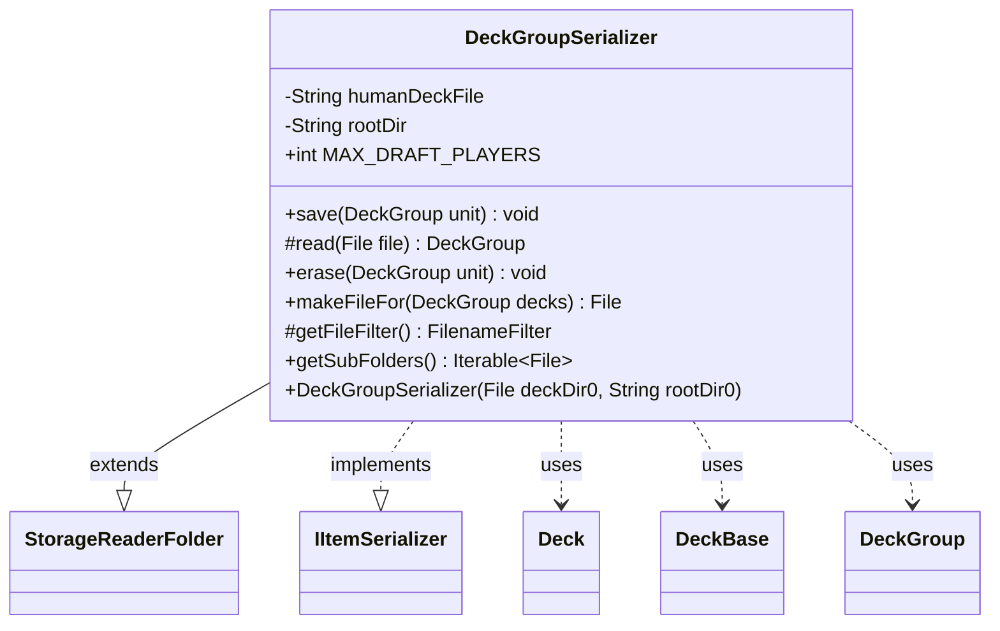

---
aliases:
  - DeckGroupSerializer
tags:
  - java/class
  - module/forge-core
  - pkg/forge/deck/io
fqn: forge.deck.io.DeckGroupSerializer
package: forge.deck.io
module: forge-core
kind: Class
---

# DeckGroupSerializer

**Package:** `forge.deck.io`   **Module:** `forge-core`   **Kind:** Class



## Relationships
**Extends:**
- [[forge.util.storage.StorageReaderFolder|StorageReaderFolder]]
**Implements:**
- [[forge.util.IItemSerializer|IItemSerializer]]
**Uses:**
- [[forge.deck.Deck|Deck]]
- [[forge.deck.DeckBase|DeckBase]]
- [[forge.deck.DeckGroup|DeckGroup]]


## Design Description

`DeckGroupSerializer` provides disk persistence for `DeckGroup` aggregates—a human deck bundled with its AI opponent decks for draft and sealed play. It extends `StorageReaderFolder<DeckGroup>`, inheriting folder-based scanning and name-keyed loading (configured with `DeckBase::getName`), and implements `IItemSerializer<DeckGroup>` to satisfy the save/read/erase persistence contract. Each group is stored as its own directory containing a fixed `human.dck` plus numbered `ai-1.dck`…`ai-N.dck` files, bounded by `MAX_DRAFT_PLAYERS`.

The design delegates per-deck file I/O to `DeckSerializer` rather than duplicating it, keeping this class focused on group layout. `getFileFilter` admits only visible, non-hidden folders that actually contain a `human.dck`, ensuring read scans recognize valid groups; `read` returns null when the human deck is missing. Because each self-contained group lives in one folder, `getSubFolders` returns an empty list to intentionally prevent recursive drilling.

## Source
`forge-core/src/main/java/forge/deck/io/DeckGroupSerializer.java`

```java
/*
 * Forge: Play Magic: the Gathering.
 * Copyright (C) 2011  Forge Team
 *
 * This program is free software: you can redistribute it and/or modify
 * it under the terms of the GNU General Public License as published by
 * the Free Software Foundation, either version 3 of the License, or
 * (at your option) any later version.
 * 
 * This program is distributed in the hope that it will be useful,
 * but WITHOUT ANY WARRANTY; without even the implied warranty of
 * MERCHANTABILITY or FITNESS FOR A PARTICULAR PURPOSE.  See the
 * GNU General Public License for more details.
 * 
 * You should have received a copy of the GNU General Public License
 * along with this program.  If not, see <http://www.gnu.org/licenses/>.
 */
package forge.deck.io;

import com.google.common.collect.ImmutableList;
import forge.deck.Deck;
import forge.deck.DeckBase;
import forge.deck.DeckGroup;
import forge.util.IItemSerializer;
import forge.util.storage.StorageReaderFolder;
import org.apache.commons.lang3.StringUtils;

import java.io.File;
import java.io.FilenameFilter;
import java.util.List;

/**
 * TODO: Write javadoc for this type.
 * 
 */
public class DeckGroupSerializer extends StorageReaderFolder<DeckGroup> implements IItemSerializer<DeckGroup> {
    private static final String humanDeckFile = "human.dck";

    private final String rootDir;

    /**
     * Instantiates a new deck group serializer.
     *
     * @param deckDir0 the deck dir0
     */
    public DeckGroupSerializer(final File deckDir0, String rootDir0) {
        super(deckDir0, DeckBase::getName);
        rootDir = rootDir0;
    }

    /** The Constant MAX_DRAFT_PLAYERS. */
    public static final int MAX_DRAFT_PLAYERS = 8;

    /**
     * Write draft Decks.
     *
     * @param unit the unit
     */
    @Override
    public void save(final DeckGroup unit) {
        final File f = makeFileFor(unit);
        f.mkdir();
        DeckSerializer.writeDeck(unit.getHumanDeck(), new File(f, humanDeckFile));
        final List<Deck> aiDecks = unit.getAiDecks();
        for (int i = 1; i <= aiDecks.size(); i++) {
            DeckSerializer.writeDeck(aiDecks.get(i - 1), new File(f, "ai-" + i + ".dck"));
        }
    }

    /* (non-Javadoc)
     * @see forge.util.StorageReaderFolder#read(java.io.File)
     */
    @Override
    protected final DeckGroup read(final File file) {
        final Deck humanDeck = DeckSerializer.fromFile(new File(file, humanDeckFile));
        if (humanDeck == null) { return null; }

        final DeckGroup d = new DeckGroup(humanDeck.getName());
        d.setDirectory(file.getParent().substring(rootDir.length()));
        d.setHumanDeck(humanDeck);
        for (int i = 1; i < DeckGroupSerializer.MAX_DRAFT_PLAYERS; i++) {
            final File theFile = new File(file, "ai-" + i + ".dck");
            if (!theFile.exists()) {
                break;
            }
            d.addAiDeck(DeckSerializer.fromFile(theFile));
        }
        return d;
    }

    /*
     * (non-Javadoc)
     * 
     * @see forge.deck.IDeckSerializer#erase(forge.item.CardCollectionBase,
     * java.io.File)
     */
    @Override
    public void erase(final DeckGroup unit) {
        final File dir = makeFileFor(unit);
        final File[] files = dir.listFiles();
        for (final File f : files) {
            f.delete();
        }
        dir.delete();
    }

    /**
     * Make file for.
     *
     * @param decks the decks
     * @return the file
     */
    public File makeFileFor(final DeckGroup decks) {
        return new File(directory, decks.getBestFileName());
    }

    /*
     * (non-Javadoc)
     * 
     * @see forge.deck.io.DeckSerializerBase#getFileFilter()
     */
    @Override
    protected FilenameFilter getFileFilter() {
        return (dir, name) -> {
            final File testSubject = new File(dir, name);
            final boolean isVisibleFolder = testSubject.isDirectory() && !testSubject.isHidden();
            final boolean hasGoodName = StringUtils.isNotEmpty(name) && !name.startsWith(".");
            final File fileHumanDeck = new File(testSubject, DeckGroupSerializer.humanDeckFile);
            return isVisibleFolder && hasGoodName && fileHumanDeck.exists();
        };
    }

    @Override
    public Iterable<File> getSubFolders() {
        // Sealed decks are kept in separate folders, no further drilling possible
        return ImmutableList.of();
    }

}
```

## Python
`forge/deck/io/DeckGroupSerializer.py`

```python
from forge.deck.Deck import Deck
from forge.deck.DeckBase import DeckBase
from forge.deck.DeckGroup import DeckGroup
from forge.util.IItemSerializer import IItemSerializer
from forge.util.storage.StorageReaderFolder import StorageReaderFolder
from forge.deck.io.DeckSerializer import DeckSerializer

import os


# TODO: Write javadoc for this type.
class DeckGroupSerializer(StorageReaderFolder, IItemSerializer):
    humanDeckFile = "human.dck"

    # The Constant MAX_DRAFT_PLAYERS.
    MAX_DRAFT_PLAYERS = 8

    def __init__(self, deckDir0, rootDir0):
        """
        Instantiates a new deck group serializer.

        :param deckDir0: the deck dir0
        """
        super().__init__(deckDir0, DeckBase.getName)
        self.rootDir = rootDir0

    def save(self, unit):
        """
        Write draft Decks.

        :param unit: the unit
        """
        f = self.makeFileFor(unit)
        os.mkdir(f)
        DeckSerializer.writeDeck(unit.getHumanDeck(), os.path.join(f, DeckGroupSerializer.humanDeckFile))
        aiDecks = unit.getAiDecks()
        for i in range(1, len(aiDecks) + 1):
            DeckSerializer.writeDeck(aiDecks[i - 1], os.path.join(f, "ai-" + str(i) + ".dck"))

    def read(self, file):
        humanDeck = DeckSerializer.fromFile(os.path.join(file, DeckGroupSerializer.humanDeckFile))
        if humanDeck is None:
            return None

        d = DeckGroup(humanDeck.getName())
        d.setDirectory(os.path.dirname(file)[len(self.rootDir):])
        d.setHumanDeck(humanDeck)
        for i in range(1, DeckGroupSerializer.MAX_DRAFT_PLAYERS):
            theFile = os.path.join(file, "ai-" + str(i) + ".dck")
            if not os.path.exists(theFile):
                break
            d.addAiDeck(DeckSerializer.fromFile(theFile))
        return d

    def erase(self, unit):
        dir = self.makeFileFor(unit)
        files = os.listdir(dir)
        for f in files:
            os.remove(os.path.join(dir, f))
        os.rmdir(dir)

    def makeFileFor(self, decks):
        """
        Make file for.

        :param decks: the decks
        :return: the file
        """
        return os.path.join(self.directory, decks.getBestFileName())

    def getFileFilter(self):
        def _filter(dir, name):
            testSubject = os.path.join(dir, name)
            isVisibleFolder = os.path.isdir(testSubject) and not _is_hidden(testSubject)
            hasGoodName = bool(name) and not name.startswith(".")
            fileHumanDeck = os.path.join(testSubject, DeckGroupSerializer.humanDeckFile)
            return isVisibleFolder and hasGoodName and os.path.exists(fileHumanDeck)
        return _filter

    def getSubFolders(self):
        # Sealed decks are kept in separate folders, no further drilling possible
        return []
```
