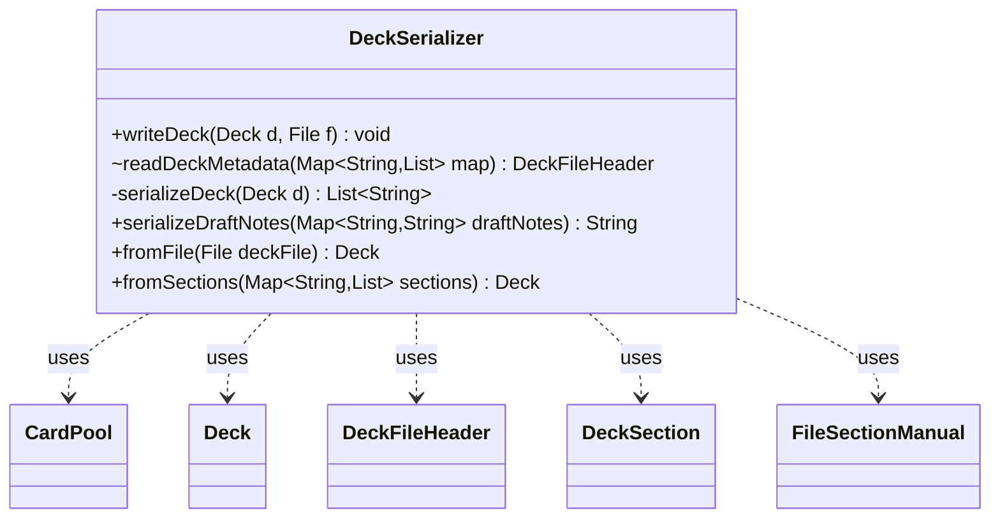

---
aliases:
  - DeckSerializer
tags:
  - java/class
  - module/forge-core
  - pkg/forge/deck/io
fqn: forge.deck.io.DeckSerializer
package: forge.deck.io
module: forge-core
kind: Class
---

# DeckSerializer

**Package:** `forge.deck.io` &nbsp; **Module:** `forge-core` &nbsp; **Kind:** Class



## Relationships
**Uses:**
- [[forge.deck.CardPool|CardPool]]
- [[forge.deck.Deck|Deck]]
- [[forge.deck.DeckSection|DeckSection]]
- [[forge.deck.io.DeckFileHeader|DeckFileHeader]]
- [[forge.util.FileSectionManual|FileSectionManual]]


## Design Description

`DeckSerializer` is a stateless utility class that handles persistence of `Deck` objects to and from Forge's text-based deck file format. It centralizes both directions of the conversion: `writeDeck`/`serializeDeck` emit a deck as a list of bracketed sections—a `[metadata]` header followed by one section per non-empty `DeckSection`/`CardPool` pair—while `fromFile`/`fromSections` parse that layout back into a `Deck`.

Implemented entirely with static methods and no instance state, it forms a focused boundary between the in-memory `Deck` model and on-disk storage, delegating low-level I/O and tokenizing to `FileUtil`, `FileSection`, and `TextUtil`. It collaborates with `DeckFileHeader` to read and write deck metadata (name, comment, tags, AI hints, draft notes, key cards), and uses `FileSectionManual` as a fallback to reconstruct a header from a legacy `general` layout. Notably, card sections are restored lazily via `setDeferredSections`, deferring the cost of materializing each `CardPool` until it is actually needed.

## Source
`forge-core/src/main/java/forge/deck/io/DeckSerializer.java`

```java
package forge.deck.io;

import forge.deck.CardPool;
import forge.deck.Deck;
import forge.deck.DeckSection;
import forge.util.FileSection;
import forge.util.FileSectionManual;
import forge.util.FileUtil;
import forge.util.TextUtil;
import org.apache.commons.lang3.StringUtils;

import java.io.File;
import java.util.ArrayList;
import java.util.List;
import java.util.Map;
import java.util.Map.Entry;

public class DeckSerializer {

    public static void writeDeck(final Deck d, final File f) {
        FileUtil.writeFile(f, serializeDeck(d));
    }

    static DeckFileHeader readDeckMetadata(final Map<String, List<String>> map) {
        if (map == null) {
            return null;
        }
        final List<String> metadata = map.get("metadata");
        if (metadata != null) {
            return new DeckFileHeader(FileSection.parse(metadata, FileSection.EQUALS_KV_SEPARATOR));
        }
        final List<String> general = map.get("general");
        if (general != null) {
            final FileSectionManual fs = new FileSectionManual();
            fs.put(DeckFileHeader.NAME, StringUtils.join(map.get(""), " "));
            fs.put(DeckFileHeader.DECK_TYPE, StringUtils.join(general, " "));
            return new DeckFileHeader(fs);
        }

        return null;
    }

    private static List<String> serializeDeck(Deck d) {
        final List<String> out = new ArrayList<>();
        out.add(TextUtil.enclosedBracket("metadata"));
    
        out.add(TextUtil.concatNoSpace(DeckFileHeader.NAME,"=", d.getName().replaceAll("\n", "")));
        // these are optional
        if (d.getComment() != null) {
            out.add(TextUtil.concatNoSpace(DeckFileHeader.COMMENT,"=", d.getComment().replaceAll("\n", "")));
        }
        if (!d.getTags().isEmpty()) {
            out.add(TextUtil.concatNoSpace(DeckFileHeader.TAGS,"=", StringUtils.join(d.getTags(), DeckFileHeader.TAGS_SEPARATOR)));
        }
        if (!d.getAiHints().isEmpty()) {
            out.add(TextUtil.concatNoSpace(DeckFileHeader.AI_HINTS, "=", StringUtils.join(d.getAiHints(), " | ")));
        }
        if (!d.getDraftNotes().isEmpty()) {
            String sb = serializeDraftNotes(d.getDraftNotes());
            out.add(TextUtil.concatNoSpace(DeckFileHeader.DRAFT_NOTES, "=", sb));
        }
        if (!d.getKeyCards().isEmpty()) {
            out.add(TextUtil.concatNoSpace(DeckFileHeader.KEY_CARDS, "=", StringUtils.join(d.getKeyCards(), ";")));
        }

        for (Entry<DeckSection, CardPool> s : d) {
            if(s.getValue().isEmpty())
                continue;
            out.add(TextUtil.enclosedBracket(s.getKey().toString()));
            out.add(s.getValue().toCardList(System.lineSeparator()));
        }
        return out;
    }

    public static String serializeDraftNotes(final Map<String, String> draftNotes) {
        StringBuilder sb = new StringBuilder();
        for (String key : draftNotes.keySet()) {
            if (sb.length() > 0) {
                sb.append(" | ");
            }

            sb.append(key).append(":").append(draftNotes.get(key));
        }
        return sb.toString();
    }

    public static Deck fromFile(final File deckFile) {
        return fromSections(FileSection.parseSections(FileUtil.readFile(deckFile)));
    }

    public static Deck fromSections(final Map<String, List<String>> sections) {
        if (sections == null || sections.isEmpty()) {
            return null;
        }
    
        final DeckFileHeader dh = readDeckMetadata(sections);
        if (dh == null) {
            return null;
        }

        Deck d = new Deck(dh.getName());
        d.setComment(dh.getComment());
        d.setAiHints(dh.getAiHints());
        d.getTags().addAll(dh.getTags());
        d.setDraftNotes(dh.getDraftNotes());
        for (String keyCard : dh.getKeyCards()) {
            d.addKeyCard(keyCard);
        }
        d.setDeferredSections(sections);
        return d;
    }
}
```
