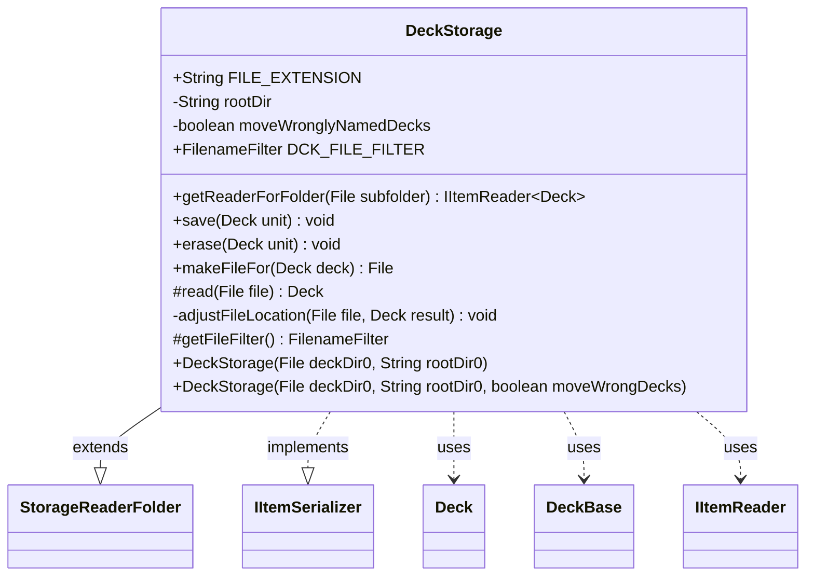

---
aliases:
  - DeckStorage
tags:
  - java/class
  - module/forge-core
  - pkg/forge/deck/io
fqn: forge.deck.io.DeckStorage
package: forge.deck.io
module: forge-core
kind: Class
---

# DeckStorage

**Package:** `forge.deck.io` &nbsp; **Module:** `forge-core` &nbsp; **Kind:** Class



## Relationships
**Extends:**
- [[forge.util.storage.StorageReaderFolder|StorageReaderFolder]]
**Implements:**
- [[forge.util.IItemSerializer|IItemSerializer]]
**Uses:**
- [[forge.deck.Deck|Deck]]
- [[forge.deck.DeckBase|DeckBase]]
- [[forge.util.IItemReader|IItemReader]]


## Design Description

DeckStorage is the persistence gateway for `Deck` objects in Forge's `.dck` file format, mediating between in-memory decks and their on-disk representation within a folder tree. Extending `StorageReaderFolder<Deck>` gives it folder-based reading and name-keyed indexing (via the `DeckBase::getName` extractor passed to the superclass), while implementing `IItemSerializer<Deck>` supplies the write side—`save`, `erase`, and `makeFileFor`—so one type acts as both reader and writer. It delegates the actual `.dck` parsing and emission to `DeckSerializer`, staying focused on file location and lifecycle.

Notable design intent: `getReaderForFolder` recursively returns a new `DeckStorage` per child subfolder (guarding against non-child folders) to support nested deck collections, and the optional `moveWronglyNamedDecks` flag lets the reader self-heal by renaming or deleting files whose names diverge from their canonical best-file-name. `rootDir` is used to derive each deck's relative directory.

## Source
`forge-core/src/main/java/forge/deck/io/DeckStorage.java`

```java
/*
 * Forge: Play Magic: the Gathering.
 * Copyright (C) 2011  Forge Team
 *
 * This program is free software: you can redistribute it and/or modify
 * it under the terms of the GNU General Public License as published by
 * the Free Software Foundation, either version 3 of the License, or
 * (at your option) any later version.
 * 
 * This program is distributed in the hope that it will be useful,
 * but WITHOUT ANY WARRANTY; without even the implied warranty of
 * MERCHANTABILITY or FITNESS FOR A PARTICULAR PURPOSE.  See the
 * GNU General Public License for more details.
 * 
 * You should have received a copy of the GNU General Public License
 * along with this program.  If not, see <http://www.gnu.org/licenses/>.
 */
package forge.deck.io;

import forge.deck.Deck;
import forge.deck.DeckBase;
import forge.util.FileSection;
import forge.util.FileUtil;
import forge.util.IItemReader;
import forge.util.IItemSerializer;
import forge.util.storage.StorageReaderFolder;

import java.io.File;
import java.io.FilenameFilter;
import java.util.List;
import java.util.Map;

/**
 * This class knows how to make a file out of a deck object and vice versa.
 */
public class DeckStorage extends StorageReaderFolder<Deck> implements IItemSerializer<Deck> {
    public static final String FILE_EXTENSION = ".dck";

    private final String rootDir;
    private final boolean moveWronglyNamedDecks;

    /** Constant <code>DCKFileFilter</code>. */
    public static final FilenameFilter DCK_FILE_FILTER = (dir, name) -> name.endsWith(FILE_EXTENSION);

    public DeckStorage(final File deckDir0, final String rootDir0) {
        this(deckDir0, rootDir0, false);
    }

    public DeckStorage(final File deckDir0, final String rootDir0, boolean moveWrongDecks) {
        super(deckDir0, DeckBase::getName);
        rootDir = rootDir0;
        moveWronglyNamedDecks = moveWrongDecks;
    }

    /* (non-Javadoc)
     * @see forge.util.storage.StorageReaderBase#getReaderForFolder(java.io.File)
     */
    @Override
    public IItemReader<Deck> getReaderForFolder(File subfolder) {
        if ( !subfolder.getParentFile().equals(directory) )
            throw new UnsupportedOperationException("Only child folders of " + directory + " may be processed");
        return new DeckStorage(subfolder, rootDir, false);
    }

    @Override
    public void save(final Deck unit) {
        DeckSerializer.writeDeck(unit, this.makeFileFor(unit));
    }

    @Override
    public void erase(final Deck unit) {
        this.makeFileFor(unit).delete();
    }

    public File makeFileFor(final Deck deck) {
        return new File(this.directory, deck.getBestFileName() + FILE_EXTENSION);
    }

    @Override
    protected Deck read(final File file) {
        final Map<String, List<String>> sections = FileSection.parseSections(FileUtil.readFile(file));
        Deck result = DeckSerializer.fromSections(sections);

        if (moveWronglyNamedDecks) {
            adjustFileLocation(file, result);
        }

        if (result != null) {
            result.setDirectory(file.getParent().substring(rootDir.length()));
        }
        return result;
    }

    private static void adjustFileLocation(final File file, final Deck result) {
        if (result == null) {
            file.delete();
        } else {
            String destFilename = result.getBestFileName() + FILE_EXTENSION;
            if (!file.getName().equals(destFilename)) {
                file.renameTo(new File(file.getParentFile().getParentFile(), destFilename));
            }
        }
    }

    @Override
    protected FilenameFilter getFileFilter() {
        return DCK_FILE_FILTER;
    }
}
```
