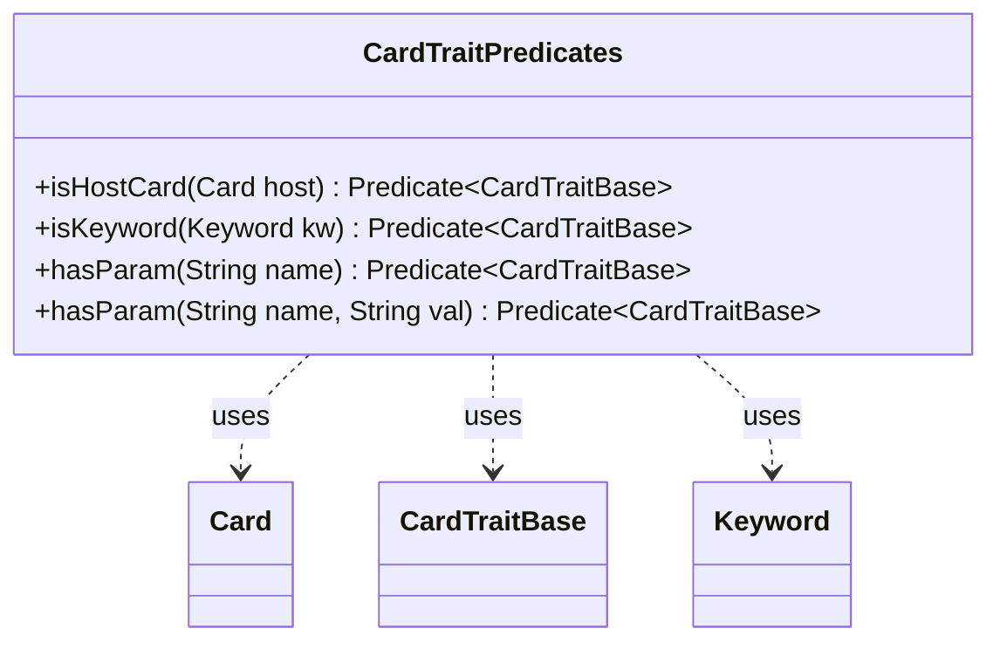

---
aliases:
  - CardTraitPredicates
tags:
  - java/class
  - module/forge-game
  - pkg/forge/game
fqn: forge.game.CardTraitPredicates
package: forge.game
module: forge-game
kind: Class
---

# CardTraitPredicates

**Package:** `forge.game`   **Module:** `forge-game`   **Kind:** Class



## Relationships
**Uses:**
- [[forge.game.CardTraitBase|CardTraitBase]]
- [[forge.game.card.Card|Card]]
- [[forge.game.keyword.Keyword|Keyword]]

## Design Description

CardTraitPredicates is a stateless utility class that supplies factory methods producing reusable `Predicate<CardTraitBase>` instances for filtering card traits. Each method—`isHostCard`, `isKeyword`, and the overloaded `hasParam`—captures its criteria in a closure and returns a predicate that tests a given CardTraitBase against that criterion, whether matching the owning Card, checking for a Keyword, or verifying a named parameter and optional value.

By collaborating with Card, Keyword, and CardTraitBase purely through these lambda predicates, the class centralizes common trait-matching logic for use with Java Stream and Collection filtering. The design intent is clear: all methods are static and final with no instantiable state, treating the class as a namespace of composable predicate builders that keep trait-selection criteria consistent and declarative across the game engine.

## Source
`forge-game/src/main/java/forge/game/CardTraitPredicates.java`

```java
package forge.game;

import forge.game.card.Card;
import forge.game.keyword.Keyword;

import java.util.function.Predicate;

public class CardTraitPredicates {

    public static final Predicate<CardTraitBase> isHostCard(final Card host) {
        return sa -> host.equals(sa.getHostCard());
    }

    public static final Predicate<CardTraitBase> isKeyword(final Keyword kw) {
        return sa -> sa.isKeyword(kw);
    }

    public static final Predicate<CardTraitBase> hasParam(final String name) {
        return sa -> sa.hasParam(name);
    }

    public static final Predicate<CardTraitBase> hasParam(final String name, final String val) {
        return sa -> {
            if (!sa.hasParam(name)) {
                return false;
            }
            return val.equals(sa.getParam(name));
        };
    }
}
```

## Python
`forge/game/CardTraitPredicates.py`

```python
from forge.game.CardTraitBase import CardTraitBase
from forge.game.card.Card import Card
from forge.game.keyword.Keyword import Keyword

from typing import Callable


class CardTraitPredicates:

    @staticmethod
    def isHostCard(host: Card) -> Callable[[CardTraitBase], bool]:
        return lambda sa: host == sa.getHostCard()

    @staticmethod
    def isKeyword(kw: Keyword) -> Callable[[CardTraitBase], bool]:
        return lambda sa: sa.isKeyword(kw)

    @staticmethod
    def hasParam(name: str, val: str = None) -> Callable[[CardTraitBase], bool]:
        if val is None:
            return lambda sa: sa.hasParam(name)

        def predicate(sa: CardTraitBase) -> bool:
            if not sa.hasParam(name):
                return False
            return val == sa.getParam(name)

        return predicate
```
