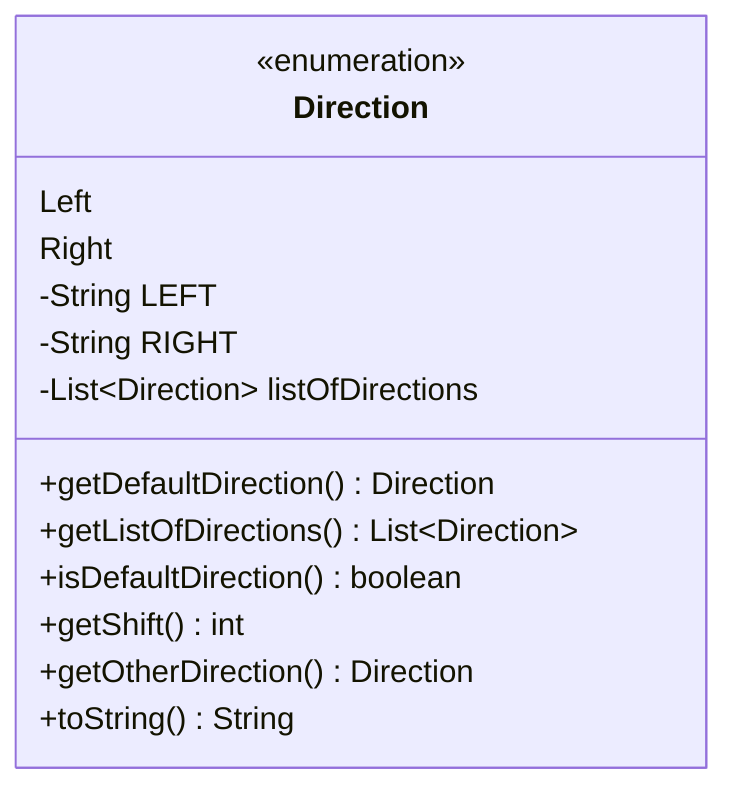

---
aliases:
  - Direction
tags:
  - java/enum
  - module/forge-game
  - pkg/forge/game
fqn: forge.game.Direction
package: forge.game
module: forge-game
kind: Enum
---

# Direction

**Package:** `forge.game` &nbsp; **Module:** `forge-game` &nbsp; **Kind:** Enum



## Design Description

Represents one of two seating directions, Left or Right, used to model the shift of turn order around the table (for example, when a "play passes left/right" effect reverses or rotates player sequence). As a plain enum with no dependencies beyond `java.util.List`, it serves as a lightweight, self-contained value type that collaborating game logic consults to determine play order.

The design treats `Left` as the canonical default direction and derives everything else from it: `getShift()` maps the default to `+1` and the other to `-1`, while `getListOfDirections()` exposes an immutable, order-preserving `List<Direction>` built once at class load. Helper methods like `getOtherDirection()` and `isDefaultDirection()` keep the binary relationship explicit, and `toString()` returns stable display labels. The pervasive use of static finals and immutability signals intent that directions be treated as constant, shareable singletons.

## Source
`forge-game/src/main/java/forge/game/Direction.java`

```java
/*
 * Forge: Play Magic: the Gathering.
 * Copyright (C) 2011  Forge Team
 *
 * This program is free software: you can redistribute it and/or modify
 * it under the terms of the GNU General Public License as published by
 * the Free Software Foundation, either version 3 of the License, or
 * (at your option) any later version.
 * 
 * This program is distributed in the hope that it will be useful,
 * but WITHOUT ANY WARRANTY; without even the implied warranty of
 * MERCHANTABILITY or FITNESS FOR A PARTICULAR PURPOSE.  See the
 * GNU General Public License for more details.
 * 
 * You should have received a copy of the GNU General Public License
 * along with this program.  If not, see <http://www.gnu.org/licenses/>.
 */
package forge.game;

import java.util.List;

/**
 *  Represents a direction (left or right).
 */
public enum Direction {
	Left,
	Right;

	private static final String LEFT = "Left";
	private static final String RIGHT = "Right";
	/** Immutable list of all directions (in order, Left and Right). */
	private static final List<Direction> listOfDirections =
			List.of(getDefaultDirection(), getDefaultDirection().getOtherDirection());

	/** @return The default direction. */
	public static final Direction getDefaultDirection() { return Left; }

	/** @return Immutable list of all directions (in order, Left and Right). */
	public static List<Direction> getListOfDirections() { return listOfDirections; }

	/** @return True if and only if this is the default direction. */
	public boolean isDefaultDirection() {
		return this.equals(getDefaultDirection());
	}

	/**
	 * Get the index by which the turn order is shifted, given this Direction.
	 * @return 1 or -1.
	 */
	public int getShift() {
		if (this.isDefaultDirection()) {
			return 1;
		}
		return -1;
	}

	/**
	 * Give the other Direction.
	 * @return Right if this is Left, and vice versa.
	 */
	public Direction getOtherDirection() {
		switch (this) {
		case Left:
			return Direction.Right;
		case Right:
			return Direction.Left;
		}
		return null;
	}

	/**
	 * {@inheritDoc}
	 */
	public String toString() {
		switch (this) {
		case Left:
			return LEFT;
		case Right:
			return RIGHT;
		}
		return null;
	}
}
```

## Python
`forge/game/Direction.py`

```python
from enum import Enum
from typing import List


class Direction(Enum):
    Left = 1
    Right = 2

    LEFT = "Left"
    RIGHT = "Right"

    @staticmethod
    def getDefaultDirection() -> "Direction":
        """:return: The default direction."""
        return Direction.Left

    @staticmethod
    def getListOfDirections() -> List["Direction"]:
        """:return: Immutable list of all directions (in order, Left and Right)."""
        return Direction.listOfDirections

    def isDefaultDirection(self) -> bool:
        """:return: True if and only if this is the default direction."""
        return self == Direction.getDefaultDirection()

    def getShift(self) -> int:
        """
        Get the index by which the turn order is shifted, given this Direction.
        :return: 1 or -1.
        """
        if self.isDefaultDirection():
            return 1
        return -1

    def getOtherDirection(self) -> "Direction":
        """
        Give the other Direction.
        :return: Right if this is Left, and vice versa.
        """
        if self is Direction.Left:
            return Direction.Right
        elif self is Direction.Right:
            return Direction.Left
        return None

    def __str__(self) -> str:
        if self is Direction.Left:
            return Direction.LEFT.value
        elif self is Direction.Right:
            return Direction.RIGHT.value
        return None


Direction.listOfDirections = [
    Direction.getDefaultDirection(),
    Direction.getDefaultDirection().getOtherDirection(),
]
```
