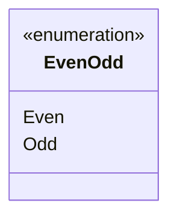

---
aliases:
  - EvenOdd
tags:
  - java/enum
  - module/forge-game
  - pkg/forge/game
fqn: forge.game.EvenOdd
package: forge.game
module: forge-game
kind: Enum
---

# EvenOdd

**Package:** `forge.game`   **Module:** `forge-game`   **Kind:** Enum



## Design Description

Forge's `EvenOdd` is a minimal two-constant enum (`Even`, `Odd`) in the `forge.game` package that provides a type-safe representation of numeric parity within the game engine. Rather than passing booleans or magic strings, collaborating game-rules code uses this enum to express parity-based conditions and choices—such as card effects that test or select values by even or odd. Its design intent is deliberately spare: it carries no fields, constructors, or behavior, serving purely as a closed, self-documenting domain vocabulary. As a standalone enumeration it implements no project interfaces and has no supertype beyond the implicit `java.lang.Enum`, leaving callers to attach parity semantics at the point of use.

## Source
`forge-game/src/main/java/forge/game/EvenOdd.java`

```java
package forge.game;

public enum EvenOdd {
    Even,
    Odd
}
```

## Python
`forge/game/EvenOdd.py`

```python
from enum import Enum


class EvenOdd(Enum):
    Even = "Even"
    Odd = "Odd"
```
