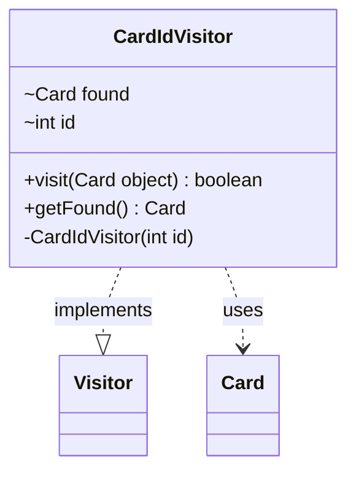

---
aliases:
  - CardIdVisitor
tags:
  - java/class
  - module/forge-game
  - pkg/forge/game
fqn: forge.game.Game.CardIdVisitor
package: forge.game
module: forge-game
kind: Class
---

# CardIdVisitor

**Package:** `forge.game`   **Module:** `forge-game`   **Kind:** Class



## Relationships
**Implements:**
- [[forge.util.Visitor|Visitor]]
**Uses:**
- [[forge.game.card.Card|Card]]

## Design Description

The CardIdVisitor is a private static helper that implements the `Visitor<Card>` interface to locate a single card by its numeric identifier. Constructed with a target id, it is designed to be driven across a collection of cards by an external traversal mechanism: each `visit` call compares the candidate card's id against the target, capturing the first match in its `found` field. Its boolean return implements an early-termination protocol, yielding `true` to continue the traversal only while no match has been found and `false` once the card is located, after which `getFound` exposes the result. The private constructor and tight scoping reflect its intent as an internal, single-use search utility within Game rather than a reusable component.

## Source
`forge-game/src/main/java/forge/game/Game.java` — declaration excerpt

```java
    private static class CardIdVisitor implements Visitor<Card> {
        Card found = null;
        int id;

        private CardIdVisitor(final int id) {
            this.id = id;
        }

        @Override
        public boolean visit(Card object) {
            if (this.id == object.getId()) {
                found = object;
            }
            return found == null;
        }

        public Card getFound() {
            return found;
        }
    }
```
