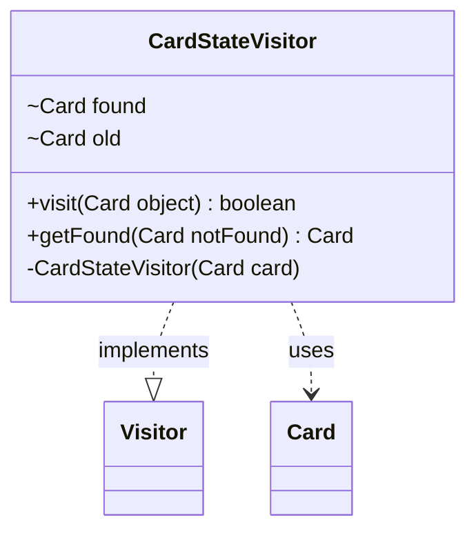

---
aliases:
  - CardStateVisitor
tags:
  - java/class
  - module/forge-game
  - pkg/forge/game
fqn: forge.game.Game.CardStateVisitor
package: forge.game
module: forge-game
kind: Class
---

# CardStateVisitor

**Package:** `forge.game`   **Module:** `forge-game`   **Kind:** Class



## Relationships
**Implements:**
- [[forge.util.Visitor|Visitor]]
**Uses:**
- [[forge.game.card.Card|Card]]

## Design Description

The CardStateVisitor is a private static helper that implements the `Visitor<Card>` interface to perform a linear search for a specific card within a traversable card collection. Constructed with a target card (stored in `old`), it inspects each visited `Card`, capturing a match in `found` and returning `false` to halt iteration once the target is located—an early-exit optimization that avoids scanning the remainder of the collection.

Its narrow scope as a nested class reflects its role as an internal implementation detail of `Game`, decoupling traversal mechanics from the collection structure via the generic Visitor pattern. The `getFound` accessor returns the located card or a caller-supplied fallback, giving callers a null-safe way to resolve the search result.

## Source
`forge-game/src/main/java/forge/game/Game.java` — declaration excerpt

```java
    private static class CardStateVisitor implements Visitor<Card> {
        Card found = null;
        Card old = null;

        private CardStateVisitor(final Card card) {
            this.old = card;
        }

        @Override
        public boolean visit(Card object) {
            if (object.equals(old)) {
                found = object;
            }
            return found == null;
        }

        public Card getFound(final Card notFound) {
            return found == null ? notFound : found;
        }
    }
```
