---
aliases:
  - Game
tags:
  - java/class
  - module/forge-game
  - pkg/forge/game
fqn: forge.game.Game
package: forge.game
module: forge-game
kind: Class
---

# Game

**Package:** `forge.game`   **Module:** `forge-game`   **Kind:** Class



```mermaid
classDiagram
    class Game {
        -TaggedLogger netLog
        -int maxId
        -int id
        -GameRules rules
        -PlayerCollection allPlayers
        -PlayerCollection ingamePlayers
        -PlayerCollection lostPlayers
        -List~Card~ activePlanes
        +Untap untap
        +Phase upkeep
        +Phase beginOfCombat
        +Phase endOfCombat
        +Phase endOfTurn
        +Phase cleanup
        +List~GameCommand~ sbaCheckedCommandList
        +MagicStack stack
        +CostPaymentStack costPaymentStack
        -PhaseHandler phaseHandler
        -StaticEffects staticEffects
        -TriggerHandler triggerHandler
        -ReplacementHandler replacementHandler
        -EventBus events
        -GameLog gameLog
        -Zone stackZone
        +int AI_TIMEOUT
        +boolean AI_CAN_USE_TIMEOUT
        +boolean EXPERIMENTAL_RESTORE_SNAPSHOT
        -GameSnapshot previousGameState
        -CardCollection lastStateBattlefield
        -CardCollection lastStateGraveyard
        -CardZoneTable untilHostLeavesPlayTriggerList
        -Table~CounterType,Player,List~ countersAddedThisTurn
        -Multimap~CounterType,Pair~ countersRemovedThisTurn
        -List~Card~ leftBattlefieldThisTurn
        -List~Card~ leftGraveyardThisTurn
        -FCollection~CardDamageHistory~ globalDamageHistory
        -IdentityHashMap~Pair,Pair~ damageThisTurnLKI
        -Map~Player,Card~ topLibsCast
        -Map~Card,Integer~ facedownWhileCasting
        -Player initiative
        -Player monarch
        -Player monarchBeginTurn
        -Player startingPlayer
        -Direction turnOrder
        -Boolean daytime
        -int numPiledGuessedSA
        -long timestamp
        +GameAction action
        -Match match
        -GameStage age
        -GameOutcome outcome
        -Game maingame
        -GameView view
        -Tracker tracker
        -GameEntityCache~Player,PlayerView~ playerCache
        -Table~Integer,Long,Card~ changeZoneLKIInfo
        -int cardIdCounter
        -int hiddenCardIdCounter
        -nextId() int
        +getId() int
        +getStartingPlayer() Player
        +setStartingPlayer(Player p) void
        +getMonarch() Player
        +setMonarch(Player p) void
        +getMonarchBeginTurn() Player
        +setMonarchBeginTurn(Player monarchBeginTurn) void
        +getHasInitiative() Player
        +setHasInitiative(Player p) void
        +getUntilHostLeavesPlayTriggerList() CardZoneTable
        +getLastStateBattlefield() CardCollectionView
        +getLastStateGraveyard() CardCollectionView
        +stashGameState() void
        +restoreGameState() boolean
        +copyLastState() void
        +copyLastState(ZoneType type) CardCollectionView
        +copyLastStateBattlefield() CardCollectionView
        +copyLastStateGraveyard() CardCollectionView
        +updateLastStateForCard(Card c) void
        +getPlayer(PlayerView playerView) Player
        +getPlayer(int id) Player
        +addPlayer(int id, Player player) void
        +addChangeZoneLKIInfo(Card lki) void
        +getChangeZoneLKIInfo(Card c) Card
        +clearChangeZoneLKIInfo() void
        +addLeftBattlefieldThisTurn(Card lki) void
        +addLeftGraveyardThisTurn(Card lki) void
        +getLeftBattlefieldThisTurn() List~Card~
        +getLeftGraveyardThisTurn() List~Card~
        +clearLeftBattlefieldThisTurn() void
        +clearLeftGraveyardThisTurn() void
        +getView() GameView
        +getTracker() Tracker
        +getPlayers() PlayerCollection
        +getLostPlayers() PlayerCollection
        +getPlayersInTurnOrder() PlayerCollection
        +getPlayersInTurnOrder(Player p) PlayerCollection
        +getRegisteredPlayers() PlayerCollection
        +getUntap() Untap
        +getUpkeep() Phase
        +getBeginOfCombat() Phase
        +getEndOfCombat() Phase
        +getEndOfTurn() Phase
        +getCleanup() Phase
        +addSBACheckedCommand(GameCommand c) void
        +runSBACheckedCommands() void
        +getStaticEffects() StaticEffects
        +getReplacementHandler() ReplacementHandler
        +getTriggerHandler() TriggerHandler
        +getPhaseHandler() PhaseHandler
        +updateTurnForView() void
        +updatePhaseForView() void
        +updatePlayerTurnForView() void
        +getStack() MagicStack
        +updateStackForView() void
        +getCombat() Combat
        +updateCombatForView() void
        +getGameLog() GameLog
        +getStackZone() Zone
        +getCardsPlayerCanActivateInStack() CardCollectionView
        +getTurnOrder() Direction
        +reverseTurnOrder() void
        +resetTurnOrder() void
        +getNextTimestamp() long
        +getTimestamp() long
        +dangerouslySetTimestamp(long timestamp) void
        +getOutcome() GameOutcome
        +getMaingame() Game
        +isGameOver() boolean
        +setGameOver(GameEndReason reason) void
        +getZoneOf(Card card) Zone
        +getCardsIn(ZoneType zone) CardCollectionView
        +getCardsIncludePhasingIn(ZoneType zone) CardCollectionView
        +getCardsIn(Iterable~ZoneType~ zones) CardCollectionView
        +getCardsInOwnedBy(Iterable~ZoneType~ zones, Player p) CardCollectionView
        +isCardExiled(Card c) boolean
        +isCardInPlay(String cardName) boolean
        +isCardInCommand(String cardName) boolean
        +getColoredCardsInPlay(String color) CardCollectionView
        +getCardState(Card card) Card
        +getCardState(Card card, Card notFound) Card
        +findByView(CardView view) Card
        +findById(int id) Card
        +forEachCardInGame(Visitor~Card~ visitor) void
        +forEachCardInGame(Visitor~Card~ visitor, boolean withSideboard) void
        +getCardsInGame() CardCollectionView
        +getAction() GameAction
        +getMatch() Match
        +getNextPlayerAfter(Player playerTurn) Player
        +getNextPlayerAfter(Player playerTurn, Direction turnOrder) Player
        +getPosition(Player player, Player startingPlayer) int
        +onPlayerLost(Player p) void
        +fireEvent(Event event) void
        +subscribeToEvents(Object subscriber) void
        +getRules() GameRules
        +getActivePlanes() List~Card~
        +setActivePlanes(List~Card~ activePlane0) void
        +getAge() GameStage
        +setAge(GameStage value) void
        +nextCardId() int
        +nextHiddenCardId() int
        +chooseCardsForAnte(boolean matchRarity, boolean includeBasicLands) Multimap~Player,Card~
        -chooseRandomCardsForAnte(Player player, Multimap~Player,Card~ anteed, boolean includeBasicLands) void
        -getValidRarities(Iterable~Card~ cards) Set~CardRarity~
        +clearCaches() void
        +isGraveyardOrdered(Player p) boolean
        +getControlVote() Player
        +incPiledGuessedSA() void
        +getNumPiledGuessedSA() int
        +resetNumPiledGuessedSA() void
        +onCleanupPhase() void
        +addCounterAddedThisTurn(Player putter, CounterType cType, Card card, Integer value) void
        +getCounterAddedThisTurn(CounterType cType, String validPlayer, String validCard, Card source, Player sourceController, CardTraitBase ctb) int
        +getCounterAddedThisTurn(CounterType cType, Card card) int
        +clearCounterAddedThisTurn() void
        +addCounterRemovedThisTurn(CounterType cType, Card card, Integer value) void
        +addCounterRemovedThisTurn(CounterType cType, Player player, Integer value) void
        +getCounterRemovedThisTurn(CounterType cType, String valid, Card source, Player sourceController, CardTraitBase ctb) int
        +clearCounterRemovedThisTurn() void
        +getDamageDoneThisTurn(Boolean isCombat, boolean anyIsEnough, String validSourceCard, String validTargetEntity, Card source, Player sourceController, CardTraitBase ctb) List~Integer~
        +getSingleMaxDamageDoneThisTurn() int
        +addGlobalDamageHistory(CardDamageHistory cdh, Pair~Integer,Boolean~ dmg, Card source, GameEntity target) void
        +clearGlobalDamageHistory() void
        +getDamageLKI(Pair~Integer,Boolean~ dmg) Pair~Card,GameEntity~
        +getTopLibForPlayer(Player P) Card
        +setTopLibsCast() void
        +clearTopLibsCast(SpellAbility sa) void
        +addFacedownWhileCasting(Card c, int numDrawn) void
        +isDay() boolean
        +isNight() boolean
        +isNeitherDayNorNight() boolean
        +getDayTime() Boolean
        +setDayTime(Boolean value) void
        +isVoid() boolean
        +getAITimeout() int
        +canUseTimeout() boolean
        +Game(Iterable~RegisteredPlayer~ players0, GameRules rules0, Match match0)
        +Game(Iterable~RegisteredPlayer~ players0, GameRules rules0, Match match0, Game maingame0, int startingLife)
    }
    Game ..> AbilityKey : uses
    Game ..> Card : uses
    Game ..> CardCollection : uses
    Game ..> CardCollectionView : uses
    Game ..> CardDamageHistory : uses
    Game ..> CardIdVisitor : uses
    Game ..> CardRarity : uses
    Game ..> CardStateVisitor : uses
    Game ..> CardTraitBase : uses
    Game ..> CardView : uses
    Game ..> CardZoneTable : uses
    Game ..> Combat : uses
    Game ..> CostPaymentStack : uses
    Game ..> CounterType : uses
    Game ..> Direction : uses
    Game ..> Event : uses
    Game ..> FCollection : uses
    Game ..> GameAction : uses
    Game ..> GameCommand : uses
    Game ..> GameEndReason : uses
    Game ..> GameEntity : uses
    Game ..> GameEntityCache : uses
    Game ..> GameEventAddLog : uses
    Game ..> GameEventDayTimeChanged : uses
    Game ..> GameEventGameOutcome : uses
    Game ..> GameLog : uses
    Game ..> GameOutcome : uses
    Game ..> GameRules : uses
    Game ..> GameSnapshot : uses
    Game ..> GameStage : uses
    Game ..> GameView : uses
    Game ..> IGameEntitiesFactory : uses
    Game ..> MagicStack : uses
    Game ..> Match : uses
    Game ..> Phase : uses
    Game ..> PhaseHandler : uses
    Game ..> Player : uses
    Game ..> PlayerCollection : uses
    Game ..> PlayerView : uses
    Game ..> PlayerZoneBattlefield : uses
    Game ..> RegisteredPlayer : uses
    Game ..> ReplacementHandler : uses
    Game ..> SpellAbility : uses
    Game ..> SpellAbilityStackInstance : uses
    Game ..> StaticEffects : uses
    Game ..> Tracker : uses
    Game ..> TriggerHandler : uses
    Game ..> Untap : uses
    Game ..> Visitor : uses
    Game ..> Zone : uses
    Game ..> ZoneType : uses
```

## Relationships
**Uses:**
- [[forge.GameCommand|GameCommand]]
- [[forge.card.CardRarity|CardRarity]]
- [[forge.game.CardTraitBase|CardTraitBase]]
- [[forge.game.Direction|Direction]]
- [[forge.game.Game.CardIdVisitor|CardIdVisitor]]
- [[forge.game.Game.CardStateVisitor|CardStateVisitor]]
- [[forge.game.GameAction|GameAction]]
- [[forge.game.GameEndReason|GameEndReason]]
- [[forge.game.GameEntity|GameEntity]]
- [[forge.game.GameEntityCache|GameEntityCache]]
- [[forge.game.GameLog|GameLog]]
- [[forge.game.GameOutcome|GameOutcome]]
- [[forge.game.GameRules|GameRules]]
- [[forge.game.GameSnapshot|GameSnapshot]]
- [[forge.game.GameStage|GameStage]]
- [[forge.game.GameView|GameView]]
- [[forge.game.Match|Match]]
- [[forge.game.StaticEffects|StaticEffects]]
- [[forge.game.ability.AbilityKey|AbilityKey]]
- [[forge.game.card.Card|Card]]
- [[forge.game.card.CardCollection|CardCollection]]
- [[forge.game.card.CardCollectionView|CardCollectionView]]
- [[forge.game.card.CardDamageHistory|CardDamageHistory]]
- [[forge.game.card.CardView|CardView]]
- [[forge.game.card.CardZoneTable|CardZoneTable]]
- [[forge.game.card.CounterType|CounterType]]
- [[forge.game.combat.Combat|Combat]]
- [[forge.game.event.Event|Event]]
- [[forge.game.event.GameEventAddLog|GameEventAddLog]]
- [[forge.game.event.GameEventDayTimeChanged|GameEventDayTimeChanged]]
- [[forge.game.event.GameEventGameOutcome|GameEventGameOutcome]]
- [[forge.game.phase.Phase|Phase]]
- [[forge.game.phase.PhaseHandler|PhaseHandler]]
- [[forge.game.phase.Untap|Untap]]
- [[forge.game.player.IGameEntitiesFactory|IGameEntitiesFactory]]
- [[forge.game.player.Player|Player]]
- [[forge.game.player.PlayerCollection|PlayerCollection]]
- [[forge.game.player.PlayerView|PlayerView]]
- [[forge.game.player.RegisteredPlayer|RegisteredPlayer]]
- [[forge.game.replacement.ReplacementHandler|ReplacementHandler]]
- [[forge.game.spellability.SpellAbility|SpellAbility]]
- [[forge.game.spellability.SpellAbilityStackInstance|SpellAbilityStackInstance]]
- [[forge.game.trigger.TriggerHandler|TriggerHandler]]
- [[forge.game.zone.CostPaymentStack|CostPaymentStack]]
- [[forge.game.zone.MagicStack|MagicStack]]
- [[forge.game.zone.PlayerZoneBattlefield|PlayerZoneBattlefield]]
- [[forge.game.zone.Zone|Zone]]
- [[forge.game.zone.ZoneType|ZoneType]]
- [[forge.trackable.Tracker|Tracker]]
- [[forge.util.Visitor|Visitor]]
- [[forge.util.collect.FCollection|FCollection]]

## Design Description

Represents the complete mutable state of a single Magic: the Gathering game, a fresh instance being created for each game played within a [[forge.game.Match|Match]]. As the central aggregate root of the `forge-game` module, it owns and wires together the game's major subsystems—the [[forge.game.zone.MagicStack|MagicStack]], [[forge.game.phase.PhaseHandler|PhaseHandler]], [[forge.game.trigger.TriggerHandler|TriggerHandler]], [[forge.game.replacement.ReplacementHandler|ReplacementHandler]], and [[forge.game.StaticEffects|StaticEffects]]—and tracks the [[forge.game.player.Player|Player]] collections, turn order, zones, and per-turn histories (counters, damage, cards that left a zone) that rules logic queries.

It centralizes cross-cutting concerns: card lookup across all zones via lightweight `Visitor` traversals that avoid temporary allocations, last-known-information snapshots, an [[forge.game.GameView|GameView]]/[[forge.trackable.Tracker|Tracker]] facade decoupling presentation from state, and a Guava `EventBus` for decoupled event notification. Notable design intent includes immutable `final` subsystem references established in the constructor, idempotent `synchronized` game-over handling, and detailed rules-citation-driven cleanup when a player leaves.

## Source
`forge-game/src/main/java/forge/game/Game.java`

```java
/*
 * Forge: Play Magic: the Gathering.
 * Copyright (C) 2011  Forge Team
 *
 * This program is free software: you can redistribute it and/or modify
 * it under the terms of the GNU General Public License as published by
 * the Free Software Foundation, either version 3 of the License, or
 * (at your option) any later version.
 *
 * This program is distributed in the hope that it will be useful,
 * but WITHOUT ANY WARRANTY; without even the implied warranty of
 * MERCHANTABILITY or FITNESS FOR A PARTICULAR PURPOSE.  See the
 * GNU General Public License for more details.
 *
 * You should have received a copy of the GNU General Public License
 * along with this program.  If not, see <http://www.gnu.org/licenses/>.
 */
package forge.game;

import com.google.common.collect.ArrayListMultimap;
import com.google.common.collect.HashBasedTable;
import com.google.common.collect.Lists;
import com.google.common.collect.Maps;
import com.google.common.collect.Multimap;
import com.google.common.collect.Sets;
import com.google.common.collect.Table;
import com.google.common.eventbus.EventBus;
import forge.GameCommand;
import forge.card.CardRarity;
import forge.card.CardStateName;
import forge.game.ability.AbilityKey;
import forge.game.card.*;
import forge.game.combat.Combat;
import forge.game.event.Event;
import forge.game.event.GameEventDayTimeChanged;
import forge.game.event.GameEventAddLog;
import forge.game.event.GameEventGameOutcome;
import forge.game.phase.Phase;
import forge.game.phase.PhaseHandler;
import forge.game.phase.PhaseType;
import forge.game.phase.Untap;
import forge.game.player.*;
import forge.game.replacement.ReplacementHandler;
import forge.game.spellability.SpellAbility;
import forge.game.spellability.SpellAbilityStackInstance;
import forge.game.staticability.StaticAbilityCantChangeDayTime;
import forge.game.trigger.TriggerHandler;
import forge.game.trigger.TriggerType;
import forge.game.zone.*;
import forge.trackable.Tracker;
import forge.util.*;
import forge.util.collect.FCollection;
import org.apache.commons.lang3.tuple.Pair;
import org.tinylog.Logger;
import org.tinylog.TaggedLogger;

import java.util.*;
import java.util.function.Predicate;

/**
 * Represents the state of a <i>single game</i>, a new instance is created for each game.
 */
public class Game {

    private static final TaggedLogger netLog = Logger.tag("NETWORK");

    private static int maxId = 0;
    private static int nextId() { return ++maxId; }

    /** The ID. */
    private int id;
    private final GameRules rules;
    private final PlayerCollection allPlayers = new PlayerCollection();
    private final PlayerCollection ingamePlayers = new PlayerCollection();
    private final PlayerCollection lostPlayers = new PlayerCollection();

    private List<Card> activePlanes = null;

    public final Untap untap;
    public final Phase upkeep;
    public final Phase beginOfCombat;
    public final Phase endOfCombat;
    public final Phase endOfTurn;
    public final Phase cleanup;

    // to execute commands for "current" phase each time state based action is checked
    public final List<GameCommand> sbaCheckedCommandList;
    public final MagicStack stack;
    public final CostPaymentStack costPaymentStack = new CostPaymentStack();
    private final PhaseHandler phaseHandler;
    private final StaticEffects staticEffects = new StaticEffects();
    private final TriggerHandler triggerHandler = new TriggerHandler(this);
    private final ReplacementHandler replacementHandler = new ReplacementHandler(this);
    private final EventBus events = new EventBus("game events");
    private final GameLog gameLog = new GameLog();

    private final Zone stackZone = new Zone(ZoneType.Stack, this);
    public int AI_TIMEOUT = 5;
    public boolean AI_CAN_USE_TIMEOUT = true;

    public boolean EXPERIMENTAL_RESTORE_SNAPSHOT = false;
    // While this is false here, its really set by the Match/Preferences

    // If this merges with LKI In the future, it will need to change forms
    private GameSnapshot previousGameState = null;
    private CardCollection lastStateBattlefield = new CardCollection();
    private CardCollection lastStateGraveyard = new CardCollection();

    private CardZoneTable untilHostLeavesPlayTriggerList = new CardZoneTable();

    private Table<CounterType, Player, List<Pair<Card, Integer>>> countersAddedThisTurn = HashBasedTable.create();
    private Multimap<CounterType, Pair<GameEntity, Integer>> countersRemovedThisTurn = ArrayListMultimap.create();

    private List<Card> leftBattlefieldThisTurn = Lists.newArrayList();
    private List<Card> leftGraveyardThisTurn = Lists.newArrayList();

    private FCollection<CardDamageHistory> globalDamageHistory = new FCollection<>();
    private IdentityHashMap<Pair<Integer, Boolean>, Pair<Card, GameEntity>> damageThisTurnLKI = new IdentityHashMap<>();

    private Map<Player, Card> topLibsCast = Maps.newHashMap();
    private Map<Card, Integer> facedownWhileCasting = Maps.newHashMap();

    private Player initiative;
    private Player monarch;
    private Player monarchBeginTurn;
    private Player startingPlayer;

    private Direction turnOrder = Direction.getDefaultDirection();

    private Boolean daytime = null;

    private int numPiledGuessedSA;

    private long timestamp = 0;
    public final GameAction action;
    private final Match match;
    private GameStage age = GameStage.BeforeMulligan;
    private GameOutcome outcome;
    private final Game maingame;

    private final GameView view;
    private final Tracker tracker = new Tracker();

    /**
     * Gets the id.
     *
     * @return the id
     */
    public int getId() {
        return this.id;
    }

    public Player getStartingPlayer() {
        return startingPlayer;
    }
    public void setStartingPlayer(final Player p) {
        startingPlayer = p;
    }

    public Player getMonarch() {
        return monarch;
    }
    public void setMonarch(final Player p) {
        monarch = p;
    }

    public Player getMonarchBeginTurn() {
        return monarchBeginTurn;
    }
    public void setMonarchBeginTurn(Player monarchBeginTurn) {
        this.monarchBeginTurn = monarchBeginTurn;
    }

    public Player getHasInitiative() {
        return initiative;
    }
    public void setHasInitiative(final Player p) {
        initiative = p;
    }

    public CardZoneTable getUntilHostLeavesPlayTriggerList() {
        return untilHostLeavesPlayTriggerList;
    }

    public CardCollectionView getLastStateBattlefield() {
        return lastStateBattlefield;
    }
    public CardCollectionView getLastStateGraveyard() {
        return lastStateGraveyard;
    }

    public void stashGameState() {
        // Take a snapshot of the current state to restore to previous state
        if (EXPERIMENTAL_RESTORE_SNAPSHOT) {
            previousGameState = new GameSnapshot(this);
            previousGameState.makeCopy();
        }
    }

    public boolean restoreGameState() {
        // Restore game state snapshot
        if (previousGameState == null || !EXPERIMENTAL_RESTORE_SNAPSHOT) {
            return false;
        }

        previousGameState.restoreGameState(this);
        return true;
    }

    public void copyLastState() {
        lastStateBattlefield.clear();
        lastStateGraveyard.clear();
        Map<Integer, Card> cachedMap = Maps.newHashMap();
        for (final Player p : getPlayers()) {
            lastStateBattlefield.addAll(p.getZone(ZoneType.Battlefield).getLKICopy(cachedMap));
            lastStateGraveyard.addAll(p.getZone(ZoneType.Graveyard).getLKICopy(cachedMap));
        }
    }

    public CardCollectionView copyLastState(ZoneType type) {
        CardCollection result = new CardCollection();
        Map<Integer, Card> cachedMap = Maps.newHashMap();
        for (final Player p : getPlayers()) {
            result.addAll(p.getZone(type).getLKICopy(cachedMap));
        }
        return result;
    }

    public CardCollectionView copyLastStateBattlefield() {
        return copyLastState(ZoneType.Battlefield);
    }

    public CardCollectionView copyLastStateGraveyard() {
        return copyLastState(ZoneType.Graveyard);
    }

    public void updateLastStateForCard(Card c) {
        if (c == null || c.getZone() == null) {
            return;
        }

        ZoneType zone = c.getZone().getZoneType();
        CardCollection lookup = zone.equals(ZoneType.Battlefield) ? lastStateBattlefield
                : zone.equals(ZoneType.Graveyard) ? lastStateGraveyard
                : null;

        if (lookup != null) {
            lastStateBattlefield.remove(c);
            lastStateGraveyard.remove(c);
            lookup.add(CardCopyService.getLKICopy(c));
        }
    }

    private final GameEntityCache<Player, PlayerView> playerCache = new GameEntityCache<>();
    public Player getPlayer(PlayerView playerView) {
        return playerCache.get(playerView);
    }

    public Player getPlayer(int id) {
        for(Player p : allPlayers) {
            if (p.getId() == id) {
                return p;
            }
        }
        return null;
    }

    public void addPlayer(int id, Player player) {
        playerCache.put(id, player);
    }

    // methods that deal with saving, retrieving and clearing LKI information about cards on zone change
    private final Table<Integer, Long, Card> changeZoneLKIInfo = HashBasedTable.create();
    public final void addChangeZoneLKIInfo(Card lki) {
        if (lki == null) {
            return;
        }
        changeZoneLKIInfo.put(lki.getId(), lki.getGameTimestamp(), lki);
    }
    public final Card getChangeZoneLKIInfo(Card c) {
        if (c == null) {
            return null;
        }
        return Objects.requireNonNullElse(changeZoneLKIInfo.get(c.getId(), c.getGameTimestamp()), c);
    }
    public final void clearChangeZoneLKIInfo() {
        changeZoneLKIInfo.clear();
    }

    public void addLeftBattlefieldThisTurn(Card lki) {
        leftBattlefieldThisTurn.add(lki);
    }
    public void addLeftGraveyardThisTurn(Card lki) {
        leftGraveyardThisTurn.add(lki);
    }

    public List<Card> getLeftBattlefieldThisTurn() {
        return leftBattlefieldThisTurn;
    }
    public List<Card> getLeftGraveyardThisTurn() {
        return leftGraveyardThisTurn;
    }

    public void clearLeftBattlefieldThisTurn() {
        leftBattlefieldThisTurn.clear();
    }
    public void clearLeftGraveyardThisTurn() {
        leftGraveyardThisTurn.clear();
    }

    public Game(Iterable<RegisteredPlayer> players0, GameRules rules0, Match match0) {
        this(players0, rules0, match0, null, -1);
    }

    public Game(Iterable<RegisteredPlayer> players0, GameRules rules0, Match match0, Game maingame0, int startingLife) { /* no more zones to map here */
        rules = rules0;
        match = match0;
        maingame = maingame0;
        this.id = nextId();

        int highestTeam = -1;
        for (RegisteredPlayer psc : players0) {
            // Track highest team number for auto assigning unassigned teams
            int teamNum = psc.getTeamNumber();
            if (teamNum > highestTeam) {
                highestTeam = teamNum;
            }
        }

        // View needs to be done before PlayerController
        view = new GameView(this);

        int plId = 0;
        for (RegisteredPlayer psc : players0) {
            IGameEntitiesFactory factory = (IGameEntitiesFactory)psc.getPlayer();
            // If the Registered Player already has a pre-assigned ID, use that. Otherwise, assign a new one.
            Integer id = psc.getId();
            Player pl = factory.createIngamePlayer(this, id == null ? plId++ : id);
            allPlayers.add(pl);
            ingamePlayers.add(pl);

            if (startingLife != -1) {
                pl.setStartingLife(startingLife);
            } else {
                pl.setStartingLife(psc.getStartingLife());
            }
            pl.setMaxHandSize(psc.getStartingHand());
            pl.setStartingHandSize(psc.getStartingHand());

            if (psc.getManaShards() > 0) {
                pl.setNumManaShards(psc.getManaShards());
            }
            int teamNum = psc.getTeamNumber();
            if (teamNum == -1) {
                // RegisteredPlayer doesn't have an assigned team, set it to 1 higher than the highest found team number
                teamNum = ++highestTeam;
                psc.setTeamNumber(teamNum);
            }

            pl.setTeam(teamNum);
        }

        action = new GameAction(this);
        stack = new MagicStack(this);
        phaseHandler = new PhaseHandler(this);

        untap = new Untap(this);
        upkeep = new Phase(PhaseType.UPKEEP);
        beginOfCombat = new Phase(PhaseType.COMBAT_BEGIN);
        endOfCombat = new Phase(PhaseType.COMBAT_END);
        endOfTurn = new Phase(PhaseType.END_OF_TURN);
        cleanup = new Phase(PhaseType.CLEANUP);

        sbaCheckedCommandList = new ArrayList<>();

        view.updatePlayers(this);

        subscribeToEvents(gameLog.getEventVisitor());
    }

    public GameView getView() {
        return view;
    }

    public Tracker getTracker() {
        return tracker;
    }

    /**
     * Gets the players who are still fighting to win.
     */
    public final PlayerCollection getPlayers() {
        return ingamePlayers;
    }

    public final PlayerCollection getLostPlayers() {
        return lostPlayers;
    }

    /**
     * Gets the players who are still fighting to win, in turn order.
     */
    public final PlayerCollection getPlayersInTurnOrder() {
        if (getTurnOrder().isDefaultDirection()) {
            return ingamePlayers;
        }
        final PlayerCollection players = new PlayerCollection(ingamePlayers);
        Collections.reverse(players);
        return players;
    }

    public final PlayerCollection getPlayersInTurnOrder(Player p) {
        final PlayerCollection players = new PlayerCollection(getPlayersInTurnOrder());

        int i = players.indexOf(p);
        Collections.rotate(players, -i);
        return players;
    }

    /**
     * Gets the players who participated in match (regardless of outcome).
     * <i>Use this in UI and after match calculations</i>
     */
    public final PlayerCollection getRegisteredPlayers() {
        return allPlayers;
    }

    public final Untap getUntap() {
        return untap;
    }
    public final Phase getUpkeep() {
        return upkeep;
    }
    public final Phase getBeginOfCombat() {
        return beginOfCombat;
    }
    public final Phase getEndOfCombat() {
        return endOfCombat;
    }
    public final Phase getEndOfTurn() {
        return endOfTurn;
    }
    public final Phase getCleanup() {
        return cleanup;
    }

    public void addSBACheckedCommand(final GameCommand c) {
        sbaCheckedCommandList.add(c);
    }
    public final void runSBACheckedCommands() {
        for (final GameCommand c : sbaCheckedCommandList) {
            c.run();
        }
        sbaCheckedCommandList.clear();
    }

    public final StaticEffects getStaticEffects() {
        return staticEffects;
    }
    public final ReplacementHandler getReplacementHandler() {
        return replacementHandler;
    }
    public final TriggerHandler getTriggerHandler() {
        return triggerHandler;
    }
    public final PhaseHandler getPhaseHandler() {
        return phaseHandler;
    }

    public final void updateTurnForView() {
        view.updateTurn(phaseHandler);
    }
    public final void updatePhaseForView() {
        view.updatePhase(phaseHandler);
    }
    public final void updatePlayerTurnForView() {
        view.updatePlayerTurn(phaseHandler);
    }

    public final MagicStack getStack() {
        return stack;
    }
    public final void updateStackForView() {
        view.updateStack(stack);
    }

    public final Combat getCombat() {
        return getPhaseHandler().getCombat();
    }
    public final void updateCombatForView() {
        view.updateCombat(getCombat());
    }

    public final GameLog getGameLog() {
        return gameLog;
    }

    public final Zone getStackZone() {
        return stackZone;
    }

    public CardCollectionView getCardsPlayerCanActivateInStack() {
        return CardLists.filter(stackZone.getCards(), c -> {
            for (final SpellAbility sa : c.getSpellAbilities()) {
                final ZoneType restrictZone = sa.getRestrictions().getZone();
                if (ZoneType.Stack == restrictZone) {
                    return true;
                }
            }
            return false;
        });
    }

    /**
     * The Direction in which the turn order of this Game currently proceeds.
     */
    public final Direction getTurnOrder() {
        if (phaseHandler.getPlayerTurn() != null && phaseHandler.getPlayerTurn().isTurnOrderReversed()) {
            return turnOrder.getOtherDirection();
        }
    	return turnOrder;
    }
    public final void reverseTurnOrder() {
    	turnOrder = turnOrder.getOtherDirection();
    }
    public final void resetTurnOrder() {
    	turnOrder = Direction.getDefaultDirection();
    }

    /**
     * Create and return the next timestamp.
     */
    public final long getNextTimestamp() {
        timestamp = getTimestamp() + 1;
        return getTimestamp();
    }
    public final long getTimestamp() {
        return timestamp;
    }

    public void dangerouslySetTimestamp(long timestamp) {
        this.timestamp = timestamp;
    }

    public final GameOutcome getOutcome() {
        return outcome;
    }

    public final Game getMaingame() {
        return maingame;
    }

    public synchronized boolean isGameOver() {
        return age == GameStage.GameOver;
    }

    public synchronized void setGameOver(GameEndReason reason) {
        // early exit in case many events causing a game over have fired
        if (isGameOver()) {
            return;
        }

        for (Player p : allPlayers) {
            p.clearController();
        }
        age = GameStage.GameOver;

        for (Player p : getPlayers()) {
            p.onGameOver();
        }

        final GameOutcome result = new GameOutcome(reason, getRegisteredPlayers());
        result.setTurnsPlayed(getPhaseHandler().getTurn());

        outcome = result;
        if (maingame == null) {
            match.addGamePlayed(this);
        }

        view.updateGameOver(this);

        // The log shall listen to events and generate text internally
        if (maingame == null) {
            fireEvent(new GameEventGameOutcome(result, match.getOutcomes()));
        }
    }

    public Zone getZoneOf(final Card card) {
        return card == null ? null : card.getLastKnownZone();
    }

    public synchronized CardCollectionView getCardsIn(final ZoneType zone) {
        if (zone == ZoneType.Stack) {
            return getStackZone().getCards();
        }
        return getPlayers().getCardsIn(zone);
    }

    public CardCollectionView getCardsIncludePhasingIn(final ZoneType zone) {
        if (zone == ZoneType.Stack) {
            return getStackZone().getCards();
        }

        CardCollection cards = new CardCollection();
        for (final Player p : getPlayers()) {
            cards.addAll(p.getCardsIn(zone, false));
        }
        return cards;
    }

    public CardCollectionView getCardsIn(final Iterable<ZoneType> zones) {
        CardCollection cards = new CardCollection();
        for (final ZoneType z : zones) {
            cards.addAll(getCardsIn(z));
        }
        return cards;
    }

    public CardCollectionView getCardsInOwnedBy(final Iterable<ZoneType> zones, Player p) {
        CardCollection cards = new CardCollection();
        for (final ZoneType z : zones) {
            cards.addAll(getCardsIncludePhasingIn(z));
        }
        return CardLists.filter(cards, CardPredicates.isOwner(p));
    }

    public boolean isCardExiled(final Card c) {
        return getCardsIn(ZoneType.Exile).contains(c);
    }

    public boolean isCardInPlay(final String cardName) {
        return getCardsIn(ZoneType.Battlefield).anyMatch(CardPredicates.nameEquals(cardName));
    }

    public boolean isCardInCommand(final String cardName) {
        return getCardsIn(ZoneType.Command).anyMatch(CardPredicates.nameEquals(cardName));
    }

    public CardCollectionView getColoredCardsInPlay(final String color) {
        final CardCollection cards = new CardCollection();
        for (Player p : getPlayers()) {
            cards.addAll(p.getColoredCardsInPlay(color));
        }
        return cards;
    }

    private static class CardStateVisitor implements Visitor<Card> {
        Card found = null;
        Card old = null;

        private CardStateVisitor(final Card card) {
            this.old = card;
        }

        @Override
        public boolean visit(Card object) {
            if (object.equals(old)) {
                found = object;
            }
            return found == null;
        }

        public Card getFound(final Card notFound) {
            return found == null ? notFound : found;
        }
    }

    public Card getCardState(final Card card) {
        return getCardState(card, card);
    }
    public Card getCardState(final Card card, final Card notFound) {
        CardStateVisitor visit = new CardStateVisitor(card);
        this.forEachCardInGame(visit);
        return visit.getFound(notFound);
    }

    private static class CardIdVisitor implements Visitor<Card> {
        Card found = null;
        int id;

        private CardIdVisitor(final int id) {
            this.id = id;
        }

        @Override
        public boolean visit(Card object) {
            if (this.id == object.getId()) {
                found = object;
            }
            return found == null;
        }

        public Card getFound() {
            return found;
        }
    }

    public Card findByView(CardView view) {
        if (view == null) {
            return null;
        }
        CardIdVisitor visit = new CardIdVisitor(view.getId());
        if (ZoneType.Stack.equals(view.getZone())) {
            visit.visitAll(getStackZone());
        } else if (view.getController() != null && view.getZone() != null) {
            Player p = getPlayer(view.getController());
            if (p != null) {
                visit.visitAll(p.getZone(view.getZone()));
            }
        }
        // Zone-specific search may miss if the view has stale zone info
        // (e.g. IdRef resolved from a tracker that wasn't updated after a
        // zone change). Fall back to global search.
        if (visit.getFound() == null) {
            forEachCardInGame(visit);
        }
        Card found = visit.getFound();
        if (found == null) {
            netLog.error("findByView: id={} (zone={}, controller={}) not found in any zone — returning null",
                    view.getId(), view.getZone(), view.getController());
        }
        return found;
    }

    public Card findById(int id) {
        CardIdVisitor visit = new CardIdVisitor(id);
        this.forEachCardInGame(visit);
        return visit.getFound();
    }

    public void forEachCardInGame(Visitor<Card> visitor) {
        forEachCardInGame(visitor, false);
    }
    // Allows visiting cards in game without allocating a temporary list.
    public void forEachCardInGame(Visitor<Card> visitor, boolean withSideboard) {
        for (final Player player : getPlayers()) {
            if (!visitor.visitAll(player.getZone(ZoneType.Graveyard).getCards())) {
                return;
            }
            if (!visitor.visitAll(player.getZone(ZoneType.Hand).getCards())) {
                return;
            }
            if (!visitor.visitAll(player.getZone(ZoneType.Library).getCards())) {
                return;
            }
            if (!visitor.visitAll(player.getZone(ZoneType.Battlefield).getCards(false))) {
                return;
            }
            if (!visitor.visitAll(((PlayerZoneBattlefield)player.getZone(ZoneType.Battlefield)).getMeldedCards())) {
                return;
            }
            if (!visitor.visitAll(player.getZone(ZoneType.Exile).getCards())) {
                return;
            }
            if (!visitor.visitAll(player.getCardsIn(ZoneType.PART_OF_COMMAND_ZONE))) {
                return;
            }
            if (withSideboard && !visitor.visitAll(player.getZone(ZoneType.Sideboard).getCards())) {
                return;
            }
            if (!visitor.visitAll(player.getInboundTokens())) {
                return;
            }
        }
        visitor.visitAll(getStackZone().getCards());
    }
    public CardCollectionView getCardsInGame() {
        final CardCollection all = new CardCollection();
        Visitor<Card> visitor = new Visitor<Card>() {
            @Override
            public boolean visit(Card card) {
                all.add(card);
                return true;
            }
        };
        forEachCardInGame(visitor);
        return all;
    }

    public final GameAction getAction() {
        return action;
    }

    public final Match getMatch() {
        return match;
    }

    /**
     * Get the player whose turn it is after a given player's turn, taking turn
     * order into account.
     * @param playerTurn a {@link Player}, or {@code null}.
     * @return A {@link Player}, whose turn comes after the current player, or
     * {@code null} if there are no players in the game.
     */
    public Player getNextPlayerAfter(final Player playerTurn) {
        return getNextPlayerAfter(playerTurn, getTurnOrder());
    }

    /**
     * Get the player whose turn it is after a given player's turn, taking turn
     * order into account.
     * @param playerTurn a {@link Player}, or {@code null}.
     * @param turnOrder a {@link Direction}
     * @return A {@link Player}, whose turn comes after the current player, or
     * {@code null} if there are no players in the game.
     */
    public Player getNextPlayerAfter(final Player playerTurn, final Direction turnOrder) {
        int iPlayer = ingamePlayers.indexOf(playerTurn);

        if (ingamePlayers.isEmpty()) {
            return null;
        }

        final int shift = turnOrder.getShift();
        if (-1 == iPlayer) { // if playerTurn has just lost
        	final int totalNumPlayers = allPlayers.size();
            int iAlive;
            iPlayer = allPlayers.indexOf(playerTurn);
            do {
                iPlayer = (iPlayer + shift) % totalNumPlayers;
                if (iPlayer < 0) {
                	iPlayer += totalNumPlayers;
                }
                iAlive = ingamePlayers.indexOf(allPlayers.get(iPlayer));
            } while (iAlive < 0);
            iPlayer = iAlive;
        } else { // for the case playerTurn hasn't died
        	final int numPlayersInGame = ingamePlayers.size();
        	iPlayer = (iPlayer + shift) % numPlayersInGame;
        	if (iPlayer < 0) {
        		iPlayer += numPlayersInGame;
        	}
        }

        return ingamePlayers.get(iPlayer);
    }

    public int getPosition(Player player, Player startingPlayer) {
        int startPosition = ingamePlayers.indexOf(startingPlayer);
        int myPosition = ingamePlayers.indexOf(player);
        if (startPosition > myPosition) {
            myPosition += ingamePlayers.size();
        }

        return myPosition - startPosition + 1;
    }

    public void onPlayerLost(Player p) {
        //set for Avatar
        p.setHasLost(true);
        // CR 800.4 Losing a Multiplayer game
        CardCollectionView cards = this.getCardsInGame();
        boolean planarControllerLost = false;
        boolean planarOwnerLost = false;
        boolean isMultiplayer = getPlayers().size() > 2;
        CardZoneTable triggerList = new CardZoneTable(getLastStateBattlefield(), getLastStateGraveyard());

        // CR 702.142f & 707.9
        // If a player leaves the game, all face-down cards that player owns must be revealed to all players.
        // At the end of each game, all face-down cards must be revealed to all players.
        if (isMultiplayer) {
            p.revealFaceDownCards();
        } else {
            for (Player pl : getPlayers()) {
                pl.revealFaceDownCards();
            }
        }

        // TODO free any mindslaves

        for (Card c : cards) {
            // CR 800.4d if card is controlled by opponent, LTB should trigger
            if (c.getOwner().equals(p) && c.getController().equals(p)) {
                getTriggerHandler().clearActiveTriggers(c, null);
            }
        }

        if (getActivePlanes() != null) {
            for (Card c : getActivePlanes()) {
                if (c.getController().equals(p)) {
                    planarControllerLost = true;
                }
                if (c.getOwner().equals(p)) {
                    planarOwnerLost = true;
                }
            }
        }

        for (Card c : cards) {
            if (isMultiplayer) {
                // unattach all "Enchant Player"
                c.removeAttachedTo(p);
                if (c.getOwner().equals(p)) {
                    // check that it wasn't cleaned up already
                    if (c.getEffectSource() != null && !c.isEmblem() && p.getZone(ZoneType.Command).contains(c)) {
                        c.getZone().remove(c);
                        // move effect to another player so they continue to work
                        getNextPlayerAfter(p).getZone(ZoneType.Command).add(c);
                    } else {
                        for (Card cc : cards) {
                            cc.removeImprintedCard(c);
                            cc.removeEncodedCard(c);
                            cc.removeRemembered(c);
                            cc.removeAttachedTo(c);
                            cc.removeAttachedCard(c);
                        }
                        triggerList.put(c.getZone().getZoneType(), null, c);
                        getAction().ceaseToExist(c, false);
                    }
                } else {
                    // return stolen permanents
                    if (c.isInPlay() && (c.getController().equals(p) || c.getZone().getPlayer().equals(p))) {
                        c.removeTempController(p);
                        getAction().controllerChangeZoneCorrection(c);
                    }
                    c.removeTempController(p);
                    // return stolen spells
                    if (c.isInZone(ZoneType.Stack)) {
                        SpellAbilityStackInstance si = getStack().getInstanceMatchingSpellAbilityID(c.getCastSA());
                        if (si != null) {
                            si.setActivatingPlayer(c.getController());
                        }
                    }
                    if (c.getController().equals(p) && !(c.isPlane() || c.isPhenomenon())) {
                        getAction().exile(c, null, null);
                        triggerList.put(ZoneType.Battlefield, c.getZone().getZoneType(), c);
                    }
                }
            } else {
                c.forceTurnFaceUp();
            }
        }

        triggerList.triggerChangesZoneAll(this, null);

        // CR 901.6 If the current planar controller would leave the game, instead the next player
        // in turn order that wouldn't leave the game becomes the planar controller
        if (planarControllerLost) {
            for (Card c : getActivePlanes()) {
                if (!c.getOwner().equals(p)) {
                    c.setController(getNextPlayerAfter(p), 0);
                    getAction().controllerChangeZoneCorrection(c);
                }
            }
        }
        // CR 901.10 When a player leaves the game, all objects owned by that player except abilities
        // from phenomena leave the game. (See rule 800.4a.) If that includes a face-up plane card
        // or phenomenon card, the planar controller turns the top card of his or her planar deck face up
        if (planarOwnerLost) {
            Player planarController = getPhaseHandler().getPlayerTurn();
            if (planarController.equals(p)) {
                planarController = getNextPlayerAfter(p);
            }
            CardCollection planesLeavingGame =  new CardCollection();
            for (Card c : getActivePlanes()) {
                if (c.getOwner().equals(p)) {
                    planesLeavingGame.add(c);
                    planarController.removeCurrentPlane(c);
                }
            }
            final Map<AbilityKey, Object> runParams = AbilityKey.newMap();
            runParams.put(AbilityKey.Cards, planesLeavingGame);
            getTriggerHandler().runTrigger(TriggerType.PlaneswalkedFrom, runParams, false);
            planarController.planeswalk(null);
        }

        if (p.isMonarch()) {
            // CR 724.4 if the player who lost was the Monarch, someone else will be the monarch
            // TODO need to check rules if it should try the next player if able
            if (p.equals(getPhaseHandler().getPlayerTurn())) {
                getAction().becomeMonarch(getNextPlayerAfter(p), p.getMonarchSet());
            } else {
                getAction().becomeMonarch(getPhaseHandler().getPlayerTurn(), p.getMonarchSet());
            }
        }

        if (p.hasInitiative()) {
            // CR 725.4 If the player who has the initiative leaves the game, the active player takes the initiative
            // If the active player is leaving the game or if there is no active player, the next player in turn order takes the initiative.
            if (p.equals(getPhaseHandler().getPlayerTurn())) {
                getAction().takeInitiative(getNextPlayerAfter(p), p.getInitiativeSet());
            } else {
                getAction().takeInitiative(getPhaseHandler().getPlayerTurn(), p.getInitiativeSet());
            }
        }

        // Remove leftover items from
        getStack().removeInstancesControlledBy(p);

        ingamePlayers.remove(p);
        lostPlayers.add(p);

        final Map<AbilityKey, Object> runParams = AbilityKey.mapFromPlayer(p);
        getTriggerHandler().runTrigger(TriggerType.LosesGame, runParams, false);

        getTriggerHandler().onPlayerLost(p);
    }

    /**
     * Fire only the events after they became real for gamestate and won't get replaced.<br>
     * The events are sent to UI, log and sound system. Network listeners are under development.
     */
    public void fireEvent(final Event event) {
        events.post(event);
    }
    public void subscribeToEvents(final Object subscriber) {
        events.register(subscriber);
    }

    public GameRules getRules() {
        return rules;
    }

    public List<Card> getActivePlanes() {
        return activePlanes;
    }
    public void setActivePlanes(List<Card> activePlane0) {
        activePlanes = activePlane0;
    }

    public GameStage getAge() {
        return age;
    }
    public void setAge(GameStage value) {
        age = value;
    }

    private int cardIdCounter = 0, hiddenCardIdCounter = 0;
    public int nextCardId() {
        return ++cardIdCounter;
    }
    public int nextHiddenCardId() {
        return ++hiddenCardIdCounter;
    }

    public Multimap<Player, Card> chooseCardsForAnte(final boolean matchRarity, final boolean includeBasicLands) {
        Multimap<Player, Card> anteed = ArrayListMultimap.create();

        if (matchRarity) {
            boolean onePlayerHasTimeShifted = false;

            List<CardRarity> validRarities = new ArrayList<>(Arrays.asList(CardRarity.values()));
            for (final Player player : getPlayers()) {
                final Set<CardRarity> playerRarity = getValidRarities(player.getCardsIn(ZoneType.Library));
                if (!onePlayerHasTimeShifted) {
                    onePlayerHasTimeShifted = playerRarity.contains(CardRarity.Special);
                }
                validRarities.retainAll(playerRarity);
            }

            if (validRarities.size() == 0) { //If no possible rarity matches were found, use the original method to choose antes
                for (Player player : getPlayers()) {
                    chooseRandomCardsForAnte(player, anteed, includeBasicLands);
                }
                return anteed;
            }

            //If possible, don't ante basic lands (unless the option to include them is enabled)
            if (!includeBasicLands) {
                if (validRarities.size() > 1) {
                    validRarities.remove(CardRarity.BasicLand);
                } else if (validRarities.size() == 1 && validRarities.get(0) == CardRarity.BasicLand) {
                    for (Player player : getPlayers()) {
                        chooseRandomCardsForAnte(player, anteed, includeBasicLands);
                    }
                    return anteed;
                }
            }

            if (validRarities.contains(CardRarity.Special)) {
                onePlayerHasTimeShifted = false;
            }

            CardRarity anteRarity = validRarities.get(MyRandom.getRandom().nextInt(validRarities.size()));

            System.out.println("Rarity chosen for ante: " + anteRarity.name());

            for (final Player player : getPlayers()) {
                CardCollection library = new CardCollection(player.getCardsIn(ZoneType.Library));
                CardCollection toRemove = new CardCollection();

                //Remove all cards that aren't of the chosen rarity
                for (Card card : library) {
                    if (onePlayerHasTimeShifted && card.getRarity() == CardRarity.Special) {
                        //Since Time Shifted cards don't have a traditional rarity, they're wildcards
                        continue;
                    } else if (anteRarity == CardRarity.MythicRare || anteRarity == CardRarity.Rare) {
                        //Rare and Mythic Rare cards are considered the same rarity, just as in booster packs
                        //Otherwise it's possible to never lose Mythic Rare cards if you choose opponents carefully
                        //It also lets you win Mythic Rare cards when you don't have any to ante
                        if (card.getRarity() != CardRarity.MythicRare && card.getRarity() != CardRarity.Rare) {
                            toRemove.add(card);
                        }
                    } else {
                        if (card.getRarity() != anteRarity) {
                            toRemove.add(card);
                        }
                    }
                }

                library.removeAll(toRemove);

                if (library.size() > 0) { //Make sure that matches were found. If not, use the original method to choose antes
                    Card ante = library.get(MyRandom.getRandom().nextInt(library.size()));
                    anteed.put(player, ante);
                } else {
                    chooseRandomCardsForAnte(player, anteed, includeBasicLands);
                }
            }
        }
        else {
            for (Player player : getPlayers()) {
                chooseRandomCardsForAnte(player, anteed, includeBasicLands);
            }
        }
        return anteed;
    }

    private void chooseRandomCardsForAnte(final Player player, final Multimap<Player, Card> anteed, final boolean includeBasicLands) {
        final CardCollectionView lib = player.getCardsIn(ZoneType.Library);
        if (includeBasicLands) {
            Card ante = Aggregates.random(lib);
            if (ante != null) {
                anteed.put(player, ante);
            }
            return;
        }
        Predicate<Card> goodForAnte = CardPredicates.BASIC_LANDS.negate();
        Card ante = Aggregates.random(IterableUtil.filter(lib, goodForAnte));
        if (ante == null) {
            fireEvent(new GameEventAddLog(GameLogEntryType.ANTE, "Only basic lands found. Will ante one of them"));
            ante = Aggregates.random(lib);
        }
        anteed.put(player, ante);
    }

    private static Set<CardRarity> getValidRarities(final Iterable<Card> cards) {
        final Set<CardRarity> rarities = new HashSet<>();
        for (final Card card : cards) {
            if (card.getRarity() == CardRarity.Rare || card.getRarity() == CardRarity.MythicRare) {
                //Since both rare and mythic rare are considered the same, adding both rarities
                //massively increases the odds chances of the game picking rare cards to ante.
                //This is a little unfair, so we add just one of the two.
                rarities.add(CardRarity.Rare);
            } else {
                rarities.add(card.getRarity());
            }
        }
        return rarities;
    }

    public void clearCaches() {
        lastStateBattlefield.clear();
        lastStateGraveyard.clear();
        //playerCache.clear();
    }

    // Does the player control any cards that care about the order of cards in the graveyard?
    public boolean isGraveyardOrdered(final Player p) {
        for (Card c : p.getAllCards()) {
            if (c.hasSVar("NeedsOrderedGraveyard")) {
                return true;
            } else if (c.getOriginalState(CardStateName.Original).hasSVar("NeedsOrderedGraveyard")) {
                return true;
            }
        }
        for (Card c : p.getOpponents().getCardsIn(ZoneType.Battlefield)) {
            // Bone Dancer is important when an opponent has it active on the battlefield
            if ("opponent".equalsIgnoreCase(c.getSVar("NeedsOrderedGraveyard"))) {
                return true;
            }
        }
        return false;
    }

    public Player getControlVote() {
        Player result = null;
        long maxValue = 0;
        for (Player p : getPlayers()) {
            Long v = p.getHighestControlVote();
            if (v != null && v > maxValue) {
                maxValue = v;
                result = p;
            }
        }
        return result;
    }

    public void incPiledGuessedSA() {
        numPiledGuessedSA++;
    }
    public int getNumPiledGuessedSA() {
        return numPiledGuessedSA;
    }
    public void resetNumPiledGuessedSA() {
        numPiledGuessedSA = 0;
    }

    public void onCleanupPhase() {
        resetNumPiledGuessedSA();
        clearLeftBattlefieldThisTurn();
        clearLeftGraveyardThisTurn();
        clearCounterAddedThisTurn();
        clearCounterRemovedThisTurn();
        clearGlobalDamageHistory();
        // some cards need this info updated even after a player lost, so don't skip them
        for (Player player : getRegisteredPlayers()) {
            player.onCleanupPhase();
        }
        for (final Card c : getCardsIncludePhasingIn(ZoneType.Battlefield)) {
            c.onCleanupPhase(getPhaseHandler().getPlayerTurn());
        }
        for (final Card card : getCardsInGame()) {
            card.resetActivationsPerTurn();
        }
    }

    public void addCounterAddedThisTurn(Player putter, CounterType cType, Card card, Integer value) {
        if (putter == null || card == null || value <= 0) {
            return;
        }
        List<Pair<Card, Integer>> result = countersAddedThisTurn.get(cType, putter);
        if (result == null) {
            result = Lists.newArrayList();
            countersAddedThisTurn.put(cType, putter, result);
        }
        result.add(Pair.of(CardCopyService.getLKICopy(card), value));
    }

    public int getCounterAddedThisTurn(CounterType cType, String validPlayer, String validCard, Card source, Player sourceController, CardTraitBase ctb) {
        int result = 0;
        Set<CounterType> types = null;
        if (cType == null) {
            types = countersAddedThisTurn.rowKeySet();
        } else if (!countersAddedThisTurn.containsRow(cType)) {
            return result;
        } else {
            types = Sets.newHashSet(cType);
        }
        for (CounterType type : types) {
            for (Map.Entry<Player, List<Pair<Card, Integer>>> e : countersAddedThisTurn.row(type).entrySet()) {
                if (e.getKey().isValid(validPlayer.split(","), sourceController, source, ctb)) {
                    for (Pair<Card, Integer> p : e.getValue()) {
                        if (p.getKey().isValid(validCard.split(","), sourceController, source, ctb)) {
                            result += p.getValue();
                        }
                    }
                }
            }
        }
        return result;
    }
    public int getCounterAddedThisTurn(CounterType cType, Card card) {
        int result = 0;
        Set<CounterType> types = null;
        if (cType == null) {
            types = countersAddedThisTurn.rowKeySet();
        } else if (!countersAddedThisTurn.containsRow(cType)) {
            return result;
        } else {
            types = Sets.newHashSet(cType);
        }
        for (CounterType type : types) {
            for (List<Pair<Card, Integer>> l : countersAddedThisTurn.row(type).values()) {
                for (Pair<Card, Integer> p : l) {
                    if (p.getKey().equalsWithGameTimestamp(card)) {
                        result += p.getValue();
                    }
                }
            }
        }
        return result;
    }

    public void clearCounterAddedThisTurn() {
        countersAddedThisTurn.clear();
    }

    public void addCounterRemovedThisTurn(CounterType cType, Card card, Integer value) {
        countersRemovedThisTurn.put(cType, Pair.of(CardCopyService.getLKICopy(card), value));
    }

    public void addCounterRemovedThisTurn(CounterType cType, Player player, Integer value) {
        countersRemovedThisTurn.put(cType, Pair.of(player, value));
    }

    public int getCounterRemovedThisTurn(CounterType cType, String valid, Card source, Player sourceController, CardTraitBase ctb) {
        int result = 0;
        for (Pair<GameEntity, Integer> p : countersRemovedThisTurn.get(cType)) {
            if (p.getKey().isValid(valid.split(","), sourceController, source, ctb)) {
                result += p.getValue();
            }
        }
        return result;
    }

    public void clearCounterRemovedThisTurn() {
        countersRemovedThisTurn.clear();
    }

    /**
     * Gets the damage instances done this turn.
     * @param isCombat if true only combat damage matters, pass null for both
     * @param anyIsEnough if true returns early once result has an entry
     * @param validSourceCard
     * @param validTargetEntity
     * @param source
     * @param sourceController
     * @param ctb
     * @return List<Integer> for each source
     */
    public List<Integer> getDamageDoneThisTurn(Boolean isCombat, boolean anyIsEnough, String validSourceCard, String validTargetEntity, Card source, Player sourceController, CardTraitBase ctb) {
        final List<Integer> dmgList = Lists.newArrayList();
        for (CardDamageHistory cdh : globalDamageHistory) {
            int dmg = cdh.getDamageDoneThisTurn(isCombat, anyIsEnough, validSourceCard, validTargetEntity, source, sourceController, ctb);
            if (dmg == 0) {
                continue;
            }

            dmgList.add(dmg);

            if (anyIsEnough) {
                break;
            }
        }

        return dmgList;
    }

    public int getSingleMaxDamageDoneThisTurn() {
        return globalDamageHistory.stream().flatMap(cdh -> cdh.getAllDmgInstances().stream()).
                mapToInt(dmg -> dmg.getLeft()).max().orElse(0);
    }

    public void addGlobalDamageHistory(CardDamageHistory cdh, Pair<Integer, Boolean> dmg, Card source, GameEntity target) {
        globalDamageHistory.add(cdh);
        damageThisTurnLKI.put(dmg, Pair.of(source, target));
    }
    public void clearGlobalDamageHistory() {
        globalDamageHistory.clear();
        damageThisTurnLKI.clear();
    }

    public Pair<Card, GameEntity> getDamageLKI(Pair<Integer, Boolean> dmg) {
        return damageThisTurnLKI.get(dmg);
    }

    public Card getTopLibForPlayer(Player P) {
        return topLibsCast.get(P);
    }
    public void setTopLibsCast() {
        for (Player p : getPlayers()) {
            topLibsCast.put(p, p.getTopXCardsFromLibrary(1).isEmpty() ? null : p.getTopXCardsFromLibrary(1).get(0));
        }
    }
    public void clearTopLibsCast(SpellAbility sa) {
        // if nothing left to pay
        if (sa.getActivatingPlayer().getPaidForSA() == null) {
            topLibsCast.clear();
            for (Card c : facedownWhileCasting.keySet()) {
                // maybe it was discarded as payment?
                if (c.isInZone(ZoneType.Hand)) {
                    c.forceTurnFaceUp();

                    // If an effect allows or instructs a player to reveal the card as it’s being drawn,
                    // it’s revealed after the spell becomes cast or the ability becomes activated.
                    final Map<AbilityKey, Object> runParams = AbilityKey.mapFromCard(c);
                    runParams.put(AbilityKey.Number, facedownWhileCasting.get(c));
                    runParams.put(AbilityKey.Player, c.getOwner());
                    runParams.put(AbilityKey.CanReveal, true);
                    // need to hold trigger to clear list first
                    getTriggerHandler().runTrigger(TriggerType.Drawn, runParams, true);
                }
            }
            facedownWhileCasting.clear();
        }
    }
    public void addFacedownWhileCasting(Card c, int numDrawn) {
        facedownWhileCasting.put(c, numDrawn);
    }

    public boolean isDay() {
        return this.daytime != null && this.daytime == false;
    }
    public boolean isNight() {
        return this.daytime != null && this.daytime == true;
    }
    public boolean isNeitherDayNorNight() {
        return this.daytime == null;
    }

    public Boolean getDayTime() {
        return this.daytime;
    }
    public void setDayTime(Boolean value) {
        if (StaticAbilityCantChangeDayTime.cantChangeDay(this, value)) {
            return;
        }
        Boolean previous = this.daytime;
        this.daytime = value;

        if (previous != null && value != null && previous != value) {
            Map<AbilityKey, Object> params = AbilityKey.newMap();
            this.getTriggerHandler().runTrigger(TriggerType.DayTimeChanges, params, false);
        }
        if (!isNeitherDayNorNight())
            fireEvent(new GameEventDayTimeChanged(isDay()));
    }

    public boolean isVoid() {
        return getLeftBattlefieldThisTurn().stream().anyMatch(c -> !c.isLand()) ||
                getStack().getSpellsCastThisTurn().stream().anyMatch(s -> s.getCastSA().isWarp());
    }

    public int getAITimeout() {
        return AI_TIMEOUT;
    }
    public boolean canUseTimeout() {
        return AI_CAN_USE_TIMEOUT;
    }
}
```

## Python
`forge/game/Game.py`

```python
from collections import defaultdict
import logging
import threading

from forge.GameCommand import GameCommand
from forge.card.CardRarity import CardRarity
from forge.card.CardStateName import CardStateName
from forge.game.CardTraitBase import CardTraitBase
from forge.game.Direction import Direction
from forge.game.GameAction import GameAction
from forge.game.GameEndReason import GameEndReason
from forge.game.GameEntity import GameEntity
from forge.game.GameEntityCache import GameEntityCache
from forge.game.GameLog import GameLog
from forge.game.GameLogEntryType import GameLogEntryType
from forge.game.GameOutcome import GameOutcome
from forge.game.GameRules import GameRules
from forge.game.GameSnapshot import GameSnapshot
from forge.game.GameStage import GameStage
from forge.game.GameView import GameView
from forge.game.Match import Match
from forge.game.StaticEffects import StaticEffects
from forge.game.ability.AbilityKey import AbilityKey
from forge.game.card.Card import Card
from forge.game.card.CardCollection import CardCollection
from forge.game.card.CardCollectionView import CardCollectionView
from forge.game.card.CardCopyService import CardCopyService
from forge.game.card.CardDamageHistory import CardDamageHistory
from forge.game.card.CardLists import CardLists
from forge.game.card.CardPredicates import CardPredicates
from forge.game.card.CardView import CardView
from forge.game.card.CardZoneTable import CardZoneTable
from forge.game.card.CounterType import CounterType
from forge.game.combat.Combat import Combat
from forge.game.event.Event import Event
from forge.game.event.GameEventAddLog import GameEventAddLog
from forge.game.event.GameEventDayTimeChanged import GameEventDayTimeChanged
from forge.game.event.GameEventGameOutcome import GameEventGameOutcome
from forge.game.phase.Phase import Phase
from forge.game.phase.PhaseHandler import PhaseHandler
from forge.game.phase.PhaseType import PhaseType
from forge.game.phase.Untap import Untap
from forge.game.player.IGameEntitiesFactory import IGameEntitiesFactory
from forge.game.player.Player import Player
from forge.game.player.PlayerCollection import PlayerCollection
from forge.game.player.PlayerView import PlayerView
from forge.game.player.RegisteredPlayer import RegisteredPlayer
from forge.game.replacement.ReplacementHandler import ReplacementHandler
from forge.game.spellability.SpellAbility import SpellAbility
from forge.game.spellability.SpellAbilityStackInstance import SpellAbilityStackInstance
from forge.game.staticability.StaticAbilityCantChangeDayTime import StaticAbilityCantChangeDayTime
from forge.game.trigger.TriggerHandler import TriggerHandler
from forge.game.trigger.TriggerType import TriggerType
from forge.game.zone.CostPaymentStack import CostPaymentStack
from forge.game.zone.MagicStack import MagicStack
from forge.game.zone.PlayerZoneBattlefield import PlayerZoneBattlefield
from forge.game.zone.Zone import Zone
from forge.game.zone.ZoneType import ZoneType
from forge.trackable.Tracker import Tracker
from forge.util.Aggregates import Aggregates
from forge.util.IterableUtil import IterableUtil
from forge.util.MyRandom import MyRandom
from forge.util.Visitor import Visitor
from forge.util.collect.FCollection import FCollection


class Game:
    """Represents the state of a single game, a new instance is created for each game."""

    netLog = logging.getLogger("NETWORK")

    maxId = 0

    @staticmethod
    def nextId():
        Game.maxId += 1
        return Game.maxId

    def __init__(self, players0, rules0, match0, maingame0=None, startingLife=-1):
        self._lock = threading.RLock()

        self.rules = rules0
        self.allPlayers = PlayerCollection()
        self.ingamePlayers = PlayerCollection()
        self.lostPlayers = PlayerCollection()

        self.activePlanes = None

        self.costPaymentStack = CostPaymentStack()
        self.staticEffects = StaticEffects()
        self.triggerHandler = TriggerHandler(self)
        self.replacementHandler = ReplacementHandler(self)
        self.events = []  # Guava EventBus("game events")
        self.gameLog = GameLog()

        self.stackZone = Zone(ZoneType.Stack, self)
        self.AI_TIMEOUT = 5
        self.AI_CAN_USE_TIMEOUT = True

        self.EXPERIMENTAL_RESTORE_SNAPSHOT = False
        # While this is false here, its really set by the Match/Preferences

        # If this merges with LKI In the future, it will need to change forms
        self.previousGameState = None
        self.lastStateBattlefield = CardCollection()
        self.lastStateGraveyard = CardCollection()

        self.untilHostLeavesPlayTriggerList = CardZoneTable()

        # Table<CounterType, Player, List<Pair<Card, Integer>>>
        self.countersAddedThisTurn = {}
        # Multimap<CounterType, Pair<GameEntity, Integer>>
        self.countersRemovedThisTurn = defaultdict(list)

        self.leftBattlefieldThisTurn = []
        self.leftGraveyardThisTurn = []

        self.globalDamageHistory = FCollection()
        self.damageThisTurnLKI = {}

        self.topLibsCast = {}
        self.facedownWhileCasting = {}

        self.initiative = None
        self.monarch = None
        self.monarchBeginTurn = None
        self.startingPlayer = None

        self.turnOrder = Direction.getDefaultDirection()

        self.daytime = None

        self.numPiledGuessedSA = 0

        self.timestamp = 0
        self.age = GameStage.BeforeMulligan
        self.outcome = None
        self.match = match0
        self.maingame = maingame0

        self.tracker = Tracker()

        self.playerCache = GameEntityCache()

        # methods that deal with saving, retrieving and clearing LKI information about cards on zone change
        # Table<Integer, Long, Card>
        self.changeZoneLKIInfo = {}

        self.cardIdCounter = 0
        self.hiddenCardIdCounter = 0

        self.id = Game.nextId()

        highestTeam = -1
        for psc in players0:
            # Track highest team number for auto assigning unassigned teams
            teamNum = psc.getTeamNumber()
            if teamNum > highestTeam:
                highestTeam = teamNum

        # View needs to be done before PlayerController
        self.view = GameView(self)

        plId = 0
        for psc in players0:
            factory = psc.getPlayer()
            # If the Registered Player already has a pre-assigned ID, use that. Otherwise, assign a new one.
            id = psc.getId()
            if id is None:
                pid = plId
                plId += 1
            else:
                pid = id
            pl = factory.createIngamePlayer(self, pid)
            self.allPlayers.add(pl)
            self.ingamePlayers.add(pl)

            if startingLife != -1:
                pl.setStartingLife(startingLife)
            else:
                pl.setStartingLife(psc.getStartingLife())
            pl.setMaxHandSize(psc.getStartingHand())
            pl.setStartingHandSize(psc.getStartingHand())

            if psc.getManaShards() > 0:
                pl.setNumManaShards(psc.getManaShards())
            teamNum = psc.getTeamNumber()
            if teamNum == -1:
                # RegisteredPlayer doesn't have an assigned team, set it to 1 higher than the highest found team number
                highestTeam += 1
                teamNum = highestTeam
                psc.setTeamNumber(teamNum)

            pl.setTeam(teamNum)

        self.action = GameAction(self)
        self.stack = MagicStack(self)
        self.phaseHandler = PhaseHandler(self)

        self.untap = Untap(self)
        self.upkeep = Phase(PhaseType.UPKEEP)
        self.beginOfCombat = Phase(PhaseType.COMBAT_BEGIN)
        self.endOfCombat = Phase(PhaseType.COMBAT_END)
        self.endOfTurn = Phase(PhaseType.END_OF_TURN)
        self.cleanup = Phase(PhaseType.CLEANUP)

        self.sbaCheckedCommandList = []

        self.view.updatePlayers(self)

        self.subscribeToEvents(self.gameLog.getEventVisitor())

    def getId(self):
        return self.id

    def getStartingPlayer(self):
        return self.startingPlayer

    def setStartingPlayer(self, p):
        self.startingPlayer = p

    def getMonarch(self):
        return self.monarch

    def setMonarch(self, p):
        self.monarch = p

    def getMonarchBeginTurn(self):
        return self.monarchBeginTurn

    def setMonarchBeginTurn(self, monarchBeginTurn):
        self.monarchBeginTurn = monarchBeginTurn

    def getHasInitiative(self):
        return self.initiative

    def setHasInitiative(self, p):
        self.initiative = p

    def getUntilHostLeavesPlayTriggerList(self):
        return self.untilHostLeavesPlayTriggerList

    def getLastStateBattlefield(self):
        return self.lastStateBattlefield

    def getLastStateGraveyard(self):
        return self.lastStateGraveyard

    def stashGameState(self):
        # Take a snapshot of the current state to restore to previous state
        if self.EXPERIMENTAL_RESTORE_SNAPSHOT:
            self.previousGameState = GameSnapshot(self)
            self.previousGameState.makeCopy()

    def restoreGameState(self):
        # Restore game state snapshot
        if self.previousGameState is None or not self.EXPERIMENTAL_RESTORE_SNAPSHOT:
            return False

        self.previousGameState.restoreGameState(self)
        return True

    def copyLastState(self, *args):
        if not args:
            self.lastStateBattlefield.clear()
            self.lastStateGraveyard.clear()
            cachedMap = {}
            for p in self.getPlayers():
                self.lastStateBattlefield.addAll(p.getZone(ZoneType.Battlefield).getLKICopy(cachedMap))
                self.lastStateGraveyard.addAll(p.getZone(ZoneType.Graveyard).getLKICopy(cachedMap))
            return None

        type = args[0]
        result = CardCollection()
        cachedMap = {}
        for p in self.getPlayers():
            result.addAll(p.getZone(type).getLKICopy(cachedMap))
        return result

    def copyLastStateBattlefield(self):
        return self.copyLastState(ZoneType.Battlefield)

    def copyLastStateGraveyard(self):
        return self.copyLastState(ZoneType.Graveyard)

    def updateLastStateForCard(self, c):
        if c is None or c.getZone() is None:
            return

        zone = c.getZone().getZoneType()
        lookup = self.lastStateBattlefield if zone == ZoneType.Battlefield \
            else self.lastStateGraveyard if zone == ZoneType.Graveyard \
            else None

        if lookup is not None:
            self.lastStateBattlefield.remove(c)
            self.lastStateGraveyard.remove(c)
            lookup.add(CardCopyService.getLKICopy(c))

    def getPlayer(self, arg):
        if isinstance(arg, int):
            for p in self.allPlayers:
                if p.getId() == arg:
                    return p
            return None
        return self.playerCache.get(arg)

    def addPlayer(self, id, player):
        self.playerCache.put(id, player)

    def addChangeZoneLKIInfo(self, lki):
        if lki is None:
            return
        self.changeZoneLKIInfo.setdefault(lki.getId(), {})[lki.getGameTimestamp()] = lki

    def getChangeZoneLKIInfo(self, c):
        if c is None:
            return None
        row = self.changeZoneLKIInfo.get(c.getId())
        val = row.get(c.getGameTimestamp()) if row is not None else None
        return val if val is not None else c

    def clearChangeZoneLKIInfo(self):
        self.changeZoneLKIInfo.clear()

    def addLeftBattlefieldThisTurn(self, lki):
        self.leftBattlefieldThisTurn.append(lki)

    def addLeftGraveyardThisTurn(self, lki):
        self.leftGraveyardThisTurn.append(lki)

    def getLeftBattlefieldThisTurn(self):
        return self.leftBattlefieldThisTurn

    def getLeftGraveyardThisTurn(self):
        return self.leftGraveyardThisTurn

    def clearLeftBattlefieldThisTurn(self):
        self.leftBattlefieldThisTurn.clear()

    def clearLeftGraveyardThisTurn(self):
        self.leftGraveyardThisTurn.clear()

    def getView(self):
        return self.view

    def getTracker(self):
        return self.tracker

    def getPlayers(self):
        """Gets the players who are still fighting to win."""
        return self.ingamePlayers

    def getLostPlayers(self):
        return self.lostPlayers

    def getPlayersInTurnOrder(self, *args):
        if not args:
            if self.getTurnOrder().isDefaultDirection():
                return self.ingamePlayers
            players = PlayerCollection(self.ingamePlayers)
            # Collections.reverse(players)
            data = list(players)
            data.reverse()
            players.clear()
            players.addAll(data)
            return players

        p = args[0]
        players = PlayerCollection(self.getPlayersInTurnOrder())

        i = players.indexOf(p)
        # Collections.rotate(players, -i)
        n = len(list(players))
        if n != 0:
            i %= n
            data = list(players)
            rotated = data[i:] + data[:i]
            players.clear()
            players.addAll(rotated)
        return players

    def getRegisteredPlayers(self):
        """Gets the players who participated in match (regardless of outcome)."""
        return self.allPlayers

    def getUntap(self):
        return self.untap

    def getUpkeep(self):
        return self.upkeep

    def getBeginOfCombat(self):
        return self.beginOfCombat

    def getEndOfCombat(self):
        return self.endOfCombat

    def getEndOfTurn(self):
        return self.endOfTurn

    def getCleanup(self):
        return self.cleanup

    def addSBACheckedCommand(self, c):
        self.sbaCheckedCommandList.append(c)

    def runSBACheckedCommands(self):
        for c in self.sbaCheckedCommandList:
            c.run()
        self.sbaCheckedCommandList.clear()

    def getStaticEffects(self):
        return self.staticEffects

    def getReplacementHandler(self):
        return self.replacementHandler

    def getTriggerHandler(self):
        return self.triggerHandler

    def getPhaseHandler(self):
        return self.phaseHandler

    def updateTurnForView(self):
        self.view.updateTurn(self.phaseHandler)

    def updatePhaseForView(self):
        self.view.updatePhase(self.phaseHandler)

    def updatePlayerTurnForView(self):
        self.view.updatePlayerTurn(self.phaseHandler)

    def getStack(self):
        return self.stack

    def updateStackForView(self):
        self.view.updateStack(self.stack)

    def getCombat(self):
        return self.getPhaseHandler().getCombat()

    def updateCombatForView(self):
        self.view.updateCombat(self.getCombat())

    def getGameLog(self):
        return self.gameLog

    def getStackZone(self):
        return self.stackZone

    def getCardsPlayerCanActivateInStack(self):
        def _pred(c):
            for sa in c.getSpellAbilities():
                restrictZone = sa.getRestrictions().getZone()
                if ZoneType.Stack == restrictZone:
                    return True
            return False
        return CardLists.filter(self.stackZone.getCards(), _pred)

    def getTurnOrder(self):
        """The Direction in which the turn order of this Game currently proceeds."""
        if self.phaseHandler.getPlayerTurn() is not None and self.phaseHandler.getPlayerTurn().isTurnOrderReversed():
            return self.turnOrder.getOtherDirection()
        return self.turnOrder

    def reverseTurnOrder(self):
        self.turnOrder = self.turnOrder.getOtherDirection()

    def resetTurnOrder(self):
        self.turnOrder = Direction.getDefaultDirection()

    def getNextTimestamp(self):
        """Create and return the next timestamp."""
        self.timestamp = self.getTimestamp() + 1
        return self.getTimestamp()

    def getTimestamp(self):
        return self.timestamp

    def dangerouslySetTimestamp(self, timestamp):
        self.timestamp = timestamp

    def getOutcome(self):
        return self.outcome

    def getMaingame(self):
        return self.maingame

    def isGameOver(self):
        with self._lock:
            return self.age == GameStage.GameOver

    def setGameOver(self, reason):
        with self._lock:
            # early exit in case many events causing a game over have fired
            if self.isGameOver():
                return

            for p in self.allPlayers:
                p.clearController()
            self.age = GameStage.GameOver

            for p in self.getPlayers():
                p.onGameOver()

            result = GameOutcome(reason, self.getRegisteredPlayers())
            result.setTurnsPlayed(self.getPhaseHandler().getTurn())

            self.outcome = result
            if self.maingame is None:
                self.match.addGamePlayed(self)

            self.view.updateGameOver(self)

            # The log shall listen to events and generate text internally
            if self.maingame is None:
                self.fireEvent(GameEventGameOutcome(result, self.match.getOutcomes()))

    def getZoneOf(self, card):
        return None if card is None else card.getLastKnownZone()

    def getCardsIn(self, zoneOrZones):
        if isinstance(zoneOrZones, ZoneType):
            with self._lock:
                if zoneOrZones == ZoneType.Stack:
                    return self.getStackZone().getCards()
                return self.getPlayers().getCardsIn(zoneOrZones)
        cards = CardCollection()
        for z in zoneOrZones:
            cards.addAll(self.getCardsIn(z))
        return cards

    def getCardsIncludePhasingIn(self, zone):
        if zone == ZoneType.Stack:
            return self.getStackZone().getCards()

        cards = CardCollection()
        for p in self.getPlayers():
            cards.addAll(p.getCardsIn(zone, False))
        return cards

    def getCardsInOwnedBy(self, zones, p):
        cards = CardCollection()
        for z in zones:
            cards.addAll(self.getCardsIncludePhasingIn(z))
        return CardLists.filter(cards, CardPredicates.isOwner(p))

    def isCardExiled(self, c):
        return self.getCardsIn(ZoneType.Exile).contains(c)

    def isCardInPlay(self, cardName):
        return self.getCardsIn(ZoneType.Battlefield).anyMatch(CardPredicates.nameEquals(cardName))

    def isCardInCommand(self, cardName):
        return self.getCardsIn(ZoneType.Command).anyMatch(CardPredicates.nameEquals(cardName))

    def getColoredCardsInPlay(self, color):
        cards = CardCollection()
        for p in self.getPlayers():
            cards.addAll(p.getColoredCardsInPlay(color))
        return cards

    class CardStateVisitor(Visitor):
        def __init__(self, card):
            self.found = None
            self.old = card

        def visit(self, object):
            if object.equals(self.old):
                self.found = object
            return self.found is None

        def getFound(self, notFound):
            return notFound if self.found is None else self.found

    def getCardState(self, card, *args):
        notFound = args[0] if args else card
        visit = Game.CardStateVisitor(card)
        self.forEachCardInGame(visit)
        return visit.getFound(notFound)

    class CardIdVisitor(Visitor):
        def __init__(self, id):
            self.found = None
            self.id = id

        def visit(self, object):
            if self.id == object.getId():
                self.found = object
            return self.found is None

        def getFound(self):
            return self.found

    def findByView(self, view):
        if view is None:
            return None
        visit = Game.CardIdVisitor(view.getId())
        if ZoneType.Stack == view.getZone():
            visit.visitAll(self.getStackZone())
        elif view.getController() is not None and view.getZone() is not None:
            p = self.getPlayer(view.getController())
            if p is not None:
                visit.visitAll(p.getZone(view.getZone()))
        # Zone-specific search may miss if the view has stale zone info
        # (e.g. IdRef resolved from a tracker that wasn't updated after a
        # zone change). Fall back to global search.
        if visit.getFound() is None:
            self.forEachCardInGame(visit)
        found = visit.getFound()
        if found is None:
            Game.netLog.error("findByView: id=%s (zone=%s, controller=%s) not found in any zone - returning null",
                              view.getId(), view.getZone(), view.getController())
        return found

    def findById(self, id):
        visit = Game.CardIdVisitor(id)
        self.forEachCardInGame(visit)
        return visit.getFound()

    # Allows visiting cards in game without allocating a temporary list.
    def forEachCardInGame(self, visitor, withSideboard=False):
        for player in self.getPlayers():
            if not visitor.visitAll(player.getZone(ZoneType.Graveyard).getCards()):
                return
            if not visitor.visitAll(player.getZone(ZoneType.Hand).getCards()):
                return
            if not visitor.visitAll(player.getZone(ZoneType.Library).getCards()):
                return
            if not visitor.visitAll(player.getZone(ZoneType.Battlefield).getCards(False)):
                return
            if not visitor.visitAll(player.getZone(ZoneType.Battlefield).getMeldedCards()):
                return
            if not visitor.visitAll(player.getZone(ZoneType.Exile).getCards()):
                return
            if not visitor.visitAll(player.getCardsIn(ZoneType.PART_OF_COMMAND_ZONE)):
                return
            if withSideboard and not visitor.visitAll(player.getZone(ZoneType.Sideboard).getCards()):
                return
            if not visitor.visitAll(player.getInboundTokens()):
                return
        visitor.visitAll(self.getStackZone().getCards())

    def getCardsInGame(self):
        all = CardCollection()

        class _Visitor(Visitor):
            def visit(self, card):
                all.add(card)
                return True

        visitor = _Visitor()
        self.forEachCardInGame(visitor)
        return all

    def getAction(self):
        return self.action

    def getMatch(self):
        return self.match

    def getNextPlayerAfter(self, playerTurn, *args):
        turnOrder = args[0] if args else self.getTurnOrder()

        iPlayer = self.ingamePlayers.indexOf(playerTurn)

        if self.ingamePlayers.isEmpty():
            return None

        shift = turnOrder.getShift()
        if -1 == iPlayer:  # if playerTurn has just lost
            totalNumPlayers = self.allPlayers.size()
            iPlayer = self.allPlayers.indexOf(playerTurn)
            while True:
                iPlayer = (iPlayer + shift) % totalNumPlayers
                if iPlayer < 0:
                    iPlayer += totalNumPlayers
                iAlive = self.ingamePlayers.indexOf(self.allPlayers.get(iPlayer))
                if not (iAlive < 0):
                    break
            iPlayer = iAlive
        else:  # for the case playerTurn hasn't died
            numPlayersInGame = self.ingamePlayers.size()
            iPlayer = (iPlayer + shift) % numPlayersInGame
            if iPlayer < 0:
                iPlayer += numPlayersInGame

        return self.ingamePlayers.get(iPlayer)

    def getPosition(self, player, startingPlayer):
        startPosition = self.ingamePlayers.indexOf(startingPlayer)
        myPosition = self.ingamePlayers.indexOf(player)
        if startPosition > myPosition:
            myPosition += self.ingamePlayers.size()

        return myPosition - startPosition + 1

    def onPlayerLost(self, p):
        # set for Avatar
        p.setHasLost(True)
        # CR 800.4 Losing a Multiplayer game
        cards = self.getCardsInGame()
        planarControllerLost = False
        planarOwnerLost = False
        isMultiplayer = self.getPlayers().size() > 2
        triggerList = CardZoneTable(self.getLastStateBattlefield(), self.getLastStateGraveyard())

        # CR 702.142f & 707.9
        # If a player leaves the game, all face-down cards that player owns must be revealed to all players.
        # At the end of each game, all face-down cards must be revealed to all players.
        if isMultiplayer:
            p.revealFaceDownCards()
        else:
            for pl in self.getPlayers():
                pl.revealFaceDownCards()

        # TODO free any mindslaves

        for c in cards:
            # CR 800.4d if card is controlled by opponent, LTB should trigger
            if c.getOwner().equals(p) and c.getController().equals(p):
                self.getTriggerHandler().clearActiveTriggers(c, None)

        if self.getActivePlanes() is not None:
            for c in self.getActivePlanes():
                if c.getController().equals(p):
                    planarControllerLost = True
                if c.getOwner().equals(p):
                    planarOwnerLost = True

        for c in cards:
            if isMultiplayer:
                # unattach all "Enchant Player"
                c.removeAttachedTo(p)
                if c.getOwner().equals(p):
                    # check that it wasn't cleaned up already
                    if c.getEffectSource() is not None and not c.isEmblem() and p.getZone(ZoneType.Command).contains(c):
                        c.getZone().remove(c)
                        # move effect to another player so they continue to work
                        self.getNextPlayerAfter(p).getZone(ZoneType.Command).add(c)
                    else:
                        for cc in cards:
                            cc.removeImprintedCard(c)
                            cc.removeEncodedCard(c)
                            cc.removeRemembered(c)
                            cc.removeAttachedTo(c)
                            cc.removeAttachedCard(c)
                        triggerList.put(c.getZone().getZoneType(), None, c)
                        self.getAction().ceaseToExist(c, False)
                else:
                    # return stolen permanents
                    if c.isInPlay() and (c.getController().equals(p) or c.getZone().getPlayer().equals(p)):
                        c.removeTempController(p)
                        self.getAction().controllerChangeZoneCorrection(c)
                    c.removeTempController(p)
                    # return stolen spells
                    if c.isInZone(ZoneType.Stack):
                        si = self.getStack().getInstanceMatchingSpellAbilityID(c.getCastSA())
                        if si is not None:
                            si.setActivatingPlayer(c.getController())
                    if c.getController().equals(p) and not (c.isPlane() or c.isPhenomenon()):
                        self.getAction().exile(c, None, None)
                        triggerList.put(ZoneType.Battlefield, c.getZone().getZoneType(), c)
            else:
                c.forceTurnFaceUp()

        triggerList.triggerChangesZoneAll(self, None)

        # CR 901.6 If the current planar controller would leave the game, instead the next player
        # in turn order that wouldn't leave the game becomes the planar controller
        if planarControllerLost:
            for c in self.getActivePlanes():
                if not c.getOwner().equals(p):
                    c.setController(self.getNextPlayerAfter(p), 0)
                    self.getAction().controllerChangeZoneCorrection(c)
        # CR 901.10 When a player leaves the game, all objects owned by that player except abilities
        # from phenomena leave the game. (See rule 800.4a.) If that includes a face-up plane card
        # or phenomenon card, the planar controller turns the top card of his or her planar deck face up
        if planarOwnerLost:
            planarController = self.getPhaseHandler().getPlayerTurn()
            if planarController.equals(p):
                planarController = self.getNextPlayerAfter(p)
            planesLeavingGame = CardCollection()
            for c in self.getActivePlanes():
                if c.getOwner().equals(p):
                    planesLeavingGame.add(c)
                    planarController.removeCurrentPlane(c)
            runParams = AbilityKey.newMap()
            runParams.put(AbilityKey.Cards, planesLeavingGame)
            self.getTriggerHandler().runTrigger(TriggerType.PlaneswalkedFrom, runParams, False)
            planarController.planeswalk(None)

        if p.isMonarch():
            # CR 724.4 if the player who lost was the Monarch, someone else will be the monarch
            # TODO need to check rules if it should try the next player if able
            if p.equals(self.getPhaseHandler().getPlayerTurn()):
                self.getAction().becomeMonarch(self.getNextPlayerAfter(p), p.getMonarchSet())
            else:
                self.getAction().becomeMonarch(self.getPhaseHandler().getPlayerTurn(), p.getMonarchSet())

        if p.hasInitiative():
            # CR 725.4 If the player who has the initiative leaves the game, the active player takes the initiative
            # If the active player is leaving the game or if there is no active player, the next player in turn order takes the initiative.
            if p.equals(self.getPhaseHandler().getPlayerTurn()):
                self.getAction().takeInitiative(self.getNextPlayerAfter(p), p.getInitiativeSet())
            else:
                self.getAction().takeInitiative(self.getPhaseHandler().getPlayerTurn(), p.getInitiativeSet())

        # Remove leftover items from
        self.getStack().removeInstancesControlledBy(p)

        self.ingamePlayers.remove(p)
        self.lostPlayers.add(p)

        runParams = AbilityKey.mapFromPlayer(p)
        self.getTriggerHandler().runTrigger(TriggerType.LosesGame, runParams, False)

        self.getTriggerHandler().onPlayerLost(p)

    def fireEvent(self, event):
        """Fire only the events after they became real for gamestate and won't get replaced."""
        for subscriber in self.events:
            if callable(subscriber):
                subscriber(event)

    def subscribeToEvents(self, subscriber):
        self.events.append(subscriber)

    def getRules(self):
        return self.rules

    def getActivePlanes(self):
        return self.activePlanes

    def setActivePlanes(self, activePlane0):
        self.activePlanes = activePlane0

    def getAge(self):
        return self.age

    def setAge(self, value):
        self.age = value

    def nextCardId(self):
        self.cardIdCounter += 1
        return self.cardIdCounter

    def nextHiddenCardId(self):
        self.hiddenCardIdCounter += 1
        return self.hiddenCardIdCounter

    def chooseCardsForAnte(self, matchRarity, includeBasicLands):
        anteed = defaultdict(list)

        if matchRarity:
            onePlayerHasTimeShifted = False

            validRarities = list(CardRarity.values())
            for player in self.getPlayers():
                playerRarity = Game.getValidRarities(player.getCardsIn(ZoneType.Library))
                if not onePlayerHasTimeShifted:
                    onePlayerHasTimeShifted = CardRarity.Special in playerRarity
                validRarities = [r for r in validRarities if r in playerRarity]

            if len(validRarities) == 0:  # If no possible rarity matches were found, use the original method to choose antes
                for player in self.getPlayers():
                    self.chooseRandomCardsForAnte(player, anteed, includeBasicLands)
                return anteed

            # If possible, don't ante basic lands (unless the option to include them is enabled)
            if not includeBasicLands:
                if len(validRarities) > 1:
                    if CardRarity.BasicLand in validRarities:
                        validRarities.remove(CardRarity.BasicLand)
                elif len(validRarities) == 1 and validRarities[0] == CardRarity.BasicLand:
                    for player in self.getPlayers():
                        self.chooseRandomCardsForAnte(player, anteed, includeBasicLands)
                    return anteed

            if CardRarity.Special in validRarities:
                onePlayerHasTimeShifted = False

            anteRarity = validRarities[MyRandom.getRandom().nextInt(len(validRarities))]

            print("Rarity chosen for ante: " + anteRarity.name())

            for player in self.getPlayers():
                library = CardCollection(player.getCardsIn(ZoneType.Library))
                toRemove = CardCollection()

                # Remove all cards that aren't of the chosen rarity
                for card in library:
                    if onePlayerHasTimeShifted and card.getRarity() == CardRarity.Special:
                        # Since Time Shifted cards don't have a traditional rarity, they're wildcards
                        continue
                    elif anteRarity == CardRarity.MythicRare or anteRarity == CardRarity.Rare:
                        # Rare and Mythic Rare cards are considered the same rarity, just as in booster packs
                        # Otherwise it's possible to never lose Mythic Rare cards if you choose opponents carefully
                        # It also lets you win Mythic Rare cards when you don't have any to ante
                        if card.getRarity() != CardRarity.MythicRare and card.getRarity() != CardRarity.Rare:
                            toRemove.add(card)
                    else:
                        if card.getRarity() != anteRarity:
                            toRemove.add(card)

                library.removeAll(toRemove)

                if library.size() > 0:  # Make sure that matches were found. If not, use the original method to choose antes
                    ante = library.get(MyRandom.getRandom().nextInt(library.size()))
                    anteed[player].append(ante)
                else:
                    self.chooseRandomCardsForAnte(player, anteed, includeBasicLands)
        else:
            for player in self.getPlayers():
                self.chooseRandomCardsForAnte(player, anteed, includeBasicLands)
        return anteed

    def chooseRandomCardsForAnte(self, player, anteed, includeBasicLands):
        lib = player.getCardsIn(ZoneType.Library)
        if includeBasicLands:
            ante = Aggregates.random(lib)
            if ante is not None:
                anteed[player].append(ante)
            return
        goodForAnte = CardPredicates.BASIC_LANDS.negate()
        ante = Aggregates.random(IterableUtil.filter(lib, goodForAnte))
        if ante is None:
            self.fireEvent(GameEventAddLog(GameLogEntryType.ANTE, "Only basic lands found. Will ante one of them"))
            ante = Aggregates.random(lib)
        anteed[player].append(ante)

    @staticmethod
    def getValidRarities(cards):
        rarities = set()
        for card in cards:
            if card.getRarity() == CardRarity.Rare or card.getRarity() == CardRarity.MythicRare:
                # Since both rare and mythic rare are considered the same, adding both rarities
                # massively increases the odds chances of the game picking rare cards to ante.
                # This is a little unfair, so we add just one of the two.
                rarities.add(CardRarity.Rare)
            else:
                rarities.add(card.getRarity())
        return rarities

    def clearCaches(self):
        self.lastStateBattlefield.clear()
        self.lastStateGraveyard.clear()
        # playerCache.clear();

    # Does the player control any cards that care about the order of cards in the graveyard?
    def isGraveyardOrdered(self, p):
        for c in p.getAllCards():
            if c.hasSVar("NeedsOrderedGraveyard"):
                return True
            elif c.getOriginalState(CardStateName.Original).hasSVar("NeedsOrderedGraveyard"):
                return True
        for c in p.getOpponents().getCardsIn(ZoneType.Battlefield):
            # Bone Dancer is important when an opponent has it active on the battlefield
            if "opponent".lower() == (c.getSVar("NeedsOrderedGraveyard") or "").lower():
                return True
        return False

    def getControlVote(self):
        result = None
        maxValue = 0
        for p in self.getPlayers():
            v = p.getHighestControlVote()
            if v is not None and v > maxValue:
                maxValue = v
                result = p
        return result

    def incPiledGuessedSA(self):
        self.numPiledGuessedSA += 1

    def getNumPiledGuessedSA(self):
        return self.numPiledGuessedSA

    def resetNumPiledGuessedSA(self):
        self.numPiledGuessedSA = 0

    def onCleanupPhase(self):
        self.resetNumPiledGuessedSA()
        self.clearLeftBattlefieldThisTurn()
        self.clearLeftGraveyardThisTurn()
        self.clearCounterAddedThisTurn()
        self.clearCounterRemovedThisTurn()
        self.clearGlobalDamageHistory()
        # some cards need this info updated even after a player lost, so don't skip them
        for player in self.getRegisteredPlayers():
            player.onCleanupPhase()
        for c in self.getCardsIncludePhasingIn(ZoneType.Battlefield):
            c.onCleanupPhase(self.getPhaseHandler().getPlayerTurn())
        for card in self.getCardsInGame():
            card.resetActivationsPerTurn()

    def addCounterAddedThisTurn(self, putter, cType, card, value):
        if putter is None or card is None or value <= 0:
            return
        row = self.countersAddedThisTurn.get(cType)
        result = row.get(putter) if row is not None else None
        if result is None:
            result = []
            self.countersAddedThisTurn.setdefault(cType, {})[putter] = result
        result.append((CardCopyService.getLKICopy(card), value))

    def getCounterAddedThisTurn(self, cType, *args):
        if len(args) == 5:
            validPlayer, validCard, source, sourceController, ctb = args
            result = 0
            if cType is None:
                types = self.countersAddedThisTurn.keys()
            elif cType not in self.countersAddedThisTurn:
                return result
            else:
                types = {cType}
            for type in types:
                row = self.countersAddedThisTurn.get(type, {})
                for player, lst in row.items():
                    if player.isValid(validPlayer.split(","), sourceController, source, ctb):
                        for p in lst:
                            if p[0].isValid(validCard.split(","), sourceController, source, ctb):
                                result += p[1]
            return result
        else:
            card = args[0]
            result = 0
            if cType is None:
                types = self.countersAddedThisTurn.keys()
            elif cType not in self.countersAddedThisTurn:
                return result
            else:
                types = {cType}
            for type in types:
                row = self.countersAddedThisTurn.get(type, {})
                for l in row.values():
                    for p in l:
                        if p[0].equalsWithGameTimestamp(card):
                            result += p[1]
            return result

    def clearCounterAddedThisTurn(self):
        self.countersAddedThisTurn.clear()

    def addCounterRemovedThisTurn(self, cType, cardOrPlayer, value):
        if isinstance(cardOrPlayer, Card):
            self.countersRemovedThisTurn[cType].append((CardCopyService.getLKICopy(cardOrPlayer), value))
        else:
            self.countersRemovedThisTurn[cType].append((cardOrPlayer, value))

    def getCounterRemovedThisTurn(self, cType, valid, source, sourceController, ctb):
        result = 0
        for p in self.countersRemovedThisTurn.get(cType, []):
            if p[0].isValid(valid.split(","), sourceController, source, ctb):
                result += p[1]
        return result

    def clearCounterRemovedThisTurn(self):
        self.countersRemovedThisTurn.clear()

    def getDamageDoneThisTurn(self, isCombat, anyIsEnough, validSourceCard, validTargetEntity, source, sourceController, ctb):
        """Gets the damage instances done this turn."""
        dmgList = []
        for cdh in self.globalDamageHistory:
            dmg = cdh.getDamageDoneThisTurn(isCombat, anyIsEnough, validSourceCard, validTargetEntity, source, sourceController, ctb)
            if dmg == 0:
                continue

            dmgList.append(dmg)

            if anyIsEnough:
                break

        return dmgList

    def getSingleMaxDamageDoneThisTurn(self):
        return max((dmg.getLeft() for cdh in self.globalDamageHistory for dmg in cdh.getAllDmgInstances()), default=0)

    def addGlobalDamageHistory(self, cdh, dmg, source, target):
        self.globalDamageHistory.add(cdh)
        self.damageThisTurnLKI[dmg] = (source, target)

    def clearGlobalDamageHistory(self):
        self.globalDamageHistory.clear()
        self.damageThisTurnLKI.clear()

    def getDamageLKI(self, dmg):
        return self.damageThisTurnLKI.get(dmg)

    def getTopLibForPlayer(self, P):
        return self.topLibsCast.get(P)

    def setTopLibsCast(self):
        for p in self.getPlayers():
            self.topLibsCast[p] = None if p.getTopXCardsFromLibrary(1).isEmpty() else p.getTopXCardsFromLibrary(1).get(0)

    def clearTopLibsCast(self, sa):
        # if nothing left to pay
        if sa.getActivatingPlayer().getPaidForSA() is None:
            self.topLibsCast.clear()
            for c in self.facedownWhileCasting.keys():
                # maybe it was discarded as payment?
                if c.isInZone(ZoneType.Hand):
                    c.forceTurnFaceUp()

                    # If an effect allows or instructs a player to reveal the card as it's being drawn,
                    # it's revealed after the spell becomes cast or the ability becomes activated.
                    runParams = AbilityKey.mapFromCard(c)
                    runParams.put(AbilityKey.Number, self.facedownWhileCasting.get(c))
                    runParams.put(AbilityKey.Player, c.getOwner())
                    runParams.put(AbilityKey.CanReveal, True)
                    # need to hold trigger to clear list first
                    self.getTriggerHandler().runTrigger(TriggerType.Drawn, runParams, True)
            self.facedownWhileCasting.clear()

    def addFacedownWhileCasting(self, c, numDrawn):
        self.facedownWhileCasting[c] = numDrawn

    def isDay(self):
        return self.daytime is not None and self.daytime == False

    def isNight(self):
        return self.daytime is not None and self.daytime == True

    def isNeitherDayNorNight(self):
        return self.daytime is None

    def getDayTime(self):
        return self.daytime

    def setDayTime(self, value):
        if StaticAbilityCantChangeDayTime.cantChangeDay(self, value):
            return
        previous = self.daytime
        self.daytime = value

        if previous is not None and value is not None and previous != value:
            params = AbilityKey.newMap()
            self.getTriggerHandler().runTrigger(TriggerType.DayTimeChanges, params, False)
        if not self.isNeitherDayNorNight():
            self.fireEvent(GameEventDayTimeChanged(self.isDay()))

    def isVoid(self):
        return any(not c.isLand() for c in self.getLeftBattlefieldThisTurn()) or \
            any(s.getCastSA().isWarp() for s in self.getStack().getSpellsCastThisTurn())

    def getAITimeout(self):
        return self.AI_TIMEOUT

    def canUseTimeout(self):
        return self.AI_CAN_USE_TIMEOUT
```
