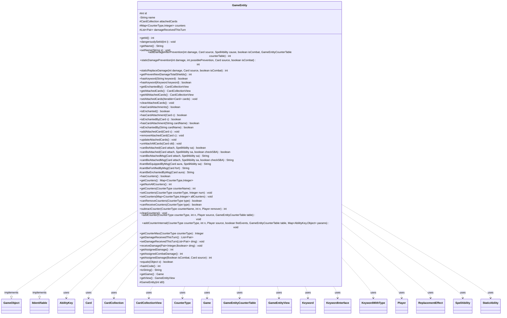

---
aliases:
  - GameEntity
tags:
  - java/class
  - module/forge-game
  - pkg/forge/game
fqn: forge.game.GameEntity
package: forge.game
module: forge-game
kind: Class
---

# GameEntity

**Package:** `forge.game` &nbsp; **Module:** `forge-game` &nbsp; **Kind:** Class



## Relationships
**Implements:**
- [[forge.game.GameObject|GameObject]]
- [[forge.game.IIdentifiable|IIdentifiable]]
**Uses:**
- [[forge.game.Game|Game]]
- [[forge.game.GameEntityCounterTable|GameEntityCounterTable]]
- [[forge.game.GameEntityView|GameEntityView]]
- [[forge.game.ability.AbilityKey|AbilityKey]]
- [[forge.game.card.Card|Card]]
- [[forge.game.card.CardCollection|CardCollection]]
- [[forge.game.card.CardCollectionView|CardCollectionView]]
- [[forge.game.card.CounterType|CounterType]]
- [[forge.game.keyword.Keyword|Keyword]]
- [[forge.game.keyword.KeywordInterface|KeywordInterface]]
- [[forge.game.keyword.KeywordWithType|KeywordWithType]]
- [[forge.game.player.Player|Player]]
- [[forge.game.replacement.ReplacementEffect|ReplacementEffect]]
- [[forge.game.spellability.SpellAbility|SpellAbility]]
- [[forge.game.staticability.StaticAbility|StaticAbility]]

## Design Description

GameEntity is the abstract root for any addressable, persistent object in a game of Magic — principally players and cards in play — supplying the identity and shared state that distinguish such objects from transient game data. As a `GameObject` and `IIdentifiable`, it carries an immutable integer `id` (the basis of `equals`/`hashCode`), a name, and three cross-cutting concerns common to all targetable entities: cards attached to it (auras, equipment, fortifications), counters keyed by `CounterType`, and damage received this turn.

It concentrates the rules logic for these concerns — attachment legality (`cantBeAttachedMsg` delegating to `StaticAbilityCantAttach`), counter caps and rule-107.1b guards, and static damage prevention scanning replacement effects — while deferring state-mutating and subtype-specific behavior (damage application, counter mutation, keyword checks, `getGame`, `getView`) to abstract methods that `Player` and `Card` implement. Deliberate touches include forecast-safe prevention methods usable by the AI without altering game state, phased-out filtering, and view synchronization on every state change.

## Source
`forge-game/src/main/java/forge/game/GameEntity.java`

```java
/*
 * Forge: Play Magic: the Gathering.
 * Copyright (C) 2011  Forge Team
 *
 * This program is free software: you can redistribute it and/or modify
 * it under the terms of the GNU General Public License as published by
 * the Free Software Foundation, either version 3 of the License, or
 * (at your option) any later version.
 *
 * This program is distributed in the hope that it will be useful,
 * but WITHOUT ANY WARRANTY; without even the implied warranty of
 * MERCHANTABILITY or FITNESS FOR A PARTICULAR PURPOSE.  See the
 * GNU General Public License for more details.
 *
 * You should have received a copy of the GNU General Public License
 * along with this program.  If not, see <http://www.gnu.org/licenses/>.
 */
package forge.game;

import java.util.List;
import java.util.Map;

import org.apache.commons.lang3.tuple.Pair;

import com.google.common.collect.Lists;
import com.google.common.collect.Maps;

import forge.game.ability.AbilityKey;
import forge.game.ability.AbilityUtils;
import forge.game.ability.ApiType;
import forge.game.card.Card;
import forge.game.card.CardCollection;
import forge.game.card.CardCollectionView;
import forge.game.card.CardLists;
import forge.game.card.CardPredicates;
import forge.game.card.CounterType;
import forge.game.keyword.Keyword;
import forge.game.keyword.KeywordInterface;
import forge.game.keyword.KeywordWithType;
import forge.game.player.Player;
import forge.game.replacement.ReplacementEffect;
import forge.game.replacement.ReplacementType;
import forge.game.spellability.SpellAbility;
import forge.game.staticability.StaticAbility;
import forge.game.staticability.StaticAbilityCantAttach;
import forge.game.zone.ZoneType;
import forge.util.Lang;

public abstract class GameEntity implements GameObject, IIdentifiable {
    protected int id;
    private String name = "";
    protected CardCollection attachedCards = new CardCollection();
    protected Map<CounterType, Integer> counters = Maps.newHashMap();
    protected List<Pair<Integer, Boolean>> damageReceivedThisTurn = Lists.newArrayList();

    protected GameEntity(int id0) {
        id = id0;
    }

    @Override
    public int getId() {
        return id;
    }
    public void dangerouslySetId(int i) { id = i; }

    public String getName() {
        return name;
    }
    public void setName(final String s) {
        name = s;
        getView().updateName(this);
    }

    // This function handles damage after replacement and prevention effects are applied
    public abstract int addDamageAfterPrevention(final int damage, final Card source, final SpellAbility cause, final boolean isCombat, GameEntityCounterTable counterTable);

    // This should be also usable by the AI to forecast an effect (so it must
    // not change the game state)
    public int staticDamagePrevention(int damage, final int possiblePrevention, final Card source, final boolean isCombat) {
        if (damage <= 0) {
            return 0;
        }
        if (!source.canDamagePrevented(isCombat)) {
            return damage;
        }

        if (isCombat && getGame().getReplacementHandler().isPreventCombatDamageThisTurn()) {
            return 0;
        }

        for (final Card ca : getGame().getCardsIn(ZoneType.STATIC_ABILITIES_SOURCE_ZONES)) {
            for (final ReplacementEffect re : ca.getReplacementEffects()) {
                if (!re.getMode().equals(ReplacementType.DamageDone) ||
                        (!re.hasParam("PreventionEffect") && !re.hasParam("Prevent"))) {
                    continue;
                }
                if (!re.zonesCheck(getGame().getZoneOf(ca))) {
                    continue;
                }
                if (!re.requirementsCheck(getGame())) {
                    continue;
                }
                // Immortal Coil prevents the damage but has a similar negative effect
                if ("Immortal Coil".equals(ca.getName())) {
                    continue;
                }
                if (!re.matchesValidParam("ValidSource", source)) {
                    continue;
                }
                if (!re.matchesValidParam("ValidTarget", this)) {
                    continue;
                }
                if (re.hasParam("IsCombat")) {
                    if (re.getParam("IsCombat").equals("True") != isCombat) {
                        continue;
                    }
                }
                if (re.hasParam("Prevent")) {
                    return 0;
                } else if (re.getOverridingAbility() != null) {
                    SpellAbility repSA = re.getOverridingAbility();
                    if (repSA.getApi() == ApiType.ReplaceDamage) {
                        damage = Math.max(0, damage - AbilityUtils.calculateAmount(ca, repSA.getParam("Amount"), repSA));
                    }
                } else {
                    return 0;
                }
            }
        }

        return Math.max(0, damage - possiblePrevention);
    }

    // This should be also usable by the AI to forecast an effect (so it must
    // not change the game state)
    public abstract int staticReplaceDamage(final int damage, final Card source, final boolean isCombat);

    public int getPreventNextDamageTotalShields() {
        return getGame().getReplacementHandler().getTotalPreventionShieldAmount(this);
    }

    public abstract boolean hasKeyword(final String keyword);
    public abstract boolean hasKeyword(final Keyword keyword);

    public final CardCollectionView getEnchantedBy() {
        // enchanted means attached by Aura
        return CardLists.filter(getAttachedCards(), Card::isAura);
    }

    // doesn't include phased out cards
    public final CardCollectionView getAttachedCards() {
        return CardLists.filter(attachedCards, CardPredicates.phasedIn());
    }

    // for view does include phased out cards
    public final CardCollectionView getAllAttachedCards() {
        return attachedCards;
    }

    public final void setAttachedCards(final Iterable<Card> cards) {
        attachedCards = new CardCollection(cards);
        updateAttachedCards();
    }

    public final void clearAttachedCards() {
        if (attachedCards.isEmpty()) {
            return;
        }
        attachedCards.clear();
        updateAttachedCards();
    }

    public final boolean hasCardAttachments() {
        return !getAttachedCards().isEmpty();
    }

    public final boolean isEnchanted() {
        // enchanted means attached by Aura
        return getAttachedCards().anyMatch(Card::isAura);
    }

    public final boolean hasCardAttachment(Card c) {
        return getAttachedCards().contains(c);
    }
    public final boolean isEnchantedBy(Card c) {
        // Rule 303.4k  Even if c is no Aura it still counts
        return hasCardAttachment(c);
    }

    public final boolean hasCardAttachment(final String cardName) {
        return getAttachedCards().anyMatch(CardPredicates.nameEquals(cardName));
    }
    public final boolean isEnchantedBy(final String cardName) {
        // Rule 303.4k  Even if c is no Aura it still counts
        return hasCardAttachment(cardName);
    }

    public final void addAttachedCard(final Card c) {
        if (attachedCards.add(c)) {
            updateAttachedCards();
        }
    }

    public final void removeAttachedCard(final Card c) {
        if (attachedCards.remove(c)) {
            updateAttachedCards();
        }
    }

    public final void updateAttachedCards() {
        getView().updateAttachedCards(this);
    }

    public final void unAttachAllCards(Card old) {
        for (Card c : getAttachedCards()) {
            c.unattachFromEntity(this, old);
        }
    }

    public boolean canBeAttached(final Card attach, SpellAbility sa) {
        return canBeAttached(attach, sa, false);
    }
    public boolean canBeAttached(final Card attach, SpellAbility sa, boolean checkSBA) {
        return cantBeAttachedMsg(attach, sa, checkSBA) == null;
    }

    public String cantBeAttachedMsg(final Card attach, SpellAbility sa) {
        return cantBeAttachedMsg(attach, sa, false);
    }
    public String cantBeAttachedMsg(final Card attach, SpellAbility sa, boolean checkSBA) {
        if (!attach.isAttachment()) {
            return attach.getDisplayName() + " is not an attachment";
        }
        if (equals(attach)) {
            return attach.getDisplayName() + " can't attach to itself";
        }

        if (attach.isCreature() && !attach.hasKeyword(Keyword.RECONFIGURE)) {
            return attach.getDisplayName() + " is a creature without reconfigure";
        }

        if (attach.isPhasedOut()) {
            return attach.getDisplayName() + " is phased out";
        }

        if (attach.isAura()) {
            String msg = cantBeEnchantedByMsg(attach);
            if (msg != null) {
                return msg;
            }
        }
        if (attach.isEquipment()) {
            String msg = cantBeEquippedByMsg(attach, sa);
            if (msg != null) {
                return msg;
            }
        }
        if (attach.isFortification()) {
            String msg = cantBeFortifiedByMsg(attach);
            if (msg != null) {
                return msg;
            }
        }

        StaticAbility stAb = StaticAbilityCantAttach.cantAttach(this, attach, checkSBA);
        if (stAb != null) {
            return stAb.toString();
        }

        return null;
    }

    protected String cantBeEquippedByMsg(final Card aura, SpellAbility sa) {
        /**
         * Equip only to Lands which are cards
         */
        return getName() + " is not a Creature";
    }

    protected String cantBeFortifiedByMsg(final Card fort) {
        /**
         * Equip only to Lands which are cards
         */
        return getName() + " is not a Land";
    }

    protected String cantBeEnchantedByMsg(final Card aura) {
        if (!aura.hasKeyword(Keyword.ENCHANT)) {
            return "No Enchant Keyword";
        }
        for (KeywordInterface ki : aura.getKeywords(Keyword.ENCHANT)) {
            if (ki instanceof KeywordWithType kwt) {
                String v = kwt.getValidType();
                String desc = kwt.getTypeDescription();
                if (!isValid(v.split(","), aura.getController(), aura, null)) {
                    return getName() + " is not " + Lang.nounWithAmount(1, desc);
                }
            }
        }
        return null;
    }

    public boolean hasCounters() {
        return !counters.isEmpty();
    }

    // get all counters from a card
    public final Map<CounterType, Integer> getCounters() {
        return counters;
    }

    // get total number of all counters on an entity
    public final int getNumAllCounters() {
        int count = 0;
        for (Integer i : getCounters().values()) {
            if (i != null && i > 0) {
                count += i;
            }
        }
        return count;
    }

    public final int getCounters(final CounterType counterName) {
        Integer value = counters.get(counterName);
        return value == null ? 0 : value;
    }

    public void setCounters(final CounterType counterType, final Integer num) {
        if (num <= 0) {
            counters.remove(counterType);
        } else {
            counters.put(counterType, num);
        }
    }

    abstract public void setCounters(final Map<CounterType, Integer> allCounters);

    abstract public boolean canRemoveCounters(final CounterType type);

    abstract public boolean canReceiveCounters(final CounterType type);
    abstract public int subtractCounter(final CounterType counterName, final int n, final Player remover);
    abstract public void clearCounters();

    public final void addCounter(final CounterType counterType, int n, final Player source, GameEntityCounterTable table) {
        if (n <= 0 || !canReceiveCounters(counterType)) {
            // As per rule 107.1b
            return;
        }

        Integer max = getCounterMax(counterType);
        if (max != null) {
            n = Math.min(n, max - getCounters(counterType));
            if (n <= 0) {
                return;
            }
        }

        // doesn't really add counters, but is just a helper to add them to the Table
        // so the Table can handle the Replacement Effect
        table.put(source, this, counterType, n);
    }

    abstract public void addCounterInternal(final CounterType counterType, final int n, final Player source, final boolean fireEvents, GameEntityCounterTable table, Map<AbilityKey, Object> params);
    public Integer getCounterMax(final CounterType counterType) {
        return null;
    }

    public List<Pair<Integer, Boolean>> getDamageReceivedThisTurn() {
        return damageReceivedThisTurn;
    }
    public void setDamageReceivedThisTurn(List<Pair<Integer, Boolean>> dmg) {
        damageReceivedThisTurn.addAll(dmg);
    }

    public void receiveDamage(Pair<Integer, Boolean> dmg) {
        damageReceivedThisTurn.add(dmg);
    }

    public final int getAssignedDamage() {
        return getAssignedDamage(null, null);
    }
    public final int getAssignedCombatDamage() {
        return getAssignedDamage(true, null);
    }
    public final int getAssignedDamage(Boolean isCombat, final Card source) {
        int num = 0;
        for (Pair<Integer, Boolean> dmg : damageReceivedThisTurn) {
            if (isCombat != null && dmg.getRight() != isCombat) {
                continue;
            }
            if (source != null && !getGame().getDamageLKI(dmg).getLeft().equalsWithGameTimestamp(source)) {
                continue;
            }
            num += dmg.getLeft();
        }
        return num;
    }

    @Override
    public final boolean equals(Object o) {
        if (o == null) { return false; }
        return o.hashCode() == id && o.getClass().equals(getClass());
    }

    @Override
    public final int hashCode() {
        return id;
    }

    @Override
    public String toString() {
        return name;
    }

    public abstract Game getGame();
    public abstract GameEntityView getView();
}
```
