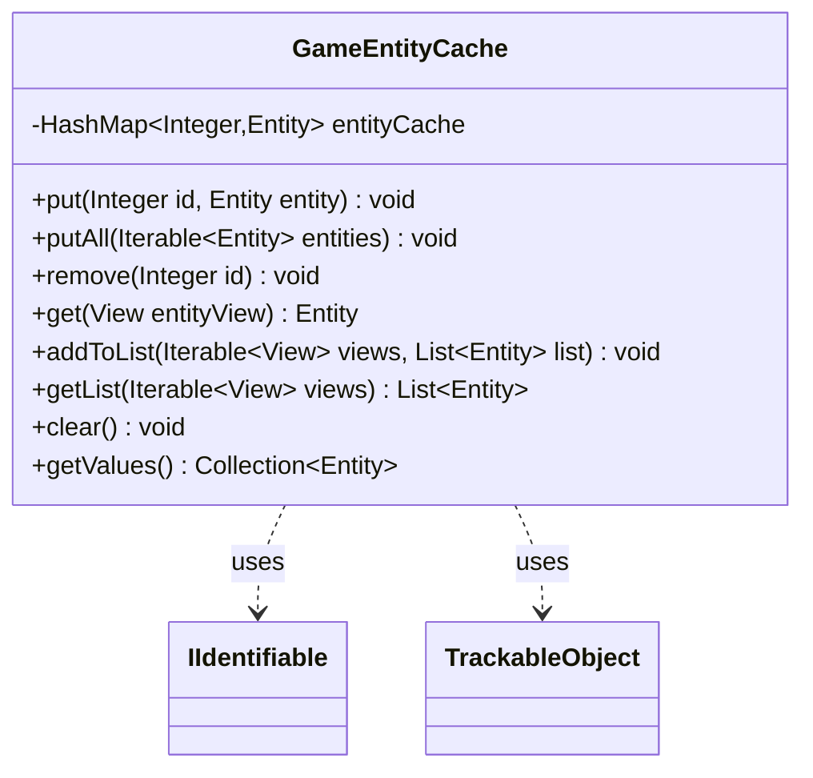

---
aliases:
  - GameEntityCache
tags:
  - java/class
  - module/forge-game
  - pkg/forge/game
fqn: forge.game.GameEntityCache
package: forge.game
module: forge-game
kind: Class
---

# GameEntityCache

**Package:** `forge.game` &nbsp; **Module:** `forge-game` &nbsp; **Kind:** Class



## Relationships
**Uses:**
- [[forge.game.IIdentifiable|IIdentifiable]]
- [[forge.trackable.TrackableObject|TrackableObject]]

## Design Description

`GameEntityCache` is a small generic registry that maps integer identifiers to live game-domain objects, decoupling Forge's view layer from the model. Parameterized over an `Entity` type (any `IIdentifiable`) and a `View` type (any `TrackableObject`), it stores entities in a `HashMap` keyed by their id and resolves a view back to its backing entity by looking up the view's id. Beyond basic `put`/`remove`/`clear` upkeep, it offers bulk operations—`putAll` to index a collection of entities and `addToList`/`getList` to translate an iterable of views into the corresponding entities, silently skipping any unresolved (null) view.

The design intent is reusability: rather than hard-coding entity types, the generics let any subsystem pairing an identifiable model with a trackable view reuse the same id-based caching and view-to-entity translation logic, keeping serialized views lightweight while their full objects live in one cache.

## Source
`forge-game/src/main/java/forge/game/GameEntityCache.java`

```java
package forge.game;

import java.util.ArrayList;
import java.util.Collection;
import java.util.HashMap;
import java.util.List;

import forge.trackable.TrackableObject;

public class GameEntityCache<Entity extends IIdentifiable, View extends TrackableObject> {
    private HashMap<Integer, Entity> entityCache = new HashMap<>();
 
    public void put(Integer id, Entity entity) {
        entityCache.put(id, entity);
    }
    public void putAll(Iterable<Entity> entities) {
        for (Entity e : entities) {
            put(e.getId(), e);
        }
    }

    public void remove(Integer id) {
        entityCache.remove(id);
    }

    public Entity get(View entityView) {
        if (entityView == null) { return null; }
        return entityCache.get(entityView.getId());
    }

    public void addToList(Iterable<View> views, List<Entity> list) {
        for (View view : views) {
            Entity entity = get(view);
            if (entity != null) {
                list.add(entity);
            }
        }
    }

    public List<Entity> getList(Iterable<View> views) {
        List<Entity> list = new ArrayList<>();
        addToList(views, list);
        return list;
    }

    public void clear() {
        entityCache.clear();
    }

    public Collection<Entity> getValues() {
        return entityCache.values();
    }
}
```
