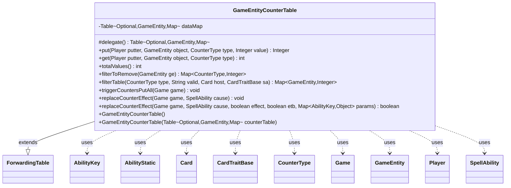

---
aliases:
  - GameEntityCounterTable
tags:
  - java/class
  - module/forge-game
  - pkg/forge/game
fqn: forge.game.GameEntityCounterTable
package: forge.game
module: forge-game
kind: Class
---

# GameEntityCounterTable

**Package:** `forge.game` &nbsp; **Module:** `forge-game` &nbsp; **Kind:** Class



## Relationships
**Uses:**
- [[forge.game.CardTraitBase|CardTraitBase]]
- [[forge.game.Game|Game]]
- [[forge.game.GameEntity|GameEntity]]
- [[forge.game.ability.AbilityKey|AbilityKey]]
- [[forge.game.card.Card|Card]]
- [[forge.game.card.CounterType|CounterType]]
- [[forge.game.player.Player|Player]]
- [[forge.game.spellability.AbilityStatic|AbilityStatic]]
- [[forge.game.spellability.SpellAbility|SpellAbility]]

## Design Description

`GameEntityCounterTable` accumulates pending counter placements during a single game action, keyed by the placing player (optional), the target `GameEntity`, and `CounterType`. It extends Guava's `ForwardingTable`, wrapping a `HashBasedTable` so the class behaves as a standard table while adding domain-specific convenience methods—merging summed values via `put`, computing totals, and filtering removable or rules-text-valid counters through `filterToRemove` and `filterTable`.

Its central responsibility is staging counter changes so they pass through Forge's rules engine before taking effect: `replaceCounterEffect` runs each entry through the replacement handler (`ReplacementType.AddCounter`), respects parameters like `MaxFromEffect` and `RememberPut`, applies the surviving counters via `addCounterInternal`, and fires `CounterAddedAll`/`CounterTypeAddedAll` triggers. It collaborates closely with `Game`, `SpellAbility`/`AbilityStatic`, and `AbilityKey` to thread replacement and trigger context, deferring batched counter events so they resolve atomically rather than per-counter.

## Source
`forge-game/src/main/java/forge/game/GameEntityCounterTable.java`

```java
package forge.game;

import java.util.Map;
import java.util.Objects;
import java.util.Optional;
import java.util.stream.Collectors;

import com.google.common.collect.ForwardingTable;
import com.google.common.collect.HashBasedTable;
import com.google.common.collect.Maps;
import com.google.common.collect.Table;

import forge.game.ability.AbilityKey;
import forge.game.card.Card;
import forge.game.card.CounterType;
import forge.game.player.Player;
import forge.game.replacement.ReplacementType;
import forge.game.spellability.AbilityStatic;
import forge.game.spellability.SpellAbility;
import forge.game.trigger.TriggerType;

public class GameEntityCounterTable extends ForwardingTable<Optional<Player>, GameEntity, Map<CounterType, Integer>> {

    private Table<Optional<Player>, GameEntity, Map<CounterType, Integer>> dataMap = HashBasedTable.create();

    public GameEntityCounterTable() {
    }

    public GameEntityCounterTable(Table<Optional<Player>, GameEntity, Map<CounterType, Integer>> counterTable) {
        putAll(counterTable);
    }

    /*
     * (non-Javadoc)
     * @see com.google.common.collect.ForwardingTable#delegate()
     */
    @Override
    protected Table<Optional<Player>, GameEntity, Map<CounterType, Integer>> delegate() {
        return dataMap;
    }

    public Integer put(Player putter, GameEntity object, CounterType type, Integer value) {
        Optional<Player> o = Optional.ofNullable(putter);
        Map<CounterType, Integer> map = get(o, object);
        if (map == null) {
            map = Maps.newHashMap();
            put(o, object, map);
        }
        return map.merge(type, value, Integer::sum);
    }

    public int get(Player putter, GameEntity object, CounterType type) {
        Optional<Player> o = Optional.ofNullable(putter);
        Map<CounterType, Integer> map = get(o, object);
        if (map == null || !map.containsKey(type)) {
            return 0;
        }
        return Objects.requireNonNullElse(map.get(type), 0);
    }

    public int totalValues() {
        int result = 0;
        for (Map<CounterType, Integer> m : values()) {
            for (Integer i : m.values()) {
                result += i;
            }
        }
        return result;
    }

    /*
     * returns the counters that can still be removed from game entity
     */
    public Map<CounterType, Integer> filterToRemove(GameEntity ge) {
        Map<CounterType, Integer> result = Maps.newHashMap();
        if (!containsColumn(ge)) {
            result.putAll(ge.getCounters());
            return result;
        }
        Map<CounterType, Integer> alreadyRemoved = column(ge).get(Optional.<Player>empty());
        for (Map.Entry<CounterType, Integer> e : ge.getCounters().entrySet()) {
            int rest = e.getValue() - (alreadyRemoved.getOrDefault(e.getKey(), 0));
            if (rest > 0) {
                result.put(e.getKey(), rest);
            }
        }
        return result;
    }

    public Map<GameEntity, Integer> filterTable(CounterType type, String valid, Card host, CardTraitBase sa) {
        return columnMap().entrySet().stream().filter(gm -> gm.getKey().isValid(valid, host.getController(), host, sa))
            .collect(Collectors.groupingBy(gm -> gm.getKey(),
                    Collectors.flatMapping(gm -> gm.getValue().values().stream(),
                            Collectors.summingInt(m -> m.getOrDefault(type, 0)))));
    }

    public void triggerCountersPutAll(final Game game) {
        if (isEmpty()) {
            return;
        }
        for (Cell<Optional<Player>, GameEntity, Map<CounterType, Integer>> c : cellSet()) {
            if (c.getValue().isEmpty()) {
                continue;
            }
            final Map<AbilityKey, Object> runParams = AbilityKey.newMap();
            runParams.put(AbilityKey.Source, c.getRowKey().get());
            runParams.put(AbilityKey.Object, c.getColumnKey());
            runParams.put(AbilityKey.CounterMap, c.getValue());
            game.getTriggerHandler().runTrigger(TriggerType.CounterPlayerAddedAll, runParams, false);
        }
        final Map<AbilityKey, Object> runParams = AbilityKey.newMap();
        runParams.put(AbilityKey.Objects, this);
        game.getTriggerHandler().runTrigger(TriggerType.CounterAddedAll, runParams, false);
    }

    public void replaceCounterEffect(final Game game, final SpellAbility cause) {
        replaceCounterEffect(game, cause, cause != null && !(cause instanceof AbilityStatic), false, null);
    }
    @SuppressWarnings("unchecked")
    public boolean replaceCounterEffect(final Game game, final SpellAbility cause, final boolean effect, final boolean etb, Map<AbilityKey, Object> params) {
        if (isEmpty()) {
            return false;
        }
        GameEntityCounterTable result = new GameEntityCounterTable();
        for (Map.Entry<GameEntity, Map<Optional<Player>, Map<CounterType, Integer>>> gm : columnMap().entrySet()) {
            Map<Optional<Player>, Map<CounterType, Integer>> values = gm.getValue();

            // ETB Counters are already handled in the Move Event
            if (!etb) {
                final Map<AbilityKey, Object> repParams = AbilityKey.mapFromAffected(gm.getKey());
                repParams.put(AbilityKey.Cause, cause);
                repParams.put(AbilityKey.EffectOnly, effect);
                repParams.put(AbilityKey.CounterMap, values);
                repParams.put(AbilityKey.ETB, etb);
                if (params != null) {
                    repParams.putAll(params);
                }

                switch (game.getReplacementHandler().run(ReplacementType.AddCounter, repParams)) {
                case NotReplaced:
                    break;
                case Updated: {
                    values = (Map<Optional<Player>, Map<CounterType, Integer>>) repParams.get(AbilityKey.CounterMap);
                    break;
                }
                default:
                    continue;
                }
            }

            // Add ETB flag
            Map<AbilityKey, Object> runParams = AbilityKey.newMap();
            runParams.put(AbilityKey.Cause, cause);
            if (params != null) {
                runParams.putAll(params);
            }

            boolean firstTime = false;
            if (gm.getKey() instanceof Card c) {
                firstTime = game.getCounterAddedThisTurn(null, c) == 0;
            }

            // Apply counter after replacement effect
            for (Map.Entry<Optional<Player>, Map<CounterType, Integer>> e : values.entrySet()) {
                boolean remember = cause != null && cause.hasParam("RememberPut");
                for (Map.Entry<CounterType, Integer> ec : e.getValue().entrySet()) {
                    Integer value = ec.getValue();
                    if (value == null) {
                        continue;
                    }
                    if (cause != null && cause.hasParam("MaxFromEffect")) {
                        value = Math.min(value, Integer.parseInt(cause.getParam("MaxFromEffect")) - gm.getKey().getCounters(ec.getKey()));
                    }
                    gm.getKey().addCounterInternal(ec.getKey(), value, e.getKey().orElse(null), true, result, runParams);
                    if (remember && ec.getValue() > 0) {
                        cause.getHostCard().addRemembered(gm.getKey());
                    }
                }
            }

            if (result.containsColumn(gm.getKey())) {
                runParams = AbilityKey.newMap();
                runParams.put(AbilityKey.Object, gm.getKey());
                runParams.put(AbilityKey.FirstTime, firstTime);
                game.getTriggerHandler().runTrigger(TriggerType.CounterTypeAddedAll, runParams, false);
            }
        }

        int totalAdded = totalValues();
        if (totalAdded > 0 && cause != null && cause.hasParam("RememberAmount")) {
            cause.getHostCard().addRemembered(totalAdded);
        }

        result.triggerCountersPutAll(game);
        return !result.isEmpty();
    }
}
```
