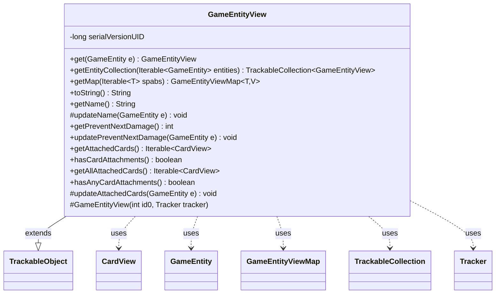

---
aliases:
  - GameEntityView
tags:
  - java/class
  - module/forge-game
  - pkg/forge/game
fqn: forge.game.GameEntityView
package: forge.game
module: forge-game
kind: Class
---

# GameEntityView

**Package:** `forge.game` &nbsp; **Module:** `forge-game` &nbsp; **Kind:** Class



## Relationships
**Extends:**
- [[forge.trackable.TrackableObject|TrackableObject]]
**Uses:**
- [[forge.game.GameEntity|GameEntity]]
- [[forge.game.GameEntityViewMap|GameEntityViewMap]]
- [[forge.game.card.CardView|CardView]]
- [[forge.trackable.TrackableCollection|TrackableCollection]]
- [[forge.trackable.Tracker|Tracker]]

## Design Description

GameEntityView is an abstract base for the view-layer representation of any in-game entity, sitting in the client-facing tracking model rather than the game-state model. Extending TrackableObject, it stores its data as tracked properties (name, prevent-next-damage shields, attached cards) so changes can be observed and synchronized, exposing public getters alongside protected `update*` methods that pull fresh values from a backing GameEntity. Static factories bridge the domain and view layers: `get` resolves an entity's existing view, `getEntityCollection` maps a group into a TrackableCollection, and `getMap` builds a typed GameEntityViewMap. Notably, `getAttachedCards` filters out phased-out CardViews, distinguishing visible attachments from all attachments. By centralizing shared entity concerns here, it lets concrete subtypes (cards, players) reuse common tracked state and view-construction logic.

## Source
`forge-game/src/main/java/forge/game/GameEntityView.java`

```java
package forge.game;

import com.google.common.collect.Iterables;
import forge.game.card.CardView;
import forge.trackable.TrackableCollection;
import forge.trackable.TrackableObject;
import forge.trackable.TrackableProperty;
import forge.trackable.Tracker;
import forge.util.IterableUtil;

public abstract class GameEntityView extends TrackableObject {
    private static final long serialVersionUID = -5129089945124455670L;

    public static GameEntityView get(GameEntity e) {
        return e == null ? null : e.getView();
    }

    public static TrackableCollection<GameEntityView> getEntityCollection(Iterable<? extends GameEntity> entities) {
        if (entities == null) {
            return null;
        }
        TrackableCollection<GameEntityView> collection = new TrackableCollection<>();
        for (GameEntity e : entities) {
            collection.add(e.getView());
        }
        return collection;
    }

    public static <T extends GameEntity, V extends GameEntityView> GameEntityViewMap<T, V> getMap(Iterable<T> spabs) {
        GameEntityViewMap<T, V> gameViewCache = new GameEntityViewMap<T, V>();
        gameViewCache.putAll(spabs);
        return gameViewCache;
    }

    protected GameEntityView(final int id0, final Tracker tracker) {
        super(id0, tracker);
    }

    @Override
    public String toString() {
        return getName();
    }

    public String getName() {
        return get(TrackableProperty.Name);
    }
    protected void updateName(GameEntity e) {
        set(TrackableProperty.Name, e.getName());
    }

    public int getPreventNextDamage() {
        return get(TrackableProperty.PreventNextDamage);
    }
    public void updatePreventNextDamage(GameEntity e) {
        set(TrackableProperty.PreventNextDamage, e.getPreventNextDamageTotalShields());
    }

    public Iterable<CardView> getAttachedCards() {
        if (hasAnyCardAttachments()) {
            Iterable<CardView> active = IterableUtil.filter(get(TrackableProperty.AttachedCards), c -> !c.isPhasedOut());
            if (!Iterables.isEmpty(active)) {
                return active;
            }
        }
        return null;
    }
    public boolean hasCardAttachments() {
        return getAttachedCards() != null;
    }
    public Iterable<CardView> getAllAttachedCards() {
        return get(TrackableProperty.AttachedCards);
    }
    public boolean hasAnyCardAttachments() {
        return getAllAttachedCards() != null;
    }

    protected void updateAttachedCards(GameEntity e) {
        if (!e.getAllAttachedCards().isEmpty()) {
            set(TrackableProperty.AttachedCards, CardView.getCollection(e.getAllAttachedCards()));
        } else {
            set(TrackableProperty.AttachedCards, null);
        }
    }
}
```

## Python
`forge/game/GameEntityView.py`

```python
from forge.game.GameEntity import GameEntity
from forge.game.GameEntityViewMap import GameEntityViewMap
from forge.game.card.CardView import CardView
from forge.trackable.TrackableCollection import TrackableCollection
from forge.trackable.TrackableObject import TrackableObject
from forge.trackable.TrackableProperty import TrackableProperty
from forge.trackable.Tracker import Tracker


class GameEntityView(TrackableObject):
    serialVersionUID = -5129089945124455670

    @staticmethod
    def get(e: GameEntity) -> "GameEntityView":
        return None if e is None else e.getView()

    @staticmethod
    def getEntityCollection(entities) -> "TrackableCollection[GameEntityView]":
        if entities is None:
            return None
        collection = TrackableCollection()
        for e in entities:
            collection.add(e.getView())
        return collection

    @staticmethod
    def getMap(spabs) -> "GameEntityViewMap":
        gameViewCache = GameEntityViewMap()
        gameViewCache.putAll(spabs)
        return gameViewCache

    def __init__(self, id0: int, tracker: Tracker):
        super().__init__(id0, tracker)

    def toString(self) -> str:
        return self.getName()

    def getName(self) -> str:
        return self.get(TrackableProperty.Name)

    def updateName(self, e: GameEntity) -> None:
        self.set(TrackableProperty.Name, e.getName())

    def getPreventNextDamage(self) -> int:
        return self.get(TrackableProperty.PreventNextDamage)

    def updatePreventNextDamage(self, e: GameEntity) -> None:
        self.set(TrackableProperty.PreventNextDamage, e.getPreventNextDamageTotalShields())

    def getAttachedCards(self):
        if self.hasAnyCardAttachments():
            active = [c for c in self.get(TrackableProperty.AttachedCards) if not c.isPhasedOut()]
            if len(active) != 0:
                return active
        return None

    def hasCardAttachments(self) -> bool:
        return self.getAttachedCards() is not None

    def getAllAttachedCards(self):
        return self.get(TrackableProperty.AttachedCards)

    def hasAnyCardAttachments(self) -> bool:
        return self.getAllAttachedCards() is not None

    def updateAttachedCards(self, e: GameEntity) -> None:
        if not e.getAllAttachedCards().isEmpty():
            self.set(TrackableProperty.AttachedCards, CardView.getCollection(e.getAllAttachedCards()))
        else:
            self.set(TrackableProperty.AttachedCards, None)
```
