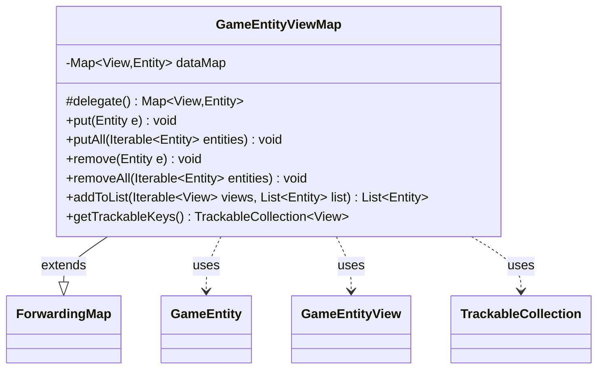

---
aliases:
  - GameEntityViewMap
tags:
  - java/class
  - module/forge-game
  - pkg/forge/game
fqn: forge.game.GameEntityViewMap
package: forge.game
module: forge-game
kind: Class
---

# GameEntityViewMap

**Package:** `forge.game` &nbsp; **Module:** `forge-game` &nbsp; **Kind:** Class



## Relationships
**Uses:**
- [[forge.game.GameEntity|GameEntity]]
- [[forge.game.GameEntityView|GameEntityView]]
- [[forge.trackable.TrackableCollection|TrackableCollection]]

## Design Description

`GameEntityViewMap` is a typed bidirectional lookup that maps each game entity's lightweight view object back to its authoritative model entity. Parameterized over `Entity extends GameEntity` and `View extends GameEntityView`, it extends Guava's `ForwardingMap`, delegating storage to a `LinkedHashMap` so insertion order is preserved while inheriting the full `Map` contract.

Its design intent is to keep the view-to-entity correspondence in sync with minimal caller effort: convenience overloads derive each key automatically via `e.getView()`, so callers `put`/`remove` entities without manually managing keys, and bulk `putAll`/`removeAll` variants iterate over collections. `addToList` resolves a sequence of views back into their entities (skipping unmatched ones), supporting the common need to translate UI-side view references into model objects. `getTrackableKeys` exposes the view keys as a `TrackableCollection`, bridging the map into Forge's trackable/observable layer used to relay game state to the UI.

## Source
`forge-game/src/main/java/forge/game/GameEntityViewMap.java`

```java
package forge.game;

import java.util.List;
import java.util.Map;

import com.google.common.collect.ForwardingMap;
import com.google.common.collect.Maps;

import forge.trackable.TrackableCollection;

public class GameEntityViewMap<Entity extends GameEntity, View extends GameEntityView> extends ForwardingMap<View, Entity> {
    private Map<View, Entity> dataMap = Maps.newLinkedHashMap();

    @Override
    protected Map<View, Entity> delegate() {
        return dataMap;
    }

    @SuppressWarnings("unchecked")
    public void put(Entity e) {
        this.put((View) e.getView(), e);
    }

    public void putAll(Iterable<Entity> entities) {
        for (Entity e : entities) {
            put(e);
        }
    }

    public void remove(Entity e) {
        this.remove(e.getView());
    }

    public void removeAll(Iterable<Entity> entities) {
        for (Entity e : entities) {
            remove(e);
        }
    }

    public List<Entity> addToList(Iterable<View> views, List<Entity> list) {
        if (views == null) {
            return list;
        }
        for (View view : views) {
            Entity entity = get(view);
            if (entity != null) {
                list.add(entity);
            }
        }
        return list;
    }

    public TrackableCollection<View> getTrackableKeys() {
        return new TrackableCollection<View>(this.keySet());
    }
}
```

## Python
`forge/game/GameEntityViewMap.py`

```python
package: forge.game

from typing import List, Iterable

from com.google.common.collect.ForwardingMap import ForwardingMap
from com.google.common.collect.Maps import Maps

from forge.game.GameEntity import GameEntity
from forge.game.GameEntityView import GameEntityView
from forge.trackable.TrackableCollection import TrackableCollection


class GameEntityViewMap(ForwardingMap):
    def __init__(self):
        self.dataMap = Maps.newLinkedHashMap()

    def delegate(self):
        return self.dataMap

    def put(self, e):
        return super().put(e.getView(), e)

    def putAll(self, entities):
        for e in entities:
            self.put(e)

    def remove(self, e):
        return super().remove(e.getView())

    def removeAll(self, entities):
        for e in entities:
            self.remove(e)

    def addToList(self, views, list):
        if views is None:
            return list
        for view in views:
            entity = self.get(view)
            if entity is not None:
                list.append(entity)
        return list

    def getTrackableKeys(self):
        return TrackableCollection(self.keySet())
```
