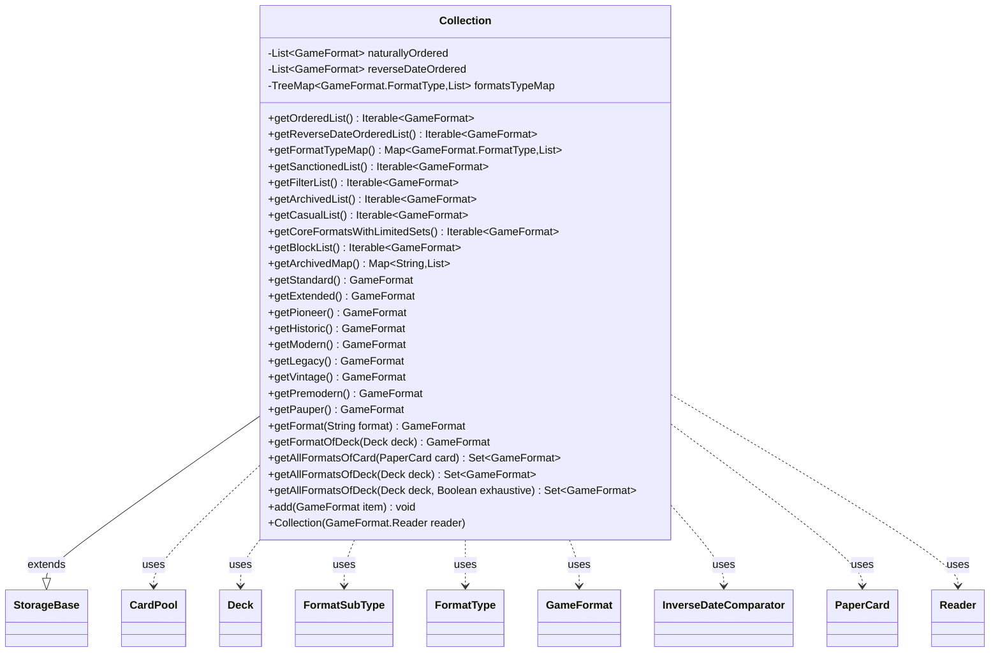

---
aliases:
  - Collection
tags:
  - java/class
  - module/forge-game
  - pkg/forge/game
fqn: forge.game.GameFormat.Collection
package: forge.game
module: forge-game
kind: Class
---

# Collection

**Package:** `forge.game`   **Module:** `forge-game`   **Kind:** Class



## Relationships
**Extends:**
- [[forge.util.storage.StorageBase|StorageBase]]
**Uses:**
- [[forge.deck.CardPool|CardPool]]
- [[forge.deck.Deck|Deck]]
- [[forge.game.GameFormat|GameFormat]]
- [[forge.game.GameFormat.FormatSubType|FormatSubType]]
- [[forge.game.GameFormat.FormatType|FormatType]]
- [[forge.game.GameFormat.InverseDateComparator|InverseDateComparator]]
- [[forge.game.GameFormat.Reader|Reader]]
- [[forge.item.PaperCard|PaperCard]]

## Design Description

`GameFormat.Collection` is a static nested class that serves as the in-memory registry of all known game formats (Standard, Modern, Legacy, Vintage, etc.) in the Forge engine. Extending `StorageBase<GameFormat>`, it inherits keyed map storage while adding ordering and classification on top: it eagerly maintains a naturally ordered list and a reverse-date-ordered list (sorted via `InverseDateComparator`) at construction from its `Reader`, and lazily builds a `TreeMap` grouping formats by `FormatType`.

Its primary responsibility is querying and filtering: it exposes named accessors for canonical formats and a family of list/map views (sanctioned, archived, casual, block, etc.) that filter by `FormatType`/`FormatSubType`. It also resolves formats from game data, determining which format(s) a `Deck` or `PaperCard` legally belongs to via `isDeckLegal`/`isPoolLegal` over a `CardPool`, deduplicating archived variants and excluding digital/commander formats unless an exhaustive scan is requested, falling back to `NoFormat` when nothing matches.

## Source
`forge-game/src/main/java/forge/game/GameFormat.java` — declaration excerpt

```java
    public static class Collection extends StorageBase<GameFormat> {
        private List<GameFormat> naturallyOrdered;
        private List<GameFormat> reverseDateOrdered;
        
        public Collection(GameFormat.Reader reader) {
            super("Format collections", reader);
            naturallyOrdered = reader.naturallyOrdered;
            reverseDateOrdered = new ArrayList<>(naturallyOrdered);
            naturallyOrdered.sort(Comparator.naturalOrder());
            reverseDateOrdered.sort(new InverseDateComparator());
        }

        public Iterable<GameFormat> getOrderedList() {
            return naturallyOrdered;
        }

        public Iterable<GameFormat> getReverseDateOrderedList() {
            return reverseDateOrdered;
        }

        private TreeMap<GameFormat.FormatType, List<GameFormat>> formatsTypeMap;
        public final Map<GameFormat.FormatType, List<GameFormat>> getFormatTypeMap() {
            if (formatsTypeMap == null) {
                formatsTypeMap = new TreeMap<>();
                for (GameFormat.FormatType formatType : GameFormat.FormatType.values())
                    formatsTypeMap.put(formatType, new ArrayList<>());

                for (GameFormat format : this.naturallyOrdered) {
                    GameFormat.FormatType key = format.getFormatType();
                    List<GameFormat> formatsOfType = formatsTypeMap.get(key);
                    formatsOfType.add(format);
                }
            }
            return formatsTypeMap;
        }

        public Iterable<GameFormat> getSanctionedList() {
            List<GameFormat> coreList = new ArrayList<>();
            for (GameFormat format: naturallyOrdered) {
                if (format.getFormatType().equals(FormatType.SANCTIONED)){
                    coreList.add(format);
                }
            }
            return coreList;
        }

        public Iterable<GameFormat> getFilterList() {
            List<GameFormat> coreList = new ArrayList<>();
            for (GameFormat format: naturallyOrdered) {
                if (!format.getFormatType().equals(FormatType.ARCHIVED)
                        &&!format.getFormatType().equals(FormatType.DIGITAL)){
                    coreList.add(format);
                }
            }
            return coreList;
        }

        public Iterable<GameFormat> getArchivedList() {
            List<GameFormat> coreList = new ArrayList<>();
            for (GameFormat format: naturallyOrdered) {
                if (format.getFormatType().equals(FormatType.ARCHIVED)){
                    coreList.add(format);
                }
            }
            return coreList;
        }

        public Iterable<GameFormat> getCasualList() {
            List<GameFormat> casualList = new ArrayList<>();
            for (GameFormat format: naturallyOrdered) {
                if (format.getFormatType().equals(FormatType.CASUAL)){
                    casualList.add(format);
                }
            }
            return casualList;
        }

        public Iterable<GameFormat> getCoreFormatsWithLimitedSets() {
            List<GameFormat> formatsWithLimitedSets = new ArrayList<>();
            for (GameFormat format: naturallyOrdered) {
                if (format.getAllowedSetCodes().size() > 0){
                    formatsWithLimitedSets.add(format);
                }
            }
            return formatsWithLimitedSets;
        }

        public Iterable<GameFormat> getBlockList() {
            List<GameFormat> blockFormats = new ArrayList<>();
            for (GameFormat format : this.getArchivedList()){
                if (format.getFormatSubType() != GameFormat.FormatSubType.BLOCK)
                    continue;
                if (!format.getName().endsWith("Block"))
                    continue;
                blockFormats.add(format);
            }
            Collections.sort(blockFormats);  // GameFormat will be sorted by Index!
            return blockFormats;
        }

        public Map<String, List<GameFormat>> getArchivedMap() {
            Map<String, List<GameFormat>> coreList = new HashMap<>();
            for (GameFormat format: naturallyOrdered){
                if (format.getFormatType().equals(FormatType.ARCHIVED)){
                    String alpha = format.getName().substring(0,1);
                    if (!coreList.containsKey(alpha)) {
                        coreList.put(alpha,new ArrayList<>());
                    }
                    coreList.get(alpha).add(format);
                }
            }
            return coreList;
        }

        public GameFormat getStandard() {
            return this.map.get("Standard");
        }

        public GameFormat getExtended() {
            return this.map.get("Extended");
        }

        public GameFormat getPioneer() {
            return this.map.get("Pioneer");
        }

        public GameFormat getHistoric() {
            return this.map.get("Historic");
        }

        public GameFormat getModern() { return this.map.get("Modern"); }

        public GameFormat getLegacy() { return this.map.get("Legacy"); }

        public GameFormat getVintage() { return this.map.get("Vintage"); }

        public GameFormat getPremodern() { return this.map.get("Premodern"); }

        public GameFormat getPauper() { return this.map.get("Pauper"); }

        public GameFormat getFormat(String format) {
            return this.map.get(format);
        }

        public GameFormat getFormatOfDeck(Deck deck) {
            for(GameFormat gf : reverseDateOrdered) {
                if ( gf.isDeckLegal(deck) )
                    return gf;
            }
            return NoFormat;
        }

        public Set<GameFormat> getAllFormatsOfCard(PaperCard card) {
            Set<GameFormat> result = new HashSet<>();
            for (GameFormat gf : naturallyOrdered) {
                if (gf.getFilterRules().test(card)) {
                    result.add(gf);
                }
            }
            if (result.isEmpty()) {
                result.add(NoFormat);
            }
            return result;
        }

        public Set<GameFormat> getAllFormatsOfDeck(Deck deck) {
            return getAllFormatsOfDeck(deck, false);
        }

        public Set<GameFormat> getAllFormatsOfDeck(Deck deck, Boolean exhaustive) {
            SortedSet<GameFormat> result = new TreeSet<>();
            Set<FormatSubType> coveredTypes = new HashSet<>();
            CardPool allCards = deck.getAllCardsInASinglePool();
            for (GameFormat gf : reverseDateOrdered) {
                if (gf.getFormatType().equals(FormatType.DIGITAL) && !exhaustive){
                    //exclude Digital formats from lists for now
                    continue;
                }
                if (gf.getFormatSubType().equals(FormatSubType.COMMANDER)){
                    //exclude Commander format as other deck checks are not performed here
                    continue;
                }
                if (gf.getFormatType().equals(FormatType.ARCHIVED) && coveredTypes.contains(gf.getFormatSubType())
                        && !exhaustive){
                    //exclude duplicate formats - only keep first of e.g. Standard archived
                    continue;
                }
                if (gf.isPoolLegal(allCards)) {
                    result.add(gf);
                    coveredTypes.add(gf.getFormatSubType());
                }
            }
            if (result.isEmpty()) {
                result.add(NoFormat);
            }
            return result;
        }

        @Override
        public void add(GameFormat item) {
            naturallyOrdered.add(item);
        }
    }
```
