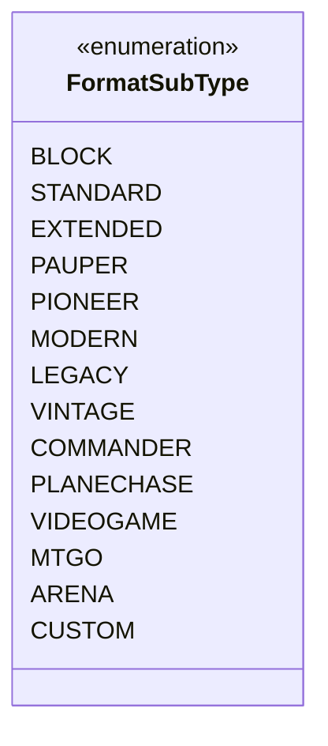

---
aliases:
  - FormatSubType
tags:
  - java/enum
  - module/forge-game
  - pkg/forge/game
fqn: forge.game.GameFormat.FormatSubType
package: forge.game
module: forge-game
kind: Enum
---

# FormatSubType

**Package:** `forge.game`   **Module:** `forge-game`   **Kind:** Enum



## Design Description

`FormatSubType` is a nested enumeration within `GameFormat` that enumerates the named categories of Magic: The Gathering play formats recognized by the engine — competitive constructed tiers (Standard, Modern, Legacy, Vintage, etc.), multiplayer variants (Commander, Planechase), digital-client formats (MTGO, Arena, Videogame), and a Custom catch-all. Its responsibility is purely to classify each `GameFormat` instance into one of these well-known subtypes, providing a closed, type-safe vocabulary in place of free-form strings or magic constants.

As a member enum of `GameFormat`, it has no behavior or state of its own; the design intent is to let format definitions and filtering logic group, label, and distinguish formats reliably at compile time. Keeping the enum nested signals that the classification is meaningful only in the context of a `GameFormat`, while the inclusion of client-specific (MTGO, ARENA) and open-ended (CUSTOM) members shows it is meant to span both official tournament formats and Forge's own extensions.

## Source
`forge-game/src/main/java/forge/game/GameFormat.java` — declaration excerpt

```java
    public enum FormatSubType {
        BLOCK,
        STANDARD,
        EXTENDED,
        PAUPER,
        PIONEER,
        MODERN,
        LEGACY,
        VINTAGE,
        COMMANDER,
        PLANECHASE,
        VIDEOGAME,
        MTGO,
        ARENA,
        CUSTOM
    }
```
