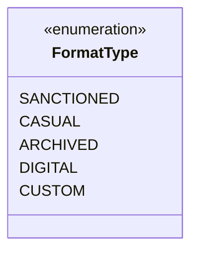

---
aliases:
  - FormatType
tags:
  - java/enum
  - module/forge-game
  - pkg/forge/game
fqn: forge.game.GameFormat.FormatType
package: forge.game
module: forge-game
kind: Enum
---

# FormatType

**Package:** `forge.game`   **Module:** `forge-game`   **Kind:** Enum



## Design Description

SANCTIONED, CASUAL, ARCHIVED, DIGITAL, and CUSTOM — `FormatType` is a nested enumeration within `GameFormat` that classifies game formats by their origin and sanctioning status. It serves as a lightweight categorical tag rather than a behavioral type, enabling `GameFormat` instances to be grouped, filtered, and prioritized according to whether a format is officially sanctioned, casual, archived (retired), digital-only, or user-defined. By modeling these categories as a fixed enum rather than free-form strings or booleans, the design enforces a closed, type-safe set of classifications that the surrounding format-management and deck-legality logic can switch over exhaustively, while leaving room for distinct handling of custom and digital formats that fall outside traditional sanctioned play.

## Source
`forge-game/src/main/java/forge/game/GameFormat.java` — declaration excerpt

```java
    public enum FormatType {
        SANCTIONED,
        CASUAL,
        ARCHIVED,
        DIGITAL,
        CUSTOM
    }
```
