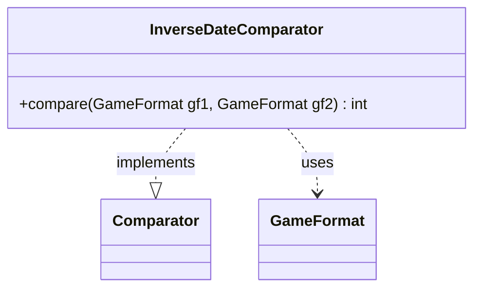

---
aliases:
  - InverseDateComparator
tags:
  - java/class
  - module/forge-game
  - pkg/forge/game
fqn: forge.game.GameFormat.InverseDateComparator
package: forge.game
module: forge-game
kind: Class
---

# InverseDateComparator

**Package:** `forge.game`   **Module:** `forge-game`   **Kind:** Class



## Relationships
**Uses:**
- [[forge.game.GameFormat|GameFormat]]

## Design Description

InverseDateComparator is a static nested helper of `GameFormat` that implements `Comparator<GameFormat>` to impose an ordering on game formats. Its sole responsibility is the `compare` method, which establishes a stable, multi-level sort key: it orders first by `formatType`, then by `formatSubType`, and—only for `ARCHIVED` formats—by `effectiveDate`, falling back to the format `name` whenever the higher-priority fields are equal or dates coincide. Null operands are tolerated by returning a fixed positive value rather than throwing. Defined as a static class, it carries no state and can be instantiated independently of any `GameFormat` instance, serving purely as a reusable sorting strategy that encapsulates the engine's date-and-type-based format collation logic.

## Source
`forge-game/src/main/java/forge/game/GameFormat.java` — declaration excerpt

```java
    public static class InverseDateComparator implements Comparator<GameFormat> {
        public int compare(GameFormat gf1, GameFormat gf2){
            if ((null == gf1) || (null == gf2)) {
                return 1;
            }
            if (gf2.formatType != gf1.formatType){
                return gf1.formatType.compareTo(gf2.formatType);
            }
            if (gf2.formatSubType != gf1.formatSubType){
                return gf1.formatSubType.compareTo(gf2.formatSubType);
            }
            if (gf1.formatType.equals(FormatType.ARCHIVED)){
                if (gf1.effectiveDate!=gf2.effectiveDate) {//for matching dates or default dates default to name sorting
                    return gf1.effectiveDate.compareTo(gf2.effectiveDate);
                }
            }
            return gf1.name.compareTo(gf2.name);
        }
    }
```

## Python
`forge/game/GameFormat/InverseDateComparator.py`

```python
from forge.game.GameFormat import GameFormat
from forge.game.GameFormat.FormatType import FormatType


class InverseDateComparator:
    def compare(self, gf1: GameFormat, gf2: GameFormat) -> int:
        if (gf1 is None) or (gf2 is None):
            return 1
        if gf2.formatType != gf1.formatType:
            return gf1.formatType.compareTo(gf2.formatType)
        if gf2.formatSubType != gf1.formatSubType:
            return gf1.formatSubType.compareTo(gf2.formatSubType)
        if gf1.formatType.equals(FormatType.ARCHIVED):
            if gf1.effectiveDate != gf2.effectiveDate:  # for matching dates or default dates default to name sorting
                return gf1.effectiveDate.compareTo(gf2.effectiveDate)
        return gf1.name.compareTo(gf2.name)
```
