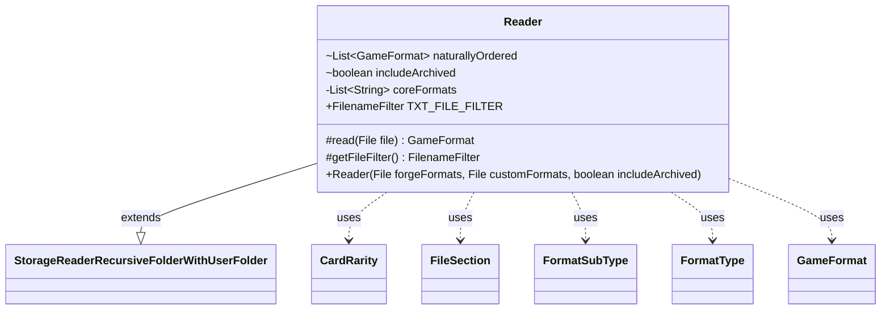

---
aliases:
  - Reader
tags:
  - java/class
  - module/forge-game
  - pkg/forge/game
fqn: forge.game.GameFormat.Reader
package: forge.game
module: forge-game
kind: Class
---

# Reader

**Package:** `forge.game`   **Module:** `forge-game`   **Kind:** Class



## Relationships
**Extends:**
- [[forge.util.storage.StorageReaderRecursiveFolderWithUserFolder|StorageReaderRecursiveFolderWithUserFolder]]
**Uses:**
- [[forge.card.CardRarity|CardRarity]]
- [[forge.game.GameFormat|GameFormat]]
- [[forge.game.GameFormat.FormatSubType|FormatSubType]]
- [[forge.game.GameFormat.FormatType|FormatType]]
- [[forge.util.FileSection|FileSection]]

## Design Description

The `Reader` is a static nested class within `GameFormat` that loads format definitions from disk, extending `StorageReaderRecursiveFolderWithUserFolder<GameFormat>` to recursively scan both the bundled Forge formats folder and a user-supplied custom folder, keying each entry by its format name. Its core responsibility is the `read(File)` override, which parses a `.txt` definition via `FileSection` into a fully-constructed `GameFormat`—resolving the format's `FormatType` and `FormatSubType` enums, effective date, allowed sets, banned/restricted/additional card lists, and permitted `CardRarity` values.

Notable design intent includes a hard-coded `coreFormats` whitelist that, unless `includeArchived` is set, restricts loading to the canonical formats (Standard, Modern, Commander, etc.), and graceful degradation when parsing unknown enum values—falling back to `CUSTOM` and migrating the deprecated `Historic` type to `ARCHIVED` with a warning. It also maintains a `naturallyOrdered` list to preserve file-encountered order, and exposes a `TXT_FILE_FILTER` so directory recursion descends folders while only consuming `.txt` files.

## Source
`forge-game/src/main/java/forge/game/GameFormat.java` — declaration excerpt

```java
    public static class Reader extends StorageReaderRecursiveFolderWithUserFolder<GameFormat> {
        List<GameFormat> naturallyOrdered = new ArrayList<>();
        boolean includeArchived;
        private List<String> coreFormats = new ArrayList<>();
        {
            coreFormats.add("Standard.txt");
            coreFormats.add("Pioneer.txt");
            coreFormats.add("Historic.txt");
            coreFormats.add("Modern.txt");
            coreFormats.add("Legacy.txt");
            coreFormats.add("Vintage.txt");
            coreFormats.add("Commander.txt");
            coreFormats.add("Extended.txt");
            coreFormats.add("Brawl.txt");
            coreFormats.add("Oathbreaker.txt");
            coreFormats.add("Premodern.txt");
            coreFormats.add("Pauper.txt");
            coreFormats.add("PreDH.txt");
        }
        
        public Reader(File forgeFormats, File customFormats, boolean includeArchived) {
            super(forgeFormats, customFormats, GameFormat::getName);
            this.includeArchived=includeArchived;
        }

        @Override
        protected GameFormat read(File file) {
            if (!includeArchived && !coreFormats.contains(file.getName())) {
                return null;
            }
            final Map<String, List<String>> contents = FileSection.parseSections(FileUtil.readFile(file));
            List<String> sets = null; // default: all sets allowed
            List<String> bannedCards = null; // default: nothing banned
            List<String> restrictedCards = null; // default: nothing restricted
            Boolean restrictedLegendary = false;
            List<String> additionalCards = null; // default: nothing additional
            List<CardRarity> rarities = null;
            List<String> formatStrings = contents.get("format");
            if (formatStrings == null){
                return null;
            }
            FileSection section = FileSection.parse(formatStrings, FileSection.COLON_KV_SEPARATOR);
            String title = section.get("name");
            FormatType formatType;
            try {
                formatType = FormatType.valueOf(section.get("type").toUpperCase());
            } catch (Exception e) {
                if ("HISTORIC".equals(section.get("type").toUpperCase())) {
                    System.out.println("Historic is no longer used as a format Type. Please update " + file.getAbsolutePath() + " to use 'Archived' instead");
                    formatType = FormatType.ARCHIVED;
                } else {
                    formatType = FormatType.CUSTOM;
                }
            }
            FormatSubType formatsubType;
            try {
                formatsubType = FormatSubType.valueOf(section.get("subtype").toUpperCase());
            } catch (Exception e) {
                formatsubType = FormatSubType.CUSTOM;
            }
            int idx = section.getInt("order");
            String dateStr = section.get("effective");
            if (dateStr == null){
                dateStr = DEFAULTDATE;
            }
            Date date = parseDate(dateStr);
            String strSets = section.get("sets");
            if ( null != strSets ) {
                sets = Arrays.asList(strSets.split(", "));
            }
            String strCars = section.get("banned");
            if ( strCars != null ) {
                bannedCards = Arrays.asList(strCars.split("; "));
            }
            
            strCars = section.get("restricted");
            if ( strCars != null ) {
                restrictedCards = Arrays.asList(strCars.split("; "));
            }

            Boolean strRestrictedLegendary = section.getBoolean("restrictedlegendary");
            if (strRestrictedLegendary != null) {
                restrictedLegendary = strRestrictedLegendary;
            }

            strCars = section.get("additional");
            if (strCars != null) {
                additionalCards = Arrays.asList(strCars.split("; "));
            }

            strCars = section.get("rarities");
            if (strCars != null) {
                CardRarity cr;
                rarities = Lists.newArrayList();
                for (String s: strCars.split(", ")) {
                    cr = CardRarity.smartValueOf(s);
                    if (!cr.name().equals("Unknown")) {
                        rarities.add(cr);
                    }
                }
            }

            GameFormat result = new GameFormat(title, date, sets, bannedCards, restrictedCards, restrictedLegendary, additionalCards, rarities, idx, formatType,formatsubType);
            naturallyOrdered.add(result);
            return result;
        }

        @Override
        protected FilenameFilter getFileFilter() {
            return TXT_FILE_FILTER;
        }

        public static final FilenameFilter TXT_FILE_FILTER = (dir, name) -> name.endsWith(".txt") || dir.isDirectory();
    }
```

## Python
`forge/game/GameFormat/Reader.py`

```python
from forge.util.storage.StorageReaderRecursiveFolderWithUserFolder import StorageReaderRecursiveFolderWithUserFolder
from forge.card.CardRarity import CardRarity
from forge.game.GameFormat import GameFormat
from forge.game.GameFormat.FormatSubType import FormatSubType
from forge.game.GameFormat.FormatType import FormatType
from forge.util.FileSection import FileSection


class Reader(StorageReaderRecursiveFolderWithUserFolder):
    TXT_FILE_FILTER = staticmethod(lambda dir, name: name.endswith(".txt") or dir.isDirectory())

    def __init__(self, forgeFormats, customFormats, includeArchived):
        super().__init__(forgeFormats, customFormats, GameFormat.getName)
        self.naturallyOrdered = []
        self.coreFormats = []
        self.coreFormats.append("Standard.txt")
        self.coreFormats.append("Pioneer.txt")
        self.coreFormats.append("Historic.txt")
        self.coreFormats.append("Modern.txt")
        self.coreFormats.append("Legacy.txt")
        self.coreFormats.append("Vintage.txt")
        self.coreFormats.append("Commander.txt")
        self.coreFormats.append("Extended.txt")
        self.coreFormats.append("Brawl.txt")
        self.coreFormats.append("Oathbreaker.txt")
        self.coreFormats.append("Premodern.txt")
        self.coreFormats.append("Pauper.txt")
        self.coreFormats.append("PreDH.txt")
        self.includeArchived = includeArchived

    def read(self, file):
        if not self.includeArchived and file.getName() not in self.coreFormats:
            return None
        contents = FileSection.parseSections(FileUtil.readFile(file))
        sets = None  # default: all sets allowed
        bannedCards = None  # default: nothing banned
        restrictedCards = None  # default: nothing restricted
        restrictedLegendary = False
        additionalCards = None  # default: nothing additional
        rarities = None
        formatStrings = contents.get("format")
        if formatStrings is None:
            return None
        section = FileSection.parse(formatStrings, FileSection.COLON_KV_SEPARATOR)
        title = section.get("name")
        try:
            formatType = FormatType.valueOf(section.get("type").upper())
        except Exception as e:
            if "HISTORIC" == section.get("type").upper():
                print("Historic is no longer used as a format Type. Please update " + file.getAbsolutePath() + " to use 'Archived' instead")
                formatType = FormatType.ARCHIVED
            else:
                formatType = FormatType.CUSTOM
        try:
            formatsubType = FormatSubType.valueOf(section.get("subtype").upper())
        except Exception as e:
            formatsubType = FormatSubType.CUSTOM
        idx = section.getInt("order")
        dateStr = section.get("effective")
        if dateStr is None:
            dateStr = DEFAULTDATE
        date = parseDate(dateStr)
        strSets = section.get("sets")
        if strSets is not None:
            sets = strSets.split(", ")
        strCars = section.get("banned")
        if strCars is not None:
            bannedCards = strCars.split("; ")

        strCars = section.get("restricted")
        if strCars is not None:
            restrictedCards = strCars.split("; ")

        strRestrictedLegendary = section.getBoolean("restrictedlegendary")
        if strRestrictedLegendary is not None:
            restrictedLegendary = strRestrictedLegendary

        strCars = section.get("additional")
        if strCars is not None:
            additionalCards = strCars.split("; ")

        strCars = section.get("rarities")
        if strCars is not None:
            rarities = []
            for s in strCars.split(", "):
                cr = CardRarity.smartValueOf(s)
                if cr.name() != "Unknown":
                    rarities.append(cr)

        result = GameFormat(title, date, sets, bannedCards, restrictedCards, restrictedLegendary, additionalCards, rarities, idx, formatType, formatsubType)
        self.naturallyOrdered.append(result)
        return result

    def getFileFilter(self):
        return Reader.TXT_FILE_FILTER
```
