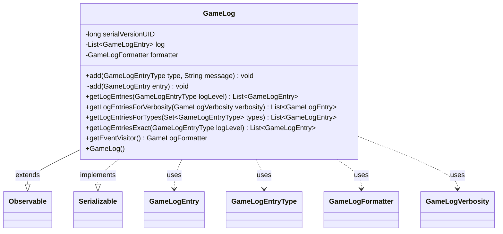

---
aliases:
  - GameLog
tags:
  - java/class
  - module/forge-game
  - pkg/forge/game
fqn: forge.game.GameLog
package: forge.game
module: forge-game
kind: Class
---

# GameLog

**Package:** `forge.game` &nbsp; **Module:** `forge-game` &nbsp; **Kind:** Class



## Relationships
**Uses:**
- [[forge.game.GameLogEntry|GameLogEntry]]
- [[forge.game.GameLogEntryType|GameLogEntryType]]
- [[forge.game.GameLogFormatter|GameLogFormatter]]
- [[forge.game.GameLogVerbosity|GameLogVerbosity]]

## Design Description

GameLog is a serializable, in-memory record of events that occur during a single game of Magic: the Gathering. It maintains an ordered list of `GameLogEntry` objects, each tagged with a `GameLogEntryType` denoting its severity or category. Callers append entries by type and message, and retrieve them—always in reverse-chronological order—filtered by an inclusive level threshold, an exact level, an explicit set of types, or a `GameLogVerbosity` preset that maps to a set of included types.

By extending `Observable`, GameLog notifies registered observers (typically UI components) whenever an entry is added, decoupling log production from presentation. It owns a transient `GameLogFormatter`, exposed via `getEventVisitor()`, that acts as a visitor translating game events into log entries; marking the formatter transient keeps it out of serialization, since it can be reconstructed. This design centralizes game-event recording while leaving rendering and verbosity choices to consumers.

## Source
`forge-game/src/main/java/forge/game/GameLog.java`

```java
/*
 * Forge: Play Magic: the Gathering.
 * Copyright (C) 2011  Forge Team
 *
 * This program is free software: you can redistribute it and/or modify
 * it under the terms of the GNU General Public License as published by
 * the Free Software Foundation, either version 3 of the License, or
 * (at your option) any later version.
 * 
 * This program is distributed in the hope that it will be useful,
 * but WITHOUT ANY WARRANTY; without even the implied warranty of
 * MERCHANTABILITY or FITNESS FOR A PARTICULAR PURPOSE.  See the
 * GNU General Public License for more details.
 * 
 * You should have received a copy of the GNU General Public License
 * along with this program.  If not, see <http://www.gnu.org/licenses/>.
 */
package forge.game;

import java.io.Serializable;
import java.util.ArrayList;
import java.util.List;
import java.util.Observable;
import java.util.Set;

/**
 * <p>
 * GameLog class.
 * 
 * @author Forge
 * @version $Id: GameLog.java 12297 2011-11-28 19:56:47Z slapshot5 $
 */
public class GameLog extends Observable implements Serializable {
    private static final long serialVersionUID = 6465283802022948827L;

    private final List<GameLogEntry> log = new ArrayList<>();

    private final transient GameLogFormatter formatter = new GameLogFormatter(this);

    /** Logging level:
     * 0 - Turn
     * 2 - Stack items
     * 3 - Poison Counters
     * 4 - Mana abilities
     * 6 - All Phase information
     */

    public GameLog() {
    }

    public void add(final GameLogEntryType type, final String message) {
        add(new GameLogEntry(type, message));
    }

    void add(GameLogEntry entry) {
        log.add(entry);
        this.setChanged();
        this.notifyObservers();
    }

    /**
     * Gets the log entries below a certain level as a list.
     *
     * @param logLevel the log level
     * @return the log text
     */
    public List<GameLogEntry> getLogEntries(final GameLogEntryType logLevel) { // null to fetch all
        final List<GameLogEntry> result = new ArrayList<>();
    
        for (int i = log.size() - 1; i >= 0; i--) {
            GameLogEntry le = log.get(i);
            if (logLevel == null || le.type().compareTo(logLevel) <= 0) {
                result.add(le);
            }
        }
        return result;
    }

    public List<GameLogEntry> getLogEntriesForVerbosity(final GameLogVerbosity verbosity) {
        return getLogEntriesForTypes(verbosity.getIncludedTypes());
    }

    public List<GameLogEntry> getLogEntriesForTypes(final Set<GameLogEntryType> types) {
        final List<GameLogEntry> result = new ArrayList<>();
        for (int i = log.size() - 1; i >= 0; i--) {
            GameLogEntry le = log.get(i);
            if (types.contains(le.type())) {
                result.add(le);
            }
        }
        return result;
    }

    public List<GameLogEntry> getLogEntriesExact(final GameLogEntryType logLevel) { // null to fetch all
        final List<GameLogEntry> result = new ArrayList<>();
    
        for (int i = log.size() - 1; i >= 0; i--) {
            GameLogEntry le = log.get(i);
            if (logLevel == null || le.type().compareTo(logLevel) == 0) {
                result.add(le);
            }
        }
        return result;
    }

    public GameLogFormatter getEventVisitor() {
        return formatter;
    }
}
```
