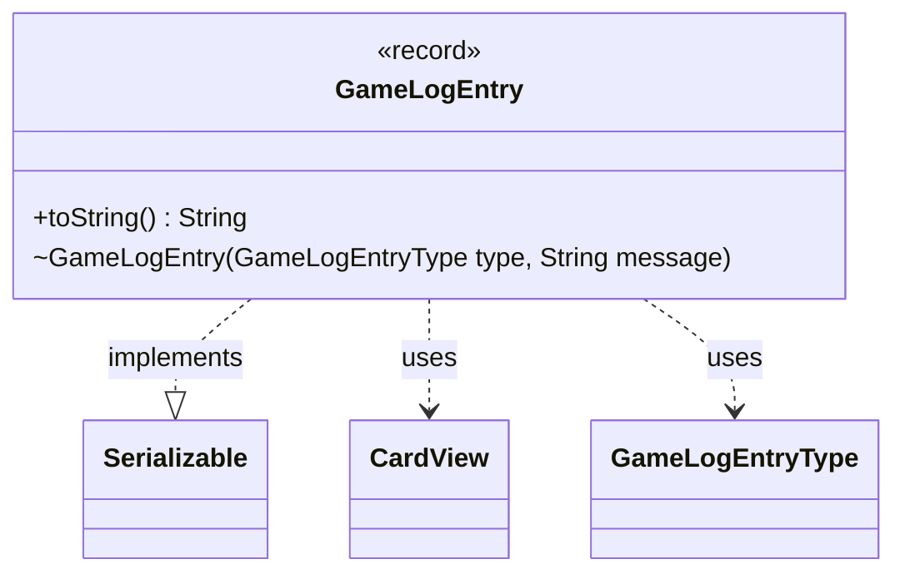

---
aliases:
  - GameLogEntry
tags:
  - java/record
  - module/forge-game
  - pkg/forge/game
fqn: forge.game.GameLogEntry
package: forge.game
module: forge-game
kind: Record
---

# GameLogEntry

**Package:** `forge.game` &nbsp; **Module:** `forge-game` &nbsp; **Kind:** Record



## Relationships
**Uses:**
- [[forge.game.GameLogEntryType|GameLogEntryType]]
- [[forge.game.card.CardView|CardView]]

## Design Description

GameLogEntry is an immutable record that captures a single timestamped event in a Forge game's running log. Each entry pairs a `GameLogEntryType` (categorizing the event and supplying its display caption) with a human-readable message and an optional `CardView` identifying the card that triggered the event.

A package-private secondary constructor lets callers omit the source card, defaulting it to `null`, which keeps the common case of card-less log lines concise. The record implements `Serializable` so entries can be persisted or transmitted alongside game state, and its `toString()` override formats output as `caption: message`, delegating the caption to the entry type so display labels stay centralized rather than duplicated at each call site.

## Source
`forge-game/src/main/java/forge/game/GameLogEntry.java`

```java
package forge.game;

import java.io.Serializable;

import forge.game.card.CardView;

public record GameLogEntry(GameLogEntryType type, String message, CardView sourceCard) implements Serializable {
    GameLogEntry(final GameLogEntryType type, final String message) {
        this(type, message, null);
    }

    @Override
    public String toString() {
        return type.getCaption() + ": " + message;
    }
}
```
