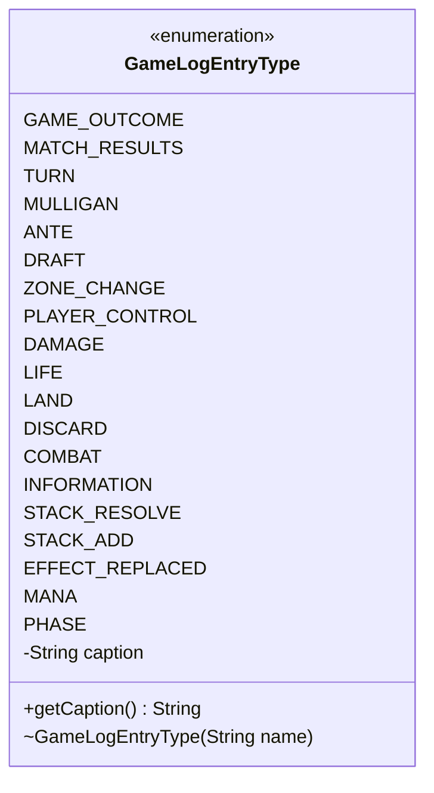

---
aliases:
  - GameLogEntryType
tags:
  - java/enum
  - module/forge-game
  - pkg/forge/game
fqn: forge.game.GameLogEntryType
package: forge.game
module: forge-game
kind: Enum
---

# GameLogEntryType

**Package:** `forge.game`   **Module:** `forge-game`   **Kind:** Enum



## Design Description

GameLogEntryType is a simple enumeration that categorizes entries written to the game log, classifying each logged event by the kind of game occurrence it represents—outcomes, turns, mulligans, zone changes, damage, life changes, combat, stack operations, mana, phases, and similar events. Each constant carries an associated human-readable `caption`, supplied through the private constructor and exposed via `getCaption()`, decoupling the symbolic enum name from its display text. The design intent is that of a lightweight, self-contained classification type: it has no behavior beyond holding and returning its caption, serving as a type-safe tag attached to log entries so that consumers can filter, group, or render game events by category without relying on free-form strings.

## Source
`forge-game/src/main/java/forge/game/GameLogEntryType.java`

```java
package forge.game;

public enum GameLogEntryType {
    GAME_OUTCOME("Game Outcome"),
    MATCH_RESULTS("Match Result"),
    TURN("Turn"),
    MULLIGAN("Mulligan"),
    ANTE("Ante"),
    DRAFT("Draft"),
    ZONE_CHANGE("Zone Change"),
    PLAYER_CONTROL("Player Control"),
    DAMAGE("Damage"),
    LIFE("Life"),
    LAND("Land"),
    DISCARD("Discard"),
    COMBAT("Combat"),
    INFORMATION("Information"),
    STACK_RESOLVE("Resolve Stack"),
    STACK_ADD("Add To Stack"),
    EFFECT_REPLACED("Replacement Effect"),
    MANA("Mana"),
    PHASE("Phase");
    
    private final String caption; 
    GameLogEntryType(String name) {
        this.caption = name;
    }

    public String getCaption() {
        return caption;
    }

}
```

## Python
`forge/game/GameLogEntryType.py`

```python
from enum import Enum


class GameLogEntryType(Enum):
    GAME_OUTCOME = "Game Outcome"
    MATCH_RESULTS = "Match Result"
    TURN = "Turn"
    MULLIGAN = "Mulligan"
    ANTE = "Ante"
    DRAFT = "Draft"
    ZONE_CHANGE = "Zone Change"
    PLAYER_CONTROL = "Player Control"
    DAMAGE = "Damage"
    LIFE = "Life"
    LAND = "Land"
    DISCARD = "Discard"
    COMBAT = "Combat"
    INFORMATION = "Information"
    STACK_RESOLVE = "Resolve Stack"
    STACK_ADD = "Add To Stack"
    EFFECT_REPLACED = "Replacement Effect"
    MANA = "Mana"
    PHASE = "Phase"

    def __init__(self, name: str):
        self.caption = name

    def getCaption(self) -> str:
        return self.caption
```
