---
aliases:
  - GameLogFormatter
tags:
  - java/class
  - module/forge-game
  - pkg/forge/game
fqn: forge.game.GameLogFormatter
package: forge.game
module: forge-game
kind: Class
---

# GameLogFormatter

**Package:** `forge.game` &nbsp; **Module:** `forge-game` &nbsp; **Kind:** Class

```mermaid
classDiagram
    class GameLogFormatter {
        -Localizer localizer
        -GameLog log
        +visit(GameEventGameOutcome ev) GameLogEntry
        +visit(GameEventScry ev) GameLogEntry
        +visit(GameEventSurveil ev) GameLogEntry
        +visit(GameEventSpellResolved ev) GameLogEntry
        +visit(GameEventSpellAbilityCast event) GameLogEntry
        +visit(GameEventCardModeChosen ev) GameLogEntry
        +visit(GameEventRandomLog ev) GameLogEntry
        +visit(GameEventPlayerControl event) GameLogEntry
        +visit(GameEventTurnPhase ev) GameLogEntry
        +visit(GameEventCardDamaged event) GameLogEntry
        +visit(GameEventLandPlayed ev) GameLogEntry
        +visit(GameEventTurnBegan event) GameLogEntry
        +visit(GameEventPlayerDamaged ev) GameLogEntry
        +visit(GameEventPlayerLivesChanged ev) GameLogEntry
        +visit(GameEventPlayerPoisoned ev) GameLogEntry
        +visit(GameEventPlayerRadiation ev) GameLogEntry
        +visit(GameEventAttackersDeclared ev) GameLogEntry
        +visit(GameEventBlockersDeclared ev) GameLogEntry
        +visit(GameEventMulligan ev) GameLogEntry
        +visit(GameEventCardForetold ev) GameLogEntry
        +visit(GameEventCardPlotted ev) GameLogEntry
        +visit(GameEventDoorChanged ev) GameLogEntry
        +visit(GameEventCardChangeZone ev) GameLogEntry
        +visit(GameEventAddLog ev) GameLogEntry
        +recieve(GameEvent ev) void
        +GameLogFormatter(GameLog gameLog)
    }
    GameLogFormatter --|> Base : extends
    GameLogFormatter ..> CardView : uses
    GameLogFormatter ..> GameEntityView : uses
    GameLogFormatter ..> GameEvent : uses
    GameLogFormatter ..> GameEventAddLog : uses
    GameLogFormatter ..> GameEventAttackersDeclared : uses
    GameLogFormatter ..> GameEventBlockersDeclared : uses
    GameLogFormatter ..> GameEventCardChangeZone : uses
    GameLogFormatter ..> GameEventCardDamaged : uses
    GameLogFormatter ..> GameEventCardForetold : uses
    GameLogFormatter ..> GameEventCardModeChosen : uses
    GameLogFormatter ..> GameEventCardPlotted : uses
    GameLogFormatter ..> GameEventDoorChanged : uses
    GameLogFormatter ..> GameEventGameOutcome : uses
    GameLogFormatter ..> GameEventLandPlayed : uses
    GameLogFormatter ..> GameEventMulligan : uses
    GameLogFormatter ..> GameEventPlayerControl : uses
    GameLogFormatter ..> GameEventPlayerDamaged : uses
    GameLogFormatter ..> GameEventPlayerLivesChanged : uses
    GameLogFormatter ..> GameEventPlayerPoisoned : uses
    GameLogFormatter ..> GameEventPlayerRadiation : uses
    GameLogFormatter ..> GameEventRandomLog : uses
    GameLogFormatter ..> GameEventScry : uses
    GameLogFormatter ..> GameEventSpellAbilityCast : uses
    GameLogFormatter ..> GameEventSpellResolved : uses
    GameLogFormatter ..> GameEventSurveil : uses
    GameLogFormatter ..> GameEventTurnBegan : uses
    GameLogFormatter ..> GameEventTurnPhase : uses
    GameLogFormatter ..> GameLog : uses
    GameLogFormatter ..> GameLogEntry : uses
    GameLogFormatter ..> IGameEventVisitor : uses
    GameLogFormatter ..> Localizer : uses
    GameLogFormatter ..> PlayerView : uses
    GameLogFormatter ..> ZoneType : uses
```



## Relationships
**Extends:**
- [[forge.game.event.IGameEventVisitor.Base|Base]]
**Uses:**
- [[forge.game.GameEntityView|GameEntityView]]
- [[forge.game.GameLog|GameLog]]
- [[forge.game.GameLogEntry|GameLogEntry]]
- [[forge.game.card.CardView|CardView]]
- [[forge.game.event.GameEvent|GameEvent]]
- [[forge.game.event.GameEventAddLog|GameEventAddLog]]
- [[forge.game.event.GameEventAttackersDeclared|GameEventAttackersDeclared]]
- [[forge.game.event.GameEventBlockersDeclared|GameEventBlockersDeclared]]
- [[forge.game.event.GameEventCardChangeZone|GameEventCardChangeZone]]
- [[forge.game.event.GameEventCardDamaged|GameEventCardDamaged]]
- [[forge.game.event.GameEventCardForetold|GameEventCardForetold]]
- [[forge.game.event.GameEventCardModeChosen|GameEventCardModeChosen]]
- [[forge.game.event.GameEventCardPlotted|GameEventCardPlotted]]
- [[forge.game.event.GameEventDoorChanged|GameEventDoorChanged]]
- [[forge.game.event.GameEventGameOutcome|GameEventGameOutcome]]
- [[forge.game.event.GameEventLandPlayed|GameEventLandPlayed]]
- [[forge.game.event.GameEventMulligan|GameEventMulligan]]
- [[forge.game.event.GameEventPlayerControl|GameEventPlayerControl]]
- [[forge.game.event.GameEventPlayerDamaged|GameEventPlayerDamaged]]
- [[forge.game.event.GameEventPlayerLivesChanged|GameEventPlayerLivesChanged]]
- [[forge.game.event.GameEventPlayerPoisoned|GameEventPlayerPoisoned]]
- [[forge.game.event.GameEventPlayerRadiation|GameEventPlayerRadiation]]
- [[forge.game.event.GameEventRandomLog|GameEventRandomLog]]
- [[forge.game.event.GameEventScry|GameEventScry]]
- [[forge.game.event.GameEventSpellAbilityCast|GameEventSpellAbilityCast]]
- [[forge.game.event.GameEventSpellResolved|GameEventSpellResolved]]
- [[forge.game.event.GameEventSurveil|GameEventSurveil]]
- [[forge.game.event.GameEventTurnBegan|GameEventTurnBegan]]
- [[forge.game.event.GameEventTurnPhase|GameEventTurnPhase]]
- [[forge.game.event.IGameEventVisitor|IGameEventVisitor]]
- [[forge.game.player.PlayerView|PlayerView]]
- [[forge.game.zone.ZoneType|ZoneType]]
- [[forge.util.Localizer|Localizer]]

## Design Description

GameLogFormatter is the engine's narration layer: it translates the stream of `GameEvent` objects emitted during play into human-readable, localized `GameLogEntry` records. It extends `IGameEventVisitor.Base<GameLogEntry>`, overriding one `visit` method per event type (scry, surveil, combat, damage, zone changes, mulligans, turn phases, and so on) so each event knows how to format itself via double dispatch. Subscribed to the game's event bus through its `@Subscribe`-annotated `recieve` method, it visits each incoming event and appends any non-null result to the injected `GameLog`.

Notable design intent is its strict separation of formatting from logging policy: it relies on `Localizer`, `CardTranslation`, and `Lang` to keep all player-facing text translatable and grammatically correct, and several visitors deliberately return null to suppress redundant entries—most visibly the `GameEventCardChangeZone` handler, which logs only ante additions and battlefield-to-graveyard/exile moves to avoid duplicating events already reported elsewhere.

## Source
`forge-game/src/main/java/forge/game/GameLogFormatter.java`

```java
package forge.game;

import java.util.Collection;
import java.util.Map.Entry;

import com.google.common.collect.Iterables;
import com.google.common.collect.Multimap;
import com.google.common.eventbus.Subscribe;

import forge.game.card.CardView;
import forge.game.card.CounterEnumType;
import forge.game.event.*;
import forge.game.event.GameEventCardDamaged.DamageType;
import forge.game.player.PlayerView;
import forge.game.zone.ZoneType;
import forge.util.*;

public class GameLogFormatter extends IGameEventVisitor.Base<GameLogEntry> {
    private final Localizer localizer = Localizer.getInstance();
    private final GameLog log;
    public GameLogFormatter(GameLog gameLog) {
        log = gameLog;
    }

    @Override
    public GameLogEntry visit(GameEventGameOutcome ev) {
        // Turn number counted from the starting player
        int lastTurn = (int)Math.ceil((float)ev.lastTurnNumber() / 2.0);
        log.add(GameLogEntryType.GAME_OUTCOME, localizer.getMessage("lblTurn") + " " + lastTurn);

        for (String outcome : ev.outcomeStrings()) {
            log.add(GameLogEntryType.GAME_OUTCOME, outcome);
        }
        return new GameLogEntry(GameLogEntryType.MATCH_RESULTS, ev.matchSummary());
    }

    @Override
    public GameLogEntry visit(GameEventScry ev) {
        String scryOutcome;
        if (ev.toTop() > 0 && ev.toBottom() > 0) {
            scryOutcome = localizer.getMessage("lblLogScryTopBottomLibrary").replace("%s", ev.player().toString()).replace("%top", String.valueOf(ev.toTop())).replace("%bottom", String.valueOf(ev.toBottom()));
        } else if (ev.toBottom() == 0) {
            scryOutcome = localizer.getMessage("lblLogScryTopLibrary").replace("%s", ev.player().toString()).replace("%top", String.valueOf(ev.toTop()));
        } else {
            scryOutcome = localizer.getMessage("lblLogScryBottomLibrary").replace("%s", ev.player().toString()).replace("%bottom", String.valueOf(ev.toBottom()));
        }

        return new GameLogEntry(GameLogEntryType.STACK_RESOLVE, scryOutcome);
    }

    @Override
    public GameLogEntry visit(GameEventSurveil ev) {
        String surveilOutcome;
        if (ev.toLibrary() > 0 && ev.toGraveyard() > 0) {
            surveilOutcome = localizer.getMessage("lblLogSurveiledToLibraryGraveyard", ev.player(), ev.toLibrary(), ev.toGraveyard());
        } else if (ev.toGraveyard() == 0) {
            surveilOutcome = localizer.getMessage("lblLogSurveiledToLibrary", ev.player(), ev.toLibrary());
        } else {
            surveilOutcome = localizer.getMessage("lblLogSurveiledToGraveyard", ev.player(), ev.toGraveyard());
        }

        return new GameLogEntry(GameLogEntryType.STACK_RESOLVE, surveilOutcome);
    }

    @Override
    public GameLogEntry visit(GameEventSpellResolved ev) {
        String messageForLog = ev.hasFizzled() ? localizer.getMessage("lblLogCardAbilityFizzles", ev.spell().getHostCard().getName()) : ev.stackDescription();
        return new GameLogEntry(GameLogEntryType.STACK_RESOLVE, messageForLog, ev.spell().getHostCard());
    }

    @Override
    public GameLogEntry visit(GameEventSpellAbilityCast event) {
        String player = event.si().getActivatingPlayer().getName();
        String action = event.sa().isSpell() ? localizer.getMessage("lblCast")
                : event.si().isTrigger() ? localizer.getMessage("lblTriggered")
                        : localizer.getMessage("lblActivated");
        String siText = event.si() != null ? event.si().getText() : "";
        String object = siText != null && siText.startsWith("Morph ")
                ? localizer.getMessage("lblMorph")
                : event.sa().getHostCard().getName();

        String messageForLog;

        if (event.targetDescription() != null) {
            messageForLog = localizer.getMessage("lblLogPlayerActionObjectWitchTarget", player, action, object, event.targetDescription());
        } else {
            messageForLog = localizer.getMessage("lblLogPlayerActionObject", player, action, object);
        }

        return new GameLogEntry(GameLogEntryType.STACK_ADD, messageForLog, event.sa().getHostCard());
    }

    @Override
    public GameLogEntry visit(GameEventCardModeChosen ev) {
        if (!ev.log()) {
            return null;
        }

        String modeChoiceOutcome;
        if (ev.random()) {
            modeChoiceOutcome = localizer.getMessage("lblLogRandomMode", ev.cardName(), ev.mode());
        } else {
            modeChoiceOutcome = localizer.getMessage("lblLogPlayerChosenModeForCard",
                    ev.player().toString(), ev.mode(), ev.cardName());
        }
        String name = CardTranslation.getTranslatedName(ev.cardName());
        modeChoiceOutcome = TextUtil.fastReplace(modeChoiceOutcome, "CARDNAME", name);
        modeChoiceOutcome = TextUtil.fastReplace(modeChoiceOutcome, "NICKNAME",
                Lang.getInstance().getNickName(name));
        return new GameLogEntry(GameLogEntryType.STACK_RESOLVE, modeChoiceOutcome);
    }

    @Override
    public GameLogEntry visit(GameEventRandomLog ev) {
        return new GameLogEntry(GameLogEntryType.STACK_RESOLVE, ev.message());
    }

    @Override
    public GameLogEntry visit(final GameEventPlayerControl event) {
        final String newLobbyPlayerName = event.newLobbyPlayerName();
        final PlayerView p = event.player();

        final String message;
        if (newLobbyPlayerName == null) {
            message = localizer.getMessage("lblLogPlayerHasRestoredControlThemself", p.getName());
        } else {
            if (newLobbyPlayerName.equals(p.getName())) return null;
            message = localizer.getMessage("lblLogPlayerControlledTargetPlayer", p.getName(), newLobbyPlayerName);
        }
        return new GameLogEntry(GameLogEntryType.PLAYER_CONTROL, message);
    }

    @Override
    public GameLogEntry visit(GameEventTurnPhase ev) {
        PlayerView p = ev.playerTurn();
        return new GameLogEntry(GameLogEntryType.PHASE, ev.phaseDesc() + Lang.getInstance().getPossessedObject(p.getName(), ev.phase().nameForUi));
    }

    @Override
    public GameLogEntry visit(GameEventCardDamaged event) {
        String additionalLog = "";
        if (event.type() == DamageType.Deathtouch) {
            additionalLog = localizer.getMessage("lblDeathtouch");
        }
        if (event.type() == DamageType.M1M1Counters) {
            additionalLog = localizer.getMessage("lblAsM1M1Counters");
        }
        if (event.type() == DamageType.LoyaltyLoss) {
            additionalLog = localizer.getMessage("lblRemovingNLoyaltyCounter", event.amount());
        }
        String message = localizer.getMessage("lblSourceDealsNDamageToDest", event.source(), event.amount(), additionalLog.isEmpty() ? "" : " (" + additionalLog + ")", event.card().toString());
        return new GameLogEntry(GameLogEntryType.DAMAGE, message, event.source());
    }

    /* (non-Javadoc)
     * @see forge.game.event.IGameEventVisitor.Base#visit(forge.game.event.GameEventLandPlayed)
     */
    @Override
    public GameLogEntry visit(GameEventLandPlayed ev) {
        String message = localizer.getMessage("lblLogPlayerPlayedLand", ev.player(), ev.land());
        return new GameLogEntry(GameLogEntryType.LAND, message, ev.land());
    }

    @Override
    public GameLogEntry visit(GameEventTurnBegan event) {
        String message = localizer.getMessage("lblLogTurnNOwnerByPlayer", event.turnNumber(), event.turnOwner());
        return new GameLogEntry(GameLogEntryType.TURN, message);
    }

    @Override
    public GameLogEntry visit(GameEventPlayerDamaged ev) {
        String extra = ev.infect() ? localizer.getMessage("lblLogAsPoisonCounters") : "";
        String damageType = ev.combat() ? localizer.getMessage("lblCombat") : localizer.getMessage("lblNonCombat");
        String message = localizer.getMessage("lblLogSourceDealsNDamageOfTypeToDest", ev.source(),
                            ev.amount(), damageType, ev.target(), extra);
        return new GameLogEntry(GameLogEntryType.DAMAGE, message, ev.source());
    }

    @Override
    public GameLogEntry visit(GameEventPlayerLivesChanged ev) {
        String message = localizer.getMessage("lblLogPlayerLifeChange", ev.player(), ev.oldLives(), ev.newLives());
        return new GameLogEntry(GameLogEntryType.LIFE, message);
    }

    @Override
    public GameLogEntry visit(GameEventPlayerPoisoned ev) {
        String message = localizer.getMessage("lblLogPlayerReceivesNPosionCounterFrom",
                            ev.receiver(), ev.amount(), ev.source());
        return new GameLogEntry(GameLogEntryType.DAMAGE, message);
    }

    @Override
    public GameLogEntry visit(GameEventPlayerRadiation ev) {
        String message;
        final int change = ev.change();
        String radCtr = CounterEnumType.RAD.getName().toLowerCase() + " " +
                Localizer.getInstance().getMessage("lblCounter").toLowerCase();
        if (change >= 0) message = localizer.getMessage("lblLogPlayerRadiation",
                ev.receiver().toString(), Lang.nounWithNumeralExceptOne(String.valueOf(change), radCtr),
                ev.source().toString());
        else message = localizer.getMessage("lblLogPlayerRadRemove",
                ev.receiver().toString(), Lang.nounWithNumeralExceptOne(String.valueOf(Math.abs(change)), radCtr));
        return new GameLogEntry(GameLogEntryType.DAMAGE, message);
    }

    @Override
    public GameLogEntry visit(final GameEventAttackersDeclared ev) {
        final StringBuilder sb = new StringBuilder();

        // Loop through Defenders
        // Append Defending Player/Planeswalker

        // Not a big fan of the triple nested loop here
        for (GameEntityView k : ev.attackersMap().keySet()) {
            Collection<CardView> attackers = ev.attackersMap().get(k);
            if (attackers == null || attackers.isEmpty()) {
                continue;
            }
            if (sb.length() > 0) sb.append("\n");
            sb.append(localizer.getMessage("lblLogPlayerAssignedAttackerToAttackTarget", ev.player(), Lang.joinHomogenous(attackers), k));
        }
        if (sb.length() == 0) return null;
        return new GameLogEntry(GameLogEntryType.COMBAT, sb.toString());
    }

    @Override
    public GameLogEntry visit(final GameEventBlockersDeclared ev) {
        final StringBuilder sb = new StringBuilder();

        // Loop through Defenders
        // Append Defending Player/Planeswalker

        for (Entry<GameEntityView, Multimap<CardView, CardView>> kv : ev.blockers().entrySet()) {
            GameEntityView defender = kv.getKey();
            Multimap<CardView, CardView> attackers = kv.getValue();
            if (attackers == null || attackers.isEmpty()) {
                continue;
            }
            if (sb.length() > 0) {
                sb.append("\n");
            }

            String controllerName;
            if (defender instanceof CardView c && c.getController() != null) {
                controllerName = c.getCurrentState().isBattle() ? c.getProtectingPlayer().getName() : c.getController().getName();
            } else {
                controllerName = defender.getName();
            }

            boolean firstAttacker = true;
            for (final Entry<CardView, Collection<CardView>> att : attackers.asMap().entrySet()) {
                if (!firstAttacker) sb.append("\n");

                Collection<CardView> blockers = att.getValue();
                if (blockers.isEmpty() || Iterables.get(blockers, 0) == att.getKey()) {
                    sb.append(localizer.getMessage("lblLogPlayerDidntBlockAttacker", controllerName, att.getKey()));
                } else {
                    sb.append(localizer.getMessage("lblLogPlayerAssignedBlockerToBlockAttacker", controllerName, Lang.joinHomogenous(blockers), att.getKey()));
                }
                firstAttacker = false;
            }
        }

        return new GameLogEntry(GameLogEntryType.COMBAT, sb.toString());
    }

    @Override
    public GameLogEntry visit(GameEventMulligan ev) {
        String message = localizer.getMessage("lblPlayerHasMulliganedDownToNCards").replace("%d", String.valueOf(ev.player().getZoneSize(ZoneType.Hand))).replace("%s", ev.player().toString());
        return new GameLogEntry(GameLogEntryType.MULLIGAN, message);
    }

    @Override
    public GameLogEntry visit(GameEventCardForetold ev) {
        return new GameLogEntry(GameLogEntryType.STACK_RESOLVE, ev.toString());
    }

    @Override
    public GameLogEntry visit(GameEventCardPlotted ev) {
        return new GameLogEntry(GameLogEntryType.STACK_RESOLVE, ev.toString(), ev.card());
    }

    @Override
    public GameLogEntry visit(GameEventDoorChanged ev) {
        return new GameLogEntry(GameLogEntryType.STACK_RESOLVE, ev.toString());
    }

    @Override
    public GameLogEntry visit(GameEventCardChangeZone ev) {
        if (ev.from() == null || ev.to() == null) {
            return null;
        }
        final ZoneType from = ev.from().zoneType();
        final ZoneType to = ev.to().zoneType();
        // Log mid-game ante additions (e.g. Contract from Below, Demonic Attorney)
        if (to == ZoneType.Ante && from != ZoneType.Ante) {
            final CardView c = ev.card();
            return new GameLogEntry(GameLogEntryType.ANTE,
                    (c != null ? c.getOwner() + " anted " + c : "a card was anted"));
        }
        // Only log Battlefield -> Graveyard/Exile to avoid duplicating entries
        // already covered by other events (land played, spell cast, discard, etc.)
        if (from != ZoneType.Battlefield || (to != ZoneType.Graveyard && to != ZoneType.Exile)) {
            return null;
        }
        final String cardName = ev.card() != null ? ev.card().toString() : "a card";
        final String message = localizer.getMessage("lblLogZoneChange", cardName, to, from);
        return new GameLogEntry(GameLogEntryType.ZONE_CHANGE, message, ev.card());
    }

    @Override
    public GameLogEntry visit(GameEventAddLog ev) {
        return new GameLogEntry(ev.type(), ev.message(), ev.sourceCard());
    }

    @Subscribe
    public void recieve(GameEvent ev) {
        GameLogEntry le = ev.visit(this);
        if (le != null) {
            log.add(le);
        }
    }
}
```
