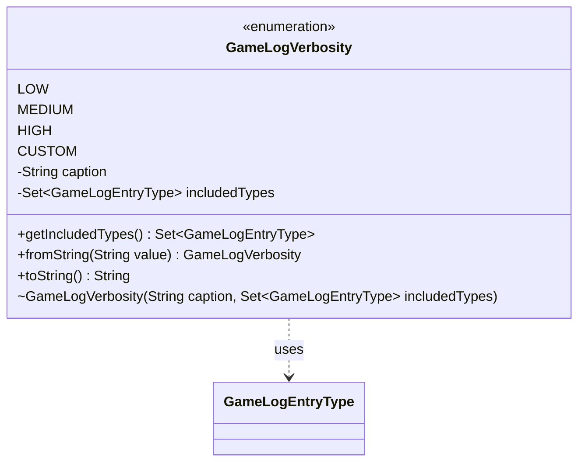

---
aliases:
  - GameLogVerbosity
tags:
  - java/enum
  - module/forge-game
  - pkg/forge/game
fqn: forge.game.GameLogVerbosity
package: forge.game
module: forge-game
kind: Enum
---

# GameLogVerbosity

**Package:** `forge.game`   **Module:** `forge-game`   **Kind:** Enum



## Relationships
**Uses:**
- [[forge.game.GameLogEntryType|GameLogEntryType]]

## Design Description

`GameLogVerbosity` is an enumeration that defines preset filtering profiles for the game log, mapping each verbosity level to the set of `GameLogEntryType` events it should display. The four constants — `LOW`, `MEDIUM`, `HIGH`, and `CUSTOM` — pair a human-readable caption with an immutable `EnumSet` of included entry types, ranging from a minimal outcome-and-turn summary up to the full event set (`allOf`) and an empty set reserved for user-defined selection. Consumers query `getIncludedTypes()` to decide which log entries to render.

The enum collaborates closely with `GameLogEntryType`, treating its members as the vocabulary of loggable events. Notable design intent includes the dual-format `fromString` parser, which accepts either the enum name or the display caption and degrades gracefully to `MEDIUM` rather than throwing on unrecognized input, and the overridden `toString` returning the caption — making the type convenient and robust for persistence and UI binding.

## Source
`forge-game/src/main/java/forge/game/GameLogVerbosity.java`

```java
package forge.game;

import java.util.EnumSet;
import java.util.Set;

public enum GameLogVerbosity {
    LOW("Low",
        EnumSet.of(GameLogEntryType.GAME_OUTCOME, GameLogEntryType.MATCH_RESULTS,
                   GameLogEntryType.TURN, GameLogEntryType.MULLIGAN,
                   GameLogEntryType.ANTE, GameLogEntryType.DAMAGE)),
    MEDIUM("Medium",
        EnumSet.of(GameLogEntryType.GAME_OUTCOME, GameLogEntryType.MATCH_RESULTS,
                   GameLogEntryType.TURN, GameLogEntryType.MULLIGAN,
                   GameLogEntryType.ANTE, GameLogEntryType.DAMAGE,
                   GameLogEntryType.ZONE_CHANGE, GameLogEntryType.LAND,
                   GameLogEntryType.DISCARD, GameLogEntryType.COMBAT,
                   GameLogEntryType.STACK_ADD, GameLogEntryType.STACK_RESOLVE,
                   GameLogEntryType.LIFE)),
    HIGH("High",
        EnumSet.allOf(GameLogEntryType.class)),
    CUSTOM("Custom",
        EnumSet.noneOf(GameLogEntryType.class));

    private final String caption;
    private final Set<GameLogEntryType> includedTypes;

    GameLogVerbosity(String caption, Set<GameLogEntryType> includedTypes) {
        this.caption = caption;
        this.includedTypes = includedTypes;
    }

    public Set<GameLogEntryType> getIncludedTypes() {
        return includedTypes;
    }

    /** Parse from either enum name ("HIGH") or caption ("High"). */
    public static GameLogVerbosity fromString(String value) {
        for (GameLogVerbosity v : values()) {
            if (v.name().equalsIgnoreCase(value) || v.caption.equals(value)) {
                return v;
            }
        }
        return MEDIUM; // safe fallback
    }

    @Override
    public String toString() {
        return caption;
    }
}
```

## Python
`forge/game/GameLogVerbosity.py`

```python
from forge.game.GameLogEntryType import GameLogEntryType
from enum import Enum


class GameLogVerbosity(Enum):
    LOW = ("Low",
           frozenset({GameLogEntryType.GAME_OUTCOME, GameLogEntryType.MATCH_RESULTS,
                      GameLogEntryType.TURN, GameLogEntryType.MULLIGAN,
                      GameLogEntryType.ANTE, GameLogEntryType.DAMAGE}))
    MEDIUM = ("Medium",
              frozenset({GameLogEntryType.GAME_OUTCOME, GameLogEntryType.MATCH_RESULTS,
                         GameLogEntryType.TURN, GameLogEntryType.MULLIGAN,
                         GameLogEntryType.ANTE, GameLogEntryType.DAMAGE,
                         GameLogEntryType.ZONE_CHANGE, GameLogEntryType.LAND,
                         GameLogEntryType.DISCARD, GameLogEntryType.COMBAT,
                         GameLogEntryType.STACK_ADD, GameLogEntryType.STACK_RESOLVE,
                         GameLogEntryType.LIFE}))
    HIGH = ("High",
            frozenset(GameLogEntryType))
    CUSTOM = ("Custom",
              frozenset())

    def __init__(self, caption: str, includedTypes: set[GameLogEntryType]):
        self.caption = caption
        self.includedTypes = includedTypes

    def getIncludedTypes(self) -> set[GameLogEntryType]:
        return self.includedTypes

    @staticmethod
    def fromString(value: str) -> "GameLogVerbosity":
        for v in GameLogVerbosity:
            if v.name.lower() == (value.lower() if value is not None else value) or v.caption == value:
                return v
        return GameLogVerbosity.MEDIUM  # safe fallback

    def __str__(self) -> str:
        return self.caption
```
