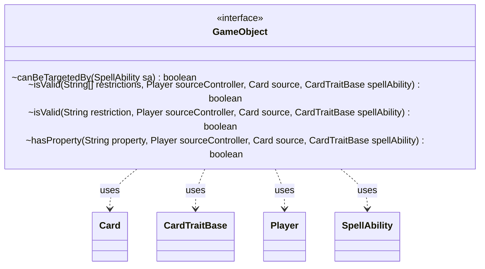

---
aliases:
  - GameObject
tags:
  - java/interface
  - module/forge-game
  - pkg/forge/game
fqn: forge.game.GameObject
package: forge.game
module: forge-game
kind: Interface
---

# GameObject

**Package:** `forge.game`   **Module:** `forge-game`   **Kind:** Interface



## Relationships
**Uses:**
- [[forge.game.CardTraitBase|CardTraitBase]]
- [[forge.game.card.Card|Card]]
- [[forge.game.player.Player|Player]]
- [[forge.game.spellability.SpellAbility|SpellAbility]]

## Design Description

`GameObject` is a foundational marker interface in the `forge-game` module, implemented by every in-game entity—chiefly `Card` and `Player`—that can be referenced, targeted, or filtered by game rules. It defines the common contract for participating in Forge's text-based restriction system: `canBeTargetedBy` gates spell targeting, the overloaded `isValid` methods test an object against one or an array of restriction strings, and `hasProperty` checks a single named property, all evaluated in the context of a source `Card`, its controlling `Player`, and the originating `CardTraitBase`/`SpellAbility`.

The design relies on `default` methods that conservatively return `false`, letting implementors override only the predicates relevant to them while remaining usable as a lightweight mixin. The array-based `isValid` delegates to the single-restriction overload with short-circuit OR semantics, centralizing the any-match logic so concrete types need only implement per-restriction evaluation. This keeps the targeting and matching vocabulary uniform across otherwise unrelated game objects.

## Source
`forge-game/src/main/java/forge/game/GameObject.java`

```java
package forge.game;

import forge.game.card.Card;
import forge.game.player.Player;
import forge.game.spellability.SpellAbility;

public interface GameObject {

    default boolean canBeTargetedBy(final SpellAbility sa) {
        return false;
    }
    
    /**
     * Checks if is valid.
     * 
     * @param restrictions
     *            the restrictions
     * @param sourceController
     *            the source controller
     * @param source
     *            the source
     * @param spellAbility
     * @return true, if is valid
     */
    default boolean isValid(final String[] restrictions, final Player sourceController, final Card source, CardTraitBase spellAbility) {
        for (final String restriction : restrictions) {
            if (this.isValid(restriction, sourceController, source, spellAbility)) {
                return true;
            }
        }
        return false;
    }

    /**
     * Checks if is valid.
     * 
     * @param restriction
     *            the restriction
     * @param sourceController
     *            the source controller
     * @param source
     *            the source
     * @param spellAbility
     * @return true, if is valid
     */
    default boolean isValid(final String restriction, final Player sourceController, final Card source, CardTraitBase spellAbility) {
        return false;
    }

    /**
     * Checks for property.
     * 
     * @param property
     *            the property
     * @param sourceController
     *            the source controller
     * @param source
     *            the source
     * @param spellAbility
     * @return true, if successful
     */
    default boolean hasProperty(final String property, final Player sourceController, final Card source, CardTraitBase spellAbility) {
        return false;
    }
}
```

## Python
`forge/game/GameObject.py`

```python
from forge.game.CardTraitBase import CardTraitBase
from forge.game.card.Card import Card
from forge.game.player.Player import Player
from forge.game.spellability.SpellAbility import SpellAbility


class GameObject:

    def canBeTargetedBy(self, sa: SpellAbility) -> bool:
        return False

    def isValid(self, restrictions, sourceController: Player, source: Card, spellAbility: CardTraitBase) -> bool:
        if isinstance(restrictions, str):
            return self._isValidSingle(restrictions, sourceController, source, spellAbility)
        for restriction in restrictions:
            if self._isValidSingle(restriction, sourceController, source, spellAbility):
                return True
        return False

    def _isValidSingle(self, restriction: str, sourceController: Player, source: Card, spellAbility: CardTraitBase) -> bool:
        return False

    def hasProperty(self, property: str, sourceController: Player, source: Card, spellAbility: CardTraitBase) -> bool:
        return False
```
