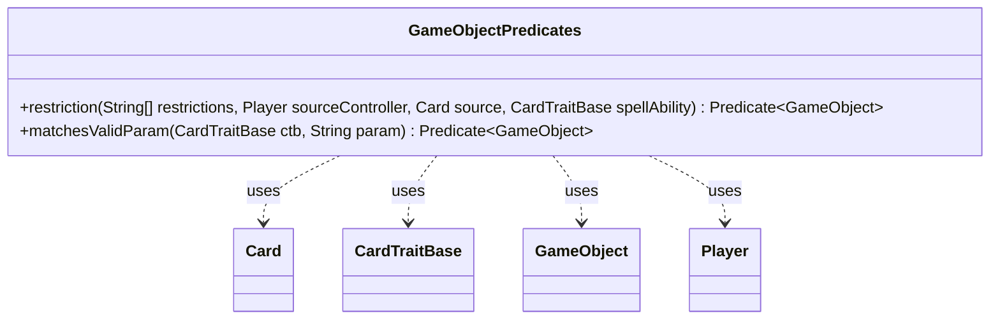

---
aliases:
  - GameObjectPredicates
tags:
  - java/class
  - module/forge-game
  - pkg/forge/game
fqn: forge.game.GameObjectPredicates
package: forge.game
module: forge-game
kind: Class
---

# GameObjectPredicates

**Package:** `forge.game` &nbsp; **Module:** `forge-game` &nbsp; **Kind:** Class



## Relationships
**Uses:**
- [[forge.game.CardTraitBase|CardTraitBase]]
- [[forge.game.GameObject|GameObject]]
- [[forge.game.card.Card|Card]]
- [[forge.game.player.Player|Player]]

## Design Description

`GameObjectPredicates` is a final, non-instantiable utility class that supplies static factory methods producing `Predicate<GameObject>` instances for filtering game objects within the Forge engine. Its two methods adapt Forge's validity-checking machinery into the `java.util.function.Predicate` abstraction: `restriction` wraps a `GameObject`'s `isValid` test against an array of restriction strings, evaluated relative to a controlling `Player`, a source `Card`, and an originating `CardTraitBase`, while null-guarding each candidate; `matchesValidParam` defers to a `CardTraitBase`'s own parameter-matching logic.

By collaborating with `Card`, `Player`, and `CardTraitBase` rather than owning state, the class acts as a stateless bridge between Forge's domain-specific targeting rules and standard functional-style stream and collection filtering. The `final` modifier and exclusively static API signal deliberate use as a namespace for reusable predicate constructors rather than an object with behavior.

## Source
`forge-game/src/main/java/forge/game/GameObjectPredicates.java`

```java
/*
 * Forge: Play Magic: the Gathering.
 * Copyright (C) 2011  Forge Team
 *
 * This program is free software: you can redistribute it and/or modify
 * it under the terms of the GNU General Public License as published by
 * the Free Software Foundation, either version 3 of the License, or
 * (at your option) any later version.
 *
 * This program is distributed in the hope that it will be useful,
 * but WITHOUT ANY WARRANTY; without even the implied warranty of
 * MERCHANTABILITY or FITNESS FOR A PARTICULAR PURPOSE.  See the
 * GNU General Public License for more details.
 *
 * You should have received a copy of the GNU General Public License
 * along with this program.  If not, see <http://www.gnu.org/licenses/>.
 */
package forge.game;

import forge.game.card.Card;
import forge.game.player.Player;

import java.util.function.Predicate;


/**
 * <p>
 * Predicate<GameObject> interface.
 * </p>
 *
 * @author Forge
 */
public final class GameObjectPredicates {

    public static Predicate<GameObject> restriction(final String[] restrictions, final Player sourceController, final Card source, final CardTraitBase spellAbility) {
        return c -> c != null && c.isValid(restrictions, sourceController, source, spellAbility);
    }

    public static Predicate<GameObject> matchesValidParam(final CardTraitBase ctb, final String param) {
        return c -> ctb.matchesValidParam(param, c);
    }

}
```

## Python
`forge/game/GameObjectPredicates.py`

```python
from forge.game.CardTraitBase import CardTraitBase
from forge.game.GameObject import GameObject
from forge.game.card.Card import Card
from forge.game.player.Player import Player

from typing import Callable


class GameObjectPredicates:

    @staticmethod
    def restriction(restrictions: list[str], sourceController: Player, source: Card, spellAbility: CardTraitBase) -> Callable[[GameObject], bool]:
        return lambda c: c is not None and c.isValid(restrictions, sourceController, source, spellAbility)

    @staticmethod
    def matchesValidParam(ctb: CardTraitBase, param: str) -> Callable[[GameObject], bool]:
        return lambda c: ctb.matchesValidParam(param, c)
```
