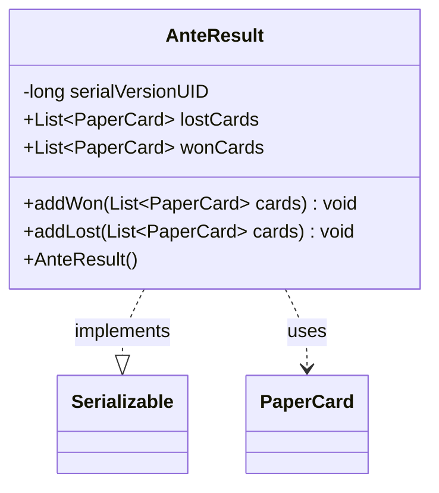

---
aliases:
  - AnteResult
tags:
  - java/class
  - module/forge-game
  - pkg/forge/game
fqn: forge.game.GameOutcome.AnteResult
package: forge.game
module: forge-game
kind: Class
---

# AnteResult

**Package:** `forge.game`   **Module:** `forge-game`   **Kind:** Class



## Relationships
**Uses:**
- [[forge.item.PaperCard|PaperCard]]

## Design Description

AnteResult is a static nested helper of `GameOutcome` that records the ante-stakes settlement of a finished game by tracking which `PaperCard`s a player won versus lost. It exposes two mutable lists (`wonCards`, `lostCards`) and the bulk mutators `addWon`/`addLost`, which reconcile additions against the opposite list—removing a card from `lostCards` when it is later won, and vice versa—so the two collections never redundantly hold the same card and the net result reflects the final ownership change.

By implementing `Serializable` (with an explicit `serialVersionUID`), it is designed to be persisted alongside the enclosing game outcome, supporting saved games and match history. The reconciliation logic in its mutators is the class's main design intent: rather than being a passive data holder, it actively maintains a consistent, deduplicated tally as cards are reported won or lost over the course of resolution.

## Source
`forge-game/src/main/java/forge/game/GameOutcome.java` — declaration excerpt

```java
    public static class AnteResult implements Serializable {
        private static final long serialVersionUID = 5087554550408543192L;

        public final List<PaperCard> lostCards = Lists.newArrayList();
        public final List<PaperCard> wonCards = Lists.newArrayList();

        public AnteResult() {
        }

        public void addWon(List<PaperCard> cards) {
            for(PaperCard c : cards) {
                if(lostCards.contains(c))
                    lostCards.remove(c);
                else
                    wonCards.add(c);
            }
        }

        public void addLost(List<PaperCard> cards) {
            for(PaperCard c : cards) {
                if(wonCards.contains(c))
                    wonCards.remove(c);
                else
                    lostCards.add(c);
            }
        }
    }
```
