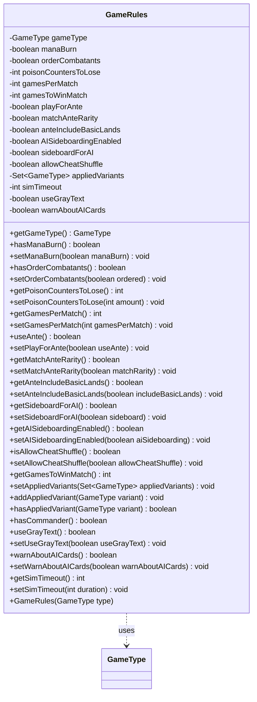

---
aliases:
  - GameRules
tags:
  - java/class
  - module/forge-game
  - pkg/forge/game
fqn: forge.game.GameRules
package: forge.game
module: forge-game
kind: Class
---

# GameRules

**Package:** `forge.game`   **Module:** `forge-game`   **Kind:** Class



## Relationships
**Uses:**
- [[forge.game.GameType|GameType]]

## Design Description

Forge's central container for the configurable parameters of a single game or match, holding both rule settings (mana burn, poison counters to lose, ante and its rarity/basic-land options, combatant ordering) and harness-level preferences (AI sideboarding, cheat-shuffle, simulation timeout, gray text, AI-card warnings). It pairs an immutable `gameType`, fixed at construction, with otherwise mutable fields exposed through plain getters and setters, acting as a passive settings record rather than enforcing game logic.

Its only collaborator is the `GameType` enum: a single `GameType` defines the base format, while an `EnumSet<GameType>` of applied variants layers additional modes on top. The class encodes a little derived logic—`setGamesPerMatch` recomputes `gamesToWinMatch` as a majority, and `hasCommander` treats Commander, Oathbreaker, Tiny Leaders, and Brawl as commander-style variants—keeping these conventions centralized rather than scattered across callers.

## Source
`forge-game/src/main/java/forge/game/GameRules.java`

```java
package forge.game;

import java.util.EnumSet;
import java.util.Set;

public class GameRules {
    private final GameType gameType;
    private boolean manaBurn;
    private boolean orderCombatants;
    private int poisonCountersToLose = 10; // is commonly 10, but turns into 15 for 2HG
    private int gamesPerMatch = 3;
    private int gamesToWinMatch = 2;
    private boolean playForAnte = false;
    private boolean matchAnteRarity = false;
    private boolean anteIncludeBasicLands = false;
    private boolean AISideboardingEnabled = false;
    private boolean sideboardForAI = false;
    private boolean allowCheatShuffle = false;
    private final Set<GameType> appliedVariants = EnumSet.noneOf(GameType.class);
    private int simTimeout = 120;

    // it's a preference, not rule... but I could hardly find a better place for it
    private boolean useGrayText;

    // whether to warn about cards AI can't play well
    private boolean warnAboutAICards = true;

    public GameRules(final GameType type) {
        this.gameType = type;
    }

    public GameType getGameType() {
        return gameType;
    }

    public boolean hasManaBurn() {
        return manaBurn;
    }
    public void setManaBurn(final boolean manaBurn) {
        this.manaBurn = manaBurn;
    }

    public boolean hasOrderCombatants() {
        return orderCombatants;
    }
    public void setOrderCombatants(final boolean ordered) {
        this.orderCombatants = ordered;
    }

    public int getPoisonCountersToLose() {
        return poisonCountersToLose;
    }
    public void setPoisonCountersToLose(final int amount) {
        this.poisonCountersToLose = amount;
    }

    public int getGamesPerMatch() {
        return gamesPerMatch;
    }
    public void setGamesPerMatch(final int gamesPerMatch) {
        this.gamesPerMatch = gamesPerMatch;
        this.gamesToWinMatch = gamesPerMatch / 2 + 1;
    }

    public boolean useAnte() {
        return playForAnte;
    }
    public void setPlayForAnte(final boolean useAnte) {
        this.playForAnte = useAnte;
    }

    public boolean getMatchAnteRarity() {
        return matchAnteRarity;
    }
    public void setMatchAnteRarity(final boolean matchRarity) {
        matchAnteRarity = matchRarity;
    }

    public boolean getAnteIncludeBasicLands() {
        return anteIncludeBasicLands;
    }
    public void setAnteIncludeBasicLands(final boolean includeBasicLands) {
        anteIncludeBasicLands = includeBasicLands;
    }

    public boolean getSideboardForAI() {
        return sideboardForAI;
    }
    public void setSideboardForAI(final boolean sideboard) {
        sideboardForAI = sideboard;
    }

    public boolean getAISideboardingEnabled() {
        return AISideboardingEnabled;
    }
    public void setAISideboardingEnabled(final boolean aiSideboarding) {
        AISideboardingEnabled = aiSideboarding;
    }

    public boolean isAllowCheatShuffle() {
        return allowCheatShuffle;
    }
    public void setAllowCheatShuffle(boolean allowCheatShuffle) {
        this.allowCheatShuffle = allowCheatShuffle;
    }

    public int getGamesToWinMatch() {
        return gamesToWinMatch;
    }

    public void setAppliedVariants(final Set<GameType> appliedVariants) {
        if (appliedVariants != null && !appliedVariants.isEmpty())
            this.appliedVariants.addAll(appliedVariants);
    }

    public void addAppliedVariant(final GameType variant) {
        this.appliedVariants.add(variant);
    }

    public boolean hasAppliedVariant(final GameType variant) {
        return appliedVariants.contains(variant);
    }

    public boolean hasCommander() {
        return appliedVariants.contains(GameType.Commander)
                || appliedVariants.contains(GameType.Oathbreaker)
                || appliedVariants.contains(GameType.TinyLeaders)
                || appliedVariants.contains(GameType.Brawl);
    }

    public boolean useGrayText() {
        return useGrayText;
    }
    public void setUseGrayText(final boolean useGrayText) {
        this.useGrayText = useGrayText;
    }

    public boolean warnAboutAICards() {
        return warnAboutAICards;
    }
    public void setWarnAboutAICards(final boolean warnAboutAICards) {
        this.warnAboutAICards = warnAboutAICards;
    }

    public int getSimTimeout() {
        return this.simTimeout;
    }

    public void setSimTimeout(final int duration) {
        this.simTimeout = duration;
    }
}
```

## Python
`forge/game/GameRules.py`

```python
from forge.game.GameType import GameType


class GameRules:
    def __init__(self, type: GameType):
        self.gameType = type
        self.manaBurn = False
        self.orderCombatants = False
        self.poisonCountersToLose = 10  # is commonly 10, but turns into 15 for 2HG
        self.gamesPerMatch = 3
        self.gamesToWinMatch = 2
        self.playForAnte = False
        self.matchAnteRarity = False
        self.anteIncludeBasicLands = False
        self.AISideboardingEnabled = False
        self.sideboardForAI = False
        self.allowCheatShuffle = False
        self.appliedVariants: set[GameType] = set()
        self.simTimeout = 120

        # it's a preference, not rule... but I could hardly find a better place for it
        self.useGrayText = False

        # whether to warn about cards AI can't play well
        self.warnAboutAICards = True

    def getGameType(self) -> GameType:
        return self.gameType

    def hasManaBurn(self) -> bool:
        return self.manaBurn

    def setManaBurn(self, manaBurn: bool) -> None:
        self.manaBurn = manaBurn

    def hasOrderCombatants(self) -> bool:
        return self.orderCombatants

    def setOrderCombatants(self, ordered: bool) -> None:
        self.orderCombatants = ordered

    def getPoisonCountersToLose(self) -> int:
        return self.poisonCountersToLose

    def setPoisonCountersToLose(self, amount: int) -> None:
        self.poisonCountersToLose = amount

    def getGamesPerMatch(self) -> int:
        return self.gamesPerMatch

    def setGamesPerMatch(self, gamesPerMatch: int) -> None:
        self.gamesPerMatch = gamesPerMatch
        self.gamesToWinMatch = gamesPerMatch // 2 + 1

    def useAnte(self) -> bool:
        return self.playForAnte

    def setPlayForAnte(self, useAnte: bool) -> None:
        self.playForAnte = useAnte

    def getMatchAnteRarity(self) -> bool:
        return self.matchAnteRarity

    def setMatchAnteRarity(self, matchRarity: bool) -> None:
        matchAnteRarity = matchRarity

    def getAnteIncludeBasicLands(self) -> bool:
        return self.anteIncludeBasicLands

    def setAnteIncludeBasicLands(self, includeBasicLands: bool) -> None:
        anteIncludeBasicLands = includeBasicLands

    def getSideboardForAI(self) -> bool:
        return self.sideboardForAI

    def setSideboardForAI(self, sideboard: bool) -> None:
        sideboardForAI = sideboard

    def getAISideboardingEnabled(self) -> bool:
        return self.AISideboardingEnabled

    def setAISideboardingEnabled(self, aiSideboarding: bool) -> None:
        AISideboardingEnabled = aiSideboarding

    def isAllowCheatShuffle(self) -> bool:
        return self.allowCheatShuffle

    def setAllowCheatShuffle(self, allowCheatShuffle: bool) -> None:
        self.allowCheatShuffle = allowCheatShuffle

    def getGamesToWinMatch(self) -> int:
        return self.gamesToWinMatch

    def setAppliedVariants(self, appliedVariants: set[GameType]) -> None:
        if appliedVariants is not None and len(appliedVariants) != 0:
            self.appliedVariants.update(appliedVariants)

    def addAppliedVariant(self, variant: GameType) -> None:
        self.appliedVariants.add(variant)

    def hasAppliedVariant(self, variant: GameType) -> bool:
        return variant in self.appliedVariants

    def hasCommander(self) -> bool:
        return (GameType.Commander in self.appliedVariants
                or GameType.Oathbreaker in self.appliedVariants
                or GameType.TinyLeaders in self.appliedVariants
                or GameType.Brawl in self.appliedVariants)

    def useGrayText(self) -> bool:
        return self.useGrayText

    def setUseGrayText(self, useGrayText: bool) -> None:
        self.useGrayText = useGrayText

    def warnAboutAICards(self) -> bool:
        return self.warnAboutAICards

    def setWarnAboutAICards(self, warnAboutAICards: bool) -> None:
        self.warnAboutAICards = warnAboutAICards

    def getSimTimeout(self) -> int:
        return self.simTimeout

    def setSimTimeout(self, duration: int) -> None:
        self.simTimeout = duration
```
