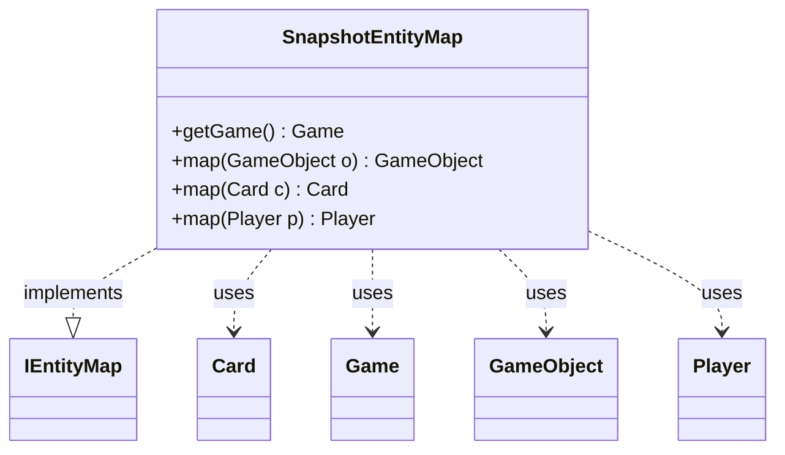

---
aliases:
  - SnapshotEntityMap
tags:
  - java/class
  - module/forge-game
  - pkg/forge/game
fqn: forge.game.GameSnapshot.SnapshotEntityMap
package: forge.game
module: forge-game
kind: Class
---

# SnapshotEntityMap

**Package:** `forge.game`   **Module:** `forge-game`   **Kind:** Class



## Relationships
**Implements:**
- [[forge.game.IEntityMap|IEntityMap]]
**Uses:**
- [[forge.game.Game|Game]]
- [[forge.game.GameObject|GameObject]]
- [[forge.game.card.Card|Card]]
- [[forge.game.player.Player|Player]]

## Design Description

SnapshotEntityMap is a private inner class of GameSnapshot that implements the IEntityMap interface, providing a translation layer between corresponding game entities across two Game instances—the original game and its snapshot copy. Its core responsibility is mapping a GameObject, Card, or Player from one game state to its counterpart in the other, delegating each lookup to the enclosing snapshot's findBy helper.

The class exposes overloaded map methods specialized for the principal entity types, with the generic GameObject overload dispatching by runtime type to the appropriate handler. Its getGame method returns either the original or new Game depending on the snapshot's restore flag, so the same mapping logic serves both directions: capturing a snapshot and restoring from one. By relying on the outer class's state and helpers, it keeps entity resolution encapsulated within the snapshot machinery.

## Source
`forge-game/src/main/java/forge/game/GameSnapshot.java` — declaration excerpt

```java
    public class SnapshotEntityMap implements IEntityMap {
        @Override
        public Game getGame() {
            if (restore) {
                return origGame;
            }
            return newGame;
        }

        @Override
        public GameObject map(GameObject o) {
            if (o instanceof Player) {
                return findBy(getGame(), (Player) o);
            } else if (o instanceof Card) {
                return findBy(getGame(), (Card) o);
            }
            return null;
        }

        @Override
        public Card map(final Card c) {
            return findBy(getGame(), c);
        }

        @Override
        public Player map(final Player p) {
            return findBy(getGame(), p);
        }
    }
```
